<div class="responsive-iframe">
  <iframe width="560" height="315" src="https://www.youtube-nocookie.com/embed/Pj6563CAnKs" title="YouTube video player" frameborder="0" allow="accelerometer; autoplay; clipboard-write; encrypted-media; gyroscope; picture-in-picture" allowfullscreen></iframe>
</div>

## 0. 들어가기 앞서 - 인공지능의 발전사

이미지출처 : <https://post.naver.com/viewer/postView.nhn?volumeNo=27021892&memberNo=43011790>

* 1950년대 영국수학자 앨런 튜링의 계산기계와 지능이라는 논문으로 시작
  * 존 폰 노이만이 현대 컴퓨터 구조의 표준을 고안
  * on/off 의 기초기능 단위를 그물망 형태로 연결하여 인간의 뇌를 흉내 => 인공신경망
  * 신경내에서의 반복적인 신호를 신경세포가 학습함을 확인 => 퍼셉트론(Perceptron:인공신경뉴런)의 탄생(1958) 신경망기반 인공지능의 1차부흥기
* 1969년
  * 퍼셉트론의 XOR처리 불가능을 수학적으로 증명하며 인공신경망의 암흑기
* 1970년대이후
  * 통계기술로 중심이동, 데이터마이닝을 거쳐 빅데이터의 근간이 됨
* 1980년대
  * 0/1사이의 여러값을 가질 수 있는  퍼지이론에 기반한 인공지능->전문가시스템
* 1990년대
  * 슈퍼컴퓨터와 시뮬레이션으로 연구방향 전환
  * 강화학습, 역전파기법 등이 발표되지만, 컴퓨팅 성능의 한계로 주목받지 못함
* 2000년대
  * 심층신경망(딥러닝) 기술의 발전
* 2010년대
  * Deep-CNN(합성곱신경망)의 이미지 인식 성능의 비약적 발전으로 딥러닝이 주목
* 2014년
  * 구글의 딥마인드(영국의 강화학습 회사) 인수, 알파고로 바둑에서 인간을 능가 => ‘인공지능’ 이라는 용어의 대중화
* 현재
  * CNN(이미지인식), RNN(음성/문자인식), GAN(모델간 대립으로 성능개선), 추론(Reasoning), 전이학습(Transfer learning)

## 1. 자연어 처리 (NLP) 란
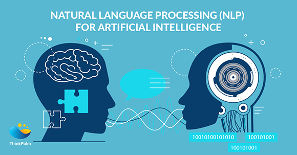
이미지출처 : <https://thinkpalm.com/blogs/natural-language-processing-nlp-artificial-intelligence/>

자연어 처리(Natural Language Processing)를 말하기 위해서 먼저 자연어란 무엇인가.

자연어는 인간이 쓰고있는 언어 자체를 말한다. 인간은 생각하는 동물이고, 그 생각은 다른 인간에게 자동으로 전달되지 못한다. 따라서 그 생각의 전달을 위해 오랜기간 적용되고 발전된 효율적인 방법으로 음성과 문자를 이용한 언어라는 방법이 생성되었다. 같은 사회에 사는 인간들은 그 방식을 자연스럽게 습득하여 소통하며 생활하는 것이다.

우리는 아직 인간의 머리속의 작동방식을 잘 모른다. 하지만 언어(자연어)를 통해 내 머리속의 생각을 다른 사람의 머리속에 이해시킬 수 있다.
우리는 컴퓨터의 작동방식은 잘 안다. 우리가 만들었으니까. 따라서 우리는 컴퓨터가 사람의 생각을 이해할 수 있는 명확한 입력방식을 안다. 이 소통방법도 ‘언어’라고 표현한다. 많은 프로그래밍 언어들, 예로 어셈블리, C, 자바, 파이썬 등등이 컴퓨터를 이해시키는 언어들이다.
우리는 이러한 언어를 별도로 ‘프로그래밍 언어’라고 부른다.

자연스러운 인간의 언어에는 단어 자체의 의미 외에도 문맥적, 함축적, 반어적, 비유적 등의 각종 의미와 표현들이 순서도치, 축약, 생략, 장황하고 완곡한 표현 등의 방법으로 적용되기에 기계가 이해하기에 너무 많은 변수들이 존재한다.
이러한 인간의 언어인 자연어를 기계에게 이해시키기 위한 방법들을 일컬어 자연어 처리, NLP라고 부르고 있다.

인간이 컴퓨터에게 무엇인가의 결과물을 얻기위한 입력방식으로 모든 인간이 자연스럽게 체득하고 있는 이 자연어로 입력할 수 있다면 활용방안이 무궁무진해 질 것이다.

## 2. 인공지능(AI:Artificial Intelligence)의 발전

NLP의 발전은 인공지능의 발전과 맞물려 있다. 인공지능의 목표가 인간과 같은 지능을 가진 기계를 만드는 것이고, 그것을 인간이 평가할 수 있는 방법은 언어를 통한 소통이 될 수 밖에 없으니까. 

여기서 말하는 인간과 같은 인공지능은 강인공지능 이라는 용어로 표현된다. 영어로는 범용인공지능 정도로 표현되는 AGI(Artficial General Intelligence)라고 부른다. 하지만 실제로 구현하기에는 너무나 막막하고 기계의 성능도 초보단계이다 보니 강인공지능으로 가기위해 각각의 세부 테스크별로 개발해 나가는 방향으로 발전하게 된다. 이미지에서 사물인식이라던지, 음성에서 텍스트를 뽑아낸다던지, 텍스트에서 카테고리를 분류한다던지 하는 식으로 특정 테스크에 집중하여 구현하려 하였다.

### 명시적 알고리즘 구현방식의 한계

1940년대 2차대전 당시 적군의 암호해독을 위한 기계번역 기법을 시작으로 많은 기법들이 나오고 발전하고 있다. 하지만, 명시적 알고리즘이라는 것이 모두 사람이 데이터를 보고 고민해서 처리로직을 추가하는 형태로써 그 법칙을 다 알아낼 수도 없을 뿐더러, 아무리 많은 로직을 쓴다 한들 복잡해진 구조에서 오는 예상못한 사이드이펙트 등으로 성능발전은 더딜 수 밖에 없었다. 인간의 처리 프로세스를 모르면서 세부적인 로직을 구현하려 한 것이니 당연한 결과였을 것이다.

### 머신러닝의 등장

1990년대 이후의 컴퓨팅 성능 발달과 빅데이터의 활용으로 새로운 국면으로 접어든다.

프로그래머가 자연어 이해의 세부로직을 구상하고 구현하는 방식이 아닌 대량의 데이터를 기계가 학습하여 그 통계적 유사성을 바탕으로 머신이 직접 알고리즘을 학습하는 머신러닝의 방법이 고안되고 적용되었다.

### 컴퓨팅발전으로 머신러닝의 방식에 딥러닝 기법이 도입

2000년대 컴퓨팅 능력의 발전과 더불어 GPU 등 병렬연산 기법의 도입으로 NLP에서 비약적 발전을 이룬다. 언어를 수치적 방향성을 가지는 벡터로 표현함으로써 단어의 유사성을 비교할 수 있게 됨과 더불어, 행렬식 표현으로 병렬연산이 가능한 형태로 이는 게임산업에 의해 발달한 병렬연산GPU를 자연어 처리 연산에 활용할 수 있게 됨으로써 많은 성능 향상을 가져왔다.

인간의 신경세포의 내부적인 기작은 정확히 모르지만 충분한 신경망을 거쳐 결과값을 찾아내는 이른바 딥러닝 기법의 적용으로 각 테스크별로는 인간 수준의 해답을 내 놓는 수준에 이른다.

다층 퍼셉트론이란 입력층과 출력층 사이에 은닉층을 추가하면, 이 은닉층에서 우리가 찾기 어려운 데이터의 특징들을 수치로 포착하여 더 복잡한 문제를 풀 수 있다는 개념으로 실제 신경망이 여러층을 거쳐 지나가는 구조를 모방하였다.

### 머신러닝의 성능향상과 데이터

어떤 통계적인 공통점을 특징으로 찾아내려면 많은 데이터가 유리하다는 것은 당연하다.

많은 데이터에 더하여 정확한 데이터 또한 중요한 요소로 적용된다. 부정확한 데이터가 많다면 특징을 찾아내는데 방해요소로 적용하게 될 것이고, 이는 성능저하로 이어지기 때문이다.

빅데이터 시대를 거치며 대량의 데이터에 의한 머신러닝의 성능향상이 가능해졌다. 하지만 많은 데이터를 만드는데도 많은 리소스가 소요되고, 많은 데이터가 있으면 그만큼 학습 비용도 상승하게 된다.

## 3. 언어 모델의 발전

NLP에서 단어의 다음에 올 단어를 예측하여 문장을 완성하는 모델을 언어 모델이라고 한다.

### 3.1. 합성곱신경망 CNN(Convolutional Neural Network)

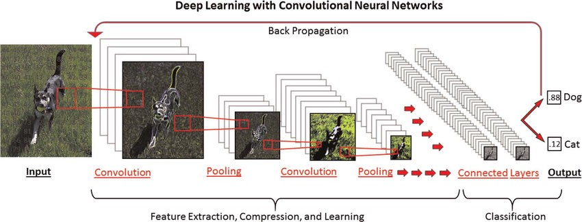
이미지출처 : <https://medium.com/@ajay.pratap/how-to-build-dog-breed-classifier-with-cnn-model-using-tensorflow-1c4759fcf601>

* 이미지 처리 분야에서 강력한 모델인 합성곱처리방식을 NLP분야에 적용하였다.
* 문장을 벡터의 행렬형태로 표현하여 합성곱으로 연산하는 방법이다.
* 이미지 처리에서 CNN은 Filter라는 특정영역의 합성곱 연산을 통하여 하나의 값으로 표현하는 방식을 전체 행렬에 순차적으로 이동하며 구한 새로운 행렬에서 원하는 특징을 도출해 내는 것으로, 각 이미지의 경계선 등 특징을 구별해 낼 수 있다.
* 내부적으로는 convolution과 pooling 레이어의 반복에 의해 특징을 일렬로 늘어뜨린다음 분류기를 통해 원하는 결과값을 출력하도록 만든다.
* 이러한 이미지에서의 강점을 NLP에서도 기대하며 적용해 보니 제법 괜찮은 성능을 보였다.
* 아래 사진은 각 레이어 마다 적용되는 방법을 시각화 한 예시이다.

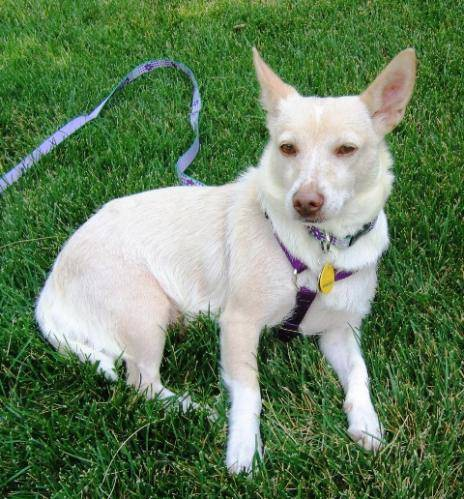
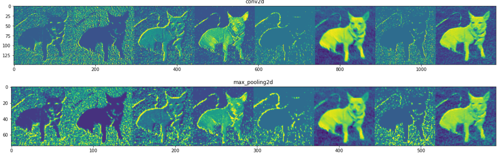
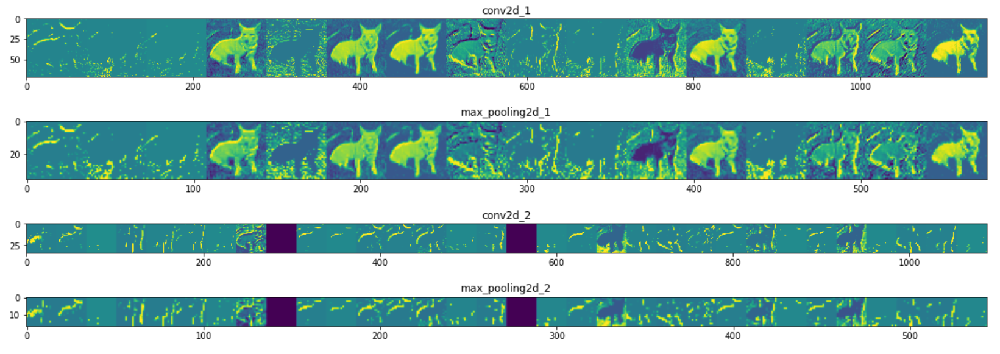
이미지출처 : <https://www.analyticsvidhya.com/blog/2020/11/tutorial-how-to-visualize-feature-maps-directly-from-cnn-layers/>

### 3.2. 순환신경망 RNN(Recurrent Neural Network)

입력층에서 출력층으로만 향하는 기존의 방식들은 문장에서 앞의 단어가 영향을 미치는 구조일 경우 반영이 되지 않는다.

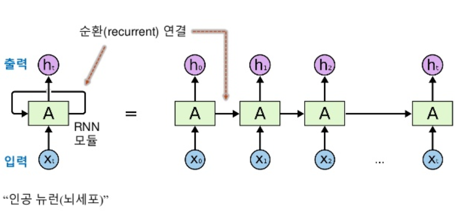

이를 보완하기 위해 결과값을 출력층으로만 보내지 않고 다음 단어의 입력층에도 전달하여 다음 단어가 이전 단어의 정보를 같이 판단할 수 있게 만드는 구조들이 고안되었는데, 그중 가장 유명해진 방법이 이 RNN이다.

RNN은 최초 입력부터 각 입력마다의 결과인 Hidden state가 그 이전의 입력값을 기억하는 구조로 작동하기 때문이다.

이렇게 함으로써 이전 단어들의 특징을 전달할 수 있게 되었지만, 순차적 연산을 거쳐야 하고, 연산량을 줄이기 위해 직전의 가까운 단어정보만 전달을 받게 됨으로 여러 문제 또한 발생시킨다.

### 3.3. seq2seq 언어모델

* 언어모델이란 문장을 차례로 생성해 내는 모델이다.
* Machine Translation(기계번역)은 과거 의미구문별 1:1매핑 후 문법적 재배열 하는 phrase-based MT 였으나 neural MT로 넘어오면서 비약적인 발전을 한다.
* 그 시작을 알린 기술이 sequence to sequence 언어모델이다.
* 번역될 문장과 번역된 문장을 조건부 확률의 문제로 해석한다.
* 또한 암호를 해석하는 인코더-디코더 개념을 도입한 모델이다.
* seq2seq는 RNN을 이용한 인코더와 디코더의 두부분의 조합으로 구성된다.

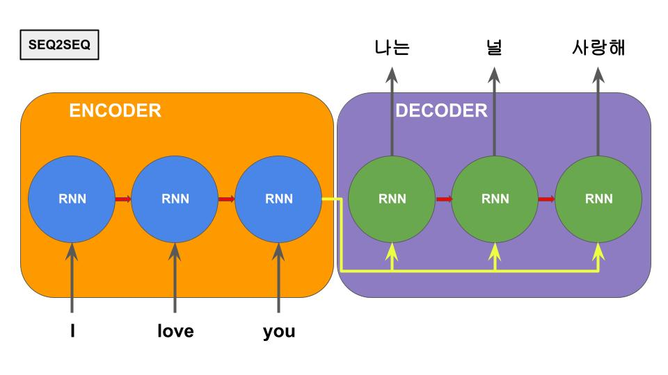

인코더에 번역 될 문장이 RNN구조로 입력되고, 디코더에서는 타겟언어의 해당문장이 RNN을 통해서 단어별로 생성되는 생성모델 구조이다. 번역 같은 좌우 대칭구조에 적합하고 좋은 성능을 보여준다.

RNN의 메모리특성인 hidden state중 입력단의 마지막 hidden state를 출력단이 계속 참고하여 다음 단어를 예측하는 구조로 작동한다. 하지만 RNN은 이전 입력을 기억하긴 하지만, 중심단어와 연관단어의 거리가 너무 멀어지면 성능이 저하되는 현상이 있다. 이는 인코더 입력단의 누적 hidden state가 최종적으로 문장벡터라고 불리는 하나의 벡터에 기록되기 때문에 발생하는 현상이다. 이 현상을 줄이려고 모델 크기를 마냥 크게하는 것은 새롭게 효율성의 문제를 야기하게 된다. 이 문제를 해결하기 위해 아래의 Attention 메카니즘이 탄생한다.

### 3.4. Attention 메커니즘

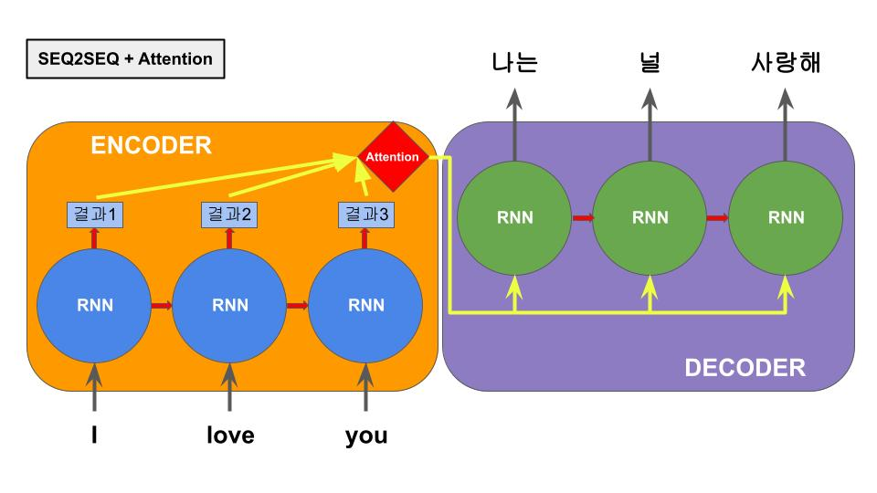

어텐션 메커니즘은 seq2seq에서 인코더 부분의 RNN이 바로 직전의 가까운 단어만을 잘 기억하고 문장 초반의 거리가 멀어진 단어를 망각하는 특성에 의한 성능저하를 극복하고자 제시되었다.

기존의 직전 단어의 결과값을 누적으로 넘겨받아 하나의 벡터를 형성하는게 아니라 그 이전의 각 단어의 결과값(hidden state)을 한꺼번에 참고하여 디코더에 단어가 생성되는 순간에 중요도가 높은 인코더부분의 hidden state를 중요하게 참조하는 구조이다.

중요한 단어는 모델이 데이터를 학습하면서 스스로 연결관계를 알아내는 구조이다. 이러한 구조는 seq2seq에서 긴 문장에서도 매우 좋은 성능을 보여주었다.

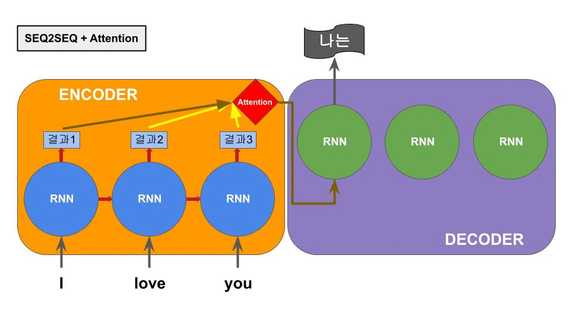

### 3.5. Transformer

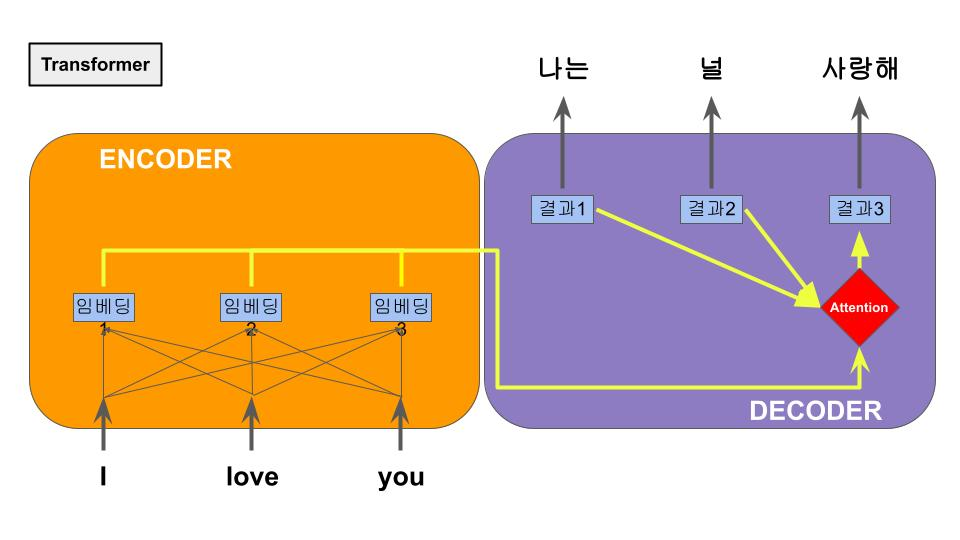

RNN+Attention 구조에서 RNN 덕분에 이전 단어의 정보를 참고하지만 순차적으로 진행된다. 그러나 Attention 구조에 의해 결국 문장 전체 특징을 볼수 있게 된다. 이 특성은 그럼 RNN을 거칠 필요가 없지 않을까? 라는 의문에 도달하게 되고, 그리하여 RNN을 제거하고 self-Attention만을 강조한 구조가 등장하는데, 이것이 바로 NLP의 획기적인 성능향상을 불러온 Transformer 이다. 또한 Multi-headed Attention이라는 여러개의 인코더를 쌓아올린 구조가 적용되며 큰 성능향상으로 이어졌다.

RNN을 제거한 후, 각 단어 임베딩과 각 단어의 순서를 알기위해 positional embedding을 추가하여 단어별 순차연산이 아닌 문장을 한번에 연산하게 만들었는데, 이는 대량 병렬연산을 가능하게 해주어 학습속도의 향상을 가져왔다.

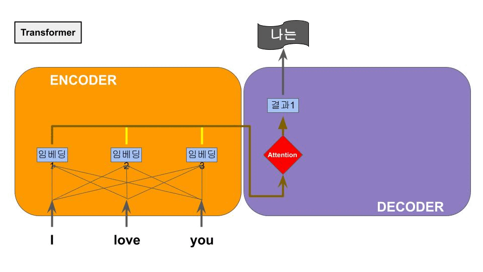

## 4. BERT의 등장

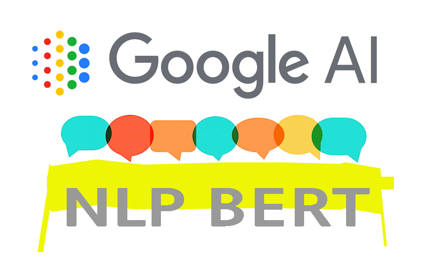
이미지출처 : <http://www.aitimes.kr/news/articleView.html?idxno=15036>

BERT(Bidirectional Encoder Representations from Transformers). 구글에서 2018년 발표한 BERT는 그 당시 압도적인 퍼포먼스로 단번에 NLP와 인공지능의 대표주자가 되었다.

기존 언어모델(LM)은 앞의 단어들을 참조하여 다음에 나올 단어를 예측하는 방식이었다. BERT는 앞에 나온 단어로 다음에 올 단어를 예측하는 것이 아니라 문장의 중간 단어를 마스킹한 후 전체 문장에서 해당 단어를 예측하는 방식으로 학습된다. 이를 Masked Language Model(MLM)이라고 부른다.

* 기존 언어모델(LM)훈련 - 순차적인 예측이고 이후의 정보는 참고할 수 없다
  ```
  > BERT는 고성능의 획기적인 (예측) => 언어
  > BERT는 고성능의 획기적인 언어 (예측) => 모델
  > BERT는 고성능의 획기적인 언어 모델 (예측) => 이다.
  ```
* BERT의 MLM훈련 - 중간 mask된 단어를 문장 전체를 보고 예측한다
  ```
  > BERT는 고성능의 (mask) 언어 모델 이다. => 획기적인
  > BERT는 (mask) 획기적인 언어 모델 이다. => 고성능의
  > BERT는 고성능의 획기적인 (mask) 모델 이다. => 언어
  ```

그리고 두 문장이 이어지는 관계인지 아닌지를 학습하는 기능을 추가하였다. Next Sentence Prediction(NSP)라 부른다.
```
> BERT는 고성능의 획기적인 언어 모델 이다. 모든 테스트에서 최상위 성적을 내었다.
NSP 결과 : 1 (이어진 문장)
> BERT는 고성능의 획기적인 언어 모델 이다. 난 아무래도 천재인가봐.
NSP 결과 : 0 (이어지지 않는 문장)
```

BERT는 문장을 생성하지 않고 문장을 분석하고 이해하는데만 집중하는 모델로 Transformer 구조에서 디코더를 생략하고 인코더만 이용했다.

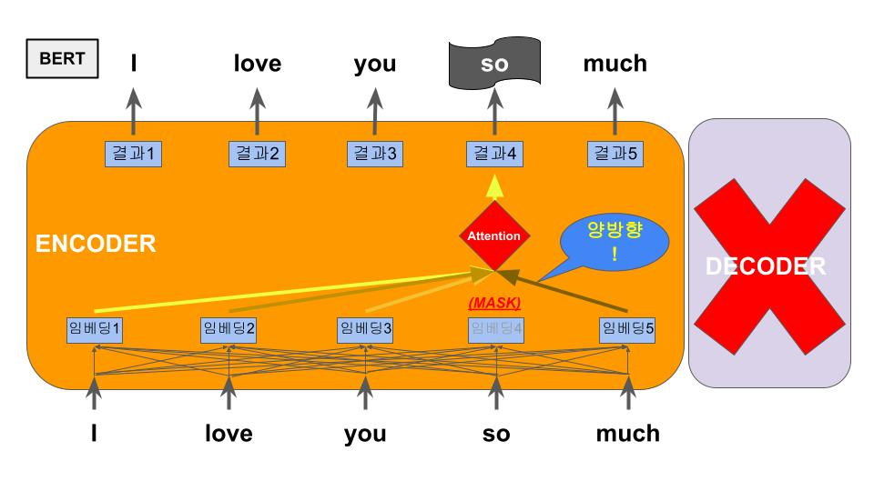

이러한 방식으로 많은 데이터를 학습하여 하이퍼 파라미터 값을 생성해 놓았더니, 각각의 독립적인 분류, 추론, 문장비교, 질문대답 등의 테스크에서 간단한 레이어를 추가하고, 적은 데이터와 학습시간으로 미세조정(Fine-Tuning)만 거쳐도 기존의 각 테스크별 SOTA(현 최고성적) 모델들을 압도하는 성능을 보여주었다. 이를 전이학습(Transfer Learning)이라 부른다.

BERT는 출시당시는 상당히 거대한 모델이어서 학습하는데 구글의 TPU를 사용해도 수일에서 수주가 걸리는 학습시간이 필요했다. 하지만 미리 학습된 기본모델과 소스코드까지 구글에서 오픈소스로 공개하였기 때문에 자유롭게 가져다 쓸 수 있다.

## 5. BERT의 구조

<div style="overflow-x:auto;">
<table>
  <tbody>
    <tr>
      <th scope="row">입력</th>
      <th scope="col"></th>
      <th scope="col">나</th>
      <th scope="col">는</th>
      <th scope="col">생각</th>
      <th scope="col">한다</th>
      <th scope="col">.</th>
      <th scope="col">고로</th>
      <th scope="col">나</th>
      <th scope="col">는</th>
      <th scope="col">존재</th>
      <th scope="col">한다</th>
      <th scope="col">.</th>
    </tr>
    <tr>
      <th scope="row">토큰</th>
      <td>(CLS)</td>
      <td>103</td>
      <td>95</td>
      <td>227</td>
      <td>16</td>
      <td>(SEP)</td>
      <td>837</td>
      <td>103</td>
      <td>95</td>
      <td>1015</td>
      <td>16</td>
      <td>(SEP)</td>
    </tr>
    <tr>
      <th scope="row">세그먼트</th>
      <td>0</td>
      <td>0</td>
      <td>0</td>
      <td>0</td>
      <td>0</td>
      <td>0</td>
      <td>1</td>
      <td>1</td>
      <td>1</td>
      <td>1</td>
      <td>1</td>
      <td>1</td>
    </tr>
    <tr>
      <th scope="row">포지션</th>
      <td>0</td>
      <td>1</td>
      <td>2</td>
      <td>3</td>
      <td>4</td>
      <td>5</td>
      <td>6</td>
      <td>7</td>
      <td>8</td>
      <td>9</td>
      <td>10</td>
      <td>11</td>
    </tr>
    <tr>
      <th scope="row">BERT</th>
      <td colspan="12">
        base : 12 hidden layer, 768 hidden size, 12 multi-head -&gt; 110M(1억1천만) 파라미터<br/>
        large : 24 hidden layer, 1024 hidden size, 16 multi-head -&gt; 340M(3억4천만) 파라미터
      </td>
    </tr>
    <tr>
      <th scope="row">출력</th>
      <td>O₁</td>
      <td>O₂</td>
      <td>O₃</td>
      <td>O₄</td>
      <td>O₅</td>
      <td>O₆</td>
      <td>O₇</td>
      <td>O₈</td>
      <td>O₉</td>
      <td>O₁₀</td>
      <td>O₁₁</td>
      <td>O₁₂</td>
    </tr>
  </tbody>
  <caption>BERT의 문장 입력시 변환되는 3가지 벡터의 예시이다. 실제 데이터와 차이가 있을 수 있다.</caption>
</table>
</div>

* 문장을 토큰화 해서 전체 문장벡터를 만든다. 문장 시작은 (CLS), 문장끝은 (SEP)이라는 특수한 토큰을 표시한다. 이외에도 몇가지 특수토큰이 존재한다.
* 문장별로 구분하는 Segment Embeddings을 만든다. 첫번째 문장 0, 두번째 문장 1
* 각 토큰의 위치를 표시하는 Position Embeddings를 만든다. 이는 Transformer의 positional embedding과 다르다.
* 이 세가지를 합산하여 입력으로 전달된다.
* 각 토큰에 해당하는 출력벡터가 출력된다.
* 이후에 출력값에 적당한 레이어를 추가하여 값을 가공하여(fine-tuning) 원하는 태스크에 적용하게 된다.

## 6. BERT의 학습

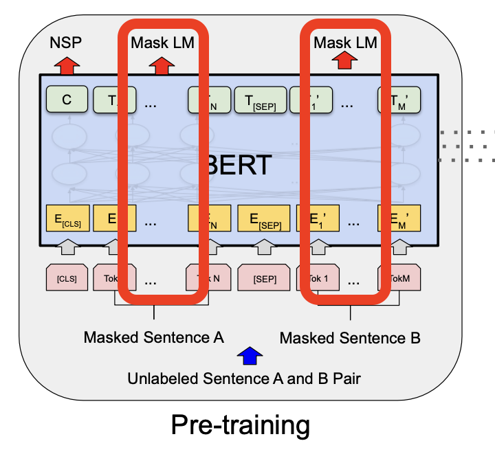
이미지출처 : <https://arxiv.org/abs/1810.04805>

* 입력에 대하여 15%내의 토큰을 masking하여 모델이 내부 양방향 연산을 통하여 적절한 단어(토큰)을 예측하여 문장을 완성한다. 실제 단어와 비교하여 학습.
* 또한, 두 문장일 경우 뒤 문장이 앞 문장의 연결문장인지 여부를 판단하여 학습.
* 영어기준 30,000개의 단어 토큰을 사용하였다.
* 학습데이터는 총 3.3B(33억) corpus
* 입력 시퀀스의 최대 토큰은 512개로 제한하였다.
* batch size : 256시퀀스 * 512토큰 = 128,000토큰/batch 1M STEP -> 40 epochs
* learning rate : 1e-4, 𝛃1=0.9, 𝛃2=0.999
* BERT-base : 4개의 TPU를 이용하여 4일간 학습
* BERT-large : 16개의 TPU를 이용하여 4일간 학습

## 7. BERT의 활용

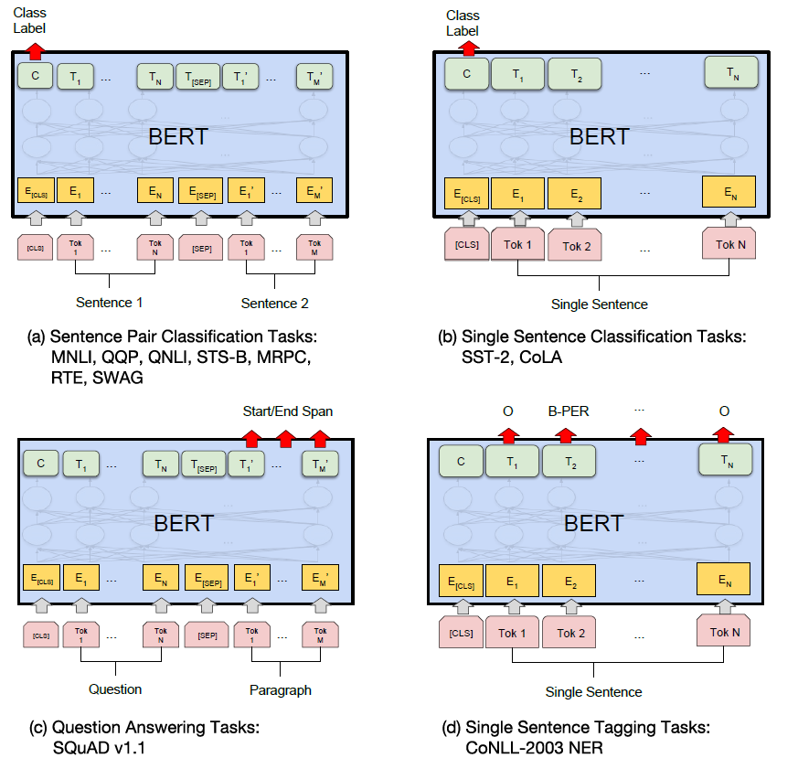
이미지출처 : <https://arxiv.org/abs/1810.04805>

* 기본적으로 두 문장의 연관성파악이나 단일문장의 분류문제, 태깅문제, 질문과 답 문제 등에 적용가능
* BERT 모델(레이어) 위에 추가적인 레이어를 올려서 다른 새로운 태스크 에도 적용해 볼 수 있다

## 8. BERT의 성능을 높인 기술들 : RoBERTa, ALBERT, DistilBERT, ELECTRA

### 8.1. RoBERTa (A Robustly Optimized BERT Pretraining Approach)

BERT의 파라미터 및 트레이닝 방법의 변화를 통해 성능을 향상시킨 버전이다.

1. 더 많은 데이터를 사용하여 더 오래, 더 큰 batch로 학습
2. NSP(next sentence prediction) 제거
3. 짧은 sequence는 배제하고 더 긴 sequence로 학습하기
4. static masking을 dynamic masking으로 바꾸기

### 8.2. ALBERT (A Lite BERT)

A Lite BERT For Self-Supervised Learning of Language Representations
BERT에서 사이즈가 크다고 무조건 성능이 향상되지 않는다는 것을 증명하며 등장한 버전이다.

1. 큰 파라미터는 OOM(out-of-memory)문제, 학습시간 증가를 야기 => input token embedding 사이즈를 줄여서 전체 파라미터를 줄임(Factorized Embedding)
2. Transformer layer 간 같은 Parameter를 공유하며 사용
3. NSP(next sentence prediction) 대신 SOP(Sentence order prediction) 사용

### 8.3. DistilBERT (a distilled version of BERT)

* KD(Knowledge Distillation)라는 압축기술을 이용하였다.
* KD는 큰 모델을 선생(Teacher)으로 작은 모델인 학생(Student)을 학습시킨다.
* BERT의 경우 크기는 40%감소, 속도는 60%증가, 결과치는 97%유지되었다.
* 학생은 선생의 출력결과의 확률 분포를 배움으로써, 특히 0에 가까운 출력값의 복잡한 특징 신호를 단순한 구조로도 배울 수 있게 되어 성능하락이 거의 없이 빠르다.
* ALBERT도 일종의 압축모델이지만, 애초에 구조를 줄여서 트레이닝 시키는 형태이고, DistilBERT는 이미 사전학습된 BERT를 압축하는 구조이다.

### 8.4. BART (Bidirectional Auto-Regressive Transformer)

* BERT가 분류등의 일반 테스크 성능은 뛰어나지만, 문장생성 등의 테스크에서는 매우 취약함을 보이는데, 이는 디코더를 사용하지 않기 때문이다. 이를 보완하기 위해서 BART는 BERT방식에, 뒤에 소개될 GPT의 디코더 구조를 사용하여 나머지 성능은 유지하고, 문장생성, 지문해석 등의 태스크에서 큰 성능향상을 보여준다.
* 기본원리는 denoising autoencoder 방식으로 사전학습이 되는데, BERT의 MLM방식처럼 입력 텍스트에 일정부분 변형(noise)을 가하고, 이것을 원래대로 복구하는 방식으로 학습이 진행된다. BART의 특징은 BERT는 단어 하나를 masking 하였는데, BART에서는 어떤형태의 변형(noise)방법이든 적용 가능 하다는 것이다.
* base 모델은 6개의 인코더와 6개의 디코더 레이어를 가지며 인코더에서 디코더로 넘어갈 때 cross-attention를 수행한다. BERT보다 대략 10%정도 많은 파라미터 수를 갖는다.
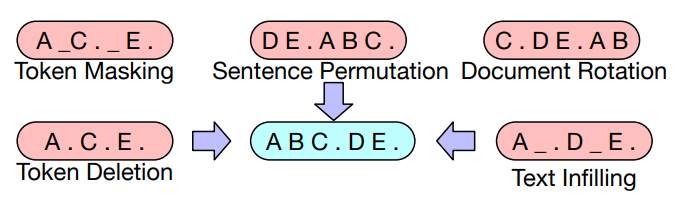

### 8.5. ELECTRA

Efficiently Learning an Encoder that Classifies Token Replacements Accurately

BERT에서 학습의 효율성에 기반하여 새로운 pre-training 방식을 제시한 버전이다.

1. Masked Language Modeling(MLM) 대신 Replaced Token Detection(RTD) 사용
2. masking 대신 작은MLM이 대체단어를 생성하면 모델은 이 가짜를 구별해 내는 방식

오리지날 BERT가 샘플 한 문장당 최대 15%의 단어만 masking하여 학습하므로 데이터셋에 대한 학습률이 15%였던 MLM방식과 다르게, RTD를 이용함으로써 샘플 한 문장을 부분적으로 단어가 바뀐 여러문장으로 생성이 가능하므로, 원본 문장의 전체 단어 모두를 각각 바꿀 수 있기 때문에 한문장의 모든 단어를 100% 사용 가능하게 된다. 이는 준비된 데이터셋의 크기대비 훈련효율을 향상시킨다.

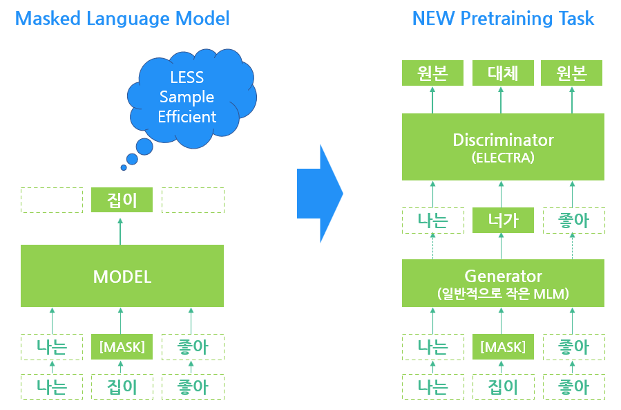
이미지출처 : <https://littlefoxdiary.tistory.com/41>

## 9. BERT를 이용한 서비스

BERT는 뛰어난 성능에도 불구하고 실제 서비스에 적용하기에 몇가지 문제가 있다.
기본적으로 너무크고 연산이 많아서 latency가 늦어져 실시간 서비스에 적용하기에 제한적이다.

이러한 문제점을 극복하고 실 서비스에 적용한 로블록스 사례를 보자.

### 9.1. ROBLOX

메타버스 게임회사의 대표 로블록스에서 하루 10억건 이상의 게임유저의 텍스트를 분류 처리하는 시스템에 BERT를 적용하였다.

기존 시스템을 BERT로 변경하며 텍스트분류에서 10%이상의 성능향상을 달성
하지만 하루 10억건이 넘는 데이터를 latency 20ms 이하로 처리해야 하는데 BERT는 너무 느렸다. BERT 기본모델의 latency 측정치 330ms. 이에 3~4가지의 튜닝을 거쳐서 GPU없이 latency 10ms를 달성한 방법을 공개하였다.

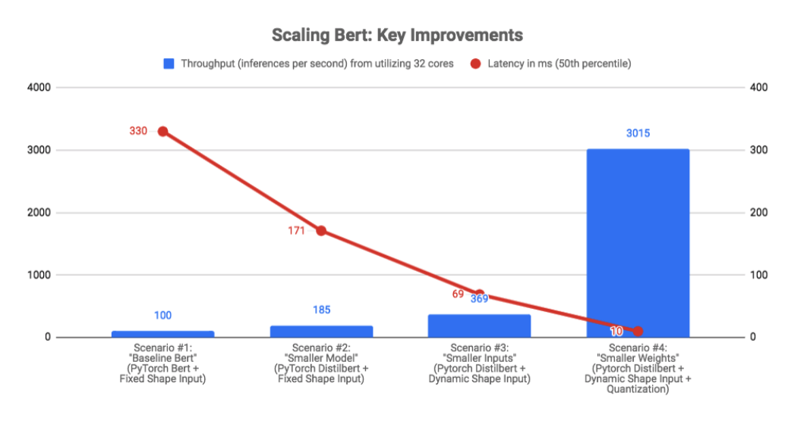
(그래프설명: 각각 BERT-base, DistilBERT, +가변형 입력, +가중치 양자화)

이미지출처 : <https://medium.com/@quocnle/how-we-scaled-bert-to-serve-1-billion-daily-requests-on-cpus-d99be090db26>

1. CPU / GPU 학습은 병렬연산이 필수적이지만, 실 서비스에 적용하는 것은 각각의 단일 문장의 요청에 대한 처리 이므로 CPU모델을 성능기준으로 잡았다. 여기서는 Tesla V100 GPU와 동급 가격인 36코어 Xeon CPU를 사용하였다.
2. DistilBERT 기술을 이용하여 모델을 작게 만들어 속도를 2배 향상시켰다.
3. 단일문장의 입력이므로, 0을 padding하여 동일한 입력크기로 맞추지 않고 각 문장까지만 그대로 입력하는 Dynamic Shapes를 사용하여 2배 향상을 이뤘다.
4. 32비트 부동소수를 8비트 정수로 변환하는 가중치 양자화 기술을 사용하여 연산의 효율성을 획기적으로 높였는데, 그중 Dynamic Quantization 이라는 훈련후 가중치를 양자화 하는 기법을 사용하여 8배 정도의 속도향상을 달성하였다.
5. 그외 입력 데이터의 caching 기법 등으로 추가적인 성능 향상이 있지만, 위 1~4의 과정 만으로 약 30배의 성능 향상을 이루어, 수평적인 CPU 확장만으로 하루 10억개의 테스크 처리가 가능하였다.

## 10. BERT의 사촌들 : GPT, XLNet, T5
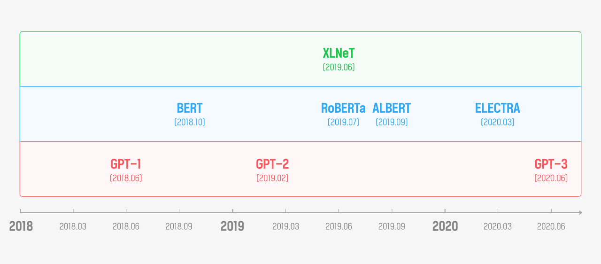
이미지출처: <https://mysterico.tistory.com/8>

### 10.1. GPT (Generative Pre-trained Transformer)
OpenAI라는 단체에서 Transformer 구조에서 인코더는 무시하고 디코더 부분만 집중하여 문장생성모델을 만들었는데, 이것이 GPT이다. 대량의 문서를 학습하여 어떤 단어가 주어졌을 때 다음에 올 확률이 가장 높은 단어를 제시하여 순차적으로 문장을 만들어 나간다.

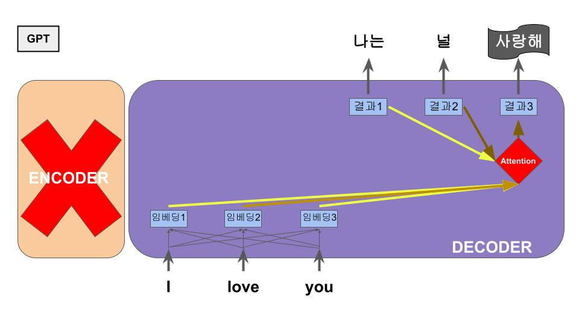

GPT는 학습데이터가 많을수록 상당한 성능 향상을 발견하여 현재 버전3 에서는 인간이 작문하였다고 봐도 크게 이상하지 않을 정도의 문장생성 능력을 보여준다. 다만, 사용된 파라미터만 175B(1,750억)개로 BERT-base 모델 110M(1.1억)개의 1,600배에 달한다.

참고로 OPEN-AI에서 GPT-1이 먼저 나오고 Google에서 더 성능좋은 BERT를 내 놓았고, OPEN-AI에서 GPT-2, 3로 업그레이드 하면서 서로 성능경쟁으로 발전하는 관계이다.


이미지출처: <http://jalammar.github.io/how-gpt3-works-visualizations-animations/>

### 10.2. XLNet
BERT가 각 masking단어별로 독립적이라고 가정하여 생기는 단어간의 위치에 대한 연관성이 무시되는 문제와 fine-tuning시의 masking기법이 쓰이지 않음으로 부조화에 의한 성능저하를 극복하고자 나온 방식이다.

```
Permutation Language Model
[ ‘New’, ‘York’, ‘is’, ‘a’, ‘city’ ]
[ ‘is’, ‘a’, ‘city’ | ‘New’, ‘York’ ]
[ ‘is’, ‘a’, ‘city’  ‘New’, ‘York’ ]
   ┖─────┚              ┃
         ┖──────────┚ 
```

pre-training에서 masking을 쓰지않고 단어를 뒤섞어서 순차적으로 예측하는 방식을 여러번 반복하여 학습하는 Permutation Language Model이다. 이는 이후 fine-tuning시에도 기법의 부조화가 없어서 성능향상이 된다. 다만, 실제 작동은 단어를 뒤섞지 않고 Transformer의 self-attention을 활용하여 attention-mask로 구현된다.

### 10.3. T5 (Text-to-Text Transfer Transformer)
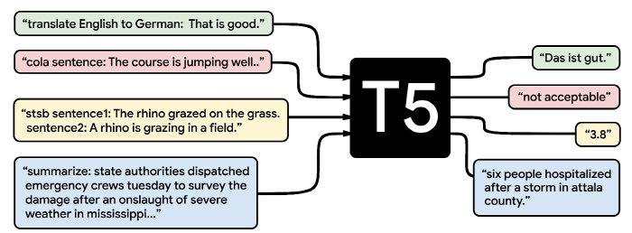
이미지출처: <https://m.news.zum.com/articles/58361658>

BERT가 분류나 입력 범위만 출력할 수 있는것에 반해 모든 입력과 출력을 문자열로 하고, 각각의 태스크 역시 입력 문자열에 포함하여 재구성한 모델이다.

예로 “translate English to German: That is good.”를 입력으로 넣으면 “Das ist gut.”를 출력으로 내 놓는다.

이렇게 훈련하기 위해 Wikipedia보다 2배 큰 C4(Colossal Clean Crawled Corpus)라는 잘 정제되고 다양한 새로운 훈련 데이터셋을 만들어 훈련하고 공개하였다.

알려진 NLP의 다양한 테스크 뿐만 아니라 새로운 유형의 테스크에도 쉽게 적응하며 뛰어난 성능을 보여준다.

## 11. NLP 딥러닝의 최신 동향 : GPT3 등 초거대인공지능
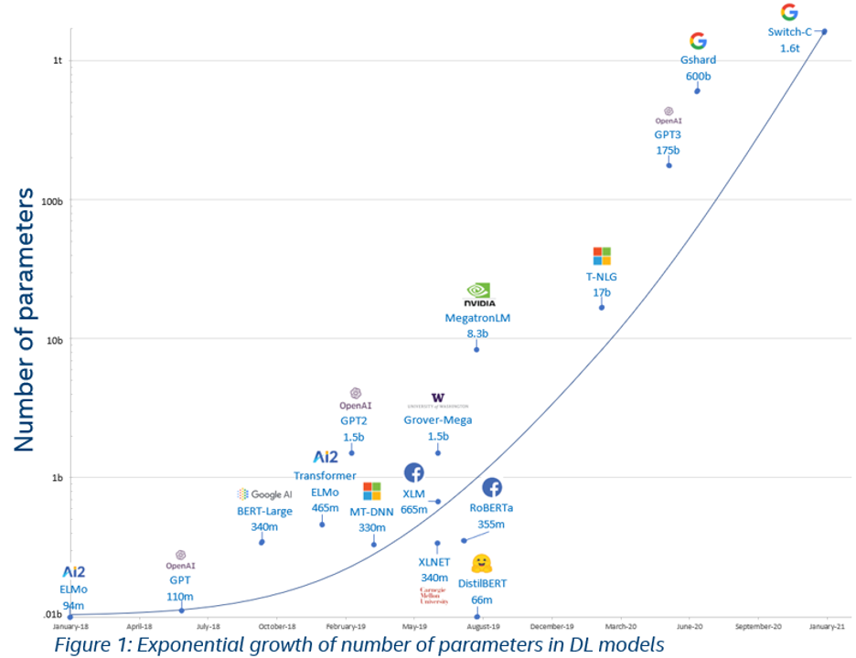

NLP의 요즘 트랜드는 대형화이다. 초 대형 모델에 엄청난 데이터의 학습. 데이터가 많으면 많을수록 다방면에서 뛰어난 성능을 보여주는 것을 GPT모델이 버전3까지 발전하며 증명하였다.

GPT3는 약 300B(3,000억)개의 데이터셋으로 사전 학습을 실행하였는데, 96개의 레이어로 하이퍼 파라미터를 175B(1,750억)개 사용하였다. 이는 fine-tuning 없이도 각종 자연어 테스크 벤치마크에서 최고점을 받았다.

하지만, GPT3는 93%가 영어인 거의 영어 전용 모델이라는 문제가 있다.

한국에서는 NAVER에서 하이퍼클로바라는 한글GPT3모델을 만들어 서비스될 예정이다.
하이퍼클로바 또한 300B(3,000억)개의 한국어 데이터셋과 204B(2,040억)개의 매개변수로 설정되었다고 한다.

이정도 규모의 모델은 구축비용이 얼마나 들까? 해외의 분석업체의 발표에 의하면 OpenAI의 구축비용은 대략 150억원 정도로 추산한다.

초거대 인공지능은 성능을 진일보 시켰지만, 대신 초대형 자본을 가진 기업들만 도전할 수 있는 분야가 되어버렸다.

딥마인드(DeepMind)의 고퍼(Gopher)에서 쓰인  파라미터 2800억 개를 시작으로, 마이크로소프트+엔비디아의 Megatron-Turing Natural Language Generation model (MT-NLG)는 파라미터가 5300억 개, 구글의 스위치-트랜스포머(Switch-Transformer)의 파라미터는 1조 6000억 개, 구글 GLaM(Generalist Language Model)의 파라미터는 1조 2000억 개이다.

## 12. Multi-Modal로 확장하는 NLP

텍스트에 국한되어있던 NLP가 다른 채널, 영역들과 합쳐지며 확장하고 있다. 학습 데이터로든 출력 결과물이든 텍스트만으로는 완전히 이해할 수 없는 언어라는 분야의 추가 정보를 위해 이미지, 사운드, 영상등의 여러 정보의 통합은 필연적일 것이다.


이미지출처: <https://cocodataset.org/#captions-2015>

### 12.1. Image to Text
seq2seq의 기계번역 모델에서 번역하고자 하는 문장을 인코더에 번역된 문장이 디코더에 나오게 된다. 여기서 만약 입력되는 인코더에 문장이 아니라 이미지가 들어간다면? 이런 아이디어로 연결한 것이 이미지를 보고 설명문장을 생성하는 모델이다.

인코더의 RNN 대신에 이미지를 파악하는 CNN모델을 연결하고, 이미지와 그 설명 문장을 쌍으로 학습시키면 이미지 캡셔닝 모델이 완성된다.

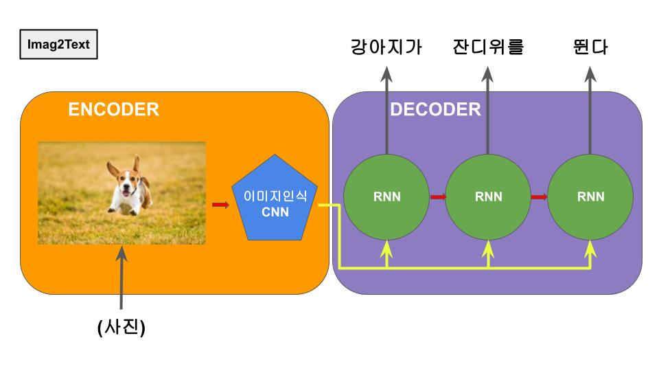

### 12.2. Text to Image

그렇다면 그 반대의 경우로 생각해보면, 설명하는 문장을 넣어주면 해당 이미지를 생성할 수 있지 않을까?

OpenAI에서 만든 이미지 생성 모델 : DALL-E

GPT를 만든 OpenAI에서 GPT의 생성기능을 이미지에 적용하여 이미지 생성 모델을 만들었다. 사용된 파라미터는 12B(120억)개이다

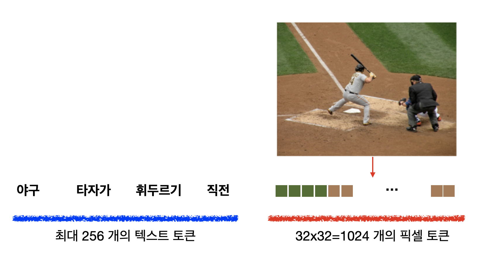
이미지출처: <https://jiho-ml.com/weekly-nlp-40/>
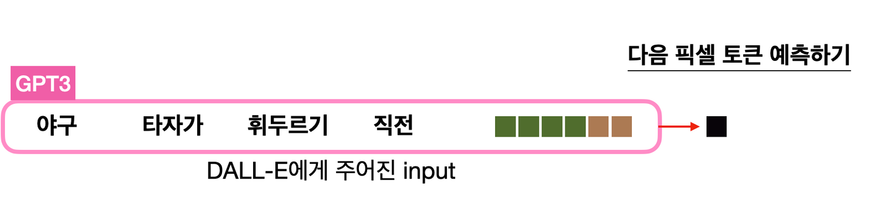
이미지출처: <https://jiho-ml.com/weekly-nlp-40/>

사진 설명 문장과 이미지 픽셀을 1차원화 한 벡터의 시작부분까지 입력으로 넣어주면, 이후 픽셀들을 하나씩 생성하여 주고, 결과를 2차원화 하면 생성된 이미지를 볼 수 있다.

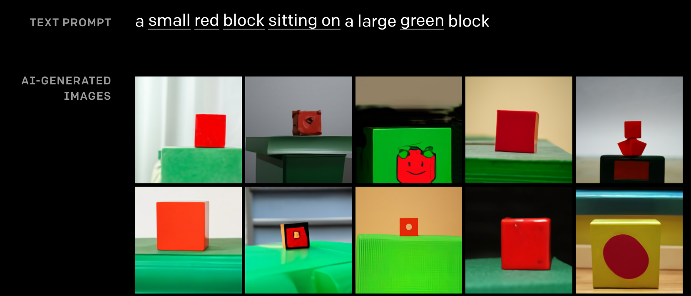
DALL-E의 생성결과 예

OpenAI에서 만든 두번째 이미지 생성 모델 : GLIDE

GLIDE(Guided Language-to-Image Diffusion for Generation and Editing)는 유도 확산 기술을 적용하여 파라미터가 DALL-E의 1/3인 3.5B(35억)개만으로 고품질 이미지를 생성하는 모델을 만들었다.

이 기술은 이미지의 부분을 마스킹하여 원하는 이미지를 텍스트입력으로 만들어 낼 수 있는 능력에 특화되어 있다.

아래 이미지는 GLIDE의 실행 결과물 예제이다.

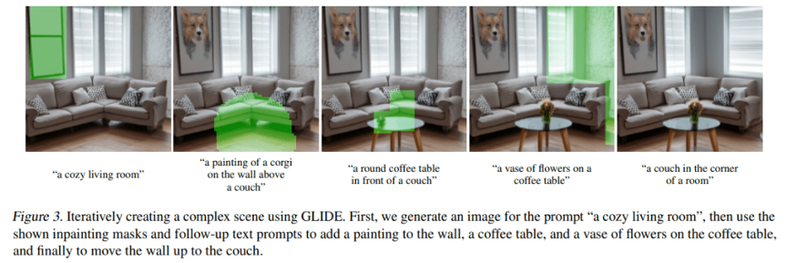
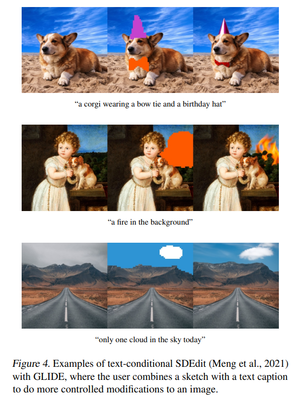
GLIDE의 실행 결과물 예제

## 13. kpfBERT (언론진흥재단 BERT)

### 13.1. 신문기사에 특화된 kpfBERT

* BERT의 특징은 대량의 데이터를 사전학습을 하는 모델이다.
* 그렇기에 데이터 수집과 모델 트레이닝에 많은 비용과 노력이 발생한다.
* 또한 어떤 데이터의 집단이냐에 따라 학습된 모델에 편향성이 생길 수도 있다.
* 하지만 같은 개념으로 특정 데이터에만 적용되는 모델이라고 가정하면, 같은 계열의 데이터로 사전학습을 진행한 모델이 더 뛰어난 성능을 보일 수 있다.
* 한국언론진흥재단에서는 언론에 특화된 사전학습된 BERT모델을 생성함으로써 여러 언론 관련 산업에서 자연어처리 작업에 활용할 수 있는 기반을 만들었다.

### 13.2. kpfBERT의 성능비교

5가지 BERT의 일반적인 태스크에 대한 비교 평가값. 동일한 하드웨어, 파이프라인을 통한 각 모델별 실측값이다.
<div style="overflow-x:auto;">
<table>
  <thead>
    <tr>
      <th scope="col">
        구분
      </th>
      <th scope="col">
        NSMC
      </th>
      <th scope="col">
        KLUE-NLI
      </th>
      <th scope="col">
        KLUE-STS
      </th>
      <th scope="col">
        KorQuAD v1
      </th>
      <th scope="col">
        KLUE MRC
      </th>
    </tr>
  </thead>
  <tbody>
    <tr>
      <th scope="row">데이터 특징 및 규격</th>
      <td>
        영화 리뷰 감정 분석<br/>
        학습: 150,000 문장<br />
        평가: 50,000 문장
      </td>
      <td>
        자연어 추론<br />
        학습: 24,998 문장<br />
        평가: 3,000 문장 (dev셋)
      </td>
      <td>
        문장의 의미적 유사도 측정<br />
        학습: 11,668 문장<br />
        평가: 519 문장 (dev셋)
      </td>
      <td>
        기계독해<br />
        학습: 60,406 건<br />
        평가: 5,774 건 (dev셋)
      </td>
      <td>
        기계 독해<br />
        학습: 17,554 건<br />
        평가: 5,841 건 (dev셋)
      </td>
    </tr>
    <tr>
      <th scope="row">
        평가방법
      </th>
      <td>
        accuracy
      </td>
      <td>
        accuracy
      </td>
      <td>
        Pearson Correlation
      </td>
      <td>
        Exact Match / F1
      </td>
      <td>
        Exact Match / Rouge W
      </td>
    </tr>
    <tr>
      <th scope="row">
        KPF BERT
      </th>
      <td>
        91.29%
      </td>
      <td>
        87.67%
      </td>
      <td>
        92.95%
      </td>
      <td>
        86.42% / 94.95%
      </td>
      <td>
        69.51% / 75.84%
      </td>
    </tr>
    <tr>
      <th scope="row">
        KLUE BERT
      </th>
      <td>
        90.62%
      </td>
      <td>
        81.33%
      </td>
      <td>
        91.14%
      </td>
      <td>
        83.84% / 93.23%
      </td>
      <td>
        61.91% / 68.38%
      </td>
    </tr>
    <tr>
      <th scope="row">
        KorBERT(ETRI)
      </th>
      <td>
        90.46%
      </td>
      <td>
        80.56%
      </td>
      <td>
        89.52%
      </td>
      <td>
        20.11%&nbsp;/ 82.00%
      </td>
      <td>
        30.56%&nbsp;/ 58.59%
      </td>
    </tr>
    <tr>
      <th scope="row">
        KoBERT(SKT)
      </th>
      <td>
        89.92%
      </td>
      <td>
        79.53%
      </td>
      <td>
        86.17%
      </td>
      <td>
        16.85%&nbsp;/ 71.36%
      </td>
      <td>
        28.56%&nbsp;/ 42.06%
      </td>
    </tr>
    <tr>
      <th scope="row">
        BERT base multilingual
      </th>
      <td>
        87.33%
      </td>
      <td>
        73.30%
      </td>
      <td>
        85.66%
      </td>
      <td>
        69.10% / 90.02%
      </td>
      <td>
        44.58% / 55.92%
      </td>
    </tr>
  </tbody>
</table>
</div>
다른 한글BERT에 비해 성능이 우수하게 나오는 것은 RoBERTa, ELECTRA등의 기술들이 적극적으로 반영되었고, 다량의 양질의 학습데이터에 의한 결과로 예상된다.

### 13.3. kpfBERT의 활용

1. 뉴스 본문 요약 <https://github.com/KPFBERT/kpfbertsum>
    * 뉴스 본문의 중요문장을 찾아서 3문장으로 제시하는 모델이다. 본문의 3줄요약은 모바일 시대에 적절한 정보전달 방법이다. 다만 BERT가 생성형 모델이 아니라 본문내용을 요약해서 문장을 생성하는 태스크는 완성도가 많이 떨어진다. 대신 문장 분석력을 사용하여 전체 문장 중 가장 중요도가 높은 문장 3개를 추천하는 방식으로 본문내용을 요약표현하는 활용법이다.
2. kpf-SBERT <https://github.com/KPFBERT/kpfSBERT>
    * Sentence BERT를 제작하는 방법에 대한 소스코드이다. 단어별 임베딩이 아닌 문장 전체를 하나의 동일한 크기의 임베딩 벡터로 변환한다. 이것은 문장간의 비교를 BERT대비 엄청나게 빠르고 효율적으로 연산할 수 있다. 문장의 의미적 유사도를 쉽게 수치로 비교할 수 있고, 미세하게 다른표현이지만 중복되는 문장 또는 기사를 찾아내어 중복제거 등의 태스크에 활용할 수 있다.
3. kpf-SBERT를 이용한 뉴스 클러스터링 <https://github.com/KPFBERT/kpfSBERT_Clustering>
    * 위에서 제작한 kpf-SBERT를 이용하여 HDBSCAN으로 뉴스를 자동 클러스터링 하는 모델의 예제이다. 소스코드에서는 기사의 제목만으로 의미적 유사도에 기반하여 DBSCAN보다 성능이 좋은 HDBSCAN을 이용하여 클러스터링 하였다.
4. 추가적으로 활용해 볼 수 있는 영역
    * 맞춤법 검사기: 단순 맞춤법 검사를 넘어 문맥과 의미를 고려한 맞춤법 검사기
    * 단어 자동완성: 입력하는 연속된 문장에서 해당시점에 가장 적절한 단어를 추천하는 모델
    * 문장의 어색한 표현이나 어휘 체크: 1차 완성된 기사에서 문장간 또는 문장내 어울리지 않는 표현이나 어휘, 잘못된 문법적 오류 검출에 활용 가능
    * 혐오표현 순화: 뉴스 댓글 등에서의 혐오표현을 검출하고 순화해서 표현하는 모델
    * 기사의 논조 분석: 중심 사안에 대한 기사의 긍정, 부정 등의 논조 파악 모델
    * 광고성 기사 검출: 협찬기사, 정보전달을 가장한 광고 등의 광고성 기사 검출 모델
