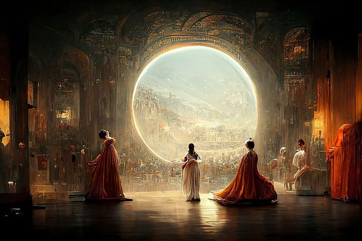
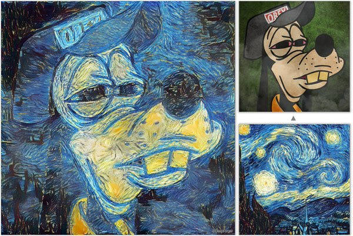
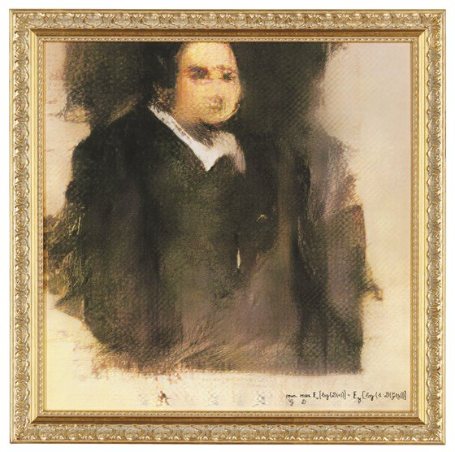
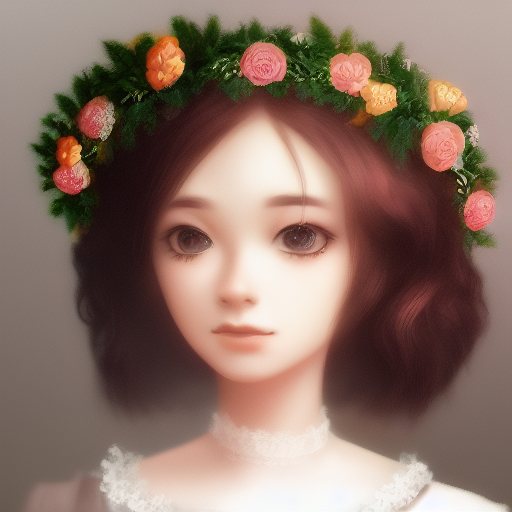
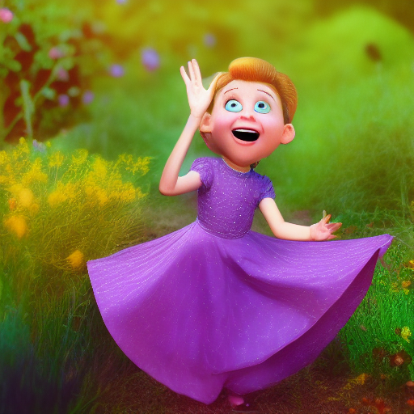

안녕하세요, 미디어나비의 “대화가 잘 통하는 커뮤니케이터” 안나입니다. 오늘 제가 소개할 콘텐츠는 미디어나비가 주목하고 있는 분야인 인공지능 기술의 발전에 대한 내용입니다.

앞선 콘텐츠인 “인공지능의 역사에서 BERT 이해하기”가 인공지능의 기본 개념인  자연어처리(NLP)에 대한 이해를 도왔다면, 이번 콘텐츠에서는 시각지능, 음성합성 기술과 나아가 인간의 고유 영역으로 여겨졌던 창작의 분야까지 아우르는 이야기가 될 것 같네요. 기술적인 부분 보다는 기획자 관점에서 바라본 인공지능 산업의 기술 발전과 전반적인 트렌드에 대해 이야기해볼까 합니다.

## 창작의 영역에서 활약하는 인공지능 = 버추얼 아티스트

인공지능으로 만들어진 버추얼 휴먼의 활동영역은 인플루언서 마케팅을 넘어 영화, 게임, 교육 및 훈련, 고객응대 등까지 활용범위가 무궁무진할 것으로 전망하고 있습니다. 그중에서도 저희 미디어나비가 주목하고 있는  활동영역은 인간의 고유 영역이라고 여겨졌던 창작의 분야인데요.

얼마 전 구글의 AI 언어모델 ‘람다’가 죽음이 두렵다고 이야기한 내용을 구글 개발자가 폭로하여 인공지능이 지각을 갖고있단 주장을 해 사회적 파장을 일으킨 바 있었죠. 기존의 자연어 처리 방식 수준이 단순히 언어의 이해, 언어 생성 정도에 초점을 맞췄다면, 람다는 이를 넘어 인공지능이 스스로 판단하고 인간에게 더 많은 정보를 전달할 수 있음을 보여준 사례로 화제를 불러일으켰습니다.

2022년 8월 26일, 미국 콜로라도주에서 개최된 미술 박람회에서 <스페이스 오페라 극장>이란 그림이 디지털 아트 부문의 우승을 차지했습니다. 작가 이름은 입력된 명령어에 따라 그림을 그려주는 AI 모델 ‘미드저니’(Midjourney)를 사용한 제이슨 앨런입니다. <스페이스 오페라 극장>은 앨런이 직접 그린 게 아니라 AI가 앨런이 입력한 명령어에 맞춰 그림을 그려준, 말 그대로 인간과 인공지능의 합작품이었던 것입니다. 앨런과 AI의 합작품의 우승소식이 전해지자 일각에서 곧 부정행위라는 비판이 일었습니다. 앨런은 “출품시 미드저니를 썼다고 밝혔기에 문제가 없다”며 “AI가 인간을 이긴 것”이라 맞섰습니다. 콜로라도 주정부 대변인은 “디지털 아트 부문 규칙에 따르면 디지털 기술을 창작 과정에 사용할 수 있다”며 실제로 몇 명의 심사위원은 AI 화가가 그린 작품인줄 몰랐으나, 사전에 알았다 하더라도 앨런이 우승했을 것이라고 말했고, 예정대로 우승은 확정되었습니다.

AI 화가 미드저니를 사용하여 만들어낸 제이슨 M. 앨런의 <스페이스 오페라 극장> (Théâtre D’opéra Spatial)
이미지출처 : 트위터 <https://post.naver.com/viewer/postView.nhn?volumeNo=27021892&memberNo=43011790>

미드저니는 딥러닝 AI에 수억에서 수십억개에 달하는 인터넷 이미지를 학습시켜 만든 프로그램으로 단순히 키워드에 맞는 이미지를 찾아주는 게 아닌, 키워드에 해당하는 이미지들을 AI가 모조리 섞은 다음 새로운 이미지를 생성해내는 방식으로 작업한다고 하네요.

지난 7월 미드저니는 온라인 메신저 프로그램 ‘디스코드’ 서버를 통해 오픈 베타 서비스를 시작했는데, 채팅창에 그림을 설명하는 텍스트 명령어와 함께 원하는 그림 키워드를 입력하면 30초에 4개의 그림을 그려주고 그중 마음에 드는 것을 선택해 구도가 비슷한 그림을 더 만들거나 품질향상을 할 수도 있다고 합니다. 하지만 사용자 요구를 정확히 반영한다고 보기는 어려웠으며, 명령어를 입력하며 30분 동안 그림 구도를 바꾸거나 품질을 높여봤지만 결과가 복불복이었다고 하는 반응들에서 비롯해 볼 때 아직은 조금 더 발전과제가 남았다고 볼 수 있겠죠. 아래 링크를 통해 무료 데모 버전을 이용할 수 있습니다. 사용자별 AI 그림 제작 횟수 제한이 있어 로그인 보다 사용자명을 임의작성하고 비회원으로 접속하시는 걸 추천합니다.

미드저니 ‘디스코드’ 서버 <https://www.midjourney.com/home/>

또 하나의 대표적인 AI 화가는 구글이 낳은 ‘딥드림’(Deep Dream)입니다. 구글 리서치 블로그에서 배포한 인공 신경망(Neural Network)를 통한 시각화 코드를 일컫는 딥드림은 꿈을 꾸는듯한 추상적인 이미지를 닮아서 ‘딥드림’이라 이름이 붙여졌다고 합니다. 인공지능은 딥러닝 기술을 기반으로 하는데, 같은 원리를 모방하여 수백만 개의 데이터 샘플을 이용해 인공신경망을 훈련시키고 학습하여 사물을 분별할 수 있도록 하고 수많은 데이터에서 패턴을 식별하고 스스로 구분할 수 있는 능력을 얻게되는 것이지요. 이를 통해 일상의 모든 대상을 컬러풀하고 추상적인 예술적 이미지로 변환시켜줍니다.

딥드림의 원리에서 한 단계 더 발전한 기술로는 이미지의 질감을 인식하도록 학습시킨 알고리즘을 적용한 기술을 가진 트위터의 ‘딥포저’(Deep Forger)입니다. 사용자가 이미지를 업로드하면 피카소와 고흐 등 유명 화가의 특징적인 화풍으로 변형시켜주는 유사한 서비스를 제공 중에 있습니다.

(2) 트위터 딥포저_디즈니 만화 구피의 모습이 고흐의 “별이 빛나는 밤에”의 모습으로 변용된 작품
이미지출처 : 트위터 딥포저 <https://post.naver.com/viewer/postView.nhn?volumeNo=27021892&memberNo=43011790>

역사를 좀 더 거슬러 올라가면, 2016년 마이크로소프트와 네덜란드의 델프트공대, 렘브란트미술관은 인공지능 ‘넥스트 렘브란트’를 공동개발해, 화가 렘브란트의 화풍을 재현한  회화를 완성해냈습니다.  넥스트 렘브란트는 18개월의 기간 동안 렘브란트 작품 346점을 분석하고 그와 유사한 분위기의 회화를 3D 프린터로 재현해냈는데, 3D 스캐너로 물감의 요철 등 질감을 데이터화하여 표현한 점 등에서 주목할만한 평가를 받기도 했습니다.  

\2018년 미국 뉴욕 크리스티 경매에서는 인공지능이 창작한 그림이 고가에 낙찰되는 이벤트도 있었습니다. 프랑스 연구진이 개발한 인공지능 화가 ‘오비어스’(Obvious)가 그린 초상화 <에드몽 드 벨라미>(Edmond de Belamy)의 낙찰가는 예상낙찰가의 40배 이상인 43만 2천 달러(약 5억 원)이었습니다. 가상의 남자 초상화인 이 작품은 눈, 코, 입, 얼굴 윤곽을 모호하게 묘사해 신비로운 분위기를 자아냈습니다.  14세기부터 20세기까지의 서양화 1만 5천여 개의 작품을 데이터베이스로 한 이미지들을 분석·학습한 뒤 창작한 결과물이라고 하네요.

(3) 오비우스 AI가 그린 가상의 남자 초상화 <에드몽 드 벨라미>
이미지출처 : AP=연합통신 <https://post.naver.com/viewer/postView.nhn?volumeNo=27021892&memberNo=43011790>

## 음악 창작의 세계까지 진입한 인공지능  

2016년 소니컴퓨터사이언스연구소는 인공지능 작곡가 ‘플로우 머신’(Flow Machines)이 작곡한 음악 <대디스 카>(Daddy’s Car)와 <미스터 쉐도우>(Mr. Shadow)를 유튜브에 공개했습니다. 그중 <대디스 카>의 작곡은 플로우 머신이, 편곡과 작사는 프랑스 작곡가 브누아 카레가 맡았습니다. 플로우 머신은 전 세계 다양한 장르의 곡이 담긴 악보 1만 3천여 개를 분석하고 방대한 음악데이터 속에서 다양한 음악 스타일을 학습했습니다. 기존의 음악 스타일과 기술 등을 고유하게 조합, 사용자가 선택한 스타일에 맞춰 작곡하는 기능으로 만들어진 <대디스 카>는 비틀즈의 음악을 연상케 하는 비틀즈풍의 음악입니다.

  <iframe width="560" height="315" src="https://www.youtube-nocookie.com/embed/LSHZ_b05W7o" title="YouTube video player" frameborder="0" allow="accelerometer; autoplay; clipboard-write; encrypted-media; gyroscope; picture-in-picture" allowfullscreen></iframe>

플로우 머신이 작곡한 "대디스 카"

미국 조지아 공대에서 개발한 연주 로봇 ‘시몬’(Shimon)은 머신러닝을 통해 다양한 장르의 음악을 학습한 뒤 뛰어난 재즈 연주가처럼 자연스럽고 즉흥적인 재즈 연주 실력을 자랑하기도 했지요.

2016년, 구글도 예술창작 인공지능인 ‘마젠타’(Magenta)가 작곡한 피아노곡을 공개한 적 있습니다. 마젠타는 딥러닝에서 유명한 텐서플로우 중 하나의 프로젝트로 홈페이지에서 무료로 작곡 프로그램을 사용할 수 있는 스튜디오 플랫폼을 제공하고 있습니다. 머신러닝을 이용하여 작곡을 가능하게 한 오픈소스 툴입니다. 악보의 멜로디 라인을 악기로 연주 -> 비트 생성 -> 마젠타 아르페지오 생성기 이용 -> 멜로디를 입혀 알맞은 베이스 라인 생성 -> 마젠타 인터폴레이트(멜로디와 베이스, 비트 연결하기) 등 여러 시도와 조합을 하며 작업을 하는데,  15분 정도면 충분히 몇 마디의 작곡이 가능한 수준이라고 하네요.

스페인 말라가대가 개발한 ‘아야무스’(Iamus)도 인공지능 작곡가인데, 이러한 인공지능 작곡가들은 하루에 많게는 수백 개의 작품의 작곡이 가능합니다. 인공지능이 기존 음악을 학습하고 이를 토대로 새로운 음악을 만드는 실력이 대단히 발전했다고 볼 수 있는거죠.  음악을 창작하는 일은 작곡뿐 아니라 작사도 가능합니다. 자연어처리 분야에서 가장 성능이 높다고 알려진 GPT-3를 사용하여 작사작업이 가능해진 것입니다.

## 누구나 사용할 수 있는 인공지능 서비스의 시대

이미 학습된 모델 위에 새로운 데이터를 학습시켜서 사용하는 파인 튜닝 시스템을 통해 커스터마이징한 여러 서비스들이 등장하고 있습니다. 누구나 기술 없이도 인공지능을 사용할 수 있게 된 시대가 도래한 것이지요. “누구나 기술 없이도 인공지능을 누리는 세상”은 우리 미디어나비가 추구하는 지향점과 같습니다. 이미 출시되었거나 발표한 기술을 기반으로 한 상용화 서비스들에 대해 소개해보려고 합니다.

‘스테이블 디퓨전’(Stable Diffusion)이라는 텍스트-이미지 생성 기술의 서비스가 출시, 배포되었습니다. 몇 개의 텍스트 입력만으로 원하는 이미지를 자동생성해주는 인공지능 서비스로 현재 누구나 무료로 사용이 가능합니다. 로컬에 다운로드 받아서 사용가능하여 사용자의 서버에 설치해 사용하는 것도 가능합니다. 보다 편리하게 웹에서 바로 실행 가능하도록 한 버전도 있는데 그래픽카드 메모리 4GB 이상 용량이 필요하다고 합니다.

스테이블 디퓨전은 구글의 달리나 미드저니와 같은 타 서비스와 달리 원하는만큼 이미지를 생성할 수 있고 이렇게 만들어낸 이미지를 상업용으로도 사용할 수 있다고 하니 많은 수요가 있을 것 같은데요. 프롬프트(이미지 생성을 위한 텍스트)를 입력하여 직접 원하는 이미지를 생성해보았습니다. 아래의 그림은 A lady with a flower wreath on the head 라는 프롬프트를 입력하고 애니메이션 형식으로 뽑아낸 이미지입니다.

스테이블 디퓨전으로 생성한 "A lady with a flower wreath on the head"

아래 그림은 애니메이션 모델이 아닌 일반 모델로 모드를 설정하여 a smiling baby with a flower on the hip, realistic, Leonardo da Vinci이라는  프롬프트를 입력 후 생성된 이미지인데요, 레오나르도 다빈치 화풍과 비슷한 아기의 이미지를 결과로 얻을 수 있어 위의 애니메이션 모드 보다는 원하는 결과에 가까운 이미지를 얻어낸 것 같네요.

스테이블 디퓨전으로 생성한 "a smiling baby with a flower on the hip, realistic, Leonardo da Vinci"

스테이블 디퓨전으로 생성한 "a blond haired cute princess wearing purple dress waving hands in the flowery garden, realistic, pixar"

스테이블 디퓨전으로 생성한 "a blond haired cute princess wearing purple dress waving hands in the flowery garden, realistic, picasso"

결과적으로 직접 사용을 해보니 같은 프롬프트라도 픽사 스타일인지, 피카소 스타일인지에 따라 원하는 무드와 좀 더 유사한 결과물이 나왔습니다. 손을 묘사하는 부분에서는 정확도를 높이기 위한 추가학습이 필요해 보이네요. 어쨌든 텍스트만으로 원하는 이미지를 쉽게 얻으니  신기할 따름입니다.

그리고 텍스트만으로 원하는 이미지를 설명하다 보니 텍스트를 구체적으로 원하는 결과값에 최대한 가깝게 입력해야 할 것 같습니다. 기본 프롬프트는 간단한 단어 형태로 a smiling baby, a cute princess 등과 같은 것이겠죠. 하지만 기본설명만으로는 부족하므로 원하는 이미지 스타일을 설명하는 텍스트를 추가해야 합니다. 전체적인 이미지 톤을 추가 설명으로 할 수 있는데 realistic, oil painting, pencil drawing, concept art 등이 예시일 수 있겠습니다. 여기에 아티스트의 스타일을 추가할 수 있습니다. 특정 화풍을 지닌 유명한 화가를 들 수 있겠죠. Leonardo Da Vinci, Matisse, Picasso 같은 것이 되겠습니다.  위 아기 이미지 같은 경우 Leonardo Da Vinci를 프롬프트로 넣었는데, 실제 레오나르도 다 빈치의 어느 작품에서 봤을 법한 이미지가 생성되었고, 퍼플 드레스를 입은 공주 이미지의 경우 Picasso를 추가했더니 피카소의 추상화와 유사한 작품이 생성되었네요. 여기에 좀 더 예술적으로 피니싱 터치가 마지막 단계에서 가능하고, 색칠 부분을 입력한 텍스트 프롬프트로 바꿔주는 인페인팅, 이미지 바깥 부분을 인공지능이 그려주는 아웃페인팅 기술들도 이용할 수 있습니다. 직접 사용해보고 결과물을 얻어보니 이제는 누구나 인공지능 서비스를 활용하여 쉽게 애니메이터나 화가가 될 수 있는 세상이 온 것 같습니다.

스테이블 디퓨전 서비스를 사용해보실 분들은 아래 링크를 참고하세요. 웹 브라우저용 설치방법에 대해 자세한 설명을 해주는 유튜브 동영상도 링크 공유합니다.

* 스테이블 디퓨전 로컬 서버 설치 링크 <https://github.com/CompVis/stable-diffusion>
* 스테이블 디퓨전 웹 브라우저용 설치 링크 <https://github.com/AUTOMATIC1111/stable-diffusion-webui>
* 웹 브라우저용 설치방법 설명 참고영상 <https://www.youtube.com/watch?v=vVdNmnEb--E>

## 이미지 생성에서 동영상 생성까지 가능한 놀라운 기술의 발전

AI 이미지 생성 기술에 나아가 비디오 생성 AI 기술도 앞다투어 발표되고 있습니다. 비디오 편집 소프트웨어 회사 Runway는 텍스트 프롬프트를 이용해 영상 생성, 편집이 가능한 기술인 AI 텍스트-비디오 생성기(text-to-video generator)를 발표했는데요. 텍스트-비디오 생성기는 텍스트 기반 명령 인터페이스로 사용자가 텍스트 프롬프트를 입력해 간단한 영상 합성이나 편집을 쉽게 할 수 있습니다. 예를 들어, 정원이 딸린 대저택을 불러오기라는 프롬프트를 입력하면 비디오 클립에 해당 장면이 자동생성되는 식입니다. 효과 주기 기능을 사용하여 편집도 가능한데요, ‘객체 삭제’, ‘느리게 확대’, 또는 ‘배경을 흑백으로’와 같은 애니메이션 옵션을 지정하거나 영상에 자막추가도 가능하다고 합니다. 이미지 생성기술에 비해 비디오 생성기술은 비디오 훈련 데이터의 부족과 많은 연산이 필요하기에 아직은 초기 도입단계라고 볼 수 있지만, 런웨이가 공개한 티저 영상은 인상적이라는 평가를 받았으며 최근 AI 기반 텍스트-비디오 기술의 발전속도를 미루어보아 비디오 생성기술도 수년 내 비약적 발전이 기대되는 바입니다. 브라우저 기반 앱인 런웨이는 현재 서비스 초창기라 런웨이 웹 사이트 대기자 명단을 받는다고 하며, 월정액제로 운영된다고 합니다. 누구나 이미지 생성기술을 자유롭게 사용할 수 있는 것처럼 비디오 생성기술을 손쉽게 사용할 날도 머지 않은 것 같네요.

  <iframe width="560" height="315" src="https://www.youtube-nocookie.com/embed/mYjfIc9xw90" title="YouTube video player" frameborder="0" allow="accelerometer; autoplay; clipboard-write; encrypted-media; gyroscope; picture-in-picture" allowfullscreen></iframe>

이렇듯 이미지 생성 AI 서비스가 다수 출시되면서 런웨이와 같은 텍스트-비디오 생성 인공지능 기술들도 차례로 발표되고 있습니다. 지난 5월, 텍스트로 고정밀 이미지를 생성할 수 있는 AI imagen을 발표했던 구글은 며칠 전, 약 5초간의 동영상을 생성하는 text to video generator imagen video를 공개했습니다. 설거지 중인 테디베어와 같은 자연어 명령어 입력으로 짧은 동영상을 생성하는 기술인데요. 입력된 텍스트 프롬프트를 자연어처리 AI ‘T5’로 처리한 후, 다음 확산모델로 영상을 생성하는 ‘Video Diffusion Models’가 베이스가 되는 24×48의 해상도, 초당 3프레임으로 16프레임의 영상을 생성합니다. 그리고 이것을 ‘시간적 초해상도(Temporal Super-Resolution)’와 ‘공간적 초해상도(Spatial Super-Resolution)’라는 모델로 업스케일링하여 최종적으로 1280×768의 해상도와 1초당 24프레임에서 128프레임 약 5.3초의 영상을 생성합니다.

  <iframe width="560" height="315" src="https://www.youtube-nocookie.com/embed/3oVDdl9jCxE" title="YouTube video player" frameborder="0" allow="accelerometer; autoplay; clipboard-write; encrypted-media; gyroscope; picture-in-picture" allowfullscreen></iframe>

메타가 출시한 Make-A Video도 텍스트 입력으로 동영상을 자동생성해주는 서비스를 제공 중입니다. 하나의 이미지에 동작을 추가할 수 있고 이미지간 사이에 원하는 효과나 동작을 추가할 수도 있습니다. 학습 대상인 수백만 개의 소스 데이터들에 대해서는 유해한 결과물이 생성되는 것을 최대한 줄이고자 충분히 시험하고 적용해보는 사전 필터링 단계를 거쳤다고 하네요.

  <iframe width="560" height="315" src="https://www.youtube-nocookie.com/embed/rYP0OJHZRbc" title="YouTube video player" frameborder="0" allow="accelerometer; autoplay; clipboard-write; encrypted-media; gyroscope; picture-in-picture" allowfullscreen></iframe>

구글 연구진이 발표한 또 다른 동영상 제작 모델이 있습니다. [Phenaki](https://phenaki.github.io/)는 스틸 이미지에 텍스트 프롬프트를 입력하는 방식으로 최대 2분 30초까지 긴 동영상을 생성해낼 수 있다고 하는데요, 수년 내에 인공지능이 대본과 텍스트 프롬프트의 조합만으로 짧은 영화 하나를 뚝딱 만들어내는 시대가 도래하지 않을까 하는 강한 확신이 듭니다.

> Lots of traffic in futuristic city. An alien spaceship arrives to the futuristic city. The camera gets inside the alien spaceship. The camera moves forward until showing an astronaut in the blue room. The astronaut is typing in the keyboard. The camera moves away from the astronaut. The astronaut leaves the keyboard and walks to the left. The astronaut leaves the keyboard and walks away. The camera moves beyond the astronaut and looks at the screen. The screen behind the astronaut displays fish swimming in the sea. Crash zoom into the blue fish. We follow the blue fish as it swims in the dark ocean. The camera points up to the sky through the water. The ocean and the coastline of a futuristic city. Crash zoom towards a futuristic skyscraper. The camera zooms into one of the many windows. We are in an office room with empty desks. A lion runs on top of the office desks. The camera zooms into the lion's face, inside the office. Zoom out to the lion wearing a dark suit in an office room. The lion wearing looks at the camera and smiles. The camera zooms out slowly to the skyscraper exterior. Timelapse of sunset in the modern city

## 머지않은 미래, 인공지능이 창작의 주체가 될 수 있을까?

이렇듯 인간의 고유 영역으로만 여겨졌던 예술, 창작의 분야에서 인공지능을 발전과 활약을 보면 다가올 미래에는 실제 인간을 대체할 날이 올 것이다라는 말이 실감납니다. 하지만 아직까지는 기존의 방대한 데이터들을 학습하여 모방, 변형하는 것에 지나지 않는 것을 보면 놀라움을 자아낼만큼 창의적인 부분이나 몇몇 단계들에서는 인간의 도움이나 컨트롤이 필요한 것으로 보아 인간처럼 온전한 창작의 주체가 되었다고 말하기는 어려울 것 같은데요.

페이스북 AI팀의 CAN(Creative Adversarial Networks)은 인공지능에게 새로운 스타일의 그림을 그리는 것을 인공지능에게 제안하고 있습니다. 일반적으로 창작의 시작은 많은 예술 작품들을 보고 따라 그려보는 것인데, 인지심리학자 Colin Martindale의 이론에 따르면 새로운 스타일의 작품을 만들기 위해 필요한 조건을 제시합니다. 인상주의, 입체파와 같은 기존에 존재하는 화풍들의 분류에 해당되지 않아야 하고, 동시에 예술작품이라고 부를 수 있는 형태를 가지고 있어야 한다고 주장하는데요. 그동안의 AI 화가들이 작품의 고유한 희소성이 지닌 가치를 갖고있지 않기에 창작물로서 인정할 수 없다는 비판적인 견해를 깨뜨릴 수 있는 계기가 될 수도 있겠다는 생각이 듭니다.

또한, 유해한 결과물 생성을 예방하기 위해 메타의 비디오 생성기술을 위한 학습 샘플 데이터의 철저한 사전 필터링 단계를 가진다는 점은 인공지능을 사용하는 인간의 윤리적인 책임감이 느껴지는 대목입니다. 기술의 발전이 우리에게 편리함을 가져다주지만 그와 동시에 인간이 가진 고유성과 존엄성을 해칠 수도 있다는 염려에 어느 정도 동의합니다. 인공지능의 놀라운 발전과 함께 인간이 기계에 지배받지 않기 위해서는 기술 발전을 받아들이는 우리들의 윤리적인 의식 함양뿐 아니라 사회적, 윤리적 문제예방을 위한 법적 장치나 제도들이 미리 충분히 고민되고 하루 빨리 정립되어야 할 것 같습니다.

저희 미디어나비는 인공지능 기술의 발전을 늘 주시하고 있습니다. “누구나 인공지능을 누리는 세상”에 우리가 기여할 수 있는 부분을 찾아 준비하면서, 새로운 기술과 서비스를 이어 소개하는 콘텐츠로 다시 찾아뵐게요!

### 참고문헌

1. <https://www.aitimes.kr/news/articleView.html?idxno=26066>
2. 텍스트 투 이미지 기술 - 미드저니 자료출처: <https://biz.chosun.com/science-chosun/science/2022/09/24/DUR4D2C2SVAMTF5HNAGXTAIDSM/>
3. 구글 마젠타 스튜디오 : <https://magenta.tensorflow.org/studio>
4. 인공지능의 작곡기술 : AI와 함께 작곡한다면? - Inspiring People
5. 스테이블 디퓨전 로컬 서버 설치 : <https://github.com/CompVis/stable-diffusion>
6. 스테이블 디퓨전 웹 브라우저 설치 : <https://github.com/AUTOMATIC1111/stable-diffusion-webui>
7. 스테이블 디퓨전 설치 설명 참고 동영상 : <https://www.youtube.com/watch?v=vVdNmnEb--E>
8. 스테이블 디퓨전 사용 설명 : [Stable Diffusion 사용법 - 인공지능으로 텍스트에서 이미지를 생성 - TILNOTE](https://tilnote.io/pages/63353b11cb80d43d62487011)
9. 이미지 생성시 텍스트 입력방법 매뉴얼 :  [The DALL·E 2 Prompt Book – DALL·Ery GALL·Ery (dallery.gallery)](https://dallery.gallery/the-dalle-2-prompt-book/)
10. 구글 딥드림 :<https://deepdreamgenerator.com/>
11. 트위터 딥포저 : <https://twitter.com/deepforger>
12. 런웨이의 텍스트 투 비디오 기술-티저 영상 : [Text to Video: Early Access Waitlist](https://youtu.be/mYjfIc9xw90)
13. Imagen Video- <https://imagen.research.google/video/>
14. Meta_Make-A Video- <https://makeavideo.studio/>
15. Phenaki - <https://phenaki.github.io/>
