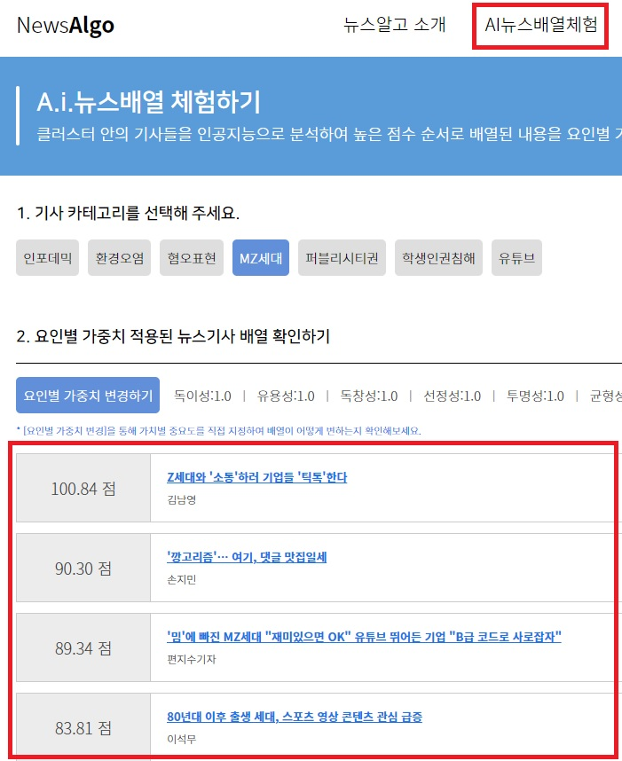

## 포털 사이트에서 보여지는 뉴스의 배열 원리에 대해 궁금하신 적 없었나요?

우리는 매일 포털 사이트를 통해 많은 양의 뉴스를 보게 됩니다. 그런데 이 뉴스들이 어떤 원리로 배열되어 우리에게 보여지는지 생각해 본적이 있으신가요? 포털 사이트에서 뉴스들이 배열되어 웹상에 보여지는 것은 마치 유튜브의 배열 알고리즘처럼 특정한 규칙에 따라 이루어 지는 것 같은데 누군가의 의도에 의해서 배열되었을 수도 있겠다는 의문이 들기도 합니다. 이런 뉴스의 배열은 우리의 사고와 행동에 영향을 미치게 되므로 매우 중요하게 여겨져야 한다고 생각되는데요. 뉴스의 배열이 어떤 원리로 이루어지는지 알아보고 직접 실습까지 해볼 수 있는 사이트가 있습니다. 바로 한국언론진흥재단이 운영하는 뉴스 알고(www.newsalgo.or.kr) 입니다. 이번 블로그 콘텐츠에서는 이 뉴스 알고를 사용해보며 포털 사이트의 뉴스 배열원리를 알아보는 시간을 가져보도록 하겠습니다.

포털에서의 기사는 특정 기준에 따라 점수가 매겨져서 그 가치가 판단됩니다. 사실 특정 기준이란 게 절대적으로 좋은 것을 판단한다는게 아니고 각각의 포털의 기준에 따른 것이라 기사의 절대적인 완성도나 품질을 판단하는 것은 아니긴 합니다. 다만 포털의 기준에 따른 포털에 대한 기사의 적합도라 보는 것이 더 알맞을 것 입니다.
포털에서는 아래와 같이 각 기사의 점수를 도출할 수 있고 이 점수에 따라 기사를 배열하면 포털 뉴스의 배열이 됩니다. 뉴스 알고의 “AI 뉴스배열체험” 메뉴에 들어가면 기사 마다 매겨진 점수의 도출과정을 볼 수 있습니다. 또한 매겨진 점수에 따라 뉴스가 배열이 된다는 것을 확인할 수 있습니다.

<figure>
  
  <figcaption>(1) 뉴스알고 사이트 "AI뉴스배열체험" 메뉴의 기사 점수에 따른 배열 </figcaption>
</figure>

각각의 기사마다 점수가 매겨진 것을 확인 할 수 있고 그 점수의 높은 순서에 따라 기사가  배열되는 것을 확인해 볼 수 있습니다.

## 뉴스알고가 뉴스 기사에 점수를 부여하는 방법

뉴스 알고에서는 아래와 같이 상세 점수를 보기 원하는 기사를 클릭하면 해당 점수가 어떻게 도출되었는지 볼 수 있습니다.

<figure>
  
  <figcaption>(2) 상세점수를 보고 싶은 기사 클릭 </figcaption>
</figure>

<figure>
  
  <figcaption>(3) 계량평가 요인별 기사 점수 </figcaption>
</figure>

기사의 "계량평가 요인별 점수"에서는 기사의 문장길이, 인용문 개수, 맞춤법 오류 개수, 평균 문장 길이 등 구성요소별로 분석을 하고 그에 따라 점수가 할당되어 배점하고 있습니다.

<figure>
  
  <figcaption>(4) 저널리즘 기준에 따른 기사의 점수 도출 </figcaption>
</figure>

기사의 독이성, 투명성, 사실성, 유용성, 균형성, 다양성, 독창성, 중요성, 심층성, 선정성의 10가지 저널리즘 기준에 따라 기사를 분석하고 저널리즘 가치를 적용하여 점수를 주고 있습니다. 이렇게 일정한 규칙과 다양한 방법에 따라 기사를 분석하여 객관적인 점수를 도출하게 됩니다.

## 네이버 포털과 뉴스알고의 뉴스 기사 배열 비교

위와 같이 기사를 측정한 결과에 의해 기사의 점수가 나오고 이 점수에 따라 포털 사이트에서 뉴스를 배열하게 되는데 뉴스 알고에서는 이를 직관적으로 체험해볼 수가 있습니다. “실습하기/포털뉴스 배열” 메뉴에서 네이버나 다음 같은 포털 사이트의 기사 여러 개를 입력하여 그 점수를 측정하고 배열을 확인해볼 수 있습니다. 해당 메뉴에서 기사의 URL을 입력한 후 “뉴스 배열 확인하기” 버튼을 누르면 각 기사의 점수를 도출하여 그 점수 순서에 따라 배열됩니다.

<figure>
  
  <figcaption>(5) 포털에서 기사 URL 가져와서 기사 배열하기 체험 </figcaption>
</figure>

또한 이 메뉴를 통해서 네이버나 다음 같은 포털 사이트에서의 기사 배열과 뉴스 알고에서의 기사 배열을 비교해볼 수 있습니다. 이번 블로그 콘텐츠에서 그 비교를 위해 네이버에서 “인앱결제 강제는 부당, 구글 상대로 소송 제기.” 이슈를 찾아서 기사를 찾아봤습니다.

<figure>
  
  <figcaption>(6) 네이버 포털에서 '인앱결제 강제는 부당, 구글 상대로 소송 제기.' 이슈로 기사 배열 화면 </figcaption>
</figure>

위와 같이 네이버 포털에서 “인앱결제 강제는 부당, 구글 상대로 소송 제기” 이슈에 대해 7개의 기사가 배열됨을 확인했습니다. 뉴스 알고에서는 이 7개의 기사가 어떻게 배열되는지 알고 싶어서 기사 각각의 URL을 뉴스 알고의 “실습하기/포털뉴스 배열”에 입력하고 “뉴스 배열 확인하기” 버튼을 눌러서 결과를 확인해봤습니다.

<figure>
  
  <figcaption>(7) 뉴스 알고에서 '인앱결제 강제는 부당, 구글 상대로 소송 제기.' 이슈로 기사 배열 화면 </figcaption>
</figure>

뉴스 알고 점수 측정과 배열 알고리즘에 따라 위와 같은 결과를 얻었습니다. 배열을 살펴보면 네이버 포털의 배열과 다른 것을 알 수 있는데, 이는 네이버 포털의 배열 순서 알고리즘과 뉴스 알고에서의 배열 순서 알고리즘이 다른 이유 때문으로 보여지네요.

## 알고리즘 설정에 따라 배열이 달라지는 포털 사이트의 뉴스 기사

포털 관리자의  의도에 따라 기사 배열 순서 알고리즘을 설정하고 그에 따라 포털에 개시되는 기사의 성격을 정할 수가 있습니다. 예를 들면, 기사 점수의 여러 요소 중에 특정 요소에 가중치를 두어서 원하는 성격의 기사가 좀 더 높은 점수를 받게 하여 추출하고 배열해 해낼 수 있는데요. 이를 뉴스 알고에서 직접 체험해볼 수 있습니다. 뉴스 알고의  “AI 뉴스배열 체험하기”메뉴에서 “요인별 가중치 변경하기”를 변경하여 점수 변화를 보는 것이 가능합니다.

<figure>
  
  <figcaption>(8) 뉴스 기사의 점수 요인별 가중치 변경 </figcaption>
</figure>

 “AI 뉴스배열 체험하기”메뉴에서 “요인별 가중치 변경하기”를 누르고 점수를 측정하는 여러 요인 중에 하나인 “독이성”의 가중치를 1에서 4로 변경했습니다.

<figure>
  
  <figcaption>(9) 뉴스 기사의 점수 요인별 가중치 변경에 의한 기사 배열의 재배치 </figcaption>
</figure>

기사의 가중치가 변경됨에 따라 기사 점수가 변하는 것을 볼 수 있습니다. 즉, 포털 관리자의 의도에 따라 원하는 성격의 기사들이 더 높은 점수를 매기고 이에 따라 더 많이 사용자들에게 보여지도록 배열 구성이 가능합니다.

## 실습하기 - 내가 기사를 쓰고 점수 확인해보고 기사 배열해 보기

앞선 내용들을 보면 포털의 기사가 어떤 식으로 평가되고 어떤 식으로 배열되는지 알수 있는데, 문득 실제 기사를 쓰면 어떤 평가를 받게 될까하는 궁금중이 듭니다. 뉴스 알고에서는 우리가 실제로 기사를 작성해서 점수 평가를 받아보아 기존의 기사들과 점수 및 랭킹을 비교해 볼 수 있는 기능이 있습니다. “실습하기”에 “기사 작성” 기능인데 여기에 원하는 주제와 기사 제목, 본문 등을 입력하여 기사를 작성하면 실제로 뉴스 알고에 작성한 기사가 등록되어 점수가 부여되고 랭킹에 등록됩니다. 이를 통해 기사의 가치 측정과 기사의 배열을 직접적으로 체험할 수 있습니다.

<figure>
  
  <figcaption>(10) 사용자가 직접 입력하여 기사를 작성 </figcaption>
</figure>

위와 같이 사용자가 직접 기사를 작성하고 기사 제출하기 버튼을 누릅니다.

<figure>
  
  <figcaption>(11) 사용자가 작성한 기사의 점수가 나오고 기존의 기사들 사이에 배열됨 </figcaption>
</figure>

사용자의 기사의 점수가 도출되고 기존의 기사 랭킹에 등록됨을 볼 수 있습니다. 물론 기존 기사들과 동일한 조건으로 "계량평가 요인별 점수"와 "저널리즘 점수"도 도출됩니다.

<figure>
  
  <figcaption>(12) 사용자가 작성한 기사의 계량평가 요인별 점수 </figcaption>
</figure>

위와 같이 작성한 기사의 세부 측정 점수를 볼 수 있으며, 도출되는 최종 점수로 다른 기사 들과 비교시 어떤지 기사 랭킹도 확인 가능합니다.  이를 통해 포털에 개시되는 기사를 작성하는 체험을 직접 해볼 수 있는 것입니다.

## "뉴스 알고"는 한국언론진흥재단의 서비스로써 저희 미디어나비에서 개발하였습니다

이상으로 포털 사이트의 기사 배열 방식과 뉴스 기사의 가치 측정 방법을 알아보면서 이를 직관적으로 체험해볼 수있는 뉴스 알고 사이트에 대해 알아봤는데요. 막연하게 임의의 알고리즘에 따라 기사가 배열될 것이라고 생각했던 것에서 발전하여 실제로 기사의 작성, 배열을 체험해보며 구체적으로 그 과정을 알 수 있었습니다.  뉴스 알고에 대해 더 궁금하신 분은 뉴스 알고 웹사이트 통해 실제로 경험해보며 체험해보시길 추천합니다.

지금까지 소개해드린 뉴스 알고는 한국언론진흥재단의 서비스로써 저희 미디어나비에서 개발하였습니다. 원하시는 분은 [뉴스알고](www.newsalgo.or.kr) 사이트에서 “학습신청하기”를 하여 직접 사용해보실 수 있습니다. 긴 글 읽어주셔서 감사합니다.
