## 웹 3.0에 대해 얼마나 알고 계신가요?

웹 3.0은 최근 화제의 키워드입니다.  웹 3.0은 블록체인 기술이 발달하며 구체화될 수 있었습니다. 하지만 우리에게 새로운 세상을 열어줄 것만 같던 웹 3.0은 최근 루나 사태로 경고등이 켜진 것 같습니다. 과연 우리는 새롭게 열릴 웹 3.0 시대를 어떻게 준비하고 받아들여야 할까요?  3.0이라는 것은 그 이전에 웹 1.0과 웹 2.0이 있다는 의미이므로 우선 웹 1.0과 웹 2.0의 개념부터 살짝 짚고 넘어가보도록 합시다.

## 웹 1.0에서 웹 2.0으로 넘어가는 선행사례

WWW, World Wide Web. 1989년 12월 개발이 시작되고 1990년 12월 웹 서비스가 보급되기 시작하였습니다. 컴퓨터 발전 이후 컴퓨터는 단순한 계산과 연산이 핵심이였지만 컴퓨터간 정보 공유를 할 수 있게 해준 게 바로 인터넷인데요. 인터넷에 연결된 컴퓨터가 여러 개 엮여있는 공간을 www라고 부르게 되었고 1.0부터 차례대로 2.0, 3.0 순으로 발전해오고 있습니다.

### 1. Web 1.0, 웹1.0, 디렉터리 기반

1994년부터 2044년까지 해당 기간으로 기본 개념은 디렉터리 검색이다. 구글, 네이버, 다음과 같은 포털에서 자료검색하면, 각 포털이 보유한 정보에 따라 많은 자료를 찾아볼 수 있는 편리함이 생겼다.
원하는 자료를 검색하려면 검색 키워드나 카테고리에 연관된 자료들이 나와야 하는데, 웹 1.0 시대는 바로 이 검색 서비스의 탄생에 해당된다. 대표적인 예로 1990년대 인기있던 Yahoo를 들 수 있다.

* 웹 1.0의 기술적 요소 :
    1. 정적 페이지
    2. 프레임셋의 이용
    3. HTML의 확장
    4. 온라인 방명록
    5. GIF 단추
* 전화접속 기반 : 천리안, 나우누리, 하이텔 등 평균 50k 대
* 대표사례 : 인터넷 익스플로러, 다음, 네이버, 구글 등 검색 포털
* 핵심기술 : HTML, Active X

### 2. Web 2.0, 웹 2.0, 양방향 소통 중심

검색을 통한 자료열람을 지나 개방, 참여, 공유, 소통의 시대로 넘어왔다. 양방향 소통 기술이 접목된 Web 2.0 시대를 말한다. 대표 콘텐츠로는 게시판, 블로그, 댓글, UCC, 지식백과 등이 있다.
웹의 집합체 웹 1.0에서 진보하여 하나의 플랫폼으로 만들고 개방하여 참여를 유도하고 소통하는 것이 웹 2.0의 핵심이다.
2003년 처음 웹 2.0 개념이 잡히기 시작했고, 상용화는 2004년 즈음이다.
웹 2.0 = “프로그램처럼 쓸 수 있는 웹 사이트”
대표사례 : 크롬, 파이어폭스 등 확장 브라우저, 위키피디아, 블로그, 싸이월드, 페이스북, 트위터, 링크드인 등 웹 페이지
핵심기술 : AJAX, XML, RSS, Tagging 등

### 3. Web 3.0, 웹 3.0, 사용자 소유

웹 3.0은 현재 개념이나 이론 수준에서 아직까지 대중화되지는 않은 영역이다. 핵심은 시맨틱 웹으로 방대해진 정보를 서로 연결하고 컴퓨터가 단어, 문장까지 이해하고 추론하는 형태로 발전하는 것으로 대표적 사례가 디앱(DApp)이다. 디앱은 중앙 컨트롤이 없으며 사용자들이 자신의 데이터를 소유하고 데이터를 공유할 사람들을 선택하여 재정적인 보상을 제공하는 환경을 말한다. → 중앙 통제장치가 없기에 보안성 강화가 가장 큰 장점이다.
현재 서비스 사례 : 스팀잇, 디튜브, 한국교육학술정보원 제공하는 학술연구정보 서비스, 법무부 제공 온토프레임 등

<figure>
  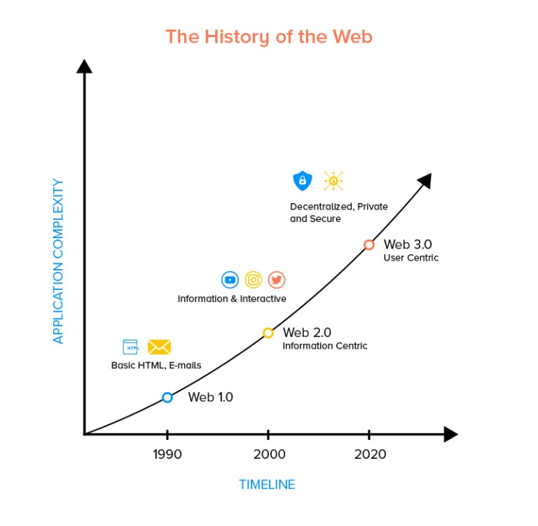
  <figcaption>(1) 웹의 역사, 이미지 출처: mozartcultures </figcaption>
</figure>

웹 1.0의 핵심은 ‘읽기’입니다. 1990년대부터 2000년대 중반까지 활약했던 Yahoo나 Google 같은 검색 서비스를 이용했던 시대인데요.  인터넷의 시작인 WWW(world wide web)로 불리우는 웹 1.0은 정적인 웹페이지로 사용자가 웹사이트에 접속해 운영자가 게시한 텍스트 중심 콘텐츠를 읽을 수 있었습니다. 한 마디로 신문이나 책을 인터넷 환경으로 그대로 옮겨온 형태라고 볼 수 있을 것 같네요.

2000년대에 들어서 등장한 웹 2.0은 일방적인 소통방식이었던 웹 1.0과 달리 ‘읽기’에  ‘쓰기’가 더해져 상호작용을 할 수 있게 된 것이 가장 큰 변화이자 발전이라고 볼 수 있습니다. 플랫폼 내에서 사용자는 자유롭게 정보를 게시할 수 있고, 타인의 정보를 읽을 수도 있습니다. 양방향 커뮤니케이션이 가능한 웹 2.0은 스마트폰을 만나며 활성화되었습니다. 유튜브 소셜 미디어, 위키백과 등이 대표적인 예이며 2000년대 중반부터 현재까지 진행 중인 단계입니다.

<figure>
  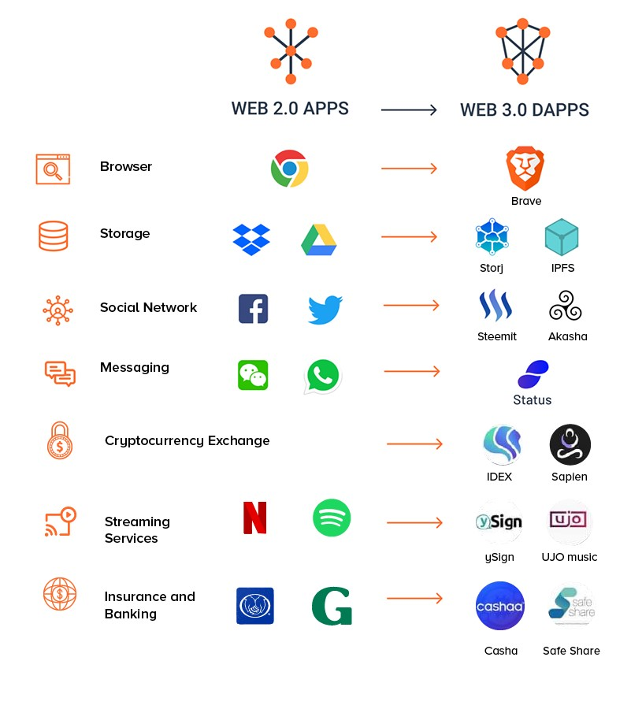
  <figcaption>(2) 웹 2.0과 웹 3.0의 차이, 이미지 출처: mozartcultures </figcaption>
</figure>

## 웹 2.0의 한계

처음 웹 2.0 등장했을 때는 누구나 원하는 정보를 자유롭게 얻을 수 있고 사용자가 직접 목소리를 낼 수도 있었기에 낙관적으로만 전망했습니다. 하지만 현재 웹 2.0 시대는 BIG 5 플랫폼이라 불리우는 MAMAA(Meta-Amazon, Microsoft, Apple, Alphabet)가 독과점하다시피하며 정보와 사용자들을 통제하고 있는 형국이라고 말할 수 있지요. 콘텐츠 창출시 생기는 수익을 실제 생산자인 사용자 보다 대기업 플랫폼들이 더 큰 몫으로 챙기는 구조로 운영되고 있으며 만약 플랫폼 기업의 보안에 문제가 생길 시에는 사용자들의 개인정보 유출이 될 수도 있다는 문제점이 발생할 수 있습니다.

게다가 플랫폼이 사라질 시 개인이 업로드했던 콘텐츠까지 함께 사라질 수 있다는 점은 앞으로 직면가능한 큰 위험요소가 될 수 있는 것이죠. 과거 싸이월드 서비스 중단 사례로 우리는 이미 한 차례 겪은 바 있습니다. 또한, 얼마 전 카카오 중앙 서버를 관리하는 데이터센터의 화재로 “국민 메신저 어플”인 카카오톡을 비롯한 관련 모든 서비스들이 일시중단되면서 사용자들이 큰 불편함을 겪은 사건이 있었습니다. 알고는 있었지만 우리가 생각했던 것 이상으로 대기업이 무료로 제공하는 서비스에 일상이  잠식당하고 있었구나를 깨달았던 사건으로 웹 3.0과 관련하여 많은 생각을 하게 했던 사례인 것 같습니다. 대기업 플랫폼에 의존적으로 될 수밖에 없는 웹 2.0 환경에 살고 있는 현재 우리에게 조만간 이러한 심각한 장애나 불편함이 또 다시 닥칠 수도 있다는 염려를 지울 수 없는 사건으로 남은 것 같네요.

## 웹 3.0의 탄생배경

웹 2.0은 앞서 언급했듯이 플랫폼을 갖고 있는 대기업들이 주도했기에 그들이 가지는 권력이 어마무시했습니다. 질 좋은 웹 환경을 제공하는 대신 플랫폼 기업들이 사용자들의 데이터와 소유권을 가져갔습니다. 이를 활용하여 막대한 수익까지 챙겼으며, 사용자들이 생산한 콘텐츠 수익의 대부분을 플랫폼 기업들이 가져가고 있습니다. 독점적인 운영 시스템으로 인터넷은 점차 중앙화되고 폐쇄적으로 변화되어갔지요.  데이터 독점으로 인해 보안이 뚫리면서 개인정보 유출의 문제점도 소지하고 있었습니다.

이러한 웹 2.0의 치명적인 문제를 해결하기 위해 웹 3.0이 탄생했습니다. 플랫폼이 거의 독점하다시피 해왔던 이익을 사용자들에게 분산하고, 정보와 데이터의 주권을 사용자에게 돌려주자는 것이 웹 3.0의 핵심목적입니다.  즉,  “탈중앙화”가 핵심 키워드입니다. 탈중앙화는 분산원장 기술인 블록체인으로 실현할 수 있는데요. 데이터를 암호화하고 개인이 데이터를 직접 소유할 수 있게 되면서 중앙의 통제로부터 자유로워질 수 있습니다.

## #웹 3.0 #사용자소유 #Sementic Web #DSC #분산 슈퍼 컴퓨팅 #맞춤형 웹

다시 말해, 웹 2.0에 ‘소유’의 개념이 추가되면 웹 3.0이라고 할 수 있는데요. 정보의 소유권은 플랫폼에 있었던 웹 2.0에 비해 분산 슈퍼 컴퓨팅(DSC)으로 인해 데이터를 분산저장하며 정보 소유권도 해당 사용자에게 있는 게 웹 3.0의 가장 큰 특징이며 ‘탈중앙화된 인터넷 세상’을 이용할 수 있다는 점에서 관심을 모으기 시작했습니다. 기존과 정반대인 탈중앙집권적 구조로, Sementic Web과 블록체인 기술 발전으로 가능해질 수 있었습니다. 블록체인을 통해 웹 3.0은 데이터를 암호화하고 개인이 데이터를 소유할 수 있어 중앙의 통제로부터 무척 자유롭다는 것이 웹 2.0에서 염려되는 문제들로부터 자유롭다는 점이 가장 혁신적인 발전인거죠.

## 다가오는 시대의 스탠다드 (feat. NFT, 메타버스)

웹 3.0에서는 데이터와 관련하여 읽기, 쓰기, 소유가 전부 다 가능하니 개인화된 인터넷 환경 구축이 가능해집니다. 웹 3.0의 기반 기술인 블록체인 산업이 빠른 속도로 규모성장 중이고, 글로벌 기업들은 NFT와 메타버스 시장을 선점하기 위해 투자를 아끼지 않고 있습니다. 모든 외부 상황이 맞물리면서 웹 3.0이 화두로 떠오르고 있습니다. 웹 3.0의 탈중앙화 가치를 따르는 서비스가 탈중앙화 앱(Decentralized App, DApp)이라 하며 사용자와 중개자 역할인 중앙 서버가 없습니다. 토큰, 디파이, NFT, DAO에도 같은 개념을 적용했습니다. 웹 3.0은 사용자와 사용자가 직접 정보를 주고받는 P2P(Peer to Peer)도 가능해지는 구조입니다.

앞서 언급했듯 웹 3.0은 보안성과 익명성이 가장 큰 장점인데요. 웹 2.0에서는 중개자가 해킹되거나 시스템 고장시 막대한 피해를 초래했습니다. 그 예로 아마존웹서비스의 서버 다운으로 AWS 클라우드를 사용하던 넷플릭스는 일부 지역에서 서비스가 중단되는 사태가 발생한 적 있었지요. 웹 2.0은 중개자를 공략하면 해킹이 가능하지만, 사실상 웹 3.0에서는 전체 네트워크를 해킹해야 하기에 현재 기술력으로는 불가능하므로 보안성이 더욱 강화됐다고 볼 수 있는 것입니다.

인공지능과 시맨틱 웹으로 인해 웹 3.0의 지능화 서비스는 문장을 넘어 맥락을 인식합니다. 검색 데이터, 선호 콘텐츠 등 행동 데이터의 분석으로 필요한 정보를 알아서 제공하기도 하구요. 맞춤형 서비스 제공으로 사용자에게 편리하고 개선된 경험을 선사하게 됩니다. 하지만 지난 루나 사태로 신뢰와 투명성이 기반인 블록체인 기술에서 웹 3.0에 대한 의구심과 비판이 일기도 했습니다.

디지털 세상에 등장한 세 번째 변화이자 시대인 웹 3.0은 데이터 소유권, 탈중앙화, 보안성 강화 등 여러 장점을 갖고 있다는 확신이 들지만 아직 시기상조로 볼 수 있으므로 올바른 이해와 철저한 설계 및 준비가 필요한 시점이라고 보여집니다.

## #NFT #P2E 게임 #Defi(탈중앙 금융) #DApp(탈중앙 어플리케이션)

웹 3.0과 함께 등장한 것은 NFT, P2E 게임, Defi(탈중앙 금융), DApp(탈중앙 어플리케이션) 등이 있습니다. NFT는 탈중앙화된 인터넷에서 디지털 자산의 소유권을 인증하는 인증서 역할을 합니다. 기존에 필요했던 중앙관리자 없이도 인증가능한 시스템이지요. P2E(Play to Earn) 역시 탈중앙화로 개인간 안전한 현금거래가 가능한 게임 수익모델입니다. 시멘틱 웹(Sementic Web)은 웹 3.0의 또 다른 핵심기술입니다. 데이터들을 취합해 개인 맞춤형 정보를 제공하는 웹으로 기존의 웹 2.0은 사용자가 원하는 정보를 검색하기 위해 시간과 노력을 들여야했지만 웹 3.0의 시맨틱 웹은 불필요한 정보들을 없애고 사용자 성향과 목적에 맞춰 정보를 전달해줍니다. 컴퓨터가 스스로 논리적인 추론을 가능하게 하는 기술이라고 볼 수 있습니다.

일론 머스크는 웹 3.0은 실체가 없는 마케팅 용어라고 하는 등 IT 업계에선 비난의 말들이 많습니다. 웹 3.0 서비스를 시작한 기업에게 돈을 투자한 투자자들만 돈을 벌게 되는 일이라며, 투자한 VC들이 웹 3.0을 소유하게 되고 결국엔 완벽한 탈중앙화가 아닌 다시 중앙화가 될 수도 있다는 우려때문인 것 같습니다. 그럼에도 불구하고 웹 3.0에 대한 글로벌 기업들의 기대와 관심은 끊이지 않고 있습니다. 삼성전자는 삼성넥스트를 통해 웹 3.0 인프라스턱처 개발 기업 ‘미스틴랩스’와 메타버스 아바타 플랫폼 기업 ‘레디 플레이어 미’에 투자했고, 카카오는 웹 3.0을 직접 개발하겠다 발표했으며, 지난 5월 구글 클라우드가 트로먼스 CTO를 필두로 웹 3.0 앱 전담조직을 신설함과 동시에  블록체인 전문 기업 대퍼랩스와 함께 웹 3.0 개발에 나섰습니다. 모두가 주목하고 있는 웹 3.0이 우리에게 어떠한 변화와 혁신을 가져올 것이기에 다수의 글로벌 기업들이 앞다투어 주목하는 것인지 지금부터 글로벌 트렌드 사례를 살펴보겠습니다.

## 웹 3.0을 적용한 글로벌 사례

### 1. 평생 보관되는 분산 저장소, 알위브

알위브는 블록체인이라는 분산 저장 시스템 도입, 드롭박스, 구글 클라우드의 탈중앙 스토리지 버전을 만드는 것을 목적으로 합니다. 탈중앙 스토리지는 보통 데이터가 영구보존되며 특정 기업이 데이터를 소유하지 않는 특징이 있습니다. 알위브가 관리하는 데이터는 외부 사용자의 남는 디스크 공간에 분산저장됩니다. 데이터는 여러 개로 쪼개져서 각기 다른 공간으로 보내지며, 누구나 저장공간을 빌려줄 수 있으나 RAM, 운영체제 같은 최소한 사양이 맞아야 자격이 주어지고 저장공간 제공자는 알위브에서 발행한 자체토큰인 AR로 보상받는 시스템으로 운영됩니다.

분산형 기술을 통해 운영비를 감축함으로써 서비스 비용을 낮췄습니다. 보편적인 스토리지 서비스의 월구독료 지불형식에서 이용 전 선불 요금납방식으로 홈페이지에서 필요한 용량을 입력하면 일시불 가격 책정 후 알려주는데, AR 토큰으로 비용을 책정하기에 토큰 시세에 따라 조금씩 변동됩니다.

데이터 평생저장 서비스를 제공하지만 누구나 데이터를 볼 수 있는 것은 아닙니다. 웹 3.0 블로그 플랫폼 미러는 사용자들의 글의 저장수단으로 알위브 스토리지를 이용 중인데, 미러에 글을 한 번 올리면 평생 해당 글은 수정이나 삭제가 불가능합니다. 대신 알위브 위에서만 삭제가 안 되는 것이고, 미러 내 비공개 설정시 외부에 공개되지 않습니다. 이러한 점에서 반드시 평생 보존해야 하거나 원본 추적해야 하는 데이터 저장시에 활용도가 높아진다고 볼 수 있습니다.

또는, 인프라 구축시 데이터의 무결성 유지를 위한 도구로도 사용됩니다. 예로, 홍콩의 언론사가 중국 정부를 비판하다 폐간당한 후 기사 데이터를 알위브에 올려두었다고 합니다. 중국 정부 검열을 대비해 기사내용의 삭제가 수정을 막은 것이지요. 분산형 결제 서비스 이용하는 에버파이넌스는 결제 데이터를 저장하기 위한 인프라로 알위브를 선택했으며. 디지털 유산 보관 비영리단체 인터넷 아카이브도 알위브로 데이터를 보존 중이라고 하네요.

예술가들이 NFT 작품 발행할 때에 알위브를 이용하기도 합니다. 예술작품의 저작권은 100년 넘게 보호되는 경우도 있으니 오랫동안 NFT 원본파일 보존을 위해 알위브 기술을 선택하는 것입니다. 개발자용이 아닌 일반 사용자가 이용할 수 있는 클라우드 저장소 ‘알드라이브’를 개발해 수익성을 높이고 있다고 하네요.

<figure>
  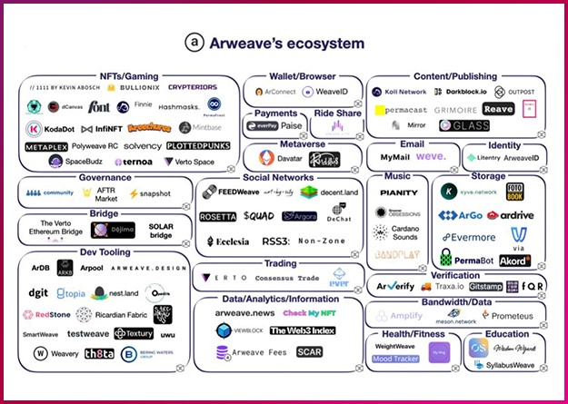
  <figcaption>(3) 알위브를 이용한 서비스, 이미지 출처: LG CNS 블로그 </figcaption>
</figure>

### 2. 현실 데이터의 연결, 체인링크

체인링크는 2017년 설립, 현실 세계의 데이터를 웹 3.0에 전달하고 탈중앙화 시스템 연동으로 외부 시스템의 API를 호출해주는 오라클 기술을 제공합니다. 스마트 컨트랙트 진위여부 판단을 위해 현실 데이터값을 확인해야 하는 경우가 있습니다. 작물 보험 스마트 컨트랙트 서비스에서 다수의 소스로부터 취합한 날씨 데이터를 바탕으로 보험금 지급요건을 확인해 보험금을 지급해야 하는데, 이때 날씨 데이터를 중앙화된 하나의 주체를 통해서 파악하면 탈중앙화된 서비스의 의미가 없어지겠지요. 그렇기에 현실 데이터를 다수의  주체를 통해 수집하고 합의 메카니즘을 통해 최종적으로 애플리케이션에 현실 데이터를 제공해야 하는 서비스가 필요한데, 이 기술을 오라클이라 부릅니다.

오라클을 통해 수집된 현실 데이터값이 현실과 다르면 스마트 컨트랙트 서비스 신뢰성에 걸림돌이 될 수 있습니다. 무결성 데이터 확보  기술이 가장 중요한 요소로 작용할 것으로 전망되는 이유입니다. 2019년부터 구글 클라우드와 협력, 구글 날씨 데이터를 기반으로 한 작물 보험 등의 탈중앙형 보험 서비스를 제공 중이라고 합니다.

### 3. 블록체인 개발을 돕는 든든한 지원군, 컨센시스

컨센시스는 블록체인 관련 서비스를 만들 때 필요한 여러 인프라를 제공하는데요. 가장 대표적으로 알려진 서비스는 이더리움 지갑 ‘메타마스크’(MetaMask)로 블록체인 및 웹 3.0 서비스에서 소셜 로그인과 유사한 역할을 하는 동시에 컨센시스에 수수료 수익을 제공하는 기술입니다. 2022년 기준 메타마스크 월 활성 사용자수는 3천만 명으로 지갑 서비스는 사용자의 요청을 받아 블록체인과 통신해야 하며, 매일 노드에 수십억 건 입출금 요청처리를 위해 읽고 쓰도록 요청해야 합니다. 이때, 자체적으로 노드를 운영할 수 있으나 비용절감 측면에서 노드를 빌려 쓰기도 하는데 이를 노드 대여 서비스라고 합니다.

컨센시스는 현재 노드 대여(노드 API) 서비스 인퓨라(Infura)를 제공하고 있습니다. 2020년 11월 발생했던 인퓨라 서비스 장애로 인해 빗썸, 업비트 등 암호화폐 거래소의 토큰 입출금 서비스가 일시중단되는 사고로 인퓨라 서비스 리스크가 드러나기도 했습니다. 또한, AWS를 이용하기에 아마존에 의해 완전히 중앙화된 프로젝트로, 탈중앙화를 추구하는 웹 3.0의 기본원칙과 맞지 않는다는 지적을 받기도 했지요.

인퓨라 서비스의 대표적인 이용사례로는 디파이 프로젝트 ‘유니스왑’을 들 수 있습니다. 네트워크를 사용하는 개발자에게 통찰력과 모니터링 기능을 제공하는 개발자 포털을 포함, 확장한 솔루션으로 발전 계획 중에 있다고 합니다. 이외에도 컨센시스는 금융, 이커머스 시장의 필요 개발기능을 모아둔 코드파이(Codefi)나 보안 및 검증을 지원하는 딜리전스(Diligence) 같은 서비스도 제공합니다.

<figure>
  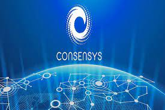
  <figcaption>(4) 컨센시스, 이미지 출처: 컨센시스 웹사이트 갈무리 </figcaption>
</figure>

### 4. 스트리밍 구축 비용을 낮추다, 라이브피어

라이브피어는 동영상 스트리밍 시장에 맞춘 분산형 인프라 제공 기업입니다. 세계 수준의 개방형 비디오 인프라 : 라이브피어는 이더리움 블록체인에 구축된 탈중앙화 비디오 코드 변환 네트워크로 설명이 가능합니다.

| 사용자 분류 | 제공 서비스|
| ---- | --- |
| 개발자(Developer) | 라이브피어 공개 네트워크 또는 호스트 서비스를 사용하여 귀하의 프로젝트에 라이브 비디오를 추가할 수 있는 API, 가이드, 리소스 및 도구를 발견할 수 있다. |
| 토큰 보유자(Tokenholders) | LPT를 취득하거나 스테이킹하여 라이브피어 네트워크의 유지 및 발전에 기여 가능. 대가로 ETH 및 LPT 보상을 획득할 수 있다.   |
| 비디오 채굴자(Video-miners) | GPU에서 라이브피어 노드를 운영하고 비디오를 변환하여 대가로 ETH 및 LPT 보상을 획득할 수 있다.  |

일반인 사용자는 영상을 업로드 하거나 실시간 방송을 할 때, 유투브나 아프리카 TV 같은 기존 플랫폼을 이용하면 되지만, 기업 사용자는 자체 영상 플랫폼을 만들어 서비스에 추가해야 하는 경우가 생기는데, 이러한 수요에 맞춰 성장 중인 기술이라고 볼 수 있지요.

기본적으로 동영상을 웹상에 전송할 때 필요한 모든 인프라를 종합 제공합니다. 기존 클라우드 인프라 기술을 활용해 영상 콘텐츠 스트리밍시 매월 최대 4,500달러가 들고, CDN(Content Delivery Network) 이용 비용은 1,500달러까지 발생할 수 있다고 하는데요. 이를 라이브피어 기술 사용시에는 최대 50배나 비용절감 효과를 기대할 수 있다고 하는데 이 역시 분산 형태 인프라로 운영 비용을 감축시킨 덕분입니다.

라이브피어는 외부 참여자의 CPU, GPU 대역폭과 같은 리소스를 활용해서 영상 콘텐츠를 웹상에 배포합니다. 타 블록체인과 마찬가지로 인프라 자원 제공자에게 자체 토큰을 보상으로 제공하고 있습니다. 인프라는 약 7만 개의 GPU를 활용해 동영상 스트리밍의 인코딩을 지원 중으로 해당 자원으로 매주 230만 분 분량의 영상이 웹전송되고 있다고 하네요. 내부 확보 GPU 리소스가 유투브, 페이스북, 트위치에 올라온 모든 영상을 인코딩할만큼의 충분한 사양인데, 2021년 AI 영상 소프트웨어 기업 미스트서버를 인수해 저작권 보호 기능이나 데이터 최적화 기술을 제공했으며, 이를 통해 종합 동영상 인프라로 확장할 준비 중으로 이커머스, 게임, 엔터테인먼트, 컨퍼런스 업계를 주요 타깃으로 삼고 사업을 확장 중입니다.

<figure>
  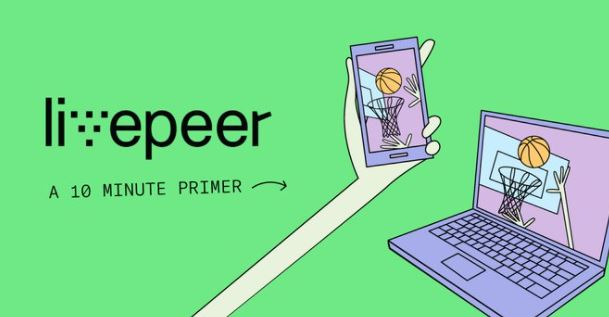
  <figcaption>(5) 라이브피어 서비스, 이미지 출처: 라이브피어 웹사이트 갈무리 </figcaption>
</figure>

### 5. 텍스트 콘텐츠 NFT 제작 Web 3.0 플랫폼, MIRROR

지금까지 대부분의 블로그와 게시물들은 원작자의 소유가 아닌 플랫폼의 소유였습니다. 네이버 블로그 글은 온전히 작성자 소유가 아니며 플랫폼 운영자인 대기업 네이버가 이 서비스를 중단하기라도 하면 내 포스팅은 영원히 사라지는 것이겠지요. 웹 3.0 시대에는 내가 작성한 콘텐츠는 오로지 나의 소유가 되며, 글의 통제권도 오로지 나에게 있습니다. 이러한 면에서 ‘미러’(Mirror) 플랫폼은 웹 3.0에서 매우 주목할만한 대표적인 프로젝트로 보입니다.

미러 플랫폼은 텍스트 콘텐츠 제작자가 작성한 글을 NFT 토큰화하며 마켓에서 거래할 수 있도록 돕는 프로젝트로 작성된 글은 발행과 동시에 NFT로 변환됩니다. 변환된 NFT 텍스트 콘텐츠는 복제나 변이가 불가능해 고유성을 유지할할 수 있습니다. 정해진 수량 외 추가발급이 어려워 희소성 가치가 있어 텍스트 콘텐츠가 ‘한정판’ 상품이 되는 것이지요.

독자는 NFT 콘텐츠를 완전히 구매하거나 지분만을 매입할 수 있습니다. 완전 구매한 NFT는 재판매를 통해 차익을 남길 수도 있구요. 지분 매입의 경우 콘텐츠가 벌어들이는 수익을 나누어가지게 됩니다. 콘텐츠 추가 연재 희망 독자들이 후원 펀딩을 하게되면 지분만큼 수익을 분배받는 방식의 구조입니다.

2020년 10월 첫 서비스 개시한 미러는 1년 내 억 단위 투자유치에 성공한 바 있으며, 초기 코인투자사들이 잠재 성장가능성을 보고 투자에 참여했습니다.

<figure>
  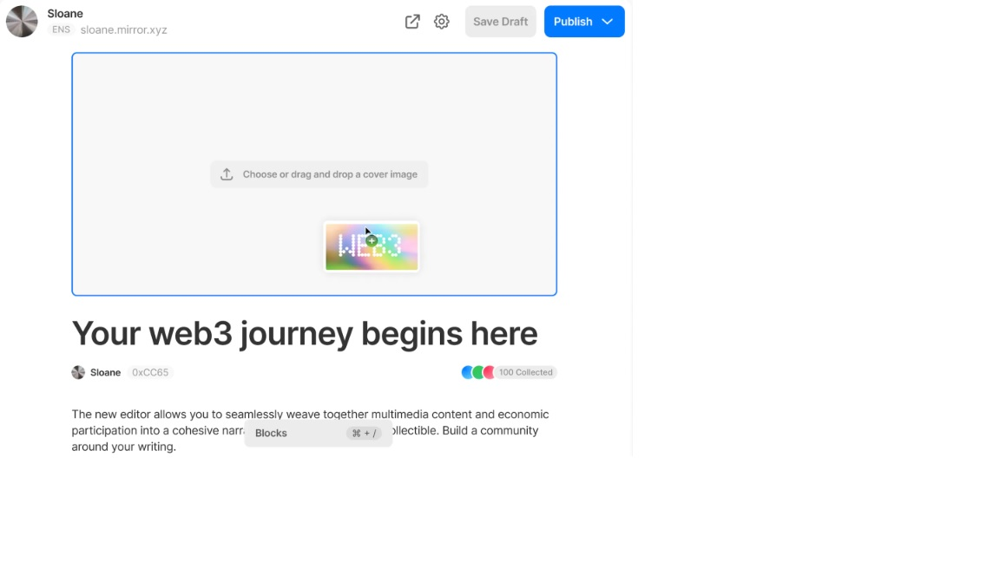
  <figcaption>(6) 텍스트 콘텐츠 플랫폼 미러, 이미지 출처: 미러 웹사이트 갈무리 </figcaption>
</figure>

### 6. 새로운 경험을 제공하는 Web 3.0 커뮤니티, 스타벅스 오딧세이

모바일 앱 활성사용자 1,700만 명, 월 평균 700만 건의 모바일 주문이 이뤄지는 스타벅스는 다양한 보상과 이벤트를 제공하며 앱사용자수의 꾸준한 증가를 유도하며 실적을 자랑해오고 있는데요. 지난 9월, 스타벅스는 회원 및 직원들에게 새로운, 확장된 경험을 제공하는 WEB 3.0 커뮤니티인 스타벅스 오딧세이를 발표했습니다. 이는 기존의 스타벅스 어플 사용 멤버를 위한 로열티 프로그램과 NFT를 결합한 것으로 암호화폐 없이도 결제가 가능하도록 만들어졌습니다. 스타벅스 오딧세이에 접속하면 다양한 여정에 참여할 수 있고 그 여정 중 수집되는 스탬프를 모아 여정 종료 후 보상받는 방식입니다. 포인트를 쌓아 행사/이벤트 초대나 아티스트 협업과 같이 특별한 경험을 할 수 있다고 합니다. 2022년 말 폴리곤 체인 기반으로 운영예정인 스타벅스 오딧세이는 현재 별도 링크를 통해 대기자 명단에 등록할 수 있는데, 웹 3.0 시대의 흐름을 놓치지 않는 트렌드 리딩 글로벌 기업답네요.

<figure>
  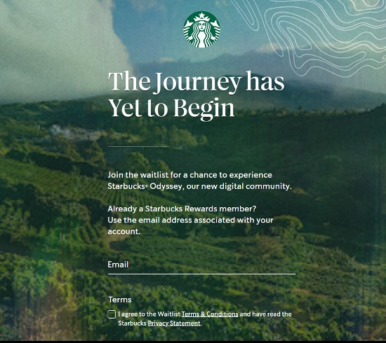
  <figcaption>(7) 스타벅스 오딧세이, 이미지 출처: 스타벅스 오딧세이 대기 신청 웹사이트 갈무리 </figcaption>
</figure>

### 7. 종합 NFT 마켓플레이스 ‘도시 스토어’ 출시, 네이버
  
지난 9월, 라인 넥스트는 NFT 마켓 '도시 스토어' 베타 버전을 출시했으며, 연내 공식 출시를 계획 중입니다. SNS 계정을 통해 도시 전용 지갑 ‘도시 월렛’에 로그인하고, 네이버페이와 신용∙체크카드 등으로 NFT 결제가 가능합니다. 공식 버전에서는 자체 코인 '링크'를 비롯한 가상자산을 사용한 결제 등 여러 기능이 탑재될 예정이라고 하네요. NFT 브랜드 확보 측면에선 대중성을 우선시했기에 지난 3월 NFT 파트너사로 네이버 계열사 외 CJ ENM, YG플러스, 신세계, 크립토닷컴, 111퍼센트 외 수 십개의 기업과 협력을 발표했습니다. 최근 웹툰 시리즈 '지옥', 네이버 영상 서비스 '나우', 아이돌 '엔믹스', 프로야구팀 'LG트윈스' 등과 NFT를 판매하기도 했네요.  NFT를 기반, 활동하는 ‘도시’에 착안해 마켓출시를 했다고 하는데요. 가입자 대상 ‘시티즌’이란 이름의 NFT를 발행, 이를 통해 각 브랜드별 커뮤니티와 이벤트 참여를 유도하고 있습니다. 활동량순으로 보상지급 기준을 세워 이용자 참여의 지속성을 유도한다는 계획입니다.

<figure>
  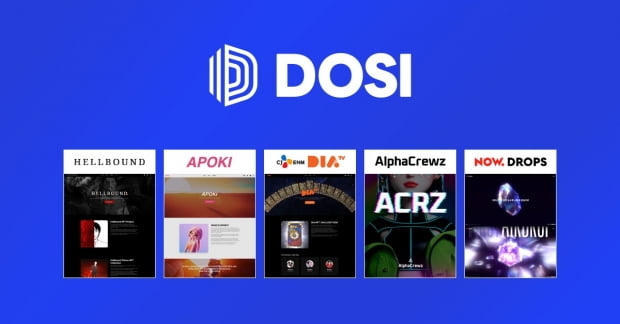
  <figcaption>(8) 라인 넥스트의 도시 스토어, 이미지 출처: 라인 넥스트 제공 </figcaption>
</figure>

<figure>
  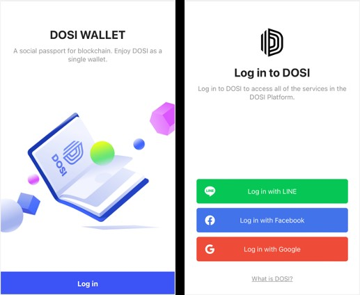
  <figcaption>(9) 라인 넥스트의 도시 월렛, 이미지 출처: 라인 넥스트 제공 </figcaption>
</figure>

### 8. 가상자산 지갑 클립과 NFT 사업 강화하는, 카카오

글로벌 블록체인 플랫폼 클레이튼은 카카오와 협력을 추진하는 '카카오 레버리지 태스크포스'를 설립했습니다. 지난달 말 설립한 TF를 통해 카카오톡에 탑재된 디지털 지갑 '클립'(Klip)에서 사용자가 보유한 NFT를 카카오톡 서비스와 연계하는 방안을 모색하고 있다고 하는데요. 클레이튼 상의 자산을 카카오톡 서비스 내에서 이용하는 방안과 함께 가상자산 관련 피해 예방을 위한 기술·제도적 해결책도 개발 중에 있습니다. 또 카카오 블록체인 계열사 그라운드X과 협력해 클레이튼 NFT 생태계 확대에 나서고 있다고 덧붙였습니다. 그라운드X는 기업의 클레이튼 NFT 사업을 지원하기 위해 얼라이언스 'GRID'(그리드)를 구축해 약 200개 기업과 논의 중에 있습니다.
  
### 9. 자사 블록체인 생태계 MBX 구축, 코인 NFT 발행, 넷마블

넷마블은 올 하반기 블록체인 게임 플랫폼 'MBX'에서 NFT 사업을 시작한다고 합니다. MBX는 사업 로드맵을 업데이트하며 하반기에 처음으로 선보일 서비스로 NFT를 제시했는데요. 그간 넷마블 자회사 넷마블에프앤씨의 블록체인 '큐브'는 NFT 사업을 활발히 진행해왔지만, MBX는 블록체인 게임 출시에만 집중하는 모습을 보여왔습니다. 게임업계에 따르면 MBX의 NFT 사업은 게임 NFT와 마켓이 될 것으로 예상되는데요. A3: 스틸얼라이브와 제2의 나라 NFT가 발행될 가능성이 큽니다.  특히 제2의 나라는 아기자기한 캐릭터와 펫, 탈것이 존재해 NFT가 잘 어울릴 것으로 전망되어 왔습니다. MBX는 하반기 블록체인 게임 모두의마블: 메타월드를 선보일 예정입니다. 앞서 넷마블은 모두의마블: 메타월드가 메타버스형 게임으로 가상토지를 사고 파는 형식이될 것이라고 언급한 바 있습니다. 가상토지가 NFT로 발행되고 마켓에서 거래될 가능성이 높다는 것이 관계자들의 설명입니다.

### 10. 자사 블록체인 게임플랫폼 C2X 구축, 가상화폐 CTX 발행, 컴투스

컴투스홀딩스는 블록체인 메인넷을 직접 만들어 안정적인 서비스 제공에 나섰습니다. 메인넷은 블록체인 서비스 개발이 가능한 네트워크로 그동안 컴투스는 테라폼랩스의 메인넷에서 게임 및 가상자산 서비스를 운영했지만 여러 외부요인으로 메인넷으로 옮기기로 결정했습니다. 블록체인 플랫폼 C2X는 게임, 가상자산 등 컴투스의 여러 블록체인 서비스를 운영하는 플랫폼으로 생태계의 안정성 확보를 목표로 운영하고 있습니다. 메인넷 구축에는 많은 시간과 비용이 들기에 타사의 메인넷을 사용하기도 하는데, 장기적으로 안정적인 블록체인 서비스를 제공할 수 있는 기반을 다지기 위해 C2X를 운영하는 것입니다. 게임이 주요사업이었던 컴투스는 사명까지 바꾸고 종합 콘텐츠 플랫폼으로 성장하겠다는 포부를 밝히며 주요 서비스인 게임 라인업 확대를 시작으로 연말까지 개발자 키트(SDK)를 공개할 계획이라고 합니다. 개발자 키트는 개발자들이 여러 서비스를 만들 수 있도록 배포되는 키트로 다양한 플랫폼 안에 여러 서비스를 갖추고 사용자 유입을 늘릴 수 있는 장점이 있습니다. 또한, 가상자산 CTX의 기능을 확대하기로 하고, 외부 파트너를 들이는 플랫폼 형태로 메타버스를 개발 중에 있다고 합니다.

### 11. K-POP 디지털 콜렉터블 플랫폼 ‘모먼티카’ 출시, 레벨스

블록체인 및 핀테크 기업 두나무와 엔터테인먼크 기업 하이브의 합작회사인 레벨스는 K-POP 분야 디지털 콜렉터블 플랫폼 ‘모먼티카’를 공식 출시했습니다. 아티스트 팬덤을 위한 디지털 콜렉터블 플랫폼으로 입지를 확고히 다지겠다고 발표했습니다. 하이브 레이블즈 아티스트의 모습을 디지털 카드 형태로 기록, 수집, 거래하는 플랫폼으로 운영됩니다. 아티스트의 미공개 버전 사진, 음성, 영상 콘텐츠, 무대 위 순간들이 디지털 카드로 유통되는 등 얼마 전 막 걸음마를 시작한 단계의 서비스입니다.

<figure>
  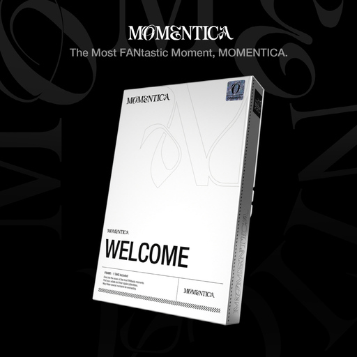
  <figcaption>(10) 모먼티카 서비스, 이미지 출처: 모먼티카 웹사이트 갈무리 </figcaption>
</figure>

<figure>
  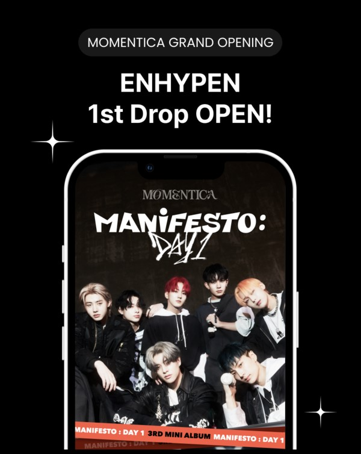
  <figcaption>(11) 모먼티카 서비스, 이미지 출처: 모먼티카 웹사이트 갈무리 </figcaption>
</figure>

### 12. NFT 마켓플레이스 ‘사이펄리’ 출시, 람다256

블록체인 기술 기업 람다256은 NFT 마켓플레이스 '사이펄리' 베타 버전을 지난 7월 말 출시하고 공식 버전을 준비 중이며, 현재는 제휴 IP를 늘리는 데 주력하고 있습니다. “최대 NFT 마켓인 오픈씨의 경우 일반인의 쉬운 NFT 유통을 추구한다면, 사이펄리는 프리미엄 콘텐츠를 팬덤이 소비하는 모델로서 차별화하는 것이 목적"이라며 “글로벌 브랜드를 타겟으로 삼고 있고, 팬을 많이 확보한 회사들에게 NFT 관련 A부터 Z까지를 안내할 수 있는 사업 모델을 구상하고 있다”고 발표했습니다. 사이펄리는 람다256 자체 서비스형블록체인(BaaS) '루니버스'를 토대로 운영되는데요. 이를 통해 ‘라이브 NFT' 등 색다른 NFT를 만들 수 있으며 수수료가 면제되고, 멀티체인 브릿지 기능으로 현재 이더리움, 클레이튼을 지원하고 있고, 솔라나, 폴리곤에 대한 지원도 준비 중에 있다고 합니다.  

지금까지 웹 3.0을 적용하여 블록체인 업계가 준비해온 대체불가토큰(NFT) 마켓 플레이스 등의 실제 글로벌 사례들에 대해 살펴봤는데요. 블록체인 업계 관계자들은 "작년 하반기 쯤에는 크립토펑크 등 투기성 자산으로서 기능했던 NFT들이 주목을 받았다면, 올해는 기업들이 준비한 NFT 프로젝트들이 연이어 등장하고 있다"며 이런 프로젝트 NFT들이 거래될 수 있는 NFT 마켓들도 때맞춰 출시되는 상황이라 분석하고 있습니다.  

새로운 시대를 받아들이기 전까지는 늘 수많은 시행착오와 우려들이 발생하는 것 같습니다. 그렇지만 시대의 흐름에 발 맞추어 성장해나가기 위해서는 예상되는 문제점들을 대비하고 준비하는 단계가 반드시 필요한 과정이라고 생각이 듭니다. 이 과정을 어떻게 준비하는가, 확실하게 준비된 자만이 그 기회를 적당한 시기에 잡을 수 있다고 생각하기에 미디어나비는 오늘도 최신 기술과 관련 산업 트렌드에 대해 연구하고 각자의 위치에서 할 수 있는 일들을 미리 준비합니다.

## 참고문헌

* SAMSUNG SDS 기술 블로그  
    <https://www.samsungsds.com/kr/insights/web3.html>
* LG CNS 기술전략팀 블로그  
    <https://www.lgcns.com/blog/cns-tech/30838/>  
    <https://www.lgcns.com/blog/cns-tech/30783/>
* Arweave explained: the elephant in the room of Web3.0  
    <https://www.foresightventures.com/focusdetail-16.html>
* How to use ArDrive for free  
    <https://ardrive.io/how-to-use-ardrive-for-free/>
* 컨센시스 블로그 - 이더리움 인프라 기반에서 왜 인퓨라가 비밀무기인 것인가?  
    <https://consensys.net/blog/news/why-infura-is-the-secret-weapon-of-ethereum-infrastructure/>
* 라이브피어 깃허브  
    <https://github.com/livepeer/wiki/blob/master/STREAMFLOW.md>
* 음악산업 혁신의 시작? 바로 웹 3.0에서 시작!  
    <https://www.lgcns.com/blog/it-trend/34218/>
* 인프런, 웹 3.0, 그것이 궁금하다!  
    <https://www.inflearn.com/pages/infmation-55-20221101?utm_source=mailchimp&utm_medium=email&utm_campaign=traffic_infmation_web3&utm_content=20221101>
* 미러, 텍스트 콘텐츠를 NFT로…  
    <https://www.sbiz.news/news/articleView.html?idxno=21068>
* "스타벅스 오딧세이" 이해를 위한 핵심 키워드 7가지!  
    <https://engine.roa.ai/articles/172690>
* 레벨스, 팬덤 위한 디지털 콜렉터블 플랫폼 '모먼티카' 출시  
    <https://www.metroseoul.co.kr/article/20221021500106>
* 두나무와 하이브의 레벨스, '모먼티카' 드롭 공식 오픈...첫 아티스트는 '엔하이픈'  
    <https://www.techm.kr/news/articleView.html?idxno=102830>
* 지금 꼭 알아야 할 개념, 웹 3.0  
    <https://contents.premium.naver.com/3mit/wony/contents/220612204532349ym>
* 테라 후유증에도 VC 공격 투자…웹 3.0에 뭉칫돈  
    <https://decenter.kr/NewsView/2677EL3JTY>
* 웹 3.0이 가져올 미래 변화는  
    <https://magazine.hankyung.com/money/article/202202143142c>
* 블록체인 업계가 공 들인 'NFT' 마켓 속속 출시  
    <https://zdnet.co.kr/view/?no=20221025153224>
* 클레이튼 "카카오 서비스 연계 모색"…'카카오레버리지TF' 설립  
    <https://www.yna.co.kr/view/AKR20221108103600017>
* 블록체인 게임 생태계 완성해 가는 넷마블, 하반기 NFT 서비스 내놓는다  
    <https://www.techm.kr/news/articleView.html?idxno=99059>
