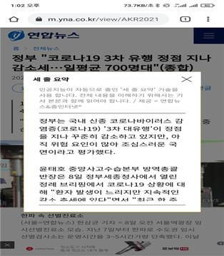

### **데이터바우처 지원사업이란?**
데이터바우처 지원사업에 대해 들어보신 적 있나요? 데이터 산업 관계자분들은 다들 아실만한 지원사업인데요. 데이터바우처 지원사업은 **데이터 수요 · 공급의 생태계를 조성하고 全 산업의 디지털 기반 데이터 활용 활성화 촉진을 위해 데이터 구매 · 가공 바우처를 지원**하는 내용의 한국데이터산업진흥원 주관 사업입니다. 2022년의 경우, 총 예산 1,241억 원이 편성되어 데이터가 필요한 수요기업과 데이터를 판매하는 공급기업의 맞춤 매칭을 통해 지원해오고 있습니다. 

**데이터바우처 사업추진체계**
<figure>
<figure>

<figcaption>(1) 데이터바우처 사업추진체계, 이미지 출처: 데이터바우처 홈페이지 </figcaption>
</figure>

**사업추진절차**
<figure>
<Figure>

<figcaption>(2) 데이터바우처 사업추진절차, 이미지 출처: 데이터바우처 홈페이지 </figcaption>
</figure>

위 사업추진절차에서 02번에 해당하는 공급기업 모집단계 중, 저희 미디어나비가 **2023년 데이터바우처 AI 가공부문 공급기업으로 선정**되어 조금 더 자세하게 저희가 서비스할 내용에 대해 설명해드리려 합니다. 이번 블로그의 콘텐츠 주제가 탄생하게 된 이유도 바로 이 덕분이지요. 그럼 저희가 공급기업으로 참여하여 제공하게 된 AI 가공데이터 서비스 상품에 대해 자세히 설명해볼게요.

#### **(AI 가공서비스 I) KPF-BERT를 활용한 뉴스 기사 본문 요약 데이터 가공서비스**
- 뉴스 본문의 중요 문장을 찾아서 3문장으로 제시하는 인공지능 언어모델을 **API와 설치형 모두 제공 가능**
- 모바일 시대에 적합한 정보전달 방법으로 문장 분석력을 사용하여 전체 문장 중 가장 중요도가 높은 문장 3개 추천방식으로 본문 내용을 요약⠂표현하는 활용법으로 이용
- 한국언론진흥재단에서 구축한 방대한 뉴스 기사 코퍼스로 학습한 KPF-BERT를 이용하여 특히, 한국어 작성 뉴스 기사 요약에 특화된 모델이라 할 수 있음
- 타 유사 서비스 예시 : 줌인터넷이 연합뉴스에 뉴스 본문 요약 기능을 API 형태로 기능을 제공 중이며, 하루 900여 건 생성
<figure>
<figure>

<figcaption>(3) 연합뉴스 뉴스 3줄 요약 서비스 모바일 화면 , 이미지 출처: 연합뉴스 </figcaption>
</figure>

#### **(AI 가공서비스 II) KPF-BERT를 활용한 뉴스 기사 클러스터링 가공서비스** 
- 비슷한 주제를 다룬 뉴스 기사들을 자동으로 묶어주는 서비스로 **설치형으로만 제공 가능**
- 비슷한 주제의 기사목록 중 위원회 알고리즘에 따른 자동평가로 대표 기사 선정 가능

-- kpf-SBERT - <https://github.com/KPFBERT/kpfSBERT>

-- Sentence BERT를 제작하는 방법에 대한 소스코드가 깃허브에 오픈되어 있음

-- 단어별 임베딩이 아닌 문장 전체를 하나의 동일한 크기의 임베딩 벡터로 변환하는데, 이것은 문장간의 비교를 BERT 대비 엄청나게 빠르고 효율적으로 연산하는 것이 가능

-- 문장의 의미적 유사도를 쉽게 수치로 비교할 수 있고, 미세하게 다른 표현이지만 중복 문장 또는 기사를 찾아내어 중복제거 등 업무에 활용할 수 있음

-- kpf-SBERT를 이용하여 HDBSCAN으로 뉴스를 자동 클러스터링하는 모델의 예제

-- 소스코드에서는 기사의 제목만으로 의미적 유사도에 기반, DBSCAN 보다 고성능인 HDBSCAN을 이용하여 클러스터링함

-- 네이버, 다음과 등 포털 뉴스는 기사 본문의 형태소 분석을 통해 기사간의 유사도를 자동측정하고 분류하여 유사한 기사끼리 묶어내는 뉴스 자동 클러스터링 서비스를 수년 전부터 제공 중

#### **(Extra Service) 이밖에 KPF-BERT 활용, 추가 기능 위한 데이터 가공서비스**
- KPF-BERT를 활용한 추가 기능 모델 개발을 위한 가공데이터 서비스를 아래의 예시 중 수요기업 니즈에 따라 사전 주문협의시 설계하여 제공 가능

1. 맞춤법 검사기
-- 단순 맞춤법 검사를 넘어 문맥과 의미를 고려한 맞춤법 검사기  
2. 단어 자동완성
-- 입력하는 연속된 문장에서 해당 시점에 가장 적절한 단어를 추천하는 모델  
3. 문장의 어색한 표현이나 어휘 체크
-- 1차 완성된 기사에서 문장간 또는 문장내 어울리지 않는 표현이나 어휘, 잘못된 문법적 오류 검출에 활용 가능  
4. 혐오표현 순화
-- 뉴스 댓글 등에서의 혐오표현을 검출하고 순화해서 표현하는 모델  
5. 기사의 논조 분석
-- 중심 사안에 대한 기사의 긍정, 부정 등의 논조 파악 모델  
6. 광고성 기사 검출
-- 협찬기사, 정보전달을 가장한 광고 등의 광고성 기사 검출 모델  

### **미디어나비의 데이터가공 서비스를 이용하고 싶으시다구요?**
미디어나비의 데이터가공 서비스를 이용하시려면 데이터바우처 수요기업으로 신청하시어 선정되시면 정부지원금인 데이터바우처 상품권으로 기업의 비용부담 없이 이용하실 수 있습니다. 그럼 수요기업으로 신청하는 절차와 방법을 함께 알아볼까요? 

지난 11월 말, 2023년도 데이터바우처 지원사업의 공급기업 선정이 먼저 완료되었습니다. 수요기업 모집공고도 곧 나올 예정인데요, 아직 공고 전이라 정확한 일정을 알 수 없지만 올해 초 일정을 참고해보면 대략 2023년도 2월 중으로 예상됩니다. 모집공고는 한국데이터산업진흥원의 데이터바우처 홈페이지 공지사항에 게시되니 하단 링크를 수시로 체크해보시면 좋을 것 같습니다. 2022년도 수요기업 모집공고를 참고하시어 수요기업 모집을 위한 사업계획서 서식을 확인하시고 미리 준비하시는 것도 시간을 절약하는 방법이겠네요.

(한국데이터산업진흥원 데이터바우처 홈페이지) 
<https://kdata.or.kr/datavoucher/index.do>

수요기업 사업계획서 작성은 2023년 새롭게 지정된 공급기업과 오프라인 협의 하에 데이터 상품 활용에 대한 사업계획서를 구체적으로 작성하게 되어있는데요. 저희 미디어나비가 2023년도 데이터바우처 AI가공 부문 공급기업으로 등록되어 있으니 앞서 설명해드린 서비스에 대한 관심이 있으시거나 수요가 있는 기업에서는 언제든 하단 메일로 문의주시면 적극적으로 안내해드리겠습니다.

(미디어나비 데이터바우처 서비스 커뮤니케이션팀)
<anna@medianavi.kr>

데이터바우처 지원사업 수요기업으로 지원하는 경우가 아니라면, 별도 컨택으로 서비스 이용이 가능합니다. 이 역시 상단 커뮤니케이션팀 이메일 주소로 바로 문의주시면 상세히 안내해드리겠습니다.

한글 뉴스 기사에 최적화된 KPF-BERT를 활용한 언론사 자체 서비스 개발, 고민하지 말고 저희 미디어나비와 함께 쉽게 시작하세요.  
  
### 참고문헌
- 한국데이터산업진흥원-데이터바우처 소개 홈페이지
<https://kdata.or.kr/datavoucher/bg/dvi/ptDvInfoDetail.do>
- 데이터바우처 사업관리시스템
<https://kdata.or.kr/pms/index.do>

[defimage03.]: /assets/image03.jpg "연합뉴스 3줄 요약 서비스 모바일 화면"