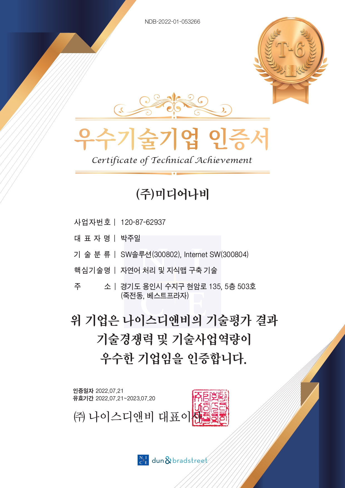

안녕하세요, 미디어나비입니다.

미디어나비가 지난 7월과 10월, 기술신용평가기관 나이스디앤비에서 차례로 실시한 **기업신용평가와 기업기술평가에서 모두 우수등급**을 인증받았습니다. **자연어처리, 인공지능, 데이터가공 및 분석 등 신기술 분야의 우수한 수행 역량을 보유**한 미디어나비는 지난 11월, **한국데이터산업진흥원에서 주관하는 데이터바우처 지원사업의 AI가공 데이터 서비스 공급기업으로 선정**되는 등 기술력을 입증해오고 있는데요. 또한, 앞으로의 기술사업화 성장 가능성 측면에서도 긍정적인 평가를 받아 의미가 깊다고 할 수 있을 것 같습니다. 신기술의 흐름을 계속해서 주시하고 유의미한 R&D와 프로젝트 수행을 통해 글로벌 시장에서 영향력 있는 기업으로 성장할 수 있도록 끊임없이 노력하는 미디어나비가 되겠습니다.

한편, 나이스디앤비의 기술신용평가는 뛰어난 기술력을 가진 기업에게 보다 좋은 조건으로 여신, 투자 등 금융 서비스를 지원하기 위한 평가제도입니다. 기업이 보유한 기술의 중요성, 시장성, 사업성 및 효율성 등 경제적 가치를 종합적으로 분석해 우수등급을 인증해주고 있습니다.

<figure>

<figcaption>(1) 우수기술기업 인증서 </figcaption>
</figure>
