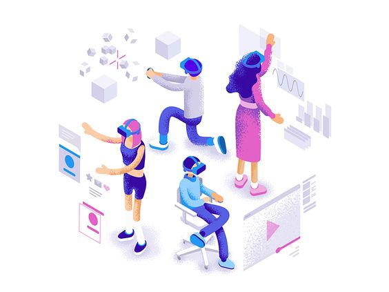
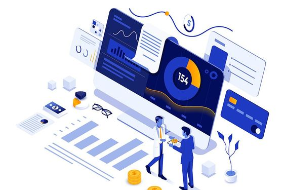

---

title: (주)미디어나비 AI 솔루션 

date: "2023-01-10T00:00:00.000Z"

category: "blog"

description: 미디어나비가 보유한 AI 솔루션 서비스에 대해 설명합니다. 

postauthor: "Anna"

---
안녕하세요. 이번 블로그 콘텐츠에서는 인공지능(AI)를 활용한 가공 서비스를 제공하는 미디어나비의 AI 솔루션에 대해 이야기해보고자 합니다. 

계속해서 쌓여가기만 하는 기업 보유 데이터, AI 가공 솔루션의 도움으로 다양한 분야로의 사업화와 생산성 향상 등 새로운 가치창출이 무궁무진하게 가능합니다. 수집 데이터 분석을 통해 각종 사건사고를 예방할 수 있으며, 유동인구 분석을 통해 관광, 축제, 행사 등의 효율적인 기획과 마케팅도 가능합니다. 또한, 인공지능 기술을 활용한 자동 생성모델 서비스를 도입하여 기업의 사업화 비용을 절감할 수 있습니다. 

미디어나비 AI 솔루션 서비스의 종류는 크게 세 가지로 나누어볼 수 있을 것 같은데요. 가장 대표적으로 수행 역량을 입증받은 **1) AI 자연어처리 솔루션 - 나비랑(Navi-Lang)** 을 비롯하여 수집 데이터를 가공하고 분석하는 **2) AI 데이터 분석 솔루션 - 나비안(Navi-An)**, 세 번째로 비전지능의 뛰어난 최신기술을 이용한 **3) AI 시각지능 솔루션 - 나비전(Navi-Sion)** 이 있습니다. 

## **1. 나비랑 Navi-Lang (MediaNavi Language AI Solutuion)**
### **I. KPF-BERT를 활용한 뉴스 기사 본문 요약 솔루션**
* 뉴스 본문의 중요 문장을 찾아서 3문장으로 제시하는 인공지능 언어모델을 API와 설치형 모두 제공 가능
* 모바일 시대에 적합한 정보전달 방법으로 문장 분석력을 사용하여 전체 문장 중 가장 중요도가 높은 문장 3개 추천방식으로 본문 내용을 요약⠂표현하는 활용법으로 이용
* 한국언론진흥재단에서 구축한 방대한 뉴스 기사 코퍼스로 학습한 KPF-BERT를 이용하여 특히, 한국어 작성 뉴스 기사 요약에 특화된 모델이라 할 수 있음

### **II. KPF-BERT를 활용한 뉴스 기사 클러스터링 솔루션**
* 비슷한 주제를 다룬 뉴스 기사들을 자동으로 묶어주는 서비스로 설치형으로만 제공 가능
* 비슷한 주제의 기사목록 중 위원회 알고리즘에 따른 자동평가로 대표 기사 선정 가능

### **III. KPF-BERT 활용, 추가 기능 위한 AI 솔루션** 
* KPF-BERT를 활용한 추가 기능 모델 개발을 위한 가공데이터 서비스를 아래의 예시 중 수요기업 니즈에 따라 사전 주문협의시 설계하여 제공 가능

1. 맞춤법 검사기 
2. 단어 자동완성 
3. 문장의 어색한 표현이나 어휘 체크 
4. 혐오표현 순화 
5. 기사의 논조 분석 
6. 광고성 기사 검출 외

텍스트 기반 솔루션이 언론사 등 미디어 산업 내 수요가 발생하는  분야라면, 어느 산업군에서든 기업 보유 데이터 활용만으로도 필요한 결과물이나 정확한 판단에 도움을 얻을 수 있는 데이터 분석 기반 AI 솔루션에 대해 설명드리겠습니다. 

## **2. 나비안 Navi-An(MediaNavi Analysis AI Solution)**
**기업 보유 데이터의 수집, 가공, 분석을 통한 AI 솔루션 제공으로 새로운 가치를 창출합니다.**
* 데이터 분석 기반 AI 솔루션을 수요기업 니즈에 따라 주문협의시 설계하여 제공 가능
* 각종 데이터를 수집, 가공, 분석하는 AI 솔루션으로 기업이 보유한 데이터를 활용하여 새로운 가치를 창출해낼 수 있는 솔루션을 제공합니다.
1) IoT(사물인터넷) 센서 데이터 수집 및 분석으로 공공보안, 질서유지, 사고예방, 관광 분야에 활용  
2) 노후설비의 장애 및 고장 데이터 분석을 통한 고장예측 인공지능 모델 개발로 안전사고 예방 및 최적의 기계 교체시기 판단
3) 저장창고의 비전 센서 데이터 분석을 통한 자원절감 및 효율적 생산계획으로 생산성 증가
4) 고객 데이터 수집 및 분석 솔루션으로 신사업 확장 및 마케팅 도구로 활용 
5) 생산자-소비자 연결 상품 자동매칭 서비스 
6) 빅데이터 분석 고도화 외 

<figure>

<figcaption></figcaption>
</figure>

## **3. 나비전 Na-viSion(MediaNavi Vision AI Solution)**
**이미지 자동인식 및 분석, 이미지, 동영상, VR AI 생성모델을 다양한 산업군의 사업화에 활용합니다.**
* 최신기술을 적용한 파인튜닝 개발방식으로 수요기업이 필요로 하는 이미지 인식분석 및 이미지, 동영상의 AI 생성 솔루션 제공 가능
* 시각지능 분야에서 높은 성능을 보여주는 스테이블 디퓨전 기술을 적용한 파인튜닝 기법으로 다음과 같은 사례에 이미지를 자동인식 및 분석하거나 필요한 이미지, 동영상의 자동생성 모델 솔루션 제공이 가능합니다.  
1) 라이브 커머스 버추얼 쇼호스트 생성모델
2) 웹툰, 광고 제작을 위한 이미지 생성모델
3) 온라인 교육을 위한 버추얼 튜터 생성모델
4) 메타버스 체험형 VR 서비스 제작 솔루션 
5) 에듀테크 분야의 AI 서비스 제작 솔루션 
6) 스포츠 가상훈련을 위한 동영상 생성모델
7) 게임 콘텐츠의 NPC 생성모델 
8) 2D 동영상에서 3D 자동생성 모델 
9) 이미지 자동인식 및 분석 모델 외 

<figure>

<figcaption></figcaption>
</figure>

## **4. 시스템 아키텍쳐 설계 및 컨설팅 제공**
**AI 활용 서비스 도입에 수반되는 DB 구축 및 아키텍쳐 설계와 시스템 컨설팅을 숙련된 노하우를 바탕으로 제공합니다.** 
* AI를 활용한 신규 서비스 런칭을 준비하는 수요기업에서 가장 필요한 부분이 무엇일까 고민해보았습니다. 
* 많은 기업들에서 자체적으로 해결하기 어렵거나 비용부담이 되는 DB 구축 및 시스템 아키텍처 설계와 시스템 컨설팅 솔루션까지 제공하여 **고객사의 경영 효율화를 지원**합니다.  

<figure>

<figcaption></figcaption>
</figure>

## **미디어나비의 AI 솔루션, 각 기업의 니즈에 맞게 설계하여 제공합니다.**
 각 기업마다 필요한 솔루션 내용이 다를텐데요. 우리 회사에 가장 적합한 AI 솔루션을 설계하여 맞춤형 서비스 제공을 받아보실 수 있습니다. 미디어나비 웹사이트 대표메일이나 하단에 있는 커뮤니케이션 담당자 이메일 주소로 문의주시면 상세 서비스 내용 및 견적사항에 대해 안내해드리겠습니다.

 **(미디어나비 AI 솔루션 커뮤니케이션팀)**
<anna@medianavi.kr>

한편, 정보통신산업진흥원에서 데이터바우처 지원사업처럼 공급기업의 AI 솔루션 이용시 바우처를 지원해주는 **AI바우처 지원사업의 2023년도 수요기업을 모집 중**에 있습니다. **최대 3억 원까지 AI 솔루션 이용 바우처를 지원**받을 수 있는데요. 기업의 자체부담금이 있긴 하지만 AI 솔루션이 필요한 수요기업이라면 반드시 신청하셔서 정부지원금으로 AI 솔루션을 이용하시는 것이 적은 부담으로 원하는 결과물을 얻을 수 있는 가장 좋은 방법인 것 같습니다. 

**AI바우처 수요기업 모집기한 : ~ 1/30(월)**

**(AI바우처 수요기업 모집공고 보러가기)**
<https://www.nipa.kr/main/selectBbsNttView.do?key=122&bbsNo=2&nttNo=2335&bbsTy=biz&searchCtgry=&searchCnd=all&searchKrwd=&pageIndex=1>

**다양한 딥러닝 프로젝트 수행과 R&D를 통해 축적한 경험과 노하우를 보유한 미디어나비 AI 솔루션으로 “누구나 기술 없이도 인공지능을 누릴 수 있는 세상”을 경험해보시길 바랍니다.**     
### 참고문헌
- 정보통신산업진흥원(NIPA) 홈페이지
<https://www.nipa.kr/main/index.do>

### 참고이미지 
- 이미지 공유 플랫폼 핀터레스트
<https://www.pinterest.co.kr>

