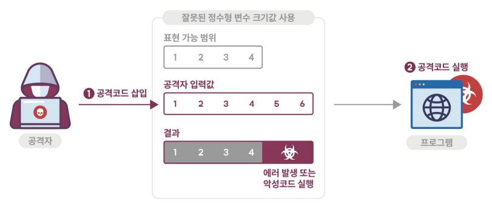

## 0. 시작하는 글
프로젝트를 하다가 고객사들은 보안 취약점에 대해 어떻게 대비를 하는지 조사를 하였습니다.
Java, Python, C++ 언어들은 쉽게 정리된 자료를 검색할 수 있었는데 JavaScript는 서버에서는 Node.js 플랫폼에서 서버사이드 애플리케이션을 개발하는데 많이 사용되고 클라이언트에서도 웹페이지의 개발 작업에 두루 사용되는 인기 많은 언어 임에도 불구하고 찾을 수가 없었습니다.  
이에 JavaScript 보안 가이드의 정리가 필요하여 작업을 진행하였습니다. 한국인터넷진흥원에서 발간한 "Python_시큐어코딩_가이드"를 참조하여 작업하였으며 필요한 텍스트와 이미지를 가져와 사용하였으며 내용을 더하고 소스는 만들어서 작성하였습니다.  
본문에 짧게 말 줄여 쓰는 점 양해 부탁합니다.
문의사항이나 잘못된 부분있으면 이메일 보내주길 바랍니다.   
-미디어나비 백엔드 개발자 퍼니 funny@medianavi.kr

클라이언트에서는 브라우저에서 웹 페이지의 동적인 상호 작용을 구현하는 데 사용되고, 서버에서는 Node.js 플랫폼에서 서버 사이드 어플리케이션을 개발하는 데 사용됩니다.

## 1. SQL 삽입

#### 가. 개요

<figure>
    
  <figcaption>(1) SQL 삽입 개요  이미지출처 : 한국인터넷진흥원 </figcaption>
</figure>

데이터베이스(DB)와 연동된 웹 응용프로그램에서 입력된 데이터에 대한 유효성 검증을 하지 않을 경우 공격자가 입력 폼 및 URL 입력란에 SQL 문을 삽입하여 DB로부터 정보를 열람하거나 조작할 수 있는 보안취약점을 말한다. 취약한 웹 응용프로그램에서는 사용자로부터 입력된 값을 검증 없이 넘겨받아 동적쿼리(Dynamic Query)를 생성하기 때문에 개발자가 의도하지 않은 쿼리가 실행되어 정보유출에 악용될 수 있다.

#### 나. SQL Injection 방어하기 코드

웹페이지 상에서 입력란에 소스코드와 SQL문을 입력하여 공격하는 방법을 SQL 인젝션 공격이라고 한다. 코드 인젝션의 한 기법으로 클라이언트의 입력값을 조작하여 서버의 데이터베이스를 공격할 수 있는 공격방식을 말한다.
주로 사용자가 입력한 데이터를 제대로 필터링, 이스케이핑하지 못했을 경우에 발생한다. 공격의 쉬운 난이도에 비해 파괴력이 어마어마하기 때문에 시큐어 코딩을 하는 개발자라면 가장 먼저 배우게 되는 내용이다. 이러한 injection 계열의 취약점들은 테스트를 통해 발견하기는 힘들지만 스캐닝 툴이나 코드 검증 절차를 거치면 보통 쉽게 발견되기 때문에 탐지하기는 쉬운 편으로 OWASP에서도 수년 동안 인젝션 기법이 보안 위협 1순위로 분류되는 만큼 보안에 각별한 주의가 필요하다고 한다.
아래는 JavaScript를 통해서 간단하게 막아보는 코드이다.

      function checkSearchedWord(obj) {
        if (obj.length > 0) {
          //특수문자 제거
          var expText = /[%=><]/;
          if (expText.test(obj) == true) {
            alert("특수문자를 입력할 수 없습니다.");
            obj.value = obj.value.split(expText).join("");
            return false;
          }

          //특정문자열(sql예약어의 앞뒤공백포함) 제거
          var sqlArray = new Array(
            //sql 예약어
            "OR", "SELECT", "INSERT", "DELETE", "UPDATE", "CREATE", "DROP", "EXEC",
            "UNION", "FETCH", "DECLARE", "TRUNCATE"
          );

          var regex;
          for (var i = 0; i < sqlArray.length; i++) {
            regex = new RegExp(sqlArray[i], "gi");

            if (regex.test(obj)) {
              alert("\"" + sqlArray[i] + "\"와(과) 같은 특정문자로 검색할 수 없습니다.");
              obj = obj.replace(regex, "");
              return false;
            }
          }
        }
        return true;
      }

위와 같은 코드로 SQL 인젝션 공격을 어느정도 방어 할 수 있다.

#### 다. 코드 주입(Code injection) 

유효하지 않은 데이터를 처리함으로써 발생되는 버그를 활용하여 시스템을 해킹하거나 공격하는 방법이다. 공격자들은 취약점이 있는 프로그램에 코드를 주입시켜 공격자들이 의도한 대로 실행하게 한다. 코드주입으로 인한 피해는 취약점이 있는 어플리케이션에 기인하는데, 엉뚱한 데이터를 어플리케이션으로 전달함으로써 잘못된 처리를 유도하면서 발생한다.특히 프로그램에서 SQL, LDAP, NoSQL 쿼리나 OS 명령어의 잘못된 처리로 인한 취약점이 발견되며, XML 파서나 SMTP 헤더, 프로그램 인자들의 잘못된 사용으로 인한 취약점도 발견되고 있다.대표적인 해킹 방법에는 SQL주입과 HTML 스크립트 주입이 있다.

#### 라. SQL Injection 예시

SQL 삽입 공격은 사용자로부터 입력받은 값을 직접 SQL 문장에 삽입하는 경우에 발생할 수 있는 보안 취약점이다. 예를 들어 아래의 코드는 사용자로부터 입력받은 "username"과 "password"를 이용해 데이터베이스에서 사용자를 검색하는 코드이다.

      var username = req.body.username;
      var password = req.body.password;

      var sql = "SELECT * FROM users WHERE username = '" + username + "' AND password = '" + password + "'";

      connection.query(sql, function(error, results) {
        if (error) {
          throw error;
        }
        res.json(results);
      });

위 코드는 사용자가 입력한 "username" 과 "password"를 그대로 SQL 문장에 삽입하기 때문에, 사용자가 악의적인 값을 입력할 경우 SQL 삽입 공격을 할 수 있다. 이를 방지하기 위해서는 prepared statement를 사용하거나, 사용자 입력값에 대해 적절한 필터링을 해야 한다.

 SQL은 Multiple statement를 지원한다. 이 말의 의미는 다음과 같은 코드를 허용한다는 것 이다.

Select * FROM topic; DROP TABLE topic;

이를 이용하면 DB 서버의 모든 데이터를 삭제하는 작업도 아주 간단하게 가능하다. 쿼리 스트링이나 form 형식으로 전달할  데이터에 원하는 SQL문을 삽입하기만 하면 끝이기 때문이다.

#### 마. SQL Injection 예방

 SQL injection을 예방하는 방법은 많다.위험한 코딩 방식과 안전한 코딩 방식은 반드시 기억해두시기 바란다.

-위험한 코드  
db.query(`Select * FROM topic Where id=${custom_id}, function(err,result){});   

-보안 코드  
db.query(`Select * FROM topic Where id=${custom_id}, function(err,result){});

두번 째 인자로 등장하는배열의 값이 첫번 째 인자의 ?에 차례대로 대응된다.

-보안 코드 2  
var mysql = require('mysql');  
var db = mysql.createConnection();  
db.query(`Select * FROM topic Where id=${db.escape(custom_id)}, function(err,result){});

## 2. 코드 삽입
#### 가. 개요 

<figure>
    
  <figcaption>이미지출처 : 한국인터넷진흥원 </figcaption>
</figure>

공격자가 소프트웨어의 의도된 동작을 변경하도록 임의 코드를 삽입하여 소프트웨어가 비정상적으로 동작하도록 하는 보안 약점을 말한다. 코드 삽입은 프로그래밍 언어 자체의 기능에 한해 이뤄진다는 점에서 운영체제 명령어 삽입과 다르다.취약한 프로그램에서 사용자의 입력 값에 코드가 포함되는 것을 허용할 경우, 공격자는 개발자가 의도하지 않은 코드를 실행하여 권한을 탈취하거나 인증 우회, 시스템 명령어 실행 등을 할 수 있다.
#### 나. 안전한 코딩기법
동적코드를 실행할 수 있는 함수를 사용하지 않는다. 필요 시, 실행 가능한 동적코드를 입력 값으로 받지 않도록, 외부 입력값에 대하여 화이트리스트 방식으로 검증한다. 또는 유효한 문자만 포함하도록 동적 코드에 사용되는 사용자 입력 값을 필터링 한다.
#### 다. 코드 예제
JavaScript 코드 삽입 문제란, 외부 소스에서 악의적인 코드를 삽입하여 웹 사이트를 악용하는 것을 말한다. 이러한 문제를 방지하기 위해서는 외부 입력을 정제하는 과정을 거쳐야 한다.예를 들어, 웹 폼에서 사용자가 입력한 값을 그대로 출력하는 경우 아래와 같은 코드를 사용할 수 있다.

    <form>
      <textarea id="user-input"></textarea>
      <button onclick="displayInput()">Display Input</button>
    </form>

    

하지만, 이렇게 그대로 출력하면 사용자가 입력한 값에 스크립트가 포함되어 있을 경우 그 스크립트가 실행되어 웹 사이트가 악용될 수 있다. 이를 방지하기 위해서는 입력값을 정제하는 과정이 필요하다.

    <form>
      <textarea id="user-input"></textarea>
      <button onclick="displayInput()">Display Input</button>
    </form>
    

위와 같이 입력값에 포함된 태그를 정제하는 과정을 거치면, 악의적인 코드 삽입을 방지할 수 있다. 또 다른 방법으로는 특정 태그를 제거하는 것 이외에도, 특정 태그만 허용하는 것, 또는 특정 태그를 안전하게 출력할 수 있도록 변환하는 것도 있다.

## 3. 경로 조작 및 자원 삽입
#### 가. 개요

<figure>
    
  <figcaption>이미지출처 : 한국인터넷진흥원 </figcaption>
</figure>

검증되지 않은 외부 입력값을 통해 파일 및 서버 등 시스템 자원(파일, 소켓의 포트 등)에 대한 접근 혹은 식별을 허용할 경우, 입력 값 조작을 통해 시스템이 보호하는 자원에 임의로 접근할 수 있는 보안약점이다. 경로조작 및 자원삽입 약점을 이용하여 공격자는 자원의 수정·삭제, 시스템 정보누출, 시스템 자원 간 충돌로 인한 서비스 장애 등을 유발시킬 수 있다.
즉, 경로 조작 및 자원 삽입을 통해서 공격자가 허용되지 않은 권한을 획득하여, 설정에 관계된 파일을 변경하거나 실행시킬 수 있다.
Python에서는 subprocess.popen()과 같이 프로세스를 여는 함수, os.pipe()처럼 파이프를 여는 함수, socket 연결 등에서 외부 입력값을 검증 없이 사용할 경우 경로 조작 및 자원 삽입의 취약점이 발생할 수 있다.

#### 나. 방지 방법
자바스크립트 기반으로 백엔드 서버 개발 시 경로 조작 및 자원 삽입 보안 취약점을 방지하기 위한 방안으로 다음과 같은 기법이 있다.

입력 검증: 외부로부터 전달받은 입력값을 정규식이나 형식 검증 등을 통해 검증하는 방법이 있다.
인증 및 권한 관리: 사용자의 인증정보를 검증하고, 권한을 관리하여 무단 접근을 방지하는 방법이 있다.
자원 접근 경로 제어: 자원에 접근 할 수 있는 경로를 제한하여 무단 접근을 방지한다.
보안 프레임워크 사용 : 전문적인 보안 프레임워크를 사용한다.
로그 기록 및 분석: 각종 접근 이력 및 정보를 기록하고 분석하여 악의적인 행위를 탐지한다.

위 방안들을 적용하면 경로 조작 및 자원 삽입 보안 취약점을 최대한 방지하거나 극복할 수 있다.
#### 다. 코드 예제
자바스크립트 소스 코드 상에서 경로 조작 및 자원 삽입 보안 취약점을 방지하는 예시이다.

1. 입력 데이터 검증:

        app.post("/submit", (req, res) => {
          const userInput = req.body.userInput;
          // 길이 제한을 두어 길이가 너무 긴 데이터를 입력하는 것을 방지
          if (userInput.length > 1000) {
            res.status(400).send("Input is too long");
            return;
          }
          // 특수문자를 제한하여 경로 조작을 방지
          if (!/^[a-zA-Z0-9 ]+$/.test(userInput)) {
            res.status(400).send("Input contains invalid characters");
            return;
          }
          // 이하 정상적인 처리 코드
        });

2. 권한 관리:

        const authorizedUsers = ["admin", "manager"];
        app.get("/secret", (req, res) => {
          const user = req.session.user;
          // 권한이 없는 사용자는 접근을 막음
          if (!authorizedUsers.includes(user)) {
            res.status(403).send("Unauthorized access");
            return;
          }
          // 이하 정상적인 처리 코드
        });

3. 로그 기록:

        const fs = require("fs");
        app.use((req, res, next) => {
          const log = `[${new Date()}] ${req.method} ${req.url}`;
          fs.appendFile("access.log", log + "\n", (err) => {
            if (err) {
              console.error(err);
            }
          });
          next();
        });

4. 암호화

        const crypto = require("crypto");
        const algorithm = "aes-256-cbc";
        const key = crypto.randomBytes(32);
        const iv = crypto.randomBytes(16);

        function encrypt(text) {
          let cipher = crypto.createCipheriv(algorithm, Buffer.from(key), iv);
          let encrypted = cipher.update(text);
          encrypted = Buffer.concat([encrypted, cipher.final()]);
          return { iv: iv.toString("hex"), encryptedData: encrypted.toString("hex") };
        }

## 4. 크로스사이트 스크립트
#### 가. 개요

<figure>
    
  <figcaption>이미지출처 : 한국인터넷진흥원 </figcaption>
</figure>

크로스사이트 스크립트 공격(Cross-site scripting Attacks)은 웹사이트에 악성 코드를 삽입하는 공격 방법이다. 공격자는 대상 웹 응용 프로그램의 결함을 이용하여 악성코드(일반적으로 클라이언트 측 JavaScript 사용)를 사용자에게 보낸다. XSS
공격은 일반적으로 애플리케이션의 호스트 자체를 대상으로 하지 않고 애플리케이션의 사용자를 목표로 삼는다.
XSS는 공격자가 웹 응용프로그램을 속여 사용자의 브라우저에서 실행할 수 있는 형식의 데이터를 보낼 때 발생한다. 일반적인 HTML과 공격자가 제공한 XSS코드의 조합 뿐만 아니라 악성코드 다운로드, 플러그인 또는 미디어 콘텐츠를 이용하기도 한다. 사용자가 양식에 입력한 데이터 또는 서버에서 클라이언트 소프트웨어(브라우저 또는 WebKit등)의 종료점(endpoint)으로 전달된 데이터가 적절한 검증 없이 사용자에게 표시되도록 허용하는 경우 발생한다.

#### 나. 안전한 코딩기법
외부 입력값 또는 출력값에 스크립트가 삽입되지 못하도록 문자열 치환 함수를 사용하여 &<>*‘/()등을 치환하거나, html라이브러리의 escape()를 사용한다. HTML 태그를 허용하는 게시판에서는 허용되는 HTML 태그들을 화이트리스트로 만들어 해당 태그만 지원하도록 한다.

검증되지 않은 값을 웹 브라우저에 보내는 경우(XSS_ATTRIBUTE)  
안전하지 않은 jsp 코드 일부

    <tr>
      <td colspan="2">${contents}</td>
    </tr>

attribute로부터 얻어온 값에 대한 검증을 수행하지 않는다.  
안전한 jsp 코드 일부

    <tr>
        <td colspan="2"><c:out value="${contents}"/></td>
    </tr>

JSTL의 <c:out> 태그를 사용하여 필터링을 수행한다.

javascript에서 막는 방법

    var escapeHtmlMap = {
        "&" : "&amp;",
        "<" : "&lt;",
        ">" : "&gt;",
        '"' : '&quot;',
        "'" : '&#39;',
        "/" : '&#x2F;'
    };

    String.prototype.escapeHTML = function() {
        return String(this).replace(/[&<>"'\/]/g, function(s) {
            return escapeHtmlMap[s];
        });
    };

    var text = "안녕하세요! <b>데브쿠아</b>입니다.";
    text.escapeHTML();

#### 다. 코드 예제
크로스사이트 스크립트(Cross-Site Scripting, XSS)문제는 웹 애플리케이션에서 입력받은 데이터를 출력할 때 발생할 수 있는 보안 문제이다. 이러한 문제는 악의적인 사용자가 입력한 스크립트를 실행할 수 있게 하는 것을 의미한다.

    

이 코드는 사용자에게 이름을 입력받아 환영 메시지를 표시한다. 하지만, 악의적인 사용자가 다음과 같은 스크립트를 입력할 경우

    

악의적인 스크립트가 실행될 수 있어 보안 문제가 발생한다.
이러한 문제를 해결하려면 입력받은 데이터를 적절히 검증하고, 출력 시 이를 이스케이프 해야한다.

## 5. 운영체제 명령어 삽입
#### 가. 개요

<figure>
    
  <figcaption>이미지출처 : 한국인터넷진흥원 </figcaption>
</figure>

적절한 검증 절차를 거치지 않은 사용자 입력값이 운영체제 명령어의 일부 또는 전부로 구성되어 실행되는 경우, 의도하지 않은 시스템 명령어가 실행돼 부적절하게 권한이 변경되거나 시스템 동작 및 운영에 악영향을 미칠 수 있다.
명령어 라인의 파라미터나 스트림 입력 등 외부 입력을 사용해 시스템 명령어를 생성 하는 프로그램을 많이 찾아볼 수 있다. 이 경우 프로그램 외부로부터 받은 입력 문자열은 기본적으로 신뢰할 수 없기 때문에 적절한 처리를 해주지 않으면, 공격으로 이어질 수 있다.
파이썬에서 eval() 함수와 exec() 함수는 내부에서 문자열을 실행하기에 편리하지만, String 형식의 표현된 식을 인수로 받아 반환하는 eval() 함수와 인수로 받은 문자열을 실행하는 exec()를 같이 사용하면 여러 변수들에 동적으로 값을 할당해 사용할 수 있어 명령어 삽입(Command Injection) 공격에 취약하다.
#### 나. 안전한 코딩기법
외부 입력값 내에 시스템 명령어를 포함하는 경우 |, ;, &, :, >, <, `(backtick), \, ! 과 같이 멀티라인 및 리다이렉트 문자 등을 필터링 하고 명령을 수행할 파일명과 옵션을 제한해 인자로만 사용될 수 있도록 해야 한다. 외부 입력에 따라 명령어를 생성하거나 선택이 필요한 경우에는 명령어 생성에 필요한 값들을 미리 지정해 놓고 사용해야 한다.
#### 다. 문제 해결
JavaScript는 웹 브라우저에서만 실행되며, 운영체제 명령어를 직접 실행할 수 없다. 웹 브라우저에서는 제한된 API만 사용 가능하며, 운영체제 명령어를 실행하는 것은 보안 위험을 내포하기 때문에 허용되지 않는다.
만약, 서버측 언어로 운영체제 명령어를 실행시키고 싶다면, Node.js를 사용하면 된다. Node.js는 JavaScript를 서버측에서 사용 가능하며, 간단한 코드로 운영체제 명령어를 실행시킬 수 있다.

    const { exec } = require("child_process");
    exec("echo 'Hello, World!'", (error, stdout, stderr) => {
      if (error) {
        console.error(`exec error: ${error}`);
        return;
      }
      console.log(`stdout: ${stdout}`);
      console.error(`stderr: ${stderr}`);
    });

단, 이러한 코드를 사용하면 운영체제에서 권한을 요구할 수 있으며, 실행되는 명령어에 따라 보안 위험을 내포할 수 있으니 주의가 필요하다.

## 6. 위험한 형식 파일 업로드
#### 가. 개요

<figure>
    
  <figcaption>이미지출처 : 한국인터넷진흥원 </figcaption>
</figure>

서버 측에서 실행될 수 있는 스크립트 파일(asp, jsp, php, sh 파일 등)이 업로드 가능하고, 이 파일을 공격자가 웹을 통해 직접 실행시킬 수 있는 경우, 시스템 내부명령어를 실행하거나 외부와 연결하여 시스템을 제어할 수 있는 보안약점이다.
## 나. 안전한 코딩기법
파일 업로드 공격을 방지하기 위해서 특정 파일 유형만 허용하도록 화이트리스트 방식으로 파일 유형을 제한하여야 한다.
이때 파일의 확장자 및 업로드 된 파일의 Content-Type도 같이 확인한다. 파일 크기 및 파일 개수를 제한하여 시스템 자원 고갈 등으로 서비스 거부 공격이 발생하지 않도록 제한하여야 한다. 업로드 된 파일을 웹 루트 폴더 외부에 저장하여 공격자가 URL을 통해 파일을 실행할 수 없도록 해야 하고 가능하면 업로드 되는 파일의 이름은 공격자가 추측할 수 없는 무작위한
이름으로 변경하여 저장하는 것이 안전하다. 또한 업로드 된 파일을 저장할 경우에는 최소 권한만 부여하는 것이 안전하고 실행 여부를 확인하여 실행권한을 삭제 한다.

## 다. 방지 방법 및 코드예제
JavaScript로 개발시 위험한 형식 파일 업로드를 방지하는 방법 중 하나는 파일 확장자를 검사하는 것이다.
예를 들어, 허용하려는 확장자만 허용하는 경우 아래와 같은 코드를 사용할 수 있다.

    var allowedExtensions = /(\.jpg|\.jpeg|\.png|\.gif)$/i;

    var file = document.getElementById("file").files[0];
    var fileName = file.name;
    if(!allowedExtensions.exec(fileName)) {
        alert("Invalid file type. Please upload a jpeg, png or gif.");
    }

또한, 이미지 파일만 업로드할 수 있도록 MIME 타입을 검사하는 것도 효과적이다.

    var file = document.getElementById("file").files[0];
    var fileType = file.type;
    if (fileType !== "image/jpeg" && fileType !== "image/png" && fileType !== "image/gif") {
        alert("Invalid file type. Please upload a jpeg, png or gif.");
    }

## 7. 신뢰되지 않는 URL 주소로 자동접속 연결
#### 가. 개요

<figure>
    
  <figcaption>이미지출처 : 한국인터넷진흥원 </figcaption>
</figure>

검증되지 않은 외부 입력값이 URL링크 생성에 사용되어 악의적인 사이트로 자동 접속될 수 있는 보안약점이다.
사용자로부터 입력되는 값을 외부사이트의 주소로 사용하여 자동으로 연결하는 서버 프로그램은 피싱(Phishing) 공격에 노출되는 취약점을 가질 수 있다.
일반적으로 클라이언트에서 전송된 URL 주소로 연결하기 때문에 안전하다고 생각할 수 있으나, 공격자는 해당 폼의 요청을 변조함으로써 사용자가 위험한 URL로 접속할 수 있도록 공격할 수 있다.

#### 나. 안전한 코딩기법
리디렉션을 허용하는 모든 URL을 서버 측 화이트리스트로 관리하고 사용자 입력 값을 리디렉션 할 URL이 존재하는지 검증해야 한다.
만약 사용자 입력 값이 화이트 리스트로 관리가 불가능하고 리디렉션 URL의 인자 값으로 사용되어야만 하는 경우는 모든 리디렉션에서 프로토콜과 host정보가 들어가지 않는 상대 URL(relative)을 사용해야 하고, 검증해야 한다. 또는 절대 URL(absoute URL)을 사용할 경우 리디렉션을 실행하기 전에 사용자 입력 URL이 https://myhompage.com/ 처럼 서비스하고 있는 URL로 시작하는지를 확인해야 한다.
다. 코드 예제
URL 파라미터에 대한 검증을 수행하지 않은 경우, 발생한다.

-안전하지 않은 jsp 코드 일부

    <html>
    <head>
    </head>
    <body>
        URL : ${param.url}
      <%
          if (request.getParameter("url") != null)
              response.sendRedirect(request.getParameter("url"));
      %>
    </body>
    </html>

-URL 파라미터에 대한 검증을 수행하지 않았다.

안전한 jsp 코드 일부

    <html>
    <head>
    </head>
    <body>
        URL : ${param.url}
        <%
        // 다른 페이지 이동하는 URL 리스트
        String allowURL[] = { "http://url1.com", "http://url2.com", "http://url3.com" };        
        // 입력받는 url은 미리 정해진 URL의 order로 받음
        if (request.getParameter("url") != null)
            Integer n = Integer.parseInt(url);
        if (n >= 0 && n < 3)
            response.sendRedirect(allowURL[n]); 
        %>
    </body>
    </html>
이동에 대한 URL을 선택하게끔 수정한다.

## 8. 부적절한 XML 외부 개체 참조
#### 가. 개요

<figure>
    
  <figcaption>이미지출처 : 한국인터넷진흥원 </figcaption>
</figure>

XML 문서에는 DTD(DocumentTypeDefinition)를 포함할 수 있으며, DTD는 XML 엔티티(entitiy)를 정의한다. 부적절한 XML 외부개체 참조 보안약점은 서버에서 XML 외부엔티티를 처리할 수 있도록 설정된 경우에 발생할 수 있다.
취약한 XML parser가 외부 값을 참조하는 XML 값을 처리할 때, 공격자가 삽입한 공격 구문이 동작되어 서버 파일 접근, 불필요한 자원 사용, 인증 우회, 정보 노출 등이 발생할 수 있다.

#### 나. 안전한 코딩기법
로컬 정적 DTD를 사용하도록 설정하고, 외부에서 전송된 XML 문서에 포함된 DTD를 완전하게 비활성화해야 한다. 비활성화를
할 수 없는 경우에는 외부 엔티티 및 외부 문서 유형 선언을 각 파서에 맞는 고유한 방식으로 비활성화 한다.
외부 라이브러리를 사용할 경우 기본적으로 외부 엔티티에 대한 구문 분석 기능을 제공하는지 확인하고 제공할 경우 해당 기능을 비활성화 할 수 있는 방법을 확인하여 외부 엔티티 구문 분석 기능을 비활성화 한다.
많이 사용하는 XML 파서의 한 종류인 lxml의 경우 외부 엔티티 구문 분석 옵션인 resolve_entities 옵션을 비활성화 하여야 한다. 또한 외부 문서를 조회할 때 네트워크 액세스를 방지하는 no_network 옵션이 활성화(True) 되어 있는지도 확인하여야 한다.

#### 다. 코드예제
XML 외부 개체 참조를 방지하는 가장 효과적인 방법은 서버측에서 검사하는 것이다.
하지만, 클라이언트 측에서도 일부 방지를 할 수 있는 방법이 있다.

    function removeScriptTag(input) {
      return input.replace(/
";
    var output = removeScriptTag(input);
    console.log(output); // "
This is a test 
"

또한, XmlHttpRequest 또는 Fetch API를 사용해 XML 데이터를 요청할 때, same-origin policy를 준수하도록 하는 것도 효과적입니다. 이로 인해, 클라이언트가 요청할 수 있는 XML 데이터는 클라이언트가 요청을 하는 웹페이지가 속한 도메인에서만 제공됩니다.

## 9. XML 삽입
#### 가.개요

<figure>
    
  <figcaption>이미지출처 : 한국인터넷진흥원 </figcaption>
</figure>

검증되지 않은 외부 입력값이 XQuery 또는 XPath 쿼리문을 생성하는 문자열로 사용되어 공격자가 쿼리문의 구조로 임의로 변경하고 임의의 쿼리를 실행하여 허가되지 않은 데이터를 열람하거나 인증절차를 우회할 수 있는 보안약점이다.
#### 나. 안전한 코딩기법
XQuery 또는 XPath 쿼리에 사용되는 외부 입력데이터에 대하여 특수문자 및 쿼리 예약어를 필터링 하고 파라미터화(Parameterized)된 쿼리문을 지원하는 XQuery를 사용한다.
#### 다. 코드예제
// XML 삽입 방지 함수

    function preventXMLInjection(str) {
        return str.replace(/[<>&"]/g, function (c) {
            switch (c) {
                case "<": return "&lt;";
                case ">": return "&gt;";
                case "&": return "&amp;";
                case "\"": return "&quot;";
            }
        });
    }

// 사용 예

    const userInput = "";
    const safeInput = preventXMLInjection(userInput);
    console.log(safeInput);
    // Output: "&lt;script&gt;alert(&#39;XML&#39;);&lt;&#47;script&gt;"

위 코드는 사용자 입력을 받아 특수 문자를 HTML 엔티티로 변환하는 함수를 제공한다. 이렇게 하면 <, >, &, " 문자가 입력될 경우 원래의 문자로 인식되지 않아 XML 삽입 공격을 방지할 수 있다.

## 10. LDAP 삽입
#### 가. 개요

<figure>
    
  <figcaption>이미지출처 : 한국인터넷진흥원 </figcaption>
</figure>

공격자가 외부 입력을 통해서 의도하지 않은 LDAP(LightweightDirectoryAccessProtocol) 명령어를 수행할 수 있다.
즉, 웹 응용프로그램이 사용자가 제공한 입력을 올바르게 처리하지 못하면, 공격자가 LDAP 명령문의 구성을 바꿀 수 있다.
이로 인해 프로세스가 명령을 실행한 컴포넌트와 동일한 권한(Permission)을 가지고 동작하게 된다.
외부 입력값을 적절한 처리 없이 LDAP 쿼리문이나 결과의 일부로 사용하는 경우, LDAP 쿼리문이 실행될 때 공격자는 LDAP 쿼리문의 내용을 마음대로 변경할 수 있다
#### 나. 안전한 코딩기법
다른 삽입 공격과 마찬가지로 LDAP 삽입에 대한 기본적인 방어 방법은 적절한 유효성 검사이다.  
⦁올바른 인코딩(Encoding) 함수를 사용하여 모든 변수 이스케이프(Escape)  
⦁화이트리스트 방식의 입력 값 유효성 검사  
⦁사용자 비밀번호와 같은 민감한 정보가 포함된 필드 인덱싱  
⦁LDAP 바인딩 계정에 할당된 권한 최소화  
#### 다. 코드예제
LDAP 삽입 문제를 방지하기 위해서는 입력 데이터를 적절하게 검증하는 것이 중요하다. 다음 예시 코드는 LDAP 검색 쿼리를 생성할 때, 특수문자를 제거하는 검증 코드이다.

    app.post("/search", (req, res) => {
      const searchString = req.body.searchString;
      // 특수문자를 제거하여 LDAP 삽입 공격을 방지
      const sanitizedSearchString = searchString.replace(/[^a-zA-Z0-9 ]/g, "");
      // LDAP 검색 쿼리 생성
      const ldapQuery = `(&(objectClass=person)(cn=*${sanitizedSearchString}*))`;
      // 이하 LDAP 검색 코드
    });

또한, 권한 관리를 통해 검색 권한이 없는 사용자가 LDAP 검색을 시도하는 것을 방지 할 수 있다.

    const authorizedUsers = ["admin", "manager"];
    app.post("/search", (req, res) => {
        const user = req.session.user;
        // 권한이 없는 사용자는 접근을 막음
        if (!authorizedUsers.includes(user)) {
        res.status(403).send("Unauthorized access");
        return;
        }
        // 이하 검증코드
    });

LDAP 삽입 공격을 방지하려면 입력데이터 검증과 권한관리를 적용하는 것이 중요하다.

## 11. 크로스 사이트 요청 위조 
#### 가. 개요

<figure>
    
  <figcaption>이미지출처 : 한국인터넷진흥원 </figcaption>
</figure>

특정 웹사이트에 대해서 사용자가 인지하지 못한 상황에서 사용자의 의도와는 무관하게 공격자가 의도한 행위(수정, 삭제,등록 등)를 요청하게 하는 공격을 말한다. 웹 응용프로그램이 사용자로부터 받은 요청에 대해서 사용자가 의도한 대로 작성되고 전송된 것인지 확인하지 않는 경우 발생 가능하고 특히 해당 사용자가 관리자인 경우 사용자 권한관리, 게시물 삭제, 사용자 등록 등 관리자 권한으로만 수행 가능한 기능을 공격자의 의도대로 실행시킬 수 있게 된다.
공격자는 사용자가 인증한 세션이 특정 동작을 수행하여도 계속 유지되어 정상적인 요청과 비정상적인 요청을 구분하지 못 하는 점을 악용한다.
#### 나. 안전한 코딩기법
해당 요청이 정상적인 사용자의 정상적인 절차에 의한 요청인지를 구분하기 위해 세션별로 CSRF토큰을 생성하여 세션에 저장하고, 사용자가 작업페이지를 요청할 때마다 hidden값으로 클라이언트에게 토큰을 전달한 뒤, 해당 클라이언트의 데이터
처리 요청 시 전달되는 CSRF토큰값을 체크하여 요청의 유효성을 검사하도록 한다.

#### 다. 코드예제
아래는 서버측에서 생성한 CSRF 토큰을 클라이언트에서 사용하는 예시 코드 이다.

    // 서버측 코드
    app.get("/transfer", (req, res) => {
      const csrfToken = generateCsrfToken(req.user); // 사용자 인증 정보를 이용해 토큰 생성
      res.render("transfer", { csrfToken }); // 클라이언트에게 토큰 전달
    });

    app.post("/transfer", (req, res) => {
      const csrfToken = req.body.csrfToken;
      if (!isValidCsrfToken(req.user, csrfToken)) { // 사용자 인증 정보와 토큰을 확인
        return res.status(403).send("Invalid CSRF token");
      }
      // 이체 처리 코드
    });

    // 클라이언트 코드
    <form action="/transfer" method="POST">
      <input type="hidden" name="_csrf" value="{{csrfToken}}">
      <input type="text" name="amount">
      <input type="text" name="to">
      <input type="submit" value="Transfer">
    </form>

위 코드는 서버측에서 생성한 CSRF 토큰을 클라이언트에서 사용하는 예시이다. 계속해서 서버는 csrfToken을 만들어서 클라이언트에 전달하고 클라이언트는 이를 이용해 서버에서 위조된 요청을 걸러낸다.

서버측 코드에서는 generateCsrfToken 함수를 이용해 사용자 인증 정보를 기반으로 CSRF 토큰을 생성하고, 이를 클라이언트에 전달한다. 그리고 클라이언트로부터 전달받은 토큰과 사용자 인증 정보를 기반으로 isValidCsrfToken 함수를 이용해 토큰의 유효성을 검사한다.

클라이언트 코드에서는 서버로부터 전달받은 CSRF 토큰을 히든 타입의 입력 필드로 추가해 전송한다. 이렇게 서버에서 생성한 CSRF 토큰을 클라이언트에서 사용하면서 토큰을 이용해 서버측에서 요청의 위조를 걸러낼 수 있다.

## 12. 서버사이드 요청 위조
#### 가. 개요

<figure>
    
  <figcaption>이미지출처 : 한국인터넷진흥원 </figcaption>
</figure>

적절한 검증절차를 거치지 않은 사용자 입력값을 서버간의 요청에 사용하여 악의적 인 행위가 발생할 수 있는 보안약점이다.
외부에 노출된 웹 서버에 취약한 애플리케이션이 존재하는 경우 공격자는 URL 또는 요청문을 위조하여 접근통제를 우회하는 방식으로 비정상적인 동작을 유도하거나 신뢰된 네트워크에 있는 데이터를 획득할 수 있다.
#### 나. 안전한 코딩기법
식별할 수 있는 범위 내에서 사용자의 입력 값을 다른 시스템의 서비스 호출에 사용하는 경우, 사용자의 입력 값을 화이트리스트 방식으로 필터링한다.
사용자가 지정하는 무작위의 URL을 받아들여야 한다면 내부의 URL을 블랙리스트로 지정하여 필터링 한다. 또한 동일한 내부 네트워크에 있더라도 기기 인증, 접근권한을 확인하여 요청이 이루어질 수 있도록 한다.
#### 다. 코드예제
서버 사이드 요청 위조를 방지하기 위해서는 요청을 인증하는 것이 중요하다.
토큰 기반 인증: 클라이언트에서 서버로 요청을 보낼 때 토큰을 포함시켜 서버에서 토큰을 검증하여 요청이 정상적인지 확인한다.

    app.use((req, res, next) => {
        const token = req.headers.authorization;
        // 토큰 검증 코드
        // 인증 성공 시 next() 호출, 인증 실패 시 응답 전송
    });

쿠키 기반 인증 : 클라이언트에서 서버로 요청을 보낼 때 쿠키를 포함시켜 서버에서 쿠키를 검증하여 요청이 정상적인지 확인한다.

## 13. HTTP 응답분할
#### 가. 개요

<figure>
    
  <figcaption>이미지출처 : 한국인터넷진흥원 </figcaption>
</figure>

HTTP 요청에 들어 있는 파라미터(Parameter)가 HTTP 응답헤더에 포함되어 사용자에게 다시 전달될 때, 입력값에 CR(CarriageReturn)이나 LF(LineFeed)와 같은 개행문자가 존재하면 HTTP 응답이 2개 이상으로 분리될 수 있다. 이 경우 공격자는 개행문자를 이용하여 첫 번째 응답을 종료 시키고, 두 번째 응답에 악의적인 코드를 주입하여 XSS 및 캐시훼손
(CachePoisoning) 공격 등을 수행할 수 있다.
Python 3.9.5+ 버전에서의 URLValidator에서 HTTP 응답분할 취약점이 보고되기도 했고 해당 라이브러리를 사용하는 Django버전에도 영향이 있다. HTTP 응답분할 공격으로부터 어플리케이션을 안전하게 지키려면 최신 버전의 라이브러리, 프레임 워크를 사용하고 외부 입력값에 대해서는 철저한 검증 작업을 수행해야 한다.
#### 나. 안전한 코딩기법
요청 파라미터의 값을 HTTP 응답헤더(예를 들어, Set-Cookie 등)에 포함시킬 경우 CR(\r), LF(\n)와 같은 개행문자를 제거한다. 외부 입력값이 헤더, 쿠키, 로그등에 사용될 경우에는 항상 개행 문자를 검증하고 헤더에 사용되는 예약어 등은 화이트리스트로 제한 할 수 있으면 화이트리스트로 제한하여야 한다.
#### 다. 코드예제
HTTP 응답 분할(HTTP Response Splitting)을 방지하기 위해서는 사용자 입력 데이터에서 CRLF(Carriage Return, Line Feed)문자를 제거하는 것이 중요하다.

다음 예시 코드는 사용자 입력 데이터에서 CRLF문자를 제거하는 검증 코드이다.

    app.post("/submit", (req, res) => {
      const userInput = req.body.userInput;
      // CRLF 문자 제거
      const sanitizedInput = userInput.replace(/[\r\n]/g, "");
      // 이하 정상적인 처리 코드
    });

또한, 라이브러리를 사용하여 입력 검증을 하는 것도 좋은 방법이다. 예를들면 'validator.js'라이브러리를 사용하면 유용하다.

    const validator = require('validator');
    app.post("/submit", (req, res) => {
      const userInput = req.body.userInput;
      // CRLF 문자 제거
      const sanitizedInput = validator.escape(userInput);
      // 이하 정상적인 처리 코드
    });

## 14. 정수형 오버플로우
#### 가. 개요

<figure>
    
  <figcaption>이미지출처 : 한국인터넷진흥원 </figcaption>
</figure>

정수형 오버플로우는 정수형 크기가 고정된 상태에서 변수가 저장할 수 있는 범위를 넘어선 값을 저장하려 할 때 실제 저장되는 값이 의도치 않게 아주 작은 수 또는 음수가 되어 프로그램이 예기치 않게 동작하게 되는 취약점이다. 특히 반복문 제어, 메모리 할당, 메모리 복사 등을 위한 조건으로 사용자가 제공하는 입력값을 사용하고 그 과정에서 정수형 오버플로우가 발생하는 경우 보안상 문제를 유발할 수 있다.
파이썬 2.x에서는 int 타입 변수의 값이 표현 가능한 범위를 넘어서게 되면 자동으로 long으로 타입을 변경해 범위를 확장한다. 파이썬 3.x에서는 long 타입을 없애고 int 타입만 유지하되, 정수 타입의 자료형에 ‘Arbitrary-precision arithmetic’ 방식을 사용해 오버플로우를 발생하지 않는다. 하지만 파이썬 3.x에서도 기존의 pydata stack을 사용하는 패키지를 사용할 때는 C언어와 동일하게 정수형 데이터가 처리되므로 오버플로우 발생에 유의해야 한다. 이처럼 언어 자체에서는 안정성을 보장하지만 특정 취약점에 취약한 패키지 또는 라이브러리를 사용하는 것에 주의해야 한다.
#### 나. 안전한 코딩기법
기본 파이썬 자료형을 사용하지 않고 패키지에서 제공하는 데이터 타입을 사용할 경우 해당 패키지에서 제공하는 데이터 타입의 표현 방식과 최대 크기를 반드시 확인해야 한다. numpy에서는 기본적으로 64비트 길이의 정수형 변수를 사용하며, 변수가 표현할 수 없는 큰 크기의 숫자는 문자열 형식(object)으로 변환하는 기능을 제공한다. 하지만 64비트를 넘어서는 크기의 숫자는 제대로 처리하지 못한다. 따라서 변수에 값 할당 전에 반드시 변수의 최소 및 최대값을 확인하고, 범위를 넘어서는 값을 할당하지 않는지 테스트해야 한다.
#### 다. 코드예제
정수형 오버플로우(integer overflow)를 방지하기 위해서는 입력 데이터를 적절하게 검증하는 것이 중요하다.
다음 예시 코드는 입력 데이터가 32비트 정수의 범위를 넘어서는 경우 에러를 발생시키는 검증 코드이다.

    app.post("/submit", (req, res) => {
      const userInput = req.body.userInput;
      // 정수형 오버플로우 검증
      if (userInput > 2147483647 || userInput < -2147483648) {
        res.status(400).send("Integer overflow");
        return;
      }
      // 이하 정상적인 처리 코드
    });

또한, 클라이언트와 서버 모두에서 정수형 오버플로우를 방지하는 것이 좋다. 예를 들어, javascript는 부동 소수점 숫자를 사용하며, 이는 정수형 오버플로우를 방지하는데 도움이 된다.

## 15. 보안기능 결정에 사용 되는 부적절한 입력값
#### 가. 개요

<figure>
    
  <figcaption>이미지출처 : 한국인터넷진흥원 </figcaption>
</figure>

응용프로그램이 외부 입력값에 대한 신뢰를 전제로 보호메커니즘을 사용하는 경우 공격자가 입력값을 조작할 수 있다면 보호메커니즘을 우회할 수 있게 된다.
개발자들이 흔히 쿠키, 환경변수 또는 히든필드와 같은 입력값이 조작될 수 없다고 가정하지만 공격자는 다양한 방법을 통해 이러한 입력값들을 변경할 수 있고 조작된 내용은 탐지되지 않을 수 있다. 인증이나 인가와 같은 보안결정이 이런 입력값(쿠키,환경변수, 히든필드 등)에 기반을 두어 수행되는 경우 공격자는 이런 입력값을 조작하여 응용프로그램의 보안을 우회할 수 있으므로 충분한 암호화, 무결성 체크를 수행하고 이와 같은 메커니즘이 없는 경우엔 외부사용자에 의한 입력값을 신뢰해서는 안 된다.
파이썬의 Djagno 프레임워크에서 세션을 관리하는 기능을 제공하고 있어 이 기능사용 시에는 세션쿠키의 만료 시점을 설정하여 사용할 수 있으며 DRF(Django Rest Framework)에서 제공하는 토큰 및 세션 기능을 사용하여 안전하게 구성할 수 있다.
#### 나. 안전한 코딩기법
상태정보나 민감한 데이터 특히 사용자 세션정보와 같은 중요한 정보는 서버에 저장하고 보안확인 절차도 서버에서 실행한다.
보안설계관점에서 신뢰할 수 없는 입력 값이 응용프로그램 내부로 들어올 수 있는 지점과 보안결정에 사용되는 입력 값을 식별하고 제공되는 입력 값에 의존할 필요가 없는 구조로 변경할 수 있는지 검토한다.
#### 다. 코드예제
부적절한 입력값을 통해 보안 기능이 우회되는 문제를 방지하기 위해서는 입력 데이터를 적절하게 검증하는 것이 중요하다.
다음 예시 코드는 사용자가 입력한 암호가 적절한 길이를 가지고 있는지 검증하는 코드이다.

    app.post("/changePassword", (req, res) => {
      const password = req.body.password;
      // 암호 길이 검증 (최소 8자 이상)
      if (password.length < 8) {
        res.status(400).send("Password must be at least 8 characters long");
        return;
      }
      // 이하 암호 변경 코드
    });

## 16. 메모리 버퍼 오버플로우 
메모리 버퍼의 경계값을 넘어서 메모리값을 읽거나 저장하여 예기치 않은 결과가 발생하는 보안약점
#### 가. 개요
메모리 버퍼 오버플로우 보안약점은 연속된 메모리 공간을 사용하는 프로그램에서 할당된 메모리의 범위를 넘어선 위치에 자료를 읽거나 쓰려고 할 때 발생한다. 메모리 버퍼 오버플로우는 프로그램의 오동작을 유발하거나, 악의적인 코드를 실행시킴으로써 공격자 프로그램을 통제할 수 있는 권한을 획득하게 한다.
#### 나. 보안대책
프로그램 상에서 메모리 버퍼를 사용할 경우 적절한 버퍼의 크기를 설정하고, 설정된 범 위의 메모리 내에서 올바르게 읽거나 쓸 수 있게 통제하여야 한다. 특히, 문자열 저장 시 널(Null) 문자로 종료하지 않으면 의도하지 않은 결과를 가져오게 되므로 널(Null) 문자를 버퍼 범위 내에 삽입하여 널(Null) 문자로 종료되도록 해야 한다.
#### 다. 코드예제
작성한 코드로 인해 메모리가 과다하게 사용되어 프로그램이 중단되는 현상이다. 아래는 간단한 예시 코드이다.

    var array = [];
    for (var i = 0; i < 100000000; i++) {
      array.push("This is a large string that will take up a lot of memory.");
    }

위 코드는 반복문을 사용해 배열에 많은 양의 문자열을 추가하는 것으로, 메모리 버퍼 오버플로우가 발생할 수 있다. 이러한 오버플로우를 방지하기 위해서는 반복문을 이용해 메모리를 사용하는 것을 최소화하는 방법을 사용해야 한다.

## 17. 포맷 스트링 삽입
#### 가. 개요

<figure>
    
  <figcaption>이미지출처 : 한국인터넷진흥원 </figcaption>
</figure>

외부로부터 입력된 값을 검증하지 않고 입·출력 함수의 포맷 문자열로 그대로 사용하는 경우 발생할 수 있는 보안약점이다.
공격자는 포맷 문자열을 이용하여 취약한 프로세스를 공격하거나 메모리 내용을 읽거나 쓸 수 있다. 그 결과, 공격자는 취약한 프로세스의 권한을 취득하여 임의의 코드를 실행 할 수 있다.
Python에서는 문자열의 포맷팅 방법으로 “% formatting”, “str.format”, “f-string” 3가지 방법의 문자열 포맷팅 형식을 제공하고 있다. f-string 방법은 Python 3.6부터 도입된 포맷팅 방법이다. 공격자는 포맷 문자열을 이용하여 내부 정보를 문자열로 만들 수 있으며, 이를 반환하는 경우 내부의 중요 정보가 유출될 수 있다.
#### 나. 안전한 코딩기법
포맷 문자열을 사용하는 함수를 사용할 때는 사용자 입력 값을 직접적으로 포맷 문자열로 사용하거나 포맷 문자열 생성에 포함시키지 않아야 한다. 사용자에게 입력받은 데이터를 포맷 문자열로 사용하고자 하는 경우에는 서식지정자를 포함하지 않거나 파이썬의 내장함수 또는 내장변수 등이 포함되지 않도록 해야 한다.
#### 다. 코드예제
포맷 스트링 삽입(format string injection)문제를 방지하기 위해서는 사용자 입력 데이터를 적절하게 검증하는 것이 중요하다.
다음 예시 코드는 사용자 입력 데이터를 안전하게 사용하도록 하는 검증 코드이다.

    app.post("/submit", (req, res) => {
      const userInput = req.body.userInput;
      // 사용자 입력 검증
      if (!userInput.match(/^[\w\s]+$/)) {
        res.status(400).send("Invalid input");
        return;
      }
      // 이하 정상적인 처리 코드
      const query = `SELECT * FROM users WHERE name = '${userInput}'`;
    });

또한, 라이브러리를 사용하여 입력 검증을 하는 것도 좋은 방법이다. 예를들면 'mysql'라이브러리를 사용하면 유용하다.

    const mysql = require('mysql');
    app.post("/submit", (req, res) => {
      const userInput = req.body.userInput;
      // 사용자 입력 검증
      const sanitizedInput = mysql.escape(userInput);
      const query = `SELECT * FROM users WHERE name = ${sanitizedInput}`;
      // 이하 정상적인 처리 코드
    });

