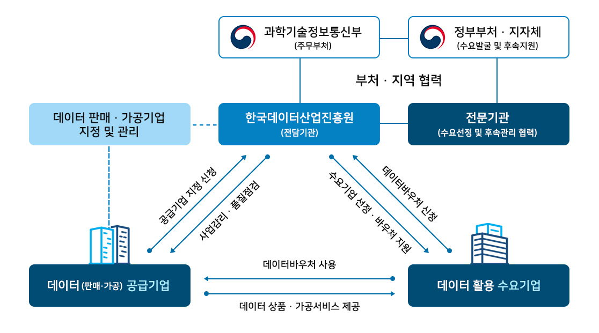

---

title: 2023년도 데이터바우처 지원사업 수요기업 모집에 관한 모든 것 

date: "2023-02-03T00:00:00.000Z"

category: "blog"

description: 미디어나비가 공급기업으로 등록된 2023년도 데이터바우처 수요기업 모집공고에 대해 설명합니다. 

postauthor: "Anna"

---
## 데이터바우처 지원사업이란?

데이터바우처 지원사업에 대해 들어보신 적 있나요? 데이터 산업 관계자분들은 한 번쯤은 들어보셨을 지원사업인데요. 데이터 수요 · 공급의 생태계를 조성하고 全 산업의 디지털 기반 데이터 활용 활성화 촉진을 위해 데이터 구매 · 가공 바우처를 지원하는 내용의 한국데이터산업진흥원 주관 사업입니다. 2022년의 경우, 총 예산 1,241억 원이 편성되어 데이터가 필요한 수요기업과 데이터를 판매하는 공급기업의 맞춤 매칭을 통해 지원해오고 있습니다. 

* 데이터바우처 사업추진체계
<figure>

<figcaption></figcaption>
</figure>

* 데이터바우처 사업추진절차
<figure>

<figcaption></figcaption>
</figure>

미디어나비가 2023년 데이터바우처 AI 가공 부문 공급기업으로 선정되어 수요가 있는 기업과 함께 수요기업 신청을 미리 준비하고자 합니다. 명확한 사업 아이템과 방향성도 중요하지만 정부지원사업은 요구되는 사업계획서 양식에 알맞게 작성하는 것이 가장 중요한 점이라는 것, 아시죠? 사업계획서에서 높은 점수를 받아 과제가 선정되기 위해선 그만큼 철저한 준비와 시간이 필요합니다. 그렇기에 이 블로그 콘텐츠를 기획하게 되었구요. 

우선 수요기업의 접수순서에 대해서 설명드립니다. 저희의 경우 AI 가공부문 공급기업이기 때문에 2번 단계에서 과제협의는 오프라인으로 하지만 과제협의서 및 견적서 제출은 불필요합니다. AI가공 서비스가 필요한 수요기업에서 저희와 사전 과제협의를 통해 선정한 아이템으로 사업계획서를 작성하시고 수요기업이 선정되었을시, AI가공 공급기업인 저희와의 과제협의서, 견적서를 제출하는 순서로 이해하시면 되겠습니다. 

1) 데이터바우처 지원사업에 신청, 접수하고자 하는 수요기업은 데이터바우처 포털 <www.kdata.or.kr/datavoucher> 에 접속하여 필요한 데이터 상품, 가공서비스 및 공급기업명을 검색
2) 공급기업과 과제협의 및 공모안내에 따라 데이터바우처 사업관리 시스템 <www.kdata.or.kr/pms> 을 통해 접수
<figure>

<figcaption></figcaption>
</figure>

2023년도 데이터바우처 지원사업의 수요기업 모집공고는 아직 나오지 않았지만요, 작년 일정을 참고하면 올해도 2월 중일 것으로 예상할 수 있습니다. 준비시간이 그리 넉넉하지는 않은 것 같습니다. 

## 2023년도 데이터바우처 지원사업 수요기업 신청의 모든 것

데이터바우처 지원사업의 기본정보를 알고 계신 분들도 계시겠지만, 처음 들어보신 분들도 계실텐데요. 그렇다면 수요기업 모집대상, 지원규모 등 수요기업 입장에서 궁금하실 기본적인 사항들부터 미리 체크해보는 게 좋을 것 같아서 주요 FAQ를 정리해봤습니다. 

| Q | A |
| ---- | --- |
| 수요기업 신청 자격이 있나요? | 중소기업, 소상공인, 1인창조기업, 예비창업자 등이 대상입니다. |
| 지난 공고에서 수요기업 선정되지 않은 기업도 이번 공모에 재신청 가능한가요? | 가능합니다. 재신청 시 이전 평가 탈락 이력으로 인한 별도 불이익은 없습니다. 다만, 평가 탈락 사유가 고의적 허위 자료 제출 또는 허위사실 기재인 경우 수요기업 신청이 제한될 수 있습니다.  |
| 지난 공고에 지원받은 수요기업도 신청할 수 있나요? | 데이터바우처는 단년도 지원을 원칙으로 하여 ‘19년도 또는 ‘20년도에 지원을 받은 기업은 본 공모 지원 대상에서 지원됩니다. 다만, 수요기업이 신규사업을 제안하여 수요기업 선정평가 결과 상위 20%에 해당하는 경우, 당해연도 지원을 검토할 수 있습니다.
|수요기업 지원금액은 어떻게 되나요? | 수요기업으로 선정되시면, 기업당 1건의 비즈니스 프로젝트별로 데이터 구매 최대 18백만원, 데이터가공(일반) 최대 45백만원, 데이터가공(AI) 최대 70백만원을 지원받으실 수 있습니다. 
|사업비는 어떻게 구성되나요? | 수요기업은 바우처 신청 시 자사 기업규모에 따라 사업비를 구성하여 신청해야 합니다. 이때, 사업비는 정부지원금(80%)과 민간부담금(20%)으로 구성하시면 됩니다.* (중소기업) 총 사업비의 20%이상을 민간부담금으로 구성하고, 현금부담금은 민간부담금의 10%이상 필수 매칭 ※ 현금부담금은 민간부담금(20%)의 10% 즉, 총 사업비(100%)의 2%입니다. * (소상공인‧1인창조기업) 총 사업비의 20%이상을 민간부담금으로 구성하고, 현물로 민간부담금 전액 구성 가능. 다만, 필요 시 현물 일부 또는 전부를 현금으로 매칭 가능 * (예비창업자, 대학·연구팀, 병원) 민간부담 제외
|민감부담금은 무엇인가요?|민간부담금이란 수요기업이 부담해야 하는 사업비로 현금과 현물로 구성됩니다. 현금은 수요기업이 공급기업에게 직접 지급하며, 현물이란 현금은 아니지만 현금처럼 산정할 수 있는 것으로 참여인력의 ‘인건비’가 현물에 해당됩니다.
|평가방식은 어떻게 되나요?| 평가방식은 (1) 적격성 검토(K-DATA) → (2) 사전심사(전문기관) → (3) 최종심사(K-DATA·외부평가위원) → (4) 평가결과 공고(K-DATA) 순으로 진행됩니다. ※ 절차별 내용 적격성 검토: 신청요건 및 자격 검토 -> 사전심사: 분야 적합성 및 사업혁신성 평가 -> 최종 심사: 공급거래적정성 등 평가 -> 평가결과 공고: 평가결과 발표 및 협약 실시

<figure>

<figcaption></figcaption>
</figure>

이밖에 자세한 문의사항은 데이터바우처 포털사이트에서 알아보실 수 있습니다. 

**(데이터바우처 홈페이지)**

<https://kdata.or.kr/datavoucher/index.do>

## 미디어나비 AI가공 서비스 수요기업 예시

<figure>

<figcaption></figcaption>
</figure>

* 인공지능 언어모델 ‘KPF-BERT’를 활용한 기사 자동요약, 클러스터링, 맞춤법 자동검사기 등 기능으로 업무효율화를 원하는 언론사 A
* 자연어처리AI 기술 기반 서비스 개발이 필요한 미디어분야 B사
* 쌓여가는 데이터를  AI 가공작업으로 사업화에 활용하고 싶은 C사
* 고객 데이터를 활용하여 매출을 극대화하고 싶은 D사
* 자동상품진열 기능 개발로 고정비용을 절감하고 싶은 E사
* 소비자-판매자 자동매칭으로 마케팅에 활용하고 싶은 F사
* IoT(사물인터넷) 센서 데이터 수집⋅분석으로 공공보안, 사고예방에 활용하고자 하는 G사
* 노후설비 장애⋅고장 데이터 분석으로 안전사고 예방 및 최적의 기계교체 시기를 판단하고자 하는 H사
* 빅데이터 분석 고도화가 필요한 I사
* 저비용으로 웹툰이나 광고를 위한 이미지 자동생성을 원하는 J사  
* 메타버스 체험형 VR 서비스 제작이 필요한 K사
* 에듀테크 분야의 AI 서비스 기능 개발을 하고자하는  L사
* 게임 콘텐츠의 인터렉티브한 NPC 자동생성이 필요한 M사
* 온라인 교육 플랫폼의 버추얼 튜터 생성모델을 원하는 N사
* 2D 동영상에서 3D 자동생성이 필요한 O사
* 이미지, 동영상 자동인식 및 분석 모델이 필요한 P사 등

빅데이터 시대, 이제는 데이터를 활용하지 않는 기업이 거의 없을텐데요. 아무런 노력 없이도 자동으로 쌓여가는 기업 보유 데이터나 필요에 의해 수집된 데이터를 어떻게 하면 잘 활용할 수 있을까요? *양질의 데이터가 있더라도 기업이 원하는 결과에 맞게 데이터를 가공하는 작업이 없다면 그 데이터는 무용지물이 되고맙니다.* 상단 예시에 맞는 수요를 가진 기업들은 미디어나비의 데이터 AI가공 서비스를 이용하실 수 있습니다. 또한, 수요기업의 니즈에 맞는 가공서비스도 제공 가능하니 **상호협의를 통해 아이템을 함께 설계**해나가면 될 것 같습니다. 데이터바우처 지원사업에서 미디어나비가 제공하는 서비스 상품설명은 하단 링크 블로그 콘텐츠에서 확인하실 수 있습니다.

**(2023년도 AI가공 서비스 공급기업으로 선정)**

<https://blog.medianavi.kr/2022-12-21-datavoucher-service/>

미디어나비는 **2023년도 데이터바우처 지원사업의 AI가공 부문 공급기업인 동시에 AI바우처 지원사업의 공급기업풀에도 등록**되어 있습니다. AI R&D를 전담하는 연구개발전담부서와 기업 자체 AI 솔루션을 보유하고 있습니다. AI 솔루션에 대한 상세 내용은 하단 블로그 내용으로도 확인하실 수 있습니다. 

**(미디어나비 AI 솔루션)**

<https://blog.medianavi.kr/2023-01-10-MediaNavi-AI-Solution/>

**(데이터바우처 홈페이지)**
미디어나비를 검색어에 입력하면, 서비스 상세설명이 나옵니다.

<https://kdata.or.kr/datavoucher/index.do>

## 2023년도 수요기업 신청 사전 준비 필요  

수요기업 사업계획서 작성은 2023년 지정된 공급기업과 오프라인 협의 하에 데이터 가공서비스 활용에 대한 사업계획서를 구체적으로 작성하게 되어있습니다. 저희 미디어나비가 2023년도 데이터바우처 AI가공 부문 공급기업으로 등록되어 있으니 당사 서비스에 대한 수요가 있는 기업에서는 언제든 하단 메일로 문의주시면 지원사업 아이템 선정부터 사업계획서 작성지원까지 사전협의가 가능합니다. 

수요기업의 사업계획서 평가에서 가장 중요한 점은 사업계획서상 명시된 **수요기업 사업의 적합성, 구체성, 혁신성** 등을 주요 평가기준으로 둔다고 합니다. 사업계획서 양식 목차를 참고용으로 공유드립니다. 

**2023년도 데이터바우처 지원사업 수요기업 모집기간 : 2월 중 예상**

**2023년도 데이터바우처 지원사업 수요기업 모집마감 : 3월 말 예상** 

<figure>

<figcaption></figcaption>
</figure>

<figure>

<figcaption></figcaption>
</figure>

**(미디어나비 데이터바우처 서비스 커뮤니케이션팀)**

<anna@medianavi.kr>

데이터바우처 지원사업 수요기업으로 신청을 안 하시더라도 AI 가공 서비스 이용이 가능합니다. 미디어나비 웹사이트 대표메일이나 상단 이메일 주소로 바로 문의주시면 상세히 안내해드리겠습니다.

**AI를 활용한 사업화, 이왕이면 정부지원금을 받아 기업부담을 줄이는 것이 어떨까요?**
**미디어나비와 함께 미리 준비하셔서 귀사의 AI 도입비용을 줄이고 사업화에 활용해보세요.** 
 

### 참고문헌
- 한국데이터산업진흥원-데이터바우처 홈페이지
<https://kdata.or.kr/datavoucher/index.do>
- 데이터바우처 사업관리시스템
<https://kdata.or.kr/pms/index.do>

### 참고이미지 
- 이미지 공유 플랫폼 핀터레스트
<https://www.pinterest.co.kr>

