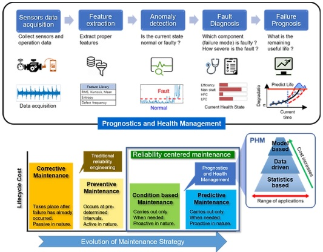
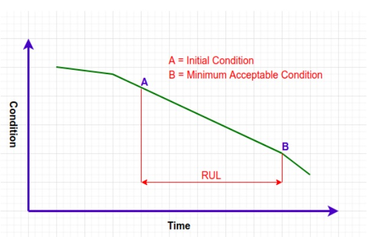
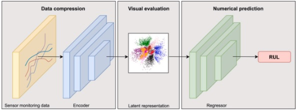
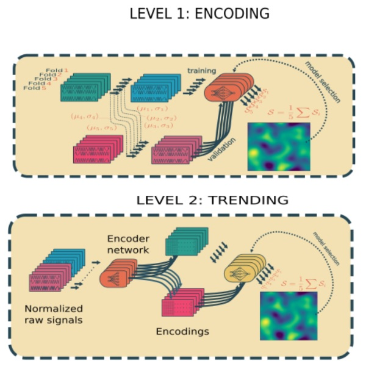

---

title: Prognostics and Health Management(고장예측시스템)   

date: "2023-04-04T00:00:00.000Z"

category: "blog"

description: 미디어나비가 수행했던 AI 프로젝트 중 Prognostics and Health Management(고장예측시스템)에 대해 설명합니다. 

postauthor: "Justa"

---
## 1. PHM이란?

**Prognostics and Health Management**의 약어로, 장치의 건전성을 예측하고 관리하는 종합적인 분야다. PHM은 다섯 단계로 구분할 수 있다.

<figure>

<figcaption></figcaption>
</figure>

1) 계측 (sensing) – 장치의 각종 물리량을 계측하는 단계이다. 정확하고 유의미한 정보를 잘 설계하여 적절한 계측방법을 사용하는 것이 중요하다. 
2) 모니터링 (monitoring) – 계측 데이터에서 유의미한 정보를 찾아 이해하기 쉽게 표시하는 과정이 모니터링 단계다.
3) 진단 (diagnostics) – 모니터링을 통해 장치의 현재 상태를 정의하는 단계다. 해당 도메인 전문가의 경험이 중요할 수 있다.
4) 예측 (prognostics) – 과거의 사례와 진단 단계의 정보를 바탕으로 향후 고장의 시기나 정도를 예측하는 단계다. 실제로 고장 예측 시스템의 핵심이다.
5) 관리 (management) – 장치의 건전성 관리. 예상 고장의 선제적 정비 등의 후속조치 단계다.

  
## 2. RUL(Remaining Useful Life)

예측단계에서 많이 쓰이는 개념으로 장치의 잔존수명이라고 보면 되겠다.

<figure>

<figcaption></figcaption>
</figure>

녹색 그래프를 해당 장치의 수명이라고 보면,
A는 장치의 가동 초기상태, B는 고장상태를 의미하고, B까지의 남은시간이 잔존수명, 즉 RUL이 되는 것이다.
B는 정상동작과 상태이상(고장)을 구분하는 Threshold값으로 장치마다 다르게 정의될 것이다.

## 3. 진단 및 예측 모델
진단과 예측은 동일선 상으로 볼 수 있다. 계측단계의 데이터가 유의미하다면 정확한 진단을 내리는 모델을 설계할 수 있을 것이고, 진단 모델을 바탕으로 상황별 계측데이터를 머신러닝하여 장치의 수명에 대한 예측모델을 훈련할 수 있기 때문이다.

장치의 특성이나 상황에 따라 여러가지 모델이 사용될 수 있다. 몇가지 예를 들면,
1) RVE 
<figure>

<figcaption></figcaption>
</figure>

Recurrent Variational Encoder의 약자로, 모델은 encoder, latent representation, regressor 세 부분으로 구성되어있다. 인코더는 LSTM으로, 입력 데이터를 저차원 공간에 매핑하여 잠재 표현(latent representation)을 생성한다. regressor는 잠재표현을 활성화 함수와 FC layer를 이용하여 결과(RUL)를 출력한다.

2) Stacked DCNN
<figure>

<figcaption></figcaption>
</figure>

심층 컨볼루션 신경망(DCNN)을 두단계로 나누어 적용하여 만든 모델로, 첫번째는 입력 데이터의 차원을 낮추고 노이즈를 제거하는 인코딩을 통해 특징벡터를 추출하고, 두번째는 이 특징벡터를 FC layer를 사용해 신호의 경향을 학습하며, RUL의 regression을 진행한다.

## 4. 현장 적용사례
- **A사, 철도관련**
 A사는 기존에 계약되어 개발하던 곳에서 결과물을 내놓지 못하여 급하게 투입되는 제한적 환경에서 고장예측 솔루션이 적용되었다.

 고장 예측 성능을 보장하기 위해서는 계측단계의 정확하고 유효한 데이터 수집이 필수다. 따라서 데이터 수집단계에 대한 분석과 설계에 많은 비중을 두어야 한다. 하지만 철도분야에서 기존 장치에 장비를 추가하거나 변경하는 것은 어려운 일이며, 기존에 설치 및 축적된 데이터에 대해서만 제한적으로 접근 및 활용가능한 상황으로 적절한 데이터 수집의 한계가 존재했다.
 
 수십 개의 부품이 결합된 선로전환기뭉치 전체에 대한 에러 데이터 및 전체를 관통하는 전압, 전류값 등을 토대로 EDA를 거쳐 장애 발생빈도에 대한 주기적 예측으로 방향을 설정하고 전처리 및 데이터 정제 작업을 통하여 학습가능한 형태로 가공처리하여 학습을 진행하였다.

 시계열 관련 경향성파악에 트랜스포머 구조의 우수성에 긴 입력데이터에도 컴퓨팅 연산량을 획기적으로 줄인 Informer 모델을 이용하여 주요부품별 장애 발생패턴을 파악하여 다음 장애 예측모델을 만들었다.

 향후 고장예측에 대한 예방조치로 고장예측률이 감소하는 경우와 그 데이터를 추가 학습하여 전체 고장 예측 성능이 저하될 수 있는 부분을 보정하는 방향으로 모델의 수정보완이 필요할 것으로 보인다.
