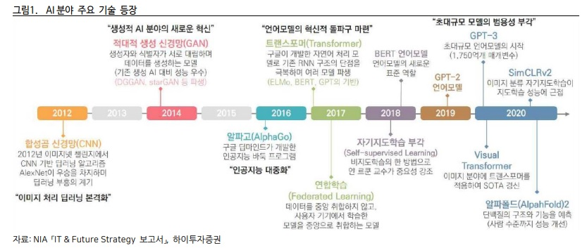
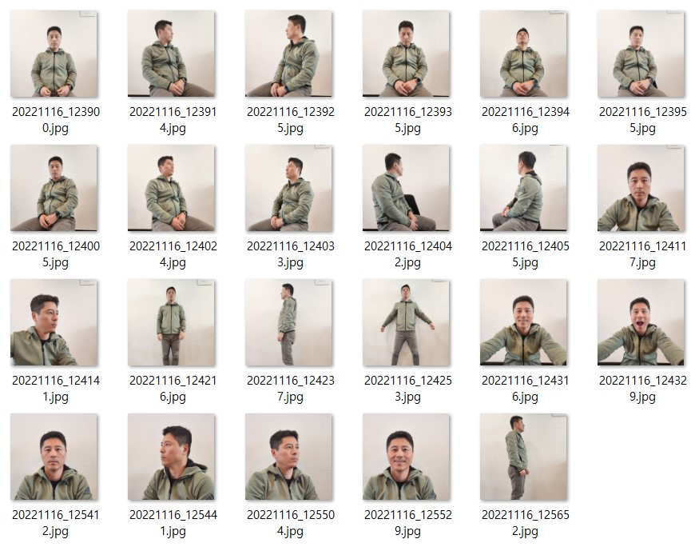

## AI 분야의 기술 발전 흐름

이번 블로그 콘텐츠에서는 인공지능 기술발전 트렌드에 대해 이야기해 보고자 합니다. 생성형 AI의 등장, OpenAI의 ChatGPT 서비스 출시와 함께 따라가기 힘들 정도의 속도로 질주하고 있는 인공지능 기술의 발전 흐름. 전반적인  인공지능(AI) 기술 발전의 흐름에 대해서는 하단 그림을 보시면 대표적인 이슈를 포함한 주요 변화지점들에 대해 파악하실 수 있습니다. 

<figure>
 AI 분야의 기술 발전 역사 / 이미지 출처 : NIA [IT & Future Strategy 보고서] 하이투자증권"/>
<figcaption><그림1> AI 분야의 기술 발전 역사 / 이미지 출처 : NIA [IT & Future Strategy 보고서] 하이투자증권</figcaption>
</figure>  

한편, 세계 AI 시장은 2021년 3,280억 달러에서 2026년 8,062억 달러로 연평균 20.10% 성장 전망을 예측합니다. AI 시장의 급성장에 따라 글로벌 기업들은 적극적인 대규모 펀딩과 M&A 확대 등 기술경쟁력 강화를 위한 투자에 집중하고 있습니다.  

<figure>
  글로벌 인공지능 시장규모 전망 / 자료 출처 :  marketandMarkets(2021), 하이투자증권"/>
<figcaption><그림2>  글로벌 인공지능 시장규모 전망 / 자료 출처 :  marketandMarkets(2021), 하이투자증권</figcaption>
</figure>  

## ChatGPT가 게임체인저가 될 것인가  

OpenAI의 챗GPT 서비스 출시가 인공지능 업계를 넘어서 모두에게 핫 이슈인데요. 2022년 11월 30일, OpenAI의 GPT-3.5 기반 대화형 AI인 챗GPT는 단순한 검색 기능을 넘어 마치 사람처럼 자연스럽게 대화의 흐름과 문맥을 이해하며 번역은 물론, 작문, 계산, 코딩까지 해내는 생성형 AI 모델의 모습으로 등장하여 모두의 놀라움을 자아냈습니다.  
    
100만 유저 확보까지 단 5일, 1,000만 유저 확보까지는 단 40일, MAU(월간 활성 사용자) 1억 명 달성까지는 단 2개월밖에 걸리지 않은 것은 대단한 확산 속도를 의미합니다. 참고로, 하단 그래프에서 현재 전세계 누구나 사용 중인 글로벌 서비스들의 기록과 비교하면 챗GPT의 이용자 확보기간이 얼마나 굉장한 기록인지 짐작이 되시리라 봅니다.

<figure>
 챗GPT 이용자 확보기간 현황 / 자료 출처 : Statista, 삼성증권, 카카오, 과학기술정보통신부"/>
<figcaption><그림3> 챗GPT 이용자 확보기간 현황 / 자료 출처 : Statista, 삼성증권, 카카오, 과학기술정보통신부</figcaption>
</figure>

또한, 챗GPT는 자연스러운 답변을 제시하는 수준으로 여러 콘텐츠 생성이 가능하며, 무엇보다 복잡한 컴퓨터 프로그래밍 언어 대신 지시어인 프롬프트 문장 몇 줄 입력만으로 개발자가 아닌 일반인들도 쉽고 빠른 속도로 어플리케이션 개발이 가능한 수준을 보여줍니다.  
  
MS는 OpenAI에 2019년, 2021년 투자에 이어 100억 달러를 추가로 투자하기로 하는 등 검색 엔진 서비스 시장의 새로운 플랫폼으로 자리매김 중입니다. 검색 서비스의 대표주자인 구글링의 시대가 저물고, 조만간 대화형 AI로 챗GPT에게 물어보는 챗지피팅 시대로 전환하는 변곡점을 맞이할 것이라는 예측들이 난무하고 있는 이유입니다.
  
챗GPT 서비스의 등장으로 사용자는 콘텐츠를 검색하고 생산하기까지의 시간을 절약하게 되며, 이는 광고, 출판, 게임을 포함한 다양한 분야에서 적용되고 있으며 앞으로도 확장될 것으로 보입니다.  
  
이중 미디어나비가 주목하는 분야는 이미지 생성 AI와 접목하여 더 빠른 속도로 발전이 예상되는 **버추얼 휴먼**입니다. 챗GPT가 복잡한 개념을 풀어서 설명할줄 알고, 대화를 통해 앞 뒤 내용을 수정할 수 있는 기능을 제공하는데, 여기에 스테이블 디퓨전과 같은 이미지 생성 AI 모델을 파인튜닝 방식으로 생성해내는 버추얼 휴먼의 향후 전망이 상당히 밝을 것으로 예측하고 있습니다.  

## 멀티 플레이어, 버추얼 휴먼  

버추얼 인플루언서에 대해 들어본 적 있으신가요? 버추얼 인플루언서 이전에 버추얼 휴먼이란, 정교한 컴퓨터 그래픽 기술로 구현되어 실존 인물 같은 외모를 가진 가상인물을 뜻합니다. 이러한 가상인물이 실존하는 인간 인플루언서처럼 온라인상에서 활발히 활동하는 인물을 바로 버추얼 인플루언서라고 하는데요. 

세계 최초 버추얼 인플루언서는 디지털 슈퍼 모델 ‘슈두’로 인스타그램에 처음 등장하며 존재를 알렸습니다. 미국을 대표하는 버추얼 휴먼으로는 릴 미켈라가 있는데 가수, 유투버, 모델 활동 등을 통해 벌어들인 지난 해 수익만 130억 원에 달합니다. 물론 국내 케이스도 있습니다. 싸이더스 스튜디오엑스 소속 버추얼 인플루언서 로지는 광고모델 활동으로 10억 원 이상의 수익을 창출해내고 있습니다. 버추얼 휴먼은 엔터테인먼트 산업에서 다방면으로 활동이 가능합니다. 버추얼 쇼호스트에 이어 버추얼 유투버, 버추얼 콘텐츠 크리에이터도 존재합니다. 

<figure>
 최초의 버추얼 인플루언서, 디지털 슈퍼모델 '슈두', 이미지 출처 : the Adobe Blog"/>
<figcaption><그림4> 최초의 버추얼 인플루언서, 디지털 슈퍼모델 '슈두', 이미지 출처 : the Adobe Blog</figcaption>
</figure>  

수많은 기업들이 앞다투어 가상의 인간인 ‘버추얼 인플루언서’를 개발하거나 버추얼 휴먼과 계약을 체결하는 이유가 무엇일까요? 실존하는 연예인에 비해 기업에 리스크를 줄 가능성이 적다는 점과 화제성 대비 낮은 모델료로 광고비용을 절감할 수 있는 강력한 이점이 있기 때문이지요. 광고주 입장에서는 마약, 음주운전, 과거의 학교폭력 이슈 등 각종 사건사고 스캔들 걱정이 없는 청정 모델을 선호할 수밖에 없고, 나날이 높아지는 톱스타들의 몸값에 비해 저렴한 계약료까지 마다할 이유가 없을 것 같습니다. 

<figure>
 활동 중인 버추얼 인플루언서, 버추얼 쇼호스트, 버추얼 강사, 이미지 출처 : 인터넷"/>
<figcaption><그림5> 활동 중인 버추얼 인플루언서, 버추얼 쇼호스트, 버추얼 강사, 이미지 출처 : 인터넷</figcaption>
</figure>  

앞서 언급했듯이 이미 국내외에서 Vision AI 기술력을 보유한 AI 기업들이 버추얼 휴먼 제작개발에 뛰어들고 있는데요. 우리가 보는 전망처럼 다양한 산업에서 쓰일 수 있는 버추얼 휴먼의 무궁무진한 가능성을 엿보았기 때문일 것이라 생각됩니다.

- 버추얼 인플루언서
- 버추얼 모델 / 버추얼 아이돌 / 버추얼 댄서
- 버추얼 은행원  
- 게임산업의 버추얼 NPC(Non-Playable Character)
- 온라인 교육산업의 버추얼 튜터
- 기업용 교육을 위한 버추얼 강사 
- 재난예방 위한 안전교육 및 시뮬레이션 강사
- 드라마/영화산업의 버추얼 엑스트라
- 홈쇼핑 산업의 버추얼 쇼호스트  

<표1> 버추얼 휴먼의 활용 예시  

그 안에서 우리가 주목하고 있는 또 다른 분야는 교육산업입니다. 글로벌 AI 교육서비스 시장은 2026년 2,658억 달러 성장이 기대되며, 이는 다시 말해 연평균 19.90% 성장률을 말합니다. AI 기술력을 중심으로 교육산업의 혁신을 이끌 것으로 전망되고 있습니다. 국내 온라인 교육시장 역시 스타강사들에게 의존하고 있는데 일부 1타강사의 수익은 손흥민 선수 연봉의 3배를 기록하는 등 화제가 된 바 있는데요. 1타강사들의 높은 몸값은 결국 사교육비를 부담하는 학부모들에게 전가되고, 사교육 시장에 큰 영향을 끼치게 됩니다. 미디어나비가 버추얼 튜터, AI 강사를 개발하려는 이유 중 하나이기도 합니다.  
  
저희가 개발한  AI 강사가 당장에 1타강사를 대체할 수는 없을 것입니다. 하지만 스타성이 요구되지 않는 분야에서부터 영역을 넓혀가며 궁극적으로는 콘텐츠로 승부하는 다양한 영역까지 도전할 수 있는 기반 기술이라고 생각되기에 의미있는 연구개발 작업임이 분명합니다. 

한편, 드라마, 영화제작시 컴퓨터 그래픽으로 구현해내는 특수효과 제작비용은 수많은 시간과 인력이 투입되므로 총 작품 제작비의 절반을 차지하는 경우도 있습니다. 수많은 군중씬을 찍기 위해 투입되는 엑스트라 배우들을 모으는 것도 만만치 않은 일입니다. 이 군중씬을 컴퓨터 그래픽으로 대체하는 것도 현재는 CG 디자이너들의 노동력이 투입되어 공급됩니다. 이 부분을 버추얼 엑스트라 연기자가 대체하고 배경 및 특수효과를 AI 기술로 자동생성해낸다면 인건비가 대폭 줄기에 제작비용을 절감할 수 있는 효과적인 대안이며, 실제 영화제작 현장에서 적용되고 있는 사례들도 점차 생겨나고 있습니다.  
  
영화제작 기술 개발을 위한 배경 생성, 배우 생성 기술은 영화뿐 아니라 산업 전반에 적용되는 기술로 활용이 가능할 것입니다. 게임에서 배경과 NPC를 제작하는데 상당한 비용이 소요되는데, 게임개발사 로스트 로어는 ‘베어버스’ 개발시 이미지 생성형 AI 미드저니를 활용하여 약 7만 달러의 개발비용을 절감했다고 합니다. 또한, 가상공간 기술의 발전에 따라 메타버스 산업이 급속도로 확산될 것으로 예상되는데요. 아직은 3D 렌더링 비용이 너무 커 발전속도가 다소 느리다고 볼 수 있습니다. 디지털 트윈도 적용 가능한 분야겠지요. 토목, 건축뿐 아니라 건축 영역에서도 3D 모델링 작업에 비효율과 고비용이 투입되고 있는데, 저희가 연구개발 중인 AI를 활용한 영화제작 기술개발은 다양한 분야에 혁신을 가져올 수 있는 기반 기술이 될 것이라고 확신합니다.
  
## AI 영화 제작 프로젝트

<figure>
 Runway AI Film Festival (AIFF), 이미지 출처 : AIFF 홈페이지"/>
<figcaption><그림7> Runway AI Film Festival (AIFF), 이미지 출처 : AIFF 홈페이지</figcaption>
</figure>

<figure>
 Runway AI Film Festival (AIFF) / 이미지 출처 : AIFF 홈페이지"/>
<figcaption> <그림7> Runway AI Film Festival (AIFF), 이미지 출처 : AIFF 홈페이지</figcaption>
</figure>  

Text-to-Video 서비스를 출시한 런웨이 AI(Runway AI)는 한 달 전, 샌프란시스코에서 열린 비공개 행사에서 AI로 만든 단편영화 10편을 선보였고, 영화제작자들이 생성형 AI를 도구로 사용하여 무엇을 얼만큼 표현해낼 수 있는지 보여줬다고 합니다. 런웨이 AI의 공동창업자 크리스토발 발렌주엘라는 이번 영화제가 일회성 행사가 아니며, 이미 기존의 타 영화제들에서도 참여에 긍정적인 관심을 보이고 있다고 밝혔는데요. 그는 영화제작자들이 AI가 인간을 대체할 것이란 우려 대신, AI 기술에 열광하는 것처럼 보인다고 덧붙였습니다. 수상목록은 하단의 Runway AI Film Festival 공식 사이트(https://aiff.runwayml.com/) 에서 시청하실 수 있으며, 작품의 완성도가 아직까지 높진 않지만, AI로 만든 영화를 위한 축제를 최초로 개최했다는 점에서 AI 기술의 현 성장단계, 그 의미를 찾을 수 있을 것입니다.  
  
## 스테이블 디퓨전 파인튜닝

미디어나비는 올해 초, 연구개발전담부서를 설립하여 인공지능 분야의 R&D를 진행해오고 있습니다. 아래는 Text-to-Image의 대표적인 생성형 AI 모델인 스테이블 디퓨전의 파인튜닝 방식으로 연구개발을 진행한 예시입니다.

<figure>
 미디어나비의 스테이블 디퓨전 파인튜닝 샘플 / 생성하고자 하는 원본 이미지"/>
<figcaption><그림6-1> 미디어나비의 스테이블 디퓨전 파인튜닝 샘플 / 생성하고자 하는 원본 이미지</figcaption>
</figure>

<figure>
 미디어나비의 스테이블 디퓨전 파인튜닝 샘플 / as Superman"/>
<figcaption><그림6-2> 미디어나비의 스테이블 디퓨전 파인튜닝 샘플 / as Superman</figcaption>
</figure>

<figure>
 미디어나비의 스테이블 디퓨전 파인튜닝 샘플 / as Captain America"/>
<figcaption><그림6-2> 미디어나비의 스테이블 디퓨전 파인튜닝 샘플 / as Captain America</figcaption>
</figure>

<figure>
 미디어나비의 스테이블 디퓨전 파인튜닝 샘플 / as an illustrated character"/>
<figcaption><그림6-2> 미디어나비의 스테이블 디퓨전 파인튜닝 샘플 / as an illustrated character</figcaption>
</figure>  
  
**지금까지는 초거대 AI  언어모델을 보유한 대기업들이 주인공이었다면, 이제는 얼마나 빠르게 최신기술을 받아들여 적용할 수 있는지 어필하는 기업이 주인공이 될 수 있는 시대가 온 것 같습니다. 향후 이어지는 Part3 콘텐츠에서도 저희가 진행 중인 R&D 현황과 함께 돌아오겠습니다.**

#### 참고문헌 및 링크

- NIA [IT & Future Strategy 보고서] 하이투자증권
- Statista, 삼성증권, 카카오, 과학기술정보통신부
- 중소기업 기술로드맵 2023-2025  http://smroadmap.smtech.go.kr/
- the Adobe Blog, 밀레니얼 세대를 사로잡은 가상 인플루언서 열풍 https://auth.services.adobe.com/en_US/deeplink.html#/deeplink
- GAMETOC, 글로벌 게임 산업에 적용된 AI의 현주소 https://www.gametoc.co.kr/news/articleView.html?idxno=71517
- KOCCA, "제작시간·인건비 절약" 생성형 AI 활용 주목하는 게임업계 https://welcon.kocca.kr/mobile/ko/info/content-news/2387
- ai타임즈, '아바타2'에서 빛난 AI와 메타버스 기술 https://www.aitimes.com/news/articleView.html?idxno=148768
- Runway AI Film Festival https://aiff.runwayml.com/
- Axios, “1 big movie thing : an AI generated film festival https://www.axios.com/2023/03/26/ai-takes-on-film
- IT조선, “누가 그림 잘 그릴까”...이미지 생성 AI 실력 따져보니 https://it.chosun.com/site/data/html_dir/2023/02/24/2023022400423.html
- 간단히 요약해보는 AI의 역사 https://brunch.co.kr/@storypop/28
- LG CNS Blog, 미래에 경험하게 될 인공지능 https://blog.lgcns.com/1291