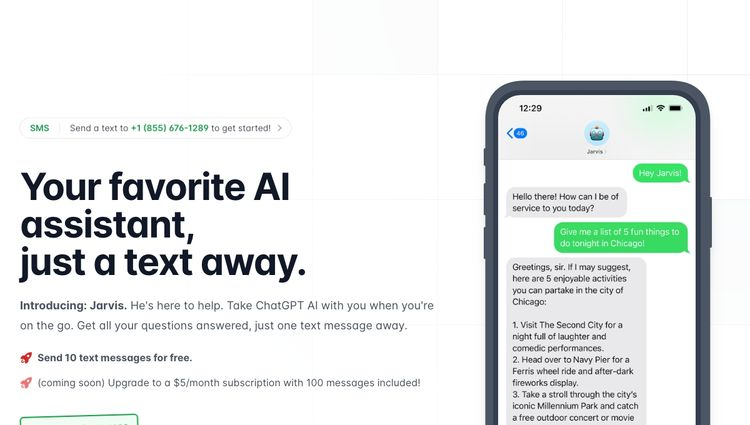

---
title: 인공지능 최신 트렌드_Part III.     
date: "2023-05-12T00:00:00.000Z"
category: "blog"
description: 인공지능 최신 트렌드에 대한 기획/연재기사로, ChatGPT 기술로 주목받고 있는 국내외 서비스 사례들에 대해 이야기합니다. 
postauthor: "Anna"
---     

인공지능 최신 트렌드 Part III. 기획/연재기사인 이번 콘텐츠에서는 인공지능 기술의 시장현황에 대해 이야기해 보고자 합니다. 따라가기도 벅찬 속도로 진행되고 있는 인공지능 기술 발전의 중심에는 OpenAI의 ChatGPT의 등장이 있는데요.

챗GPT는 자연스러운 답변 제시 수준으로 여러 콘텐츠 생성이 가능하며, 무엇보다 복잡한 컴퓨터 프로그래밍 언어 대신 지시어인 프롬프트 문장 몇 줄만으로 개발자가 아닌 일반인들도 쉽고 빠른 속도로 어플리케이션 개발이 가능한 수준까지 도달했습니다.

또한, 챗GPT 서비스 출시 이후 사용자는 콘텐츠를 검색하고 생산하기까지의 시간을 상당히 절약하게 되었는데요. 이는 광고, 출판, 게임, 헬스케어를 포함한 다양한 산업 분야에서 적용되고 있으며, 향후 지속적인  확장이 예상됩니다. 따라서 이번 블로그 글에서는 챗GPT를 도입하고 적용한 실제 서비스 사례들에 대해 이야기해볼까 합니다. 다양한 산업 내 다수의 서비스들이 존재하고 있어 챗GPT 공개 이후 출시된 국내외 서비스들 중에서도 올해 이후 기준 발표된 서비스 중심으로 정리해봤습니다.

## 국내 AI 챗봇 서비스  
### **1. 업스테이지의 아숙업(AskUP)**

<figure>
 업스테이지의 아숙업(AskUP), 이미지 출처 : AskUP 홈페이지"/>
<figcaption><그림1> 업스테이지의 아숙업(AskUP), 이미지 출처 : AskUP 홈페이지</figcaption>
</figure>  

<figure>
 업스테이지의 아숙업(AskUP, 이미지 출처 : AskUP 홈페이지"/>
<figcaption><그림1-2> 업스테이지의 아숙업(AskUP), 이미지 출처 : AskUP 홈페이지</figcaption>
</figure>  
  
업스테이지는 챗GPT를 활용한 서비스 ‘아숙업(AskUp)’을 지난 3월 초 출시했습니다. 챗GPT 기반 대화형 서비스에 업스테이지 핵심 기술인 광학문자인식(OCR) 기능을 접목해 대화 중 문서 이미지 파일을 올리면 내용을 디지털 텍스트로 변환할 수 있습니다. ‘눈 달린 챗GPT’로 입소문 탄 덕분에  출시 보름 만인 3월 중순 기준 26만 명이 넘는 구독자를 모집한 바 있습니다.

GPT-4로 한국어를 포함 27개 언어와 다양한 분야의 지식을 활용, 영어뿐 아니라 한국어, 중국어 등 다른 언어도 답변이 가능한 수준을 가지며, 법률, 의료, 교육 등 다양한 분야에 걸친 정보제공과 문서도 처리할 수 있어 활용성이 더욱 높아질 것이라고 합니다. 기업용 API 솔루션 출시도 예고됐는데요. OCR API는 손글씨, 한자, 원문자, 체크박스 등 다양한 서식이나 도장·서명을 포함한 여러 문자 특성을 인식하고 문서의 구겨짐, 복잡한 배경, 방향 회전 등 어떤 상태든 대응한다고 하네요. 추천 API는 업스테이지의 기술력으로 사용자 행동 데이터를 분석하고 개인화 추천을 제공하는 솔루션으로 기업 사용자가 코드 복사·붙여넣기와 같은 간단한 방식으로 즉시 도입이 가능하다고 합니다.

### **2. AI 기반 디지털 교육기업 앨리스, 'AI 헬피' 출시**
<figure>
 GPT-3 기반 코딩 학습 보조 AI 챗봇 'AI 헬피', 이미지 출처 : 엘리스 홈페이지"/>
<figcaption><그림2> GPT-3 기반 코딩 학습 보조 AI 챗봇 'AI 헬피', 이미지 출처 : 엘리스 홈페이지</figcaption>
</figure>  

AI 기반 디지털 교육 기업 앨리스는 올해 언어모델 GPT-3 기반 코딩 학습을 돕는 ‘AI 헬피’를 출시했습니다. 코딩 학습 보조 AI 챗봇으로, 엘리스 플랫폼 내 질의응답 메뉴 ‘헬프 센터’에서 학습자를 위해 코드를 풀어서 설명해주거나 오류를 잡아줍니다. AI 헬피는 엘리스 자체 보유 약 15만건 질의응답과 4억 개 이상 텍스트 토큰을 활용해 성능을 높였으며, 사전학습된 머신러닝 모델을 미세조정하는 과정을 거쳐 코딩 관련 질의응답에 최적화했다는 설명인데요.

이용자는 질문하고 싶은 코드 부분을 드래그해 AI 헬피에 바로 문의할 수 있으며, 평균 20분 소요되던 답변시간이 1분으로 감소했다는 설명을 덧붙였습니다. AI 헬피는 컴퓨터 공학 분야 초보 학습자들이 대형 언어모델(LLM)을 이용해 문제 풀이 시 다섯 가지 질문 선택지를 제공해 더 적합한 질문을 하도록 유도하기도 하고, 수업 추천과 진행, 코드 실시간 교정, 에러 메시지 해석 등 학습 전반에 활용하게 될 것이라 하네요. 

### **3. 교육, 지식 공유 플랫폼 클라썸, 'AI 도트 2.0'**
<figure>
 교육, 지식 공유 플랫폼 클라썸, 'AI 도트 2.0', 이미지 출처 : 클라썸 홈페이지"/>
<figcaption><그림3> 교육, 지식 공유 플랫폼 클라썸, 'AI 도트 2.0', 이미지 출처 : 클라썸 홈페이지</figcaption>
</figure>  

교육·지식 공유 플랫폼 클라썸은 지난 달 GTP-3.5 API를 접목한 ‘AI 도트 2.0’을 선보였습니다. 기업용 대화형 AI 서비스로 생성형 인공지능(generative AI)이 사내 축적된 데이터를 바탕으로 질문 답변을 제공, 고객사 직원들의 업무를 지원합니다. 도트 2.0이 적용된 플랫폼을 통해 기업들은 임직원 교육, 고객 문의 대응, 대내외 Q&A 채널 등 다양한 분야에서 효과적인 업무 지원이 가능하며, 도트 1.0를 도입했던 고객사 대상 한시적으로 도트 2.0 서비스를 무료 제공 중이라고 하네요.

학생이 부담없이 질의응답하는 환경 조성으로 수업 참여도를 높이고자 연세대학교에 도입되기도 했으며, 연세대 온라인 교육 플랫폼 ‘런어스(LearnUs)’의 모든 강의는 클라썸과 연동이 가능하고 Q&A 기능, 피드백 기능, 학습 데이터 및 통계, 도트 등을 사용할 수 있습니다. 실시간으로 쌓이는 질문을 바탕으로 유사한 질문을 추천하기에 데이터를 직접 관리하지 않아도 되며, 학생은 빠르게 질문을 해결하고 교수와 조교는 중복질문에 따른 업무부담을 줄일 수 있습니다. 한편, 전세계 25개국 약 5,000개 이상 각종 학교, 기업, 단체에서 사용되는 클라썸은 연세대학교, 서울대학교, 카이스트, 국민대학교, 삼성전자DS, SK하이닉스, DB그룹, 직방 등에서 사용 중인 기업용 대화형 AI 서비스입니다.

### **4. 여행 플랫폼 마이리얼트립, ‘AI 여행 플래너' 출시**
<figure>
 여행 플랫폼 마이리얼트립, ‘AI 여행 플래너’ 서비스 출시, 이미지 출처 : 마이리얼트립 홈페이지"/>
<figcaption><그림4> 여행 플랫폼 마이리얼트립, ‘AI 여행 플래너’ 서비스 출시, 이미지 출처 : 마이리얼트립 홈페이지</figcaption>
</figure>  

마이리얼트립도 최근 챗GPT 연동 ‘AI 여행 플래너’ 서비스를 출시했습니다. 여행 일정 계획을 위한 도움 제공을 목적으로 한 대화형 AI를 활용한 ‘AI 여행플래너' 서비스로 이용자는 AI와의 대화를 통해 여행 일정을 계획할 수 있는데요. AI 여행플래너와는 맛집, 명소, 날씨, 팁, 여행지 추천 등 여행 관련 다양한 주제에 대한 대화가 실시간으로 가능합니다.

AI 여행플래너가 시간별 일정 및 동선에 맞춘 여행 계획을 제시해주고, 최저가 항공권 구매하는 법, 숨겨진 명소, 인기 여행상품 등 정보를 제공하는 방식으로 이용자가 AI 여행플래너로 계획한 일정은 마이리얼트립 상품페이지로 연동되기도 합니다. 향후 추천, 여행 콘텐츠, 커뮤니티 활동 등 서비스 전반에 생성형 AI 기술을 적용해나간다는 계획이라고 합니다.  

국내기업은 아니지만 글로벌 온라인 여행 서비스인 트립닷컴도 실시간 여행가이드 챗봇 서비스 ‘TripGen’을 출시했습니다. 검색창에서 이용자와 실시간 대화를 통한 질의응답 기능을 제공하며 여행 아이디어, 여행 팀, 일정 제안 등 다방면으로 활용이 가능하네요. 베타 테스트에서는 한국어 포함 4개 언어를 우선지원하고 있으며 다소 복잡하거나 어려운 답변에도 구체적인 답변을 얻을 수 있습니다. 현재는 챗GPT의 GPT 아키텍처 기반으로 하고 있지만, 추후 다른 자연어처리 모델도 검토하여 여행자들에게 최고의 경험을 선사하기 위해 노력할 것이라 발표했습니다. 

<figure>
 여행 플랫폼 트립닷컴, 실시간 여행가이드 챗봇 ‘TripGen’ 출시, 이미지 출처 : 트립닷컴 홈페이지"/>
<figcaption><그림4-2> 여행 플랫폼 트립닷컴, 실시간 여행가이드 챗봇 ‘TripGen’ 출시, 이미지 출처 : 트립닷컴 홈페이지</figcaption>
</figure>  

### **5. 회계사, 세무사 매칭 플랫폼 텍슬리, ‘택슬리 AI챗봇 서비스’ 출시**
<figure>
 회계사, 세무사 매칭 플랫폼 텍슬리, ‘택슬리 AI챗봇 서비스’ 출시, 이미지 출처 : 텍슬리 홈페이지"/>
<figcaption><그림5> 회계사, 세무사 매칭 플랫폼 텍슬리, ‘택슬리 AI챗봇 서비스’ 출시, 이미지 출처 : 텍슬리 홈페이지</figcaption>
</figure>  

회계사, 세무사 매칭 플랫폼인 택슬리의 인공지능 챗봇 서비스는 택슬리 앱 및 홈페이지를 통해 사용이 가능합니다. 택슬리는 간단한 세무회계 질문을 무료로 상담받을 수 있는 ‘질문 답변’ 게시판을 운영하고 있는데요, 사용자가 다양한 세무 회계 관련 질문을 등록하면 세무사 또는 회계사가 답변을 남겨주는 방식으로 이때 사용자가 상담에 필요한 정보를 충분히 기재하지 않았거나, 질문의 난이도에 따라 무료 상담 진행이 어려운 경우 택슬리 AI 챗봇 서비스가 질문에 최적화된 맞춤형 답변을 제공하고 있습니다.

이번 서비스 출시를 통해 사용자의 무료 세무회계 상담 경험이 한층 더 편리해질 것으로 기대하고 있습니다. 챗GPT(Chat GPT)를 활용해 사용자가 남긴 질문에 맞춤형 답변을 제공하는 것은 물론 효율적이고 원활한 상담을 위한 상담 가이드 역할을 할 수 있기 때문인데요. 예를 들어, 사용자가 상담에 필요한 정보 기재를 누락한 경우, 택슬리 AI 챗봇이 확인해야 하는 정보 항목 주의사항, 참고하면 좋은 세무회계 정책 등을 제공해 체계적이고 꼼꼼한 세무회계 상담이 이루어질 수 있도록 도움을 지원합니다.

### **6. 헬스케어 플랫폼, 굿닥 ‘건강 AI 챗봇’ 출시**
<figure>
 헬스케어 플랫폼, 굿닥 ‘건강 AI 챗봇’ 출시, 이미지 출처 : 굿닥 홈페이지"/>
<figcaption><그림6> 헬스케어 플랫폼, 굿닥 ‘건강 AI 챗봇’ 출시, 이미지 출처 : 굿닥 홈페이지</figcaption>
</figure>  

헬스케어 플랫폼 굿닥도 건강 AI 챗봇을 출시했습니다. 이용자가 건강 시술 관련 질문을 하면, AI가 실시간 진단과 함께 해결방안을 건냅니다. 한편, AI 답변이 충분치 않은 경우 병원예약 등 대면진료와 연결 솔루션을 제공하기도 합니다.

### **7. 푸드테크 식신, 챗GPT 적용 서비스 추가**
<figure>
 푸드테크 식신, 챗GPT 적용 서비스 추가, 이미지 출처 : 식신 홈페이지"/>
<figcaption><그림7> 푸드테크 식신, 챗GPT 적용 서비스 추가, 이미지 출처 : 식신 홈페이지</figcaption>
</figure>  

푸드테크 스타트업 식신의 맛집 정보 서비스인 ‘식신’에 챗GPT를 적용했다고 4월 19일, 밝혔습니다. 식신은 전국 식당 약 75만곳 데이터 중 인기 맛집 8만7천곳 가량을 ‘핫 플레이스’로, 심사과정을 거친 6800곳을 ‘별맛집’으로 등급을 분류해 정보를 제공 중입니다.  챗GPT 도입으로 레스토랑을 매력적으로 소개할 수 있는 문장 생성을 기대 중이며, 기존 수작업 방식으로 제공되던  테마별 콘텐츠도 AI가 자동생성할 수 있게 할 전망이라고 합니다. 맛집 추천방식도 기존에는 정형화된 구조 안에서 머신러닝을 통해 해왔다면, 앞으로는 추천 샘플 데이터 자체와 매장 데이터를 학습시켜 개인 맞춤형 스타일의 맛집 추천이 가능해집니다. 챗봇 형태로 국내외 레스토랑 검색, 추천 서비스를 제공하는 ‘AI 맛집 비서’도 출시를 앞두고 있으며, 사용자 리뷰에 대한 부적합성 검수도 AI가 대체하게 될 것이라 합니다.  
  
### **8. 교원그룹, ‘실사형 Ai튜터’에 챗GPT 적용, 서비스 고도화**
<figure>
 교원그룹, ‘실사형 Ai튜터’에 챗GPT 적용, 서비스 고도화, 이미지 출처 : 교원그룹 홈페이지"/>
<figcaption><그림8> 교원그룹, ‘실사형 Ai튜터’에 챗GPT 적용, 서비스 고도화, 이미지 출처 : 교원그룹 홈페이지</figcaption>
</figure>  

교원그룹은 지난 3월, Ai학습지 아이캔두 ‘실사형 Ai튜터’에 챗GPT를 적용해 고도화에 나선다는 계획을 발표했습니다. 아이캔두는 실감형 교육환경을 제공하고자 메타버스로 구현한 가상교실에서 교과 연계 맞춤 학습이 가능한 Ai학습지로 현재 ‘실사형 Ai튜터’에 챗GPT 도입을 위한 타당성 검증(PoC, Proof of Concept)을 진행 중이라고 하는데요.

방대한 데이터를 기반으로 학습 중 궁금한 사항을 실시간으로 묻고 답할 수 있는 것은 물론, 데이터 개인화를 통해 학습자에게 최적화된 높은 정확도의 답변 제공을 목표로 합니다. 챗GPT 적용으로 학습을 위해 필요한 방대한 양의 정보를 손쉽게 찾아 학습할 수 있습니다.

한편, ‘실사형 Ai튜터’는 실사형 AI기술을 적용해 실제 인물을 영상 합성으로 제작한 가상 교사로 초개인화 학습을 위해 실사형 Ai튜터가 학습 습관부터 태도, 감정까지 분석합니다. 학습자는 학습 중 궁금한 점을 실사형 Ai튜터에게 질문할 수 있고, 학습 피드백을 받을 수 있으며, 수집된 학습 데이터를 바탕으로 학습 전반을 관리 받을 수 있는 점이 특징입니다.

## 해외 AI 챗봇 서비스

### **1. 어학 앱 Duolingo, Duolingo Max 발표**
<figure>
 어학 앱 Duolingo, Duolingo Max 발표, 이미지 출처 : Duolingo 홈페이지"/>
<figcaption><그림9> 어학 앱 Duolingo, Duolingo Max 발표, 이미지 출처 : Duolingo 홈페이지</figcaption>
</figure>  

유명 어학 교육 앱 듀오링고(Duolingo)는 GPT-4를 이용한 유료 서비스인 듀오링고 맥스(Duolingo Max)를 발표했습니다. 듀오링고 맥스는 AI를 이용해 사용자에 맞는 어학수업을 실현하는 걸 목표로 하는데요. 예를 들어, 한 기능(Explain My Answer)을 이용하면 사용자 실수를 개별적으로 해석하거나 롤플레이(Roleplay) 기능에서는 AI를 상대로 실제 대화를 연습해볼 수도 있습니다. GPT-4 기반 기술의 새로운 기능을 제공하는 신규 구독모델을 출시해 한 달 $20.99 / 일 년 $167.99으로 사용자들에게 유료 서비스를 제공 중이네요.  

### **2. Snapchat, 채팅봇 My AI 추가**
<figure>
 Snapchat, 채팅봇 My AI 추가, 이미지 출처 : Snapchat 홈페이지"/>
<figcaption><그림10> Snapchat, 채팅봇 My AI 추가, 이미지 출처 : Snapchat 홈페이지</figcaption>
</figure>  

스냅챗(Snapchat) 역시 채팅봇 마이 AI(My AI)를 추가했습니다. 스냅이 스냅챗용으로 커스터마이징한 오픈AI GPT 기술이 사용되고 있습니다. 마이 AI는 $3.99인 스냅챗 플러스 유료 사용자만 쓸 수 있는 기능입니다. 마이 AI는 사소한 질문에 대답하거나 하이쿠(일본의 짧은 시 장르)를 쓰는 것을 할 수 있습니다. “마이 AI는 우정, 학습, 재미에 대한 가치를 활용하는 독특한 목소리와 성격을 갖도록 훈련되었으며, 앱의 신뢰 및 안전지침을 준수하도록 교육받았습니다.”라고 밝히는 동시에 스냅챗 측은 “AI로 구동되는 거의 대부분의 챗봇과 마찬가지로, 마이 AI 역시 어떤 것이든 말하도록 속일 수 있다”고 말했는데, 이는 마이 AI가 아직까지 자체적으로 많은 결함이 있다는 것을 인정하기도 한 것 같아보이네요. 스냅챗은 심지어 이 부분에 대해 새로운 챗봇 사용자들에게 미리 양해를 구하기도 했다고 합니다.

### **3. 트위터 마이크로 블로그 플랫폼 Koo, 초안 작성 기능 제공**
<figure>
 트위터 마이크로 블로그 플랫폼 Koo, 초안 작성 기능 제공, 이미지 출처 : Koo 홈페이지"/>
<figcaption><그림11> 트위터 마이크로 블로그 플랫폼 Koo, 초안 작성 기능 제공, 이미지 출처 : Koo 홈페이지</figcaption>
</figure>  

트위터 마이크로 블로그 플랫폼인 쿠(Koo)는 챗GPT를 이용한 초안 기능을 탑재했습니다. 사측은 콘텐츠 제작을 단순화하는 방법을 항상 찾고 있으며, 챗GPT 기술 도입 및 통합을 통해 크리에이터를 위해 지적인 도움을 제공할 것이라고 밝혔습니다.

### **4. Instacart, ChatGPT 도입 ‘Ask Instacart’ 기능 탑재**
<figure>
 Instacart, ChatGPT 도입 ‘Ask Instacart’ 기능 탑재, 이미지 출처 : Instacart 홈페이지"/>
<figcaption><그림12> Instacart, ChatGPT 도입 ‘Ask Instacart’ 기능 탑재, 이미지 출처 : Instacart 홈페이지</figcaption>
</figure>  

북미를 대표하는 최대 식료품 배달 서비스로 자리잡은 인스타카트는 연내 자가 앱에 챗GPT를 탑재할 것을 발표했습니다. 애스크 인스타카트(Ask Instacart)라는 채팅 기능을 제공해 채팅에서 쇼핑으로 유도하는 구조입니다. 예를 들어, 레몬 스쿼시 만드는 방법을 물으면 레시피와 함께 AI가 추천해주는 쇼핑 목록이 나오는 식으로 운영되는 것이지요.

사용자는 앱의 인터페이스 상단에 있는 대화상자에 “점심”이라는 단어를 입력합니다. “채식주의와 채식주의 점심 아이디어는 무엇입니까?” 또는 “우리 아이들에게 줄 건강한 점심메뉴는 뭐가 있을까요?”를 포함한 예상가능한 다음 질문 옵션이 대화상자 아래에 자동으로 나타납니다. 사용자가 후자의 질문을 선택하면, 앱은 간단하고 영양가 있는 점심을 위한 재료 목록을 생성하고 다른 관련 질문을 제안함으로써 응답합니다. 이로써 고객들이 시간과 에너지를 절약할 수 있도록 일종의 쇼핑 보조 도구로써 포지셔닝한 것이지요.

### **5. 쇼피파이(Shopify) AI 쇼핑 어시스턴트**
<figure>
 쇼피파이(Shopify) AI 쇼핑 어시스턴트, 이미지 출처 : Shopify 홈페이지"/>
<figcaption><그림13> 쇼피파이(Shopify) AI 쇼핑 어시스턴트, 이미지 출처 : Shopify 홈페이지</figcaption>
</figure>  

캐나다의 온라인 쇼핑몰 플랫폼 쇼피파이도 ChatGPT를 적용해 AI 쇼핑 어시스턴트를 제공 예정입니다. 이용자는 자신이 원하는 스타일, 가격대, 브랜드 등 조건을 설정하면 원하는 상품에 유사한 상품을 제안받아 쇼핑을 쉽게 할 수 있게 됩니다. 고객과 지속적인 대화를 이어가며 검색 키워드, 구매 이력 및 관심사 등의 데이터를 분석해 고객 취향을 파악하게 됩니다. 이렇게 추천한 상품 중 “A와 B 브랜드 중 어떤 게 더 나은가요?”라는 주관적인 질문에도 고객 선호도 분석내용을 바탕으로 적절한 답변을 제공한다고 하니 오프라인에 비해 다소 선택이 어려웠던 소비자들의 온라인 쇼핑이 훨씬 더 쉽고 편리해지겠네요. 
  
### **6. 모건스탠리(Morgan Stanley) 외 금융 서비스**  

모건스탠리(Morgan Stanley)는 챗GPT-4를 활용해 10만 여개 이상의 리서치 자료를 분석한 AI 툴을 개발, 재무관리사 300명 대상 테스트를 진행 중입니다. 향후 해당 AI 툴을 통해 자산관리(WM) 분야에서 더욱 개선된 금융투자 상담을 제공할 계획이라고 하네요.

이밖에 금융권의 GPT 적용 사례로는 캐피탈 원(Capital one)과 BBVA는 AI 챗봇을 고객 응대 및 재무상담에 활용하고 있으며, HSBC는 금융사기 및 자금세탁 방지 업무에 AI를 활용 중입니다. 

## 국내외 AI 어시스턴트 서비스

### **1. Your favorite AI Assistant, Jarvis**
<figure>
 Your favorite AI Assistant, Jarvis, 이미지 출처 : Jarvis 홈페이지"/>
<figcaption><그림14> Your favorite AI Assistant, Jarvis, 이미지 출처 : Jarvis 홈페이지</figcaption>
</figure>  

자비스는 단 하나의 문자 메시지로 모든 질문에 대한 답변을 제공하는 GhatGPT AI 비서입니다. 컴퓨터 없이 문자 메시지 기반 서비스로 언제 어디서나 이용이 가능하며, 독특하고 흥미로운 데이트 아이디어, 재미있는 농담, 또는 AI 기반 여행 아이디어 등을 제공하여 이용자들의 긍정적인 반응을 얻고 있습니다. 
  
### **2. Ask Anyone, Anything, AskNow**
<figure>
 Ask Anyone, Anything, AskNow, 이미지 출처 : Jarvis 홈페이지"/>
<figcaption><그림15> Ask Anyone, Anything, AskNow, 이미지 출처 : Jarvis 홈페이지</figcaption>
</figure>  

유명인을 선택하여 질문할 수 있는 일종의 AI 챗봇 플랫폼입니다. 특정 사람을 선택하고, 질문을 하고, 레퍼런스와 함께 AI가 요약한 답변을 받아볼 수 있습니다. 일론 머스크, 나발 라비칸트, 폴 그라함과 같은 유명인이 가장 대표적인 인기 인물입니다. 

### **3. Your second brain, ExplainThis AI**
<figure>
 Your second brain, ExplainThis AI, 이미지 출처 : ExpainThis AI 홈페이지"/>
<figcaption><그림16> Your second brain, ExplainThis AI, 이미지 출처 : ExpainThis AI 홈페이지</figcaption>
</figure>

"여기에 당신의 두 번째 AI 브레인이 있습니다."라는 캐치 프레이즈가 아주 인상적인 서비스인 것 같은데요. 주요 개념을 설명하고 사용자가 읽고 있는 내용을 더 깊이 이해하기 위한 인터넷 비서입니다. 일반적인 언어로 개념에 대해 강조표시하고 자세히 설명하는 지능형 비서이지요. Explain This AI는 어디에서든 무엇을 탐색하든 필요한 도움을 주는 AI 도우미입니다. AI 브레인과 채팅을 통해 개인 튜터, 또는 멘토가 이용자의 학습과 성장을 도울 준비를 한다고 하네요. 한 번의 클릭으로 전체 페이지의 요약설명을 제공하는 등의 기능을 제공 중이며, 역시 2023년 출시된 신규 서비스입니다.

### **4. Your AI Ecommerce Assistant, Willy**  
<figure>
 Your AI Ecommerce Assistant, Willy, 이미지 출처 : Willy 홈페이지"/>
<figcaption><그림17> Your AI Ecommerce Assistant, Willy, 이미지 출처 : Willy 홈페이지</figcaption>
</figure>  

이커머스 비즈니스와 쉽게 상호작용할 수 있도록 도와주는 AI 비서 Willy는 채팅을 통해 필요 정보를 분석하고 관리할 수 있는 AI 어시스턴트 서비스입니다. 현재 홈페이지에서 데모 서비스를 신청할 수 있으며, 사용량, 사용범위에 따라 한 달 이용요금  $100부터 $400까지 구독료와 이용자의 니즈에 맞춘 커스텀 요금제를 운영 중입니다.

### **5. My expense management AI Assistant, Fyle**
<figure>
 My expense management AI Assistant, Fyle, 이미지 출처 : Fyle 홈페이지"/>
<figcaption><그림18> My expense management AI Assistant, Fyle, 이미지 출처 : Fyle 홈페이지</figcaption>
</figure>

<figure>
My expense management AI Assistant, Fyle, 이미지 출처 : Fyle 홈페이지"/>
<figcaption><그림19>My expense management AI Assistant, Fyle, 이미지 출처 : Fyle 홈페이지</figcaption>
</figure>

소유하고 있는 카드의 지출 및 경비 관리를 실시간으로 해주는 AI 어시스턴트 서비스 Fyle는 은행 피드에 의존하지 않고 신용카드 지출에 대한 즉각적인 알림을 받고, 텍스트를 통해 영수증을 수집하며, 실시간 거래 데이터를 수신할 수 있습니다. 비용 지출에 대한 리포팅을 제공받음으로써 사용자의 편의성을 높이며, 매일 같이 사용하는 사용자의 어플리케이션 내부에서 실시간으로 작업합니다. 문자 메시지로 영수증 간편 제출이 가능하며, Gmail, Outlook, Slack, 이메일 전달, 모바일 앱까지 다 지원됩니다. 파일은 AI 기반 데이터 추출 엔진을 사용하여 지출 영수증에서 데이터를 정확하게 추출하고 코드화하며, 기존 방식인 수작업의 노력을 AI 기술력으로 대체한 서비스입니다.

### **6. AI-Powered virtual assistant, DataBot*
<figure>
 AI-Powered virtual assistant, DataBot, 이미지 출처 : DataBot 홈페이지"/>
<figcaption><그림20> AI-Powered virtual assistant, DataBot, 이미지 출처 : DataBot 홈페이지</figcaption>
</figure>  

버추얼 어시스턴트 DataBot은 제목 그대로 이용자가 관심있는 주제에 대한 질문이나 요청에 목소리로 대답하는 AI 로봇 비서 서비스입니다. 다양한 언어를 말하고 이해할 수 있는 스마트한 AI 로봇 비서로 영어, 이탈리아어, 스페인어, 프랑스어, 독일어, 포르투갈어, 중국어, 일본어, 러시아어, 터키어, 폴란드어, 아랍어까지 지원하는데요. 아쉽게도 한국어는 아직 지원 언어가 아니네요. 웹으로도 모바일 어플리케이션 서비스로도 제공이 가능합니다.

### **7. AI tutor, Knewton’s Alta**  
<figure>
 AI tutor, Knewton’s Alta, 이미지 출처 : Knewton 홈페이지"/>
<figcaption><그림21> AI tutor, Knewton’s Alta, 이미지 출처 : Knewton 홈페이지</figcaption>
</figure>  

Knewton은 AI를 활용하여 학습자에게 도움을 주는 맞춤형 교육 서비스입니다. 맞춤형 학습법인 적응형 학습 기술과 공개 콘텐츠를 결합한 완전한 솔루션으로 개인화된 학습경험을 위한 기술적 도움을 제공합니다. 텍스트, 비디오, 예제 및 평가 등 모든 교육 관련 콘텐츠를 제공하며 통계, 수학, 경제 및 화학 분야 등 다방면의 과정에서 적용되어 이용이 가능합니다.

### **8. 내 손안의 AI 영작문 마법사, 윌리 ai**  
<figure>
 내 손안의 AI 영작문 마법사, 윌리 ai, 이미지 출처 : 윌리 ai 홈페이지"/>
<figcaption><그림22> 내 손안의 AI 영작문 마법사, 윌리 ai, 이미지 출처 : 윌리 ai 홈페이지</figcaption>
</figure>  

윌리 ai는 국내 기업에서 출시한 챗GPT 기반 AI 이메일 어시스턴트입니다. 확장 프로그램 설치 만 하면 간편하게 브라우저 내 작업이 가능한데요. 한국어 내용을 입력 후 클릭 한 번으로 12개국 원어민이 쓴 것같은 이메일이 즉각 생성됩니다. 한국어로 작성한 내용을 자연스럽고 정확하게 번역해주어 언어장벽을 넘어 글로벌한 소통이 필요한 이용자를 돕는 비서 역할을 하네요. 이메일 작성시간 단축으로 업무효율성을 극대화시켜주고, 문맥 분석과 키워드를 기반으로 완벽한 문장을 생성해줍니다. 고급 알고리즘을 사용하여 프로페셔널한 언어표현과 정확한 문법으로 사용자의 전문성과 신뢰성을 높이는 데 도움을 제공합니다. 이메일 작성뿐 아니라 광고 카피, 자기소개서, 제품 소개, 보고서 초안, 기사 요약, 엑셀함수 등 다양한 니즈에 맞는 도구와 기능을 골라 이용할 수 있습니다.  

**대화형 생성 AI, 챗GPT의 API 공개로 다양한 형태의 혁신적인 서비스들이 탄생되었고, 오늘도 소비자의 니즈와 관련된 서비스 개발이 이루어지고 있습니다. 내일은 또 어떤 놀라운 소식이 발표될지 인공지능 기술의 발전이 기대되는 이유인 것 같습니다. 최신 트렌드의 흐름을 반영한 보다 유용한 기획/연재기사로 다시 찾아오겠습니다.**

### 참고문헌 및 링크  
- https://yozm.wishket.com/magazine/detail/1976/ 
- https://dbr.donga.com/article/view/1202/article_no/9903 
- https://zdnet.co.kr/view/?no=20230317071729
- https://www.seoul.co.kr/news/newsView.php?id=20230320500114 
- https://www.igloo.co.kr/security-information/%EC%A0%84-%EC%84%B8%EA%B3%84%EB%A5%BC-%EB%93%A4%EC%8D%A9%EC%9D%B4%EA%B2%8C-%EB%A7%8C%EB%93%A0-%EC%B1%97gpt/ 
- https://www.lgcns.com/blog/it-trend/39768/ 
- https://zdnet.co.kr/view/?no=20230302171715 
- https://www.aitimes.kr/news/articleView.html?idxno=27777 
- http://www.fortunekorea.co.kr/news/articleView.html?idxno=27460 
- https://platum.kr/archives/203921 
- https://www.sedaily.com/NewsView/29OEHJ9WN0 
- https://www.klnews.co.kr/news/articleView.html?idxno=307821 
- https://techrecipe.co.kr/posts/52032 
- https://www.chosun.com/economy/tech_it/2023/03/10/445EF333TJBWJACBKJFQXEZRSU/ 
- https://www.yna.co.kr/view/AKR20230410112200017
- https://www.koit.co.kr/news/articleView.html?idxno=111218 
- https://www.mk.co.kr/news/it/10698173 
- https://www.boannews.com/media/view.asp?idx=117011 
- https://news.skhynix.co.kr/post/use-evaluate-chatgpt 
- https://www.venturesquare.net/877062 
- https://zdnet.co.kr/view/?no=20230417173311 
- https://news.mt.co.kr/mtview.php?no=2023040316033462474 
- https://www.ekoreanews.co.kr/news/articleView.html?idxno=66378 
- https://news.einfomax.co.kr/news/articleView.html?idxno=4261728 
- https://www.100ssd.co.kr/news/articleView.html?idxno=96995
- https://news.bizwatch.co.kr/article/mobile/2023/04/19/0027 
- https://www.sanhak.co.kr/news/articleView.html?idxno=20891
- http://m.mdilbo.com/detail/CBIT5x/691867
- https://www.themetanomist.com/news/articleView.html?idxno=3797
- https://m.ekn.kr/view.php?key=20230423010005739#_DYAD
- https://www.wiznews.co.kr/news/articleView.html?idxno=11265
- https://dream.kotra.or.kr/kotranews/cms/news/actionKotraBoardDetail.do?SITE_NO=3&MENU_ID=180&CONTENTS_NO=1&bbsGbn=243&bbsSn=243&pNttSn=200882
- https://www.inews24.com/view/1586558
- https://www.irobotnews.com/news/articleView.html?idxno=31388
- https://www.busan.com/view/busan/view.php?code=2023042018171941607
- https://www.newsnjob.com/news/articleView.html?idxno=21642
- https://www.ajunews.com/view/20230416143630526
- https://www.sisafocus.co.kr/news/articleView.html?idxno=295984
- https://www.unite.ai/10-best-ai-assistants/ 
- https://www.unite.ai/10-best-ai-chatbot-platforms/ 
- https://www.newswire.co.kr/newsRead.php?no=961748
- https://blog.duolingo.com/duolingo-max/ 
- https://techcrunch.com/2023/03/14/duolingo-launches-new-subscription-tier-with-access-to-ai-tutor-powered-by-gpt-4/?utm_source=oneoneone 
- https://techcrunch.com/2023/02/27/snapchat-launches-an-ai-chatbot-powered-by-openais-gpt-technology/ 
- https://www.analyticsvidhya.com/blog/2023/04/snapchat-brings-my-ai-chatbot-to-all-users-enhances-features/ 
- https://www.livemint.com/technology/koo-integrates-chatgpt-to-assist-users-in-creating-posts-all-you-need-to-know-11678774357462.html 
- https://www.instacart.com/company/updates/instacart-chatgpt/ 
- https://www.thedrum.com/news/2023/03/01/what-you-need-know-about-openai-and-instacarts-chatgpt-powered-ask-instacart 
- https://jarvis.tel/?via=gptforge 
- https://explainthis.ai/?ref=theresanaiforthat 
- https://www.fylehq.com/ 
- https://www.databot-app.com/ 
- https://www.knewton.com/  
- https://www.triplewhale.com/ 