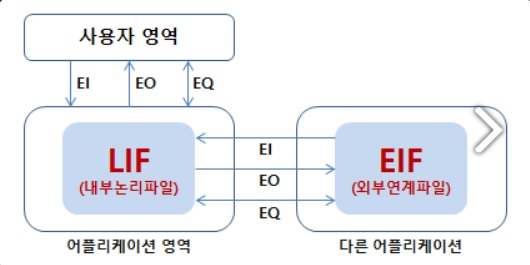
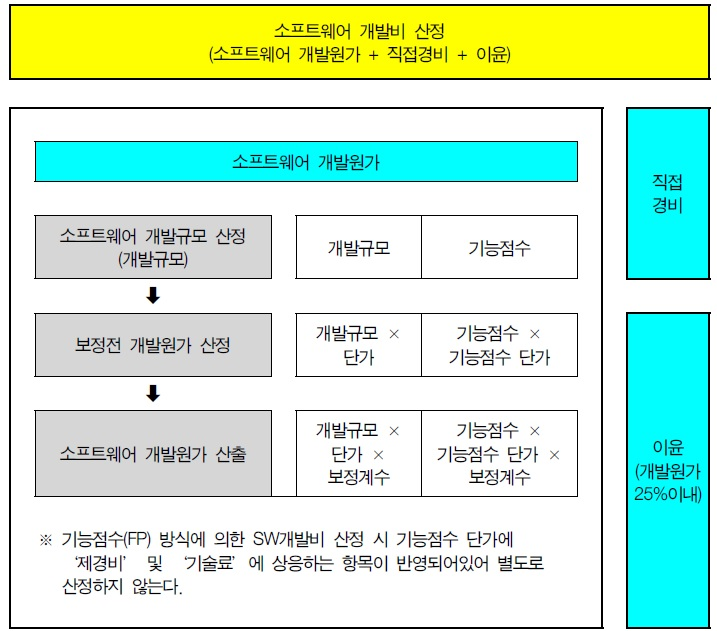

---
title: 기능점수(Function Point) 기본 개념과 산정방식
date: "2023-06-02T00:00:00.000Z"
category: "blog"
description: 소프트웨어 개발 프로젝트의 규모 측정과 개발비 산정의 근거가 되는 기능점수(Function Point)의 기본개념과 산정방식에 대해 설명합니다. 
postauthor: "Anna"
---     
안녕하세요, 이번 블로그에서는 소프트웨어 개발 프로젝트의 규모 측정과 그에 따른 개발비 산정에 근거가 되는 기능점수(Function Point)에 대한 콘텐츠를 이야기하려고 합니다. 기능점수는 소프트웨어 개발비를 산정하는데 있어서 반드시 필요한 개념이기에 알아두는 것이 좋은데요. 한국소프트웨어협회에서 발간한 SW 대가 산정 가이드와 국제표준 기반 기능점수 산정 가이드, 그리고 정보통신산업진흥원에서 제작한 기능점수 동영상 강의를 통해 학습한 내용들을 한데 모아 이해하기 쉽게 정리하려고 해보았습니다. 먼저 기능점수의 정의와 기본적인 개념들부터 알아보도록 하겠습니다.

### **기능점수(Function Point)란?**
SW의 규모를 측정 및 예측하는 기법으로 1979년 미국 IBM의 Allen J. Albrecht에 의해 제안되었고 측정절차는 ISO/IEC 20926 : 2009 국제표준입니다. 기능점수는 최초 SW개발 프로젝트의 규모측정(measurement)을 위해 고안되었으나, 현재는 SW공학적접근을 통한 다양한 방법으로 활용되고 있으며, 그 적용범위는 다음과 같습니다.

1) SW 구매 및 생산성 벤치마킹
2) 어플리케이션 SW 개발 비용 산정
3) 어플리케이션 SW 유지보수 비용 산정
4) SW계약에 관련된 소송
5) IT아웃소싱 계약
6) SW 엔지니어링 프로세스 개선 분석
7) 품질비용 산정
8) 품질측정  

미국에 본부를 둔 IFPUG(International Function Point User Group )에서는 기능점수 분석 매뉴얼 제작 및 배포, 기능점수 관련 사용자그룹과의 교류를 통한 기능점수의 글로벌한 확산을 담당하고 있습니다.

### **기능점수 분석법(Function Point Analysis)이란?**  

기능점수 분석법은 개발자 중심의 물리적 접근 방식에서 벗어나, 사용자 관점(User View)에서 SW 개발규모를 측정하기 위한 표준기법이라는데 그 핵심이 있습니다. LOC(Line of Code) 기반한 COCOMO(Constructive Cost Model) 방식은 개발 소스의 라인을 일일이 카운트하여 SW 규모를 파악한데 반하여, 기능점수 분석법은 사용자의 요구기능(데티어 기능, 트랜잭션 기능)을 논리적으로 식별하여 객관적인 SW 규모를 산정하는데 초점을 두고 있습니다. 일반적으로 기능점수가 높을수록 큰 기능량을 갖고 있어 소프트웨어나 프로젝트의 규모가 크다고 판단할 수 있습니다. 

### **기능점수 분석법의 목적**  

1) **사용자 요구와 제공된 자료를 토대로 기능을 측정**하는데 있다.
2) 시스템 구현에 사용되는 기술적 요구사항에 독립적으로 개발 및 유지보수 **SW의 규모를 측정**하는데 있다.

### **기능점수의 등장배경**  

기능점수의 등장배경으로는 여러 가지 요인이 있지만 일반적으로 세 가지 요인으로 추려볼 수 있습니다.  

**1) 추정의 어려움** - 소프트웨어 개발 초기 프로그램 LOC를 추정하기 어렵다는 요인이 있습니다.

**2) 환경의 영향** - 동일한 기능의 소프트웨어라도 개발언어에 따라 소프트웨어 라인수가 크게 다릅니다.

**3) 파라미터 영향** - 소프트웨어 기능은 동일해도 CS방식, 웹 환경 등에 따른 개발 비용산정이 어렵기 때문입니다.

### **기능점수의 장점**  

| 장 점 | 내 용|
| ---- | --- |
| **사용자 요구사항 기반** | 요구사항으로 기능을 추출하여 기술, 언어, 개발자 능력과 상관없이 일관성 있는 규모 산정 |
| **객관적 요구사항으로 측정** | 개발방법, 개발팀과 무관하므로 소프트웨어 규모 산정의 일관성 유지 |
| **모든 개발단계에서 사용** | 계획 단계뿐 아니라 분석, 설계, 구현 단계에서 사용가능하며 단계가 진행될수록 정확한 점수 산정 가능 |

<표-1> 기능점수의 장점

### **기능점수의 단점**

| 단 점 | 내 용|
| ---- | --- |
| **높은 분석 능력 요구** | 요구사항으로부터 기능을 도출하려면 상당한 분석 능력 요구 |
| **FP 전문가 필요** | 기능점수를 잘 사용할 수 있는 기능점수 전문가 필요 |
| **내부 로직 위주 SW 부적합** | 사용자가 알 수 있는 기능으로 측정하기 때문에 로직 위주의 SW 부적합 |
| **개발규모 측정에만 적합** | 실제 개발 공수를 직접 나타내는 것이 아니라 개발규모 예측에만 적합 |

<표-2> 기능점수의 단점

### **기능점수 구성도**

<figure>
 기능점수 구성도, 이미지 출처 : SW 대가산정 가이드(2022년도 개정판)"/>
<figcaption><그림-1> 기능점수 구성도, 이미지 출처 : SW 대가산정 가이드(2022년도 개정판)</figcaption>
</figure>  

### **기능점수 구성요소**  

기능점수 산정의 기본이 되는 구성요소로는 데이터 기능과 트랜잭션 기능으로 나뉘는데 하단 표의 내부논리파일(ILF), 외부연계파일(EIF), 외부입력(EI), 외부출력(EO), 외부조회(EQ) 정도가 가장 기본적인 개념이라 할 수 있습니다. 데이터 기능점수 산정을 위해서는 데이터 요소 유형을 식별해야 하기에 데이터에 대한 전반적인 지식과 이해도 필요합니다.

| 유 형 | 기 능 | 내 용 |
| ---- | ---- | ---- |
| **데이터 기능** | 내부논리파일(ILF) |경계 내에서 유지되는 데이터 및 제어정보 / 외부입력에 의해 유지, 모든 내부논리파일은 적어도 한 개의 외부입력을 가짐 |
| **데이터 기능** | 외부연계파일(EIF) |어플리케이션 경계 밖에서 유지 데이터로 측정되는 어플리케이션 외부에서 참조하는 데이터 그룹 |
| **트랜잭션 기능** | 외부입력(EI) | 어플리케이션 안으로 들어오는 데이터나 제어정보를 처리하는 단위 프로세스 / 입력, 수정, 삭제 각각 계산 |
| **트랜잭션 기능** | 외부출력(EO)| 외부 출력(보고서 출력), 어플리케이션 경계 밖으로 보냄 / 계산 데이터 생성(자동 채번), 시스템 동작 변경이 일어나는 위치 |
| **트랜잭션 기능** | 외부조회(EQ)| 외부 조회(리스트 조회) 유형, 데이터 가공 없이 입출력 / 파생 데이터 없음, 계산 데이터 생성하지 않음, 수학공식 측정 없음 |

<표-3> 기능점수 구성요소  

| 참조된 파일 | 데이터 요소 유형| 데이터 요소 유형 | 데이터 요소 유형 |
| ---- | ---- | ---- | ---- |
|      | 1~4 DET | 5~15 DET | 16 이상 DET |
| 0~1 RET | 낮음 | 낮음 | 보통 |
| 2 RET | 낮음 | 보통 | 높음 |
| 3 이상 RET | 보통 | 높음 | 높음 |

<표-4> (예시) 데이터 요소 유형 기능점수 테이블  

기능점수 측정을 위해서는 모든 데이터 요소와 파일들에 대해 이해해야 하며, 데이터 기능과 트랜잭션 기능의 점수를 측정하기 위해서는 상단의 예시와 같은 점수표가 매뉴얼에 있으니 이를 참고하여 계산하면 됩니다.  

기능점수의 기본개념들에 대해 알아봤는데요. 기능점수의 프로젝트 규모에 따라 산정방법이 두 가지로 나뉩니다. 프로젝트 범위나 적용시점, 목적의 차이에 따라 정통법과 간이법 중에서 선택해야 합니다. 그럼 산정방법의 분류기준과 세부적인 산정단계에 대해 알아봅시다.

### **기능점수 산정방법 분류**

**1) 정규 기능 점수법(정규법 또는 정통법)** - 설계 단계 이후에 사용하며 기능의 유형별 복잡도를 적용한 기능점수 산정
**2) 간이 기능 점수법(간이법)** - 기획, 발주 단계에서 사용하며 평균 복잡도를 적용하여 기능점수 산정

### **기능점수 산정방법 유형**

| 구 분 | 정규법(정통법) | 간이법 |
| ---- | ---- | ---- |
| **개 념** | 논리적인 설계를 바탕으로 각 기능의 속성을 정의하여 기능별 복잡도 매트릭에 의한 기능점수 산정방식 | 개략적 사용자 요구사항 바탕 기능점수를 도출하여 평균 복잡도에 의한 기능 점수 산정 방식 |
| **적용시점**| 개발요건 및 요건별 상세 설계 정보가 제공되는 시점 / 일반적으로 설계 공정 이후부터 폐기까지 | 개발요건만 정의되면 예산수립, 사업발주, 개발, 운영 및 유지보수, 폐기까지 모든 단계 적용 가능
| **사용목적** | SW 분석/설계, 개발, 유지보수 범위, 일정 및 원가 산정|  예산수립, 제안서 견적 및 계약 SW 사업대가 산정 |
| **측정항목** | 데이터 기능 및 DET, RET 수 도출 / 트랜잭션 기능 및 DET, FTR 식별 | 데이터 기능, 트랜잭션 기능 |
| **복잡도** | 기능별 복잡도 매트릭(Low, Average, High)| 평균 복잡도 |

<표-5> 기능점수 산정방법 유형

### **기능점수 측정절차**  

기능점수는 국제 표준 : ISO/IEC 20926 : 2009를 기준으로 측정됩니다. 측정절차는 총 6단계로 분류되며 각 단계별로 상세히 알아보도록 하겠습니다.  

#### **STEP 1. 가용 문서의 수집**

기능점수 측정을 위해 소프트웨어가 제공하는 기능이나 측정 대상 소프트웨어 프로젝트에 의해 영향을 받는 기능을 설명할 수 있는 문서를 수집합니다. 제안요청서, 제안서, 사업수행계획서 및 개발 과정에서 작성된 산출물 등 개발업무 산정시점에 가용한 모든 문서가 이에 해당합니다.

※ 기능점수 측정을 수행하기 위해 문서를 충분히 확보하거나 문서가 미흡한 경우에는 부족한 분야의 정보를 채워 줄 해당 전문가(SME: Subject Matter Expert)를 반드시 확보해야 합니다.

#### **STEP 2. 측정범위 및 경계의 정의와 사용자 기능 요구사항의 식별**

각 어플리케이션의 측정범위와 경계를 결정하고 사용자 기능 요구사항의 식별을 위해 다음 활동을 수행합니다.
1) 측정목적의 식별
2) 측정유형의 식별 – 측정목적에 따라 개발 프로젝트/개선프로젝트/어플리케이션 기능점수 측정
3) 측정목적과 유형에 따른 측정범위의 결정
4) 기술 고려사항이 아닌 사용자관점에서 측정범위 내 각 어플리케이션의 경계 설정
5) 사용자 요구사항 중 기능 요구사항을 식별

※ 참고 - 사용자요구사항 : 기능 요구사항 + 비 기능 요구사항 (비 기능 요구사항은 기능점수에 제외)

| 구 분 | 종 류 | 내 용 |
| ---- | ---- | ---- |
| 측정 범위와 어플리케이션 경계 식별 | 범위 결정 | 규모 계산 대상 SW의 하위 구성요소를 정의 / 기능점수 계산 목적에 따른 필요 기능을 식별 |
| 측정 범위와 어플리케이션 경계 식별 | 경계 분류 | 내부 어플리케이션과 외부 사용자 세계 간의 개념적 인터페이스 / 어플리케이션에 의해 유지되는 논리 데이터를 둘러싸고 있음 |

<표-6> 특정 범위 및 경계 식별

#### **STEP 3. 데이터 기능 측정**

데이터를 저장하고 참조하는 사용자 기능 요구사항을 충족시키는 기능을 말하며, 데이터 기능을 측정하려면 다음의 활동을 수행해야 합니다.

1) 모든 논리 데이터의 기능 식별 및 그룹화
2) 각 데이터 기능을 내부논리파일(ILF) 또는 외부연계파일(EIF)로 분류
3) 각 데이터 기능에 대한 데이터요소유형(DET)를 측정
4) 각 데이터 기능에 대한 레코드요소유형(RET)를 측정
5) 각 데이터 기능에 대한 기능 복잡도를 결정
6) 각 데이터 기능에 대한 기능규모를 결정

#### **STEP 4. 트랜잭션 기능 측정**

데이터를 처리하는 사용자 기능 요구사항들을 충족시키는 기능을 말하며, 트랜잭션 기능을 측정하려면 다음 활동을 수행해야 합니다. 

1) 사용자가 요구하는 각 단위프로세스를 식별
2) 단위프로세스를 각 트랜잭션 기능 EI(외부입력), EO(외부출력), EQ(외부조회)로 분류
3) 각 트랜잭션 기능에 대해 참조파일유형(FTR)을 측정
4) 각 트랜잭션 기능에 대해 데이터요소유형(DET)를 측정
5) 각 트랜잭션 기능에 대해 기능의 복잡도를 결정
6) 각 트랜잭션 기능에 대해 기능규모를 결정

* FTR : 참조파일 유형
* DET : 데이터요소유형

#### **STEP 5. 기능규모 계산**

기능규모의 계산을 위해 측정의 목적과 범위를 고려하여 계산합니다. 

1) 개발 프로젝트의 기능규모: DFP(개발 프로젝트 기능점수) = ADD + CFP 
2) 개발 프로젝트 종료 후 어플리케이션 기능규모: AFP = ADD
3) 개선 프로젝트의 기능규모: EFP(개선 프로젝트 기능점수) = ADD + CHGA + CFP + DEL
4) 개선 프로젝트 후의 어플리케이션 기능규모: AFPA = (AFPB + ADD + CHGA) - (CHGB + DEL)

※ 약어 및 공식
* 기능 점수 = 기능 수(FC) X 기술적 복잡도(TC)
* 총 영향도 = TCF(0~14) X 영향도(0~5)
* 기술적 복잡도(TC, Technical Complexity) = 0.65 + 0.01 X  총 영향도
* DFP : 개발 프로젝트 기능 점수
* UFP : 데이터의 컨버전에 의해 포함되는 기능 점수
* CFP : 변환 기능에 대한 미조정 기능 점수
* VAF : 개발 프로젝트에 대한 조정인자
* ADD : 개선 프로젝트에 의해 추가된 기능들의 미조정된 기능 점수
* EFP : 개선 프로젝트 기능점수
* CHGA: 개선 프로젝트에 의해 수정된 기능들의 미조정된 기능 점수
* CFP: 데이터의 컨버전에 의해 포함된 기능 점수
* VAFA: 개선 프로젝트 이후의 애플리케이션의 값 조정 인자
* DEL: 개선 프로젝트에 의해 삭제된 기능의 미조정된 기능 점수
* VAFB: 개선 프로젝트 이전의 애플리케이션의 값 조정 인자
* RET(Record Element Type) ≒ 테이블 수
* DET(Data Element Type) ≒ 고유 필드 수
* FTR(File Type Reference) ≒ 연계되는 테이블 수

#### **STEP 6. 기능점수 측정 문서화 및 보고**  

**1) 문서화 내용** - 측정목적과 유형, 측정범위와 경계, 측정일자, 데이터 기능 및 트랜잭션 기능 리스트, 복잡도가 포함된 측정결과,가정사항과 측정 이슈 등을 포함

**2) 측정결과보고** - 어떤 표준을 준수하여 측정했는지를 알 수 있게 하기위해 형식에 맞춰 보고

※ 표준형식: S FP (IFPUG–IS) 예) 250 FP (IFPUG-ISO/IEC 20926:2009)

### **기능점수에 의한 대가기준 산정 절차**

| 단계 | 주요내용 | 산출물 |
| ---- | ---- | ---- |
| **1. 사전준비** | 개발 대상 업무와 요구사항을 명확히 정의하고, 개발규모(기능점수) 산정법(정통법 or 간이법)을 결정한다. | 개발대상 업무 / 기능 요구사항 / 규모산정 방법
| **2. 개발 대상 SW 기능점수 산정** | 요구사항에 근거하여 개발 대상 소프트웨어의 기능을 식별하고, 복잡도를 고려하여 기능점수를 산정한다. | 개발대상 / SW / 기능점수 |
| **3. 보정전 개발원가 산정** | 산정된 기능점수에 기능점수당 단가를 곱하여 보정 전 개발원가를 산정한다.(보정 전 개발원가 = 기능점수 X 기능점수당 단가) | 보정전 개발원가 |
| **4. 보정후 개발원가 산정** | 소프트웨어 사업특성을 고려하여 보정요소 별로 보정계수를 식별한다.(보정요소 : 규모보정, 언어보정, 어플리케이션 유형보정, 품질 및 특성 보정)| 보정후 개발원가 |
| **5. 직접경비 및 이윤산정** | 해당 소프트웨어 개발에 관련된 직접경비를 산정한다. 이윤은 개발원가의 25% 이내에서 산정한다. | 직접경비 이윤 |
| **6. 소프트웨어 개발비 산정** | 소프트웨어 개발비를 산정한다.(SW 개발비 = 개발원가 + 직접경비 + 이윤) | 소프트웨어 개발비 |

<표-7> 기능점수에 의한 대가산정 단계

<figure>
 기능점수에 의한 소프트웨어 개발비 산정 참고 이미지, 이미지 출처 : SW 대가산정 가이드(2022년도 개정판)"/>
<figcaption><그림-2> 기능점수에 의한 소프트웨어 개발비 산정 참고 이미지, 이미지 출처 : SW 대가산정 가이드(2022년도 개정판) </figcaption>
</figure>  

### **기능점수 산정 예외사항**  

대부분의 소프트웨어 개발비는 오늘 알아본 기능점수에 의한 산정방법을 원칙으로 하고 있으나, 다음과 같은 사업 유형에 대해서는 예외적으로 투입공수방식을 적용하여 산정할 수 있습니다.

(1) 홈페이지 디자인, 웹 접근성 개선, 동영상 등 콘텐츠 관련 정보화사업

(2) R&D 성격의 소프트웨어개발 사업

(3) 사용자 식별 기능규모에 비해 내부처리 복잡도가 현저히 높아 기능점수 방식의 대가체계 적용이 어렵다고 인정되는 소프트웨어개발 사업

(4) 데이터 튜닝 및 최적화, 테스트 등 기능점수로 산정이 불가능한 경우

(5) 소프트웨어개발 관련 예산이 5천만 원 미만인 사업  

#### **참고문헌 및 링크**  
- 한국소프트웨어산업진흥원, https://www.software.or.kr
- 정보통신진흥원(NIPA), 기능점수 동영상 교육 1편~15편 https://www.youtube.com/watch?v=qpQJXpm0rrU
- 한국소프트웨어산업협회, SW대가산정 가이드(2022년 개정판) https://www.sw.or.kr/site/sw/main.do  
- 국제표준 기반 기능점수 산정 가이드(2014년  개정판)
- 한국소프트웨어측정원(KOSMA), FAST Function Points(영문)  https://www.kfpug.or.kr/