안녕하세요, JUSTA입니다.  
이번에 한국언론진흥재단 프로젝트를 했던 인연으로 데이터저널리즘코리아에서 진행하는 5월 세미나에 강사로 발표를 하였답니다.
<figure>
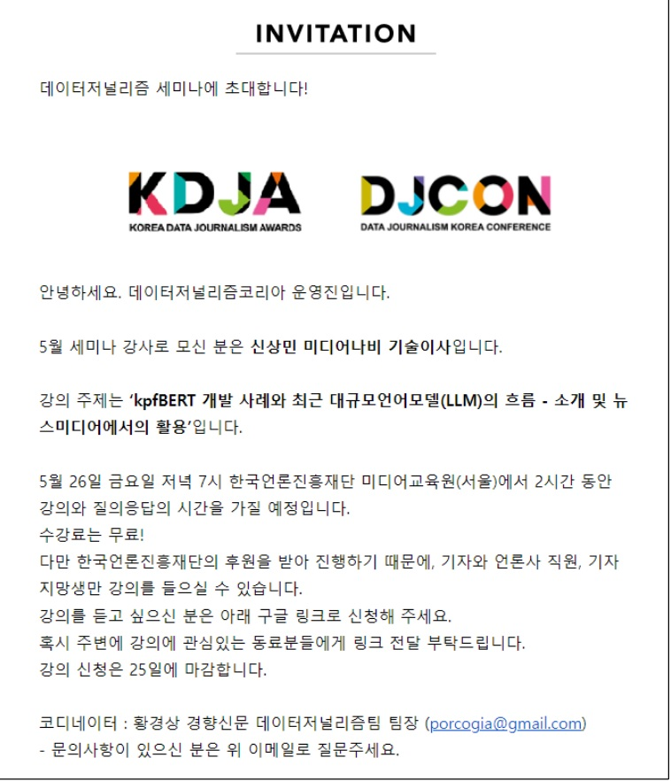 데이터저널리즘코리아 세미나 초대장 앞면, 이미지 출처 : 데이터저널리즘코리아 운영진"/>
<figcaption><그림-1> 데이터저널리즘코리아 세미나 초대장 앞면, 이미지 출처 : 데이터저널리즘코리아 운영진</figcaption>
</figure>  
<figure>
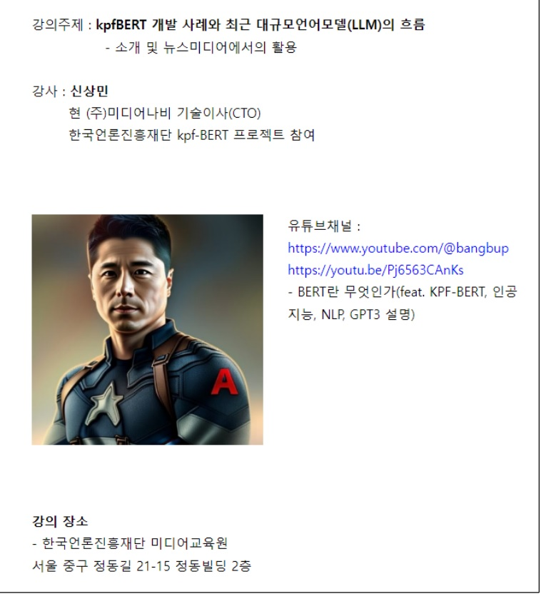 데이터저널리즘코리아 세미나 초대장 뒷면, 이미지 출처 : 데이터저널리즘코리아 운영진"/>
<figcaption><그림-2> 데이터저널리즘코리아 세미나 초대장 뒷면, 이미지 출처 : 데이터저널리즘코리아 운영진</figcaption>
</figure>  

발표내용은 한국언론진흥재단이 만든 kpf-BERT 관련 비하인드 스토리와 응용 서비스 개발이지만 아시다시피 요즘 자연어처리에서는 ChatGPT가 모두 집어 삼킨 상황이잖아요?  
그래서 실제로 발표의 초점은 GPT와 대규모언어모델(LLM)의 흐름과 전망으로 잡아보았습니다.

우리 블로그에도 발 표내용을 대략적으로 정리하는 글을 써보려 하니 모쪼록 도움이 되었으면 좋겠습니다.

참고로 그사이에도 많은 기술들이 발표되고 있네요.
관련해서 신기술들 계속 따라갈 수 있게 자주 발행할 수 있도록 하겠습니다.

### **1. 한국언론진흥재단 kpf-BERT 복습**  

**1) kpf-BERT 제작**
<figure>
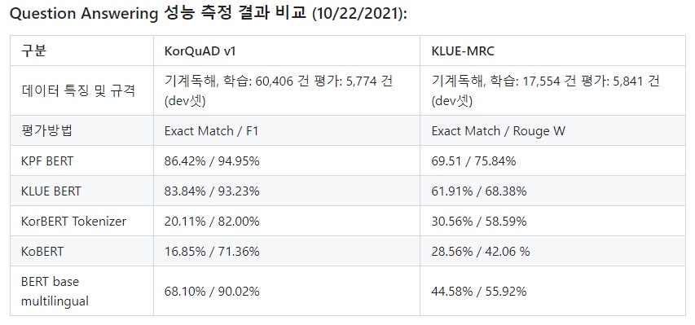 kpf-BERT 성능 측정 결과 비교표, 이미지 출처 : 한국언론진흥재단"/>
<figcaption><그림-3> kpf-BERT 성능 측정 결과 비교표, 이미지 출처 : 한국언론진흥재단</figcaption>
</figure>  

이런 성능 좋은 BERT를 한국언론진흥재단에서 만들었었죠.
그 당시 최신의 기술(Distilbert 등)이 가미되고, 정제된 신문기사 데이터가 학습되어 좀 더 좋은 성능이 나왔을 것으로 생각됩니다.

관심 있으시면 아래 링크로…  
<https://github.com/KPFBERT/kpfbert> 깃헙 모델저장 링크  
<https://youtu.be/Pj6563CAnKs> BERT란 무엇인가  

**2) 응용 서비스 예제**
응용 서비스에 활용할 수 있는 예제소스도 아래와 같이 공개되어 있습니다.  
<https://github.com/KPFBERT/kpfSBERT> 문장임베딩 BERT  
<https://github.com/KPFBERT/kpfSBERT_Clustering>   클러스터링  
<https://github.com/KPFBERT/kpfbertsum> 텍스트 요약 예제

여기까지가 벌써 2년 전 일이네요.
요즘 인공지능의 발전속도는 자고 일어나면 세상이 변해있는 수준이죠.  
2년 전이면… 이제는 유물이 된 것 같은 느낌이네요.

서론에 말씀드린 것처럼 요즘 대세는 ChatGPT이죠. 그래서 이제 GPT, LLM, 그 틈새 기술과 전망에 대해 이야기 해보죠.
<figure>
 kpf-BERT 토닥토닥..., 이미지 출처 : https://m.animalplanet.co.kr/contents/?artNo=8657"/>
<figcaption> <그림-4> kpf-BERT 토닥토닥, 이미지 출처 : https://m.animalplanet.co.kr/contents/?artNo=8657</figcaption>
</figure>

### **2. LLM - ChatGPT 공주와 일곱 난쟁이들**

<figure>
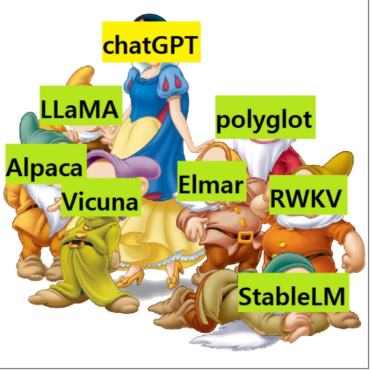 ChatGPT 공주와 일곱 난쟁이들, 이미지 출처 : 디즈니 애니메이션 백설공주와 일곱 난쟁이 중 편집"/>
<figcaption> <그림-5> ChartGPT 백설공주와 일곱난쟁이들, 이미지 출처 : 디즈니 애니메이션 "백설공주와 일곱 난쟁이" 중 편집</figcaption>
</figure>  

자, 요즘 대규모언어모델의 분위기를 어떻게 표현해 볼 수 있을까 하다가 선택한 그림입니다. 백설공주와 일곱 난쟁이들.
딱 맞는 상황은 아니겠지만, 어쨌든 ChatGPT가 1-TOP으로 시장을 평정했고, 그 와중에 소규모 로컬 LLM들이 우후죽순 생겨나고 있지요.  

아래 막대 그래프는 최근에 나와있는 로컬 LLM 모델들을 비교해 놓았길래, 어떤 모델들이 있는지 보기 편해서 가져와 봤습니다. 7개가 훨씬 넘네요.ㅎㅎ

<figure>
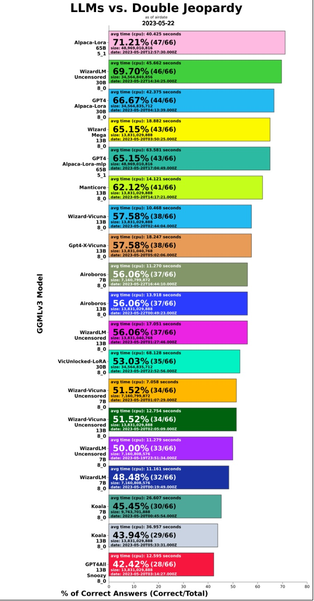 LLMs vs. Double Jeopardy, 이미지 출처 : https://www.reddit.com/r/LocalLLaMA/comments/13hd8dt/llm_double_jeopardy_testing_with_new_models/"/>
<figcaption><그림-6> LLMs vs. Double Jeopardy, 이미지 출처 : https://www.reddit.com/r/LocalLLaMA/comments/13hd8dt/llm_double_jeopardy_testing_with_new_models/</figcaption>
</figure>  

그럼 왜 갑자기 언어모델이 인공지능 판에서 메인이 되었을까요?

**1) AI와 NLP, 그리고 AGI**  

최초에 인공지능은 인간과 동등한 수준의 일반인공지능(AGI, Artficial General Intelligence, 강인공지능이라고 불리기도 함)의 구현이 목표였으나, 과거의 기술과 장비로는 불가능함을 깨닫고 각각의 소분류별 쓰임에 따라 발전해오고 있었죠.

비전이나 음성처럼 언어도 NLP(자연어처리)라는 한 분야로서 시작했는데, 성능이 발전할수록, 지금의 ChatGPT에 이르러서는 그 자체로 AGI의 가능성을 보이는 겁니다.

언어를 깊게 이해하면 그 자체가 지능이 될 수 있는것 아닌가하는 가능성을 보여주는 수준에 이른 것이지요.

**2) LLM의 눈부신 발전 - 클수록 좋다!**  

LLM(Large Language Model)은 말 그대로 거대언어모델입니다.
거대한 사이즈와 거대한 학습량을 기반으로 큰 성능향상을 이룬면서 생긴 트랜드이지요.

GPT3를 기점으로 모델 사이즈가 크면 클수록 좋은 성능이 나온다는 흐름이 있었습니다.

이후 학습데이터의 양이 많을수록 좋은 성능이 나온다는 주장도 생겼죠.

하단의 참고 이미지를 보시면 거대한 사이즈의 전쟁이 벌어진 것을 알 수 있습니다.

<figure>
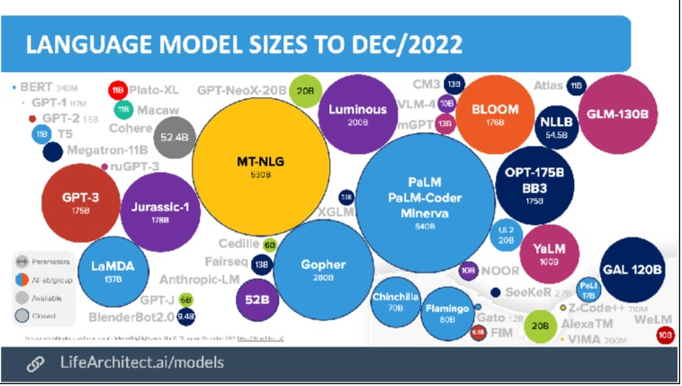 LANGUAGE MODEL SIZES TO DEC/2022, 이미지 출처 : https://www.reddit.com/r/mlscaling/comments/wizfmm/language_model_sizes_to_aug2022/"/>
<figcaption><그림-7> LANGUAGE MODEL SIZES TO DEC/2022, 이미지 출처 : https://www.reddit.com/r/mlscaling/comments/wizfmm/language_model_sizes_to_aug2022/</figcaption>
</figure>  

하지만 크다고 무조건 성능이 좋다는 것은 아닌 것으로 밝혀지며 지각변동이 생깁니다.  

OpenAI가 잘 정제된 데이터에 인간의 피드백을 추가해 학습한 ChatGPT라는 월등한 성능의 모델을 내 놓게 되면서 크기경쟁은 일단락 되는데요.  

다들 잘 알고 계시리라 생각되어 일단 ChatGPT의 설명은 생략하겠습니다.  

하지만 ChatGPT의 등장은 새로운 언어모델 학습의 길을 만들어주게 됩니다.  

바로 로컬 LLM의 등장을 가속화하는 계기가 된 것입니다.  

**3) sLLM의 반격 - 작은 것도 충분히 좋다!**  

sLLM(Small Large Language Model)이라는 모순적인 용어로도 불리는 로컬LLM모델은 아이러니하게 ChatGPT 덕분에 저렴하게 고성능으로 학습할 수 있게 되었습니다. 바로 ChatGPT에 질문과 답변을 받아내어 학습데이터로 사용하는 것이지요.  

이로써 ChatGPT 학습에 사용된 데이터 가공 비용에 비하면 거의 공짜나 다름없는 비용으로 아주 양질의 학습데이터를 방대하게 만들어 쓸 수 있게 된 것이죠.  

<figure>
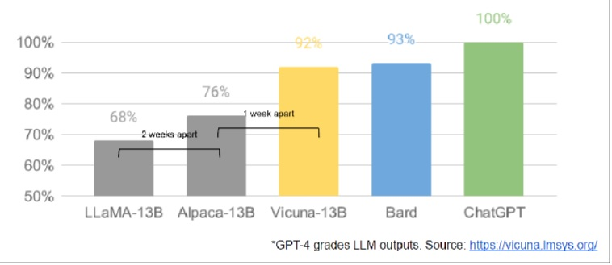 GPT-4 grades LLM output, 이미지 출처 : https://vicuna.lmsys.org/"/>
<figcaption><그림-8> GPT-4 grades LLM output, 이미지 출처 : https://vicuna.lmsys.org/</figcaption>
</figure>  

위 표를 보면 성능비교의 기준점이 ChatGPT가 되어버렸네요. 너도 나도 모델을 내놓을 때 "ChatGPT 보다 뛰어나다" 또는 "몇% 성능이다" 라고 하는 세상입니다.

로컬LLM이 ChatGPT 대비 성능이 잘 나오는 이유 중엔 ChatGPT가 생성한 데이터를 쓴 영향도 존재하는 것이죠.

물론 성능은 ChatGPT가 여전히 압도적으로 좋습니다만, 로컬모델도 나름대로의 필요성에 의해 만들어지고 있습니다.

앞에서 ChatGPT 공주와 일곱 난쟁이 중에 첫째 난쟁이로 LLaMA를 꼽았습니다.

META(구 페이스북)에서 개발하여 공개(?)당한 로컬LLM모델입니다.

META는 이것을 오픈소스로 공개하기는 했는데, 학술목적으로 waitlist 신청을 받아서 순차적으로 조금씩 공개하고 있었습니다.  

그런데, 어떤 유저가 이 모델을 받아서 토랜트로 풀어버립니다.

이로써 강제공개(?)...  
※ 하지만 META는 OpenAI(라 쓰고 ClosedAI라고 읽는다!)보다 훨씬 OPEN된 마인드로 기술들을 공개하고 있으니 많이 칭찬해 주세요~

이때부터 sLLM의 꽃이 피기 시작했다고 할 만한 상황으로 발전하였고, 제가 난장이 중 첫 번째의 영광을 주었습니다.^^

여기에 채팅식 문답가공 파인튜닝과 인스트럭션 튜닝을 거친 Alpaca나 Vicuna 등의 모델들이 나오며 sLLM모델의 기술과 기법들이 빠르게 발전하였습니다.

### **3. 로컬 LLM 모델의 가능성과 활용**  

그러면 강력한 성능의 ChatGPT를 API로 이용하면 될텐데, 왜 로컬언어모델을 쓸까요?

ChatGPT의 일반적인 강력한 성능은 너무나 좋지만 모든경우에 적용하기는 부적절한 경우가 존재합니다.

의료나 법률처럼 일반적인 지식은 필요없고, 특수한 도메인에 국한된 서비스만 필요하다면 ChatGPT는 너무 거대할 수도 있죠.

마치 아래 이미지와 같이 닭 잡는데 소 잡는 칼을 쓰는 것처럼요.

<figure>
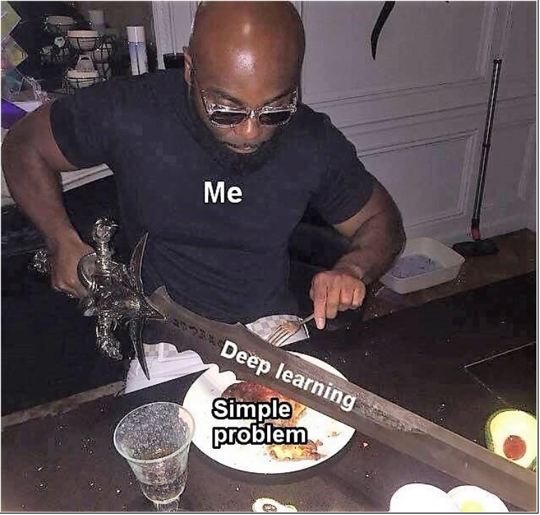 닭 잡는데 소 잡는 칼을 쓰는 꼴을 설명하는 이미지, 이미지 출처 : https://twitter.com/dev_humor/status/1081973719801712640"/>
<figcaption><그림-9> 이미지 출처 : https://twitter.com/dev_humor/status/1081973719801712640/</figcaption>
</figure>

가령 어떤 기업이 내부의 기밀자료를 파인튜닝 시켜서 업무에 활용하고 싶다고 하면, ChatGPT에게 그 자료를 학습시켜서 이용하기는 부담스러울 겁니다. 회사 내부망에서만 접근 가능한 로컬LLM모델을 활용하여 구현하는게 자연스럽죠.  

꼭 보안자료가 아니라도 사용량만큼 과금되는 ChatGPT API를 이용하여 서비스를 했을때 그 사용량이 아주 많아진다면 비용상의 문제로도 자신들의 서비스 내에 직접 로컬LLM모델을 사용할 수 밖에 없을 겁니다.  

또한 개인이 개인적으로 모델을 파인튜닝하여 사용하고 싶을때도 로컬LLM을 쓰게 될 것이구요.

자꾸 학습, 또는 파인튜닝 이야기가 나와서 요즘 LLM에서 학습이 진행되는 단계에 대해 잠깐 언급해 보도록 할게요.  

단계별로 나눠본다면 총 4단계로 나눌 수 있을 것 같아요.  

| 분 류 | 단 계 | 상세 설명 |
| ---- | --- | --- |
| 1단계 | 사전학습(pretrain) | 가능한 많은 데이터를 집어 넣어서 언어를 이해시키는 단계 |
| 2단계 | DAPT(Domain Adaptive PreTraining) | 활용하고자 하는 도메인에 한정된 데이터를 추가로 학습시켜 해당도메인에 대한 성능을 향상시키는 단계 |
| 3단계 | TAPT(Task Adaptive PreTraining) | 도메인 내에서도 실제로 하고자 하는 테스크에 맞춘 데이터셋으로 파인튜닝하는 단계 |  
| 4단계 | 미세파인튜닝(personalize) | LORA 같은 추가 튜닝모델을 덧붙여서 개별화 또는 특화시키는 파인튜닝 기법 |  

<표-1> LLM에서 학습의 진행단계별 분류

<figure>
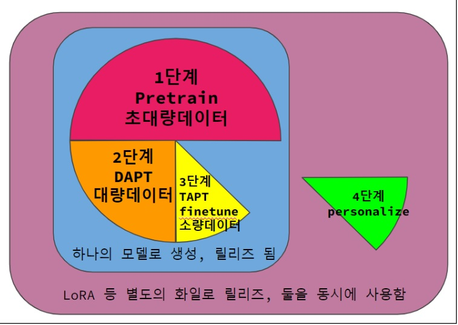 LLM에서 학습 진행단계별 분류 설명 이미지, 이미지 출처 : JUSTA 제작"/>
<figcaption><그림-10> LLM에서 학습 진행단계별 분류 설명 이미지, 이미지 출처 : JUSTA 작성</figcaption>
</figure>

정형화된 건 아니지만 이런 단계를 거쳐서 서비스에 활용하게 될 것입니다.

그리고 LLM의 종착역은 맞춤형 인공지능 개인비서가 아닐까 합니다.

인공지능 개인비서 하니 가장 먼저 떠오르는 것은 영화 "아이언맨"의 자비스가 아닐까 싶네요.

<figure>
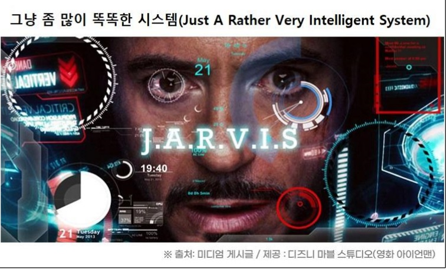 그냥 좀 많이 똑똑한 시스템(Just A Rather Very Intelligent System), 이미지 출처 : 미디엄 게시글/디즈니 마블 스튜디오(영화 아이언맨)"/>
<figcaption><그림-11>그냥 좀 많이 똑똑한 시스템(Just A Rather Very Intelligent System), 이미지 출처 : 미디엄 게시글/디즈니 마블 스튜디오(영화 "아이언맨")</figcaption>
</figure>  

자비스의 어원을 알고 계셨나요? 전 이번에 알아서 좀 충격이었네요.ㅎㅎ  

궁극적으로 LLM이 개인비서 형태의 서비스로 발전하게 되면 아무래도 로컬 디바이스에 설치된 로컬서비스 형태로 구현될 것입니다.

영화 "HER" 처럼요.

<figure>
 이미지 출처 : 영화 <HER> 장면 중 편집"/>
<figcaption><그림-12> 이미지 출처 : 영화 "HER" 장면 중 편집</figcaption>
</figure>

### **4. ChatGPT API를 이용한 서비스 모델**

**1) gpt-turbo-3.5, gpt-4 API 사용법**

<figure>
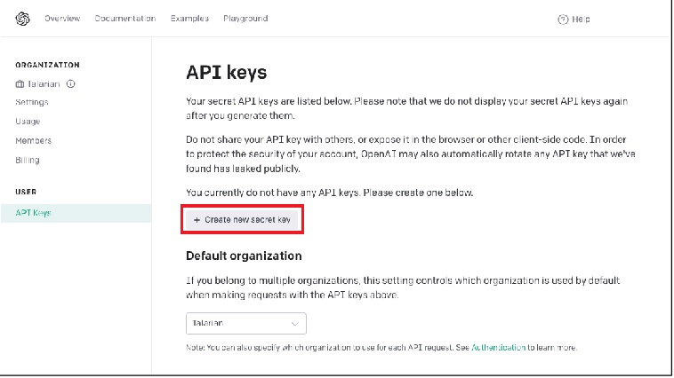 gpt-turbo-3.5, gpt-4 API 사용법, 이미지 출처 : 
https://platform.openai.com/ 스크린샷"/>
</figure>
<figure>
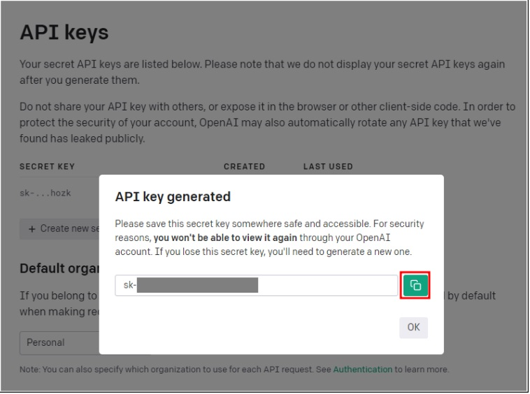 gpt-turbo-3.5, gpt-4 API 사용법, 이미지 출처 : 
https://platform.openai.com/ 스크린샷"/>
</figure>  

<https://platform.openai.com/> 이 링크로 들어가셔서 회원가입하고 API 발급받으시면 됩니다.
- 콘솔에서 openai 패키지 설치하여 사용

-> pip install openai  

* API 사용한 간단한 예시코드
</figure>
<figure>
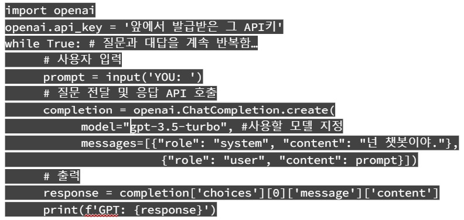 API 사용한 간단한 예시코드, 이미지 출처 : JUSTA 작성"/>
<figcaption><그림-15> API 사용한 간단한 예시코드, 출처 : JUSTA 작성 </figcaption>
</figure>

**2) API를 이용한 응용서비스**

1. PDF화일을 분석요약하고 질문에 대답  
<https://www.chatpdf.com/>
2. Excel화일을 분석요약하고 질문에 대답  
<https://chatexcel.com/en>
3. chatGPT동화생성 - 미드저니 삽화생성 - ebook제작툴  
<https://www.youtube.com/watch?v=-79WCOE4Q28>
4. chatGPT로 영어공부  
<https://www.youtube.com/watch?v=HLxlKtEAL5U>
5. chatGPT를 이용한 NPC 캐릭터 및 자유대화 모델  
<https://www.youtube.com/watch?v=UVNZ3_FwqJE>
<https://youtu.be/U4W2rGH9oWs>  ChatGPT NPC coaches me talking to people at a party in VR  

이상 세미나 내용 중 언론 분야에 특화된 내용을 제외한 부분을 정리해 보았습니다.  

인공지능 분야는 다 그렇지만, 특히 LLM은 요즘 하루가 다르게 기술이 발전하고 있습니다. 작년에 Stable Diffusion이 엄청 핫했던 것처럼요.  

이 글을 정리하는 중에도 LLM의 할루시네이션을 줄이는 방법이나 개별 레이어의 파라미터값이 의미하는 바를 추적하여 개별튜닝이 가능한 기법 등 신기술들이 튀어나오고 있습니다.  

틈나는대로 시리즈 같은 느낌적 느낌으로 후속 글을 계속 작성해 보겠습니다.  

감사합니다.