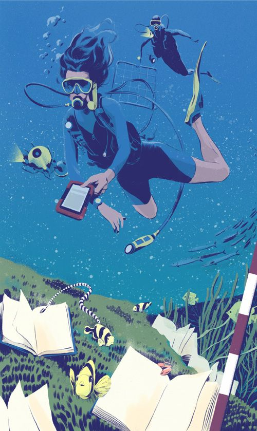

---
title: 서비스 기획자의 성장을 돕는 역량 강화 팁; 성공을 이끄는 비밀 노하우
date: "2023-08-31T00:00:00.000Z"
category: "blog"
description: 예비 기획자와 현업에서 활동하는 서비스 기획자의 역량 강화에 도움이 되는 실전 팁과 성장하기 위해 필요한 비밀 노하우에 대해 이야기합니다. 
postauthor: "Anna"
---     
안녕하세요, 안나입니다. 지난 7월 중순, 한국산학연협회에서 주최한 기획역량강화 강의를 수강한 바 있는데요. <조직과 나의 수입을 3배 이상 키우는 '3시간 기획법'>이라는 강의의 제목이 가장 먼저 눈길을 끈 것도 있지만, 수강해보니 현업에 계시는 서비스 기획자나, 예비 기획자 모두에게 꽤 도움이 될만한 내용인 것 같아 이번 콘텐츠를 구상해봤습니다.  

### **조직 내 기획 업무란?**

하나의 일련된 과정이 어떤 분야든 유사한 기획 업무는 조직 내에서 일반적으로 다음과 같은 업무들을 일컫습니다.

**1) 전략 기획**  
사업부별 실적을 평가하고, 사업 성장을 위해 비전과 전략을 수립하고 여러 경영 자원을 전략에 맞춰 분배, 관리하는 업무

**2) 사업 기획**  
사업부 혹은 사업 아이템의 경쟁력 강화를 위한 단기, 장기적 방안을 수립하고 이를 실행, 모니터링하는 업무

**3) 상품 기획**  
고객의 수요나 변화하는 니즈에 맞춰 새로운 제품을 구상하고 이를 현실화 해내거나, 기존 제품을 개선해나가는 작업을 하는 업무

**4) 부서별 기획**  
부서 단위에서 현재 실적과 미래 목표/ 방향성 사이의 연결성을 만들고, 이를 실행하기 위한 체계와 시스템을 만들고 관리하는 영업 / 마케팅 / R&D / 개발 / 생산 등 업무  

조금씩 다른 업무 같아보이지만, 간단히 말해 기획 업무란

* 현황을 분석하고,
* 목표와 방향을 수립하고,
* 실행 방안을 세우고,
* 필요한 경영 자원을 투입하고,
* 실행과정을 통제, 모니터링하는 역할입니다.  

실제로 가장 중요하게 여겨지는 기획서 작성과 같은 문서 작성은 위 업무들을 위해 필요한 세부 업무 중 한 부분이고요.

### **기획자가 지녀야 할 역량은?**

<figure>
 기획자 일러스트 이미지, 이미지 출처 : 핀터레스트"/>
<figcaption></figcaption>
</figure>  

기획자에게는 분석력, 창의력, 예측력 등 하나의 전문성이 아닌 다양한 종류의 역량이 요구됩니다. 그중 기획력은 기획자의 기본 역량입니다. 기획력을 기르기 위해서는 수많은 관련 서적 속에서 방법을 찾을 수 있습니다. 기획자가 여러 방면의 서적을 딥 다이브(Deep Dive)해야 하는 이유입니다.  

이중에서도 서비스 기획자의 핵심 역량 중 첫 번째는 호기심입니다. 매사에 호기심을 갖고 문제를 찾아내어 상황을 파악하는 것입니다. 끊임없이 질문하고 궁금해하는 자신의 모습을 두려워 말고 수없이 시도해야 합니다.  

두 번째로는 문제를 정의하여 목표의 본질을 잊지 않고 실행하는 실행력을 가져야 합니다. 명확한 목표와 본질을 잊지 않고 프로젝트를 수행해나가야 나아하고자 하는 우리의 방향성을 잃지 않을 수 있습니다.  

사업목적과 목표를 달성하기 위해 기획 내용을 구체화하는 능력도 요구됩니다. 무엇을 어떻게 변화시켜야 이 문제가 해결되는지 곰곰히 따져봐야 합니다. 서비스 기획자는 서비스의 세부적인 부분뿐 아니라 전체적인 흐름을 파악하여 아이디어를 구체화할 수 있어야 합니다. 나무가 아닌 숲을 바라보는 능력이 있어야 하는 것이죠. 넓은 시야를 가지고 컨셉을 도출해내야 하는데 전체적인 서비스의 흐름(동종업계 트렌드 조사, 시장구조 및 경쟁업체 현황, 벤치마킹 등)을 조사 분석 후 하나의 컨셉을 명확히 이끌어내야 합니다.  

마지막으로 다양한 이해관계자를 설득하기 위해 논리적으로 분석한 자료가 뒷받침되어야 하기에 문서작성 능력이 요구됩니다. 마음을 움직이고, 변화를 유도하며, 결정권자나  이해관계자에게 우리가 왜, 그리고 어떻게 변화해야 하는지 설득할 수 있어야 합니다. 또한, 실제 서비스를 이용할 사용자들에게도 새로 출시된 우리의 서비스 또는 변화된 서비스를 잘 이용할 수 있도록 유도하는 등 설득을 이끌어내야 합니다. 내가 계획한 기획의 단계들이 제대로 실행되고 있는지 틈틈이 확인하고 점검하는 것도 중요합니다. 문제가 없는지 지속적으로 자가검증해야 하며, 수정, 보완, 업데이트 작업까지 아우르는 전 단계를 책임질 수 있어야 합니다.  

이론적으로는 우리도 다 아는 내용이고 말은 너무나도 쉽죠. 그런데 나무가 아닌 숲을 바라볼 수 있는 넓은 시야와 훌륭한 안목, 창의력, 논리력, 문서화 역량 등은 어떻게 키울 수 있을까요? 세스 고딘(마케팅 전략가, 작가)이 말하길, **기획을 잘하려면 기획을 끊임없이 반복적으로 하는 방법밖에 없다**고 합니다. 그러나 이 매일의 반복에는 방법과 방향성이 잘 잡혀야겠죠? 어떤 방향성과 방법으로 반복해야만 우리가 기획 역량을 키울 수 있는지 제가 얼마 전 수강했던 기획역량강화를 위한 강의내용에 대해 살펴봅시다.

### **조직과 나의 수입을 3배 이상 키우는 '3시간 기획법'**  

이번 강의를 주최한 사단법인 한국산학연협회는 전국각지의 대학과 연구기관 회원을 중심으로 1993년 창립 이래 산학연간의 상호협력과 교류를 통하여 중소기업 기술혁신 및 국가 경쟁력 강화에 이바지 해오고 있는 기관입니다. 그중에서도 R&D 기획역량강화교육 프로그램 중 하나인 ‘3시간 기획법’을 선택, 수강하게 되었는데요. 유료강의였던만큼 퀄리티가 일정 수준 이상이었으며, 저작권 문제로 강의자료는 공개할 수 없지만 강의순서에 따른 요약 및 후기를 자세히 풀어보도록 하겠습니다. 

**1) 반드시 기획자가 되어야 하는 이유**  
대부분의 기업은 늘 자원이 부족합니다. 우리 기업도 다를 바 없이 가진 자원을 활용하여 기획을 해야하는데 매 프로젝트마다 부족함을 느끼는 현실이지요. 서로의 다른 직군이 처한 상황에서 가진 본질적인 문제도 각기 다릅니다. 이 문제를 해결할 수 있는 유일한 방법은 기획력에 있습니다. 반드시 기획자가 되어야 하는 이유는 여기에 있습니다. 다른 모든 일들을 더 쉽게 그리고 필요없게 만들 단 하나의 일이 바로 ‘기획’ 업무입니다.

**2) 나만 몰랐던 기획방법론**  
방법론이란 시행착오의 결과에 노하우가 들어가는 것을 말합니다. 나만의 방법론이 잘 정립되어 있으면 기획의 방향과 주제가 달라져도 일관된 품질을 유지할 수 있습니다. 또한, 모든 기획 업무에는 절차, 도구, 산출물, 성과지표가 있어야만 합니다.  

강사님이 말씀하시길, 기획은 누군가와 대화하는 과정이라고 해요. *기획단계 중 조직화는 전문가들과 대화하는 과정이고, 문서화는 나 자신과 대화하는 외로운 과정이며, 공유화는 세상과 대화하는 과정*입니다. 개인적으로 10년 넘게 일하면서 기획자의 역량 중 가장 중요한 것이 커뮤니케이션 능력이라 생각해 왔었는데, 그래서인지 **“기획 업무는 누군가와 대화하는 과정”이라는 말이 가장 인상 깊었던 부분 중 하나**였어요.

<figure>
 커뮤니케이터 일러스트 이미지, 이미지 출처 : 핀터레스트"/>
<figcaption></figcaption>
</figure>  
<figure>
 커뮤니케이터 일러스트 이미지, 이미지 출처 : 핀터레스트"/>
<figcaption></figcaption>
</figure>  

**3) 알아도 활용 못했던 13가지 도구와 기법**  
목차별 키워드를 적은 후 목차별 어떤 도구를 사용해야 할지 결정하면 됩니다. 우리가 주장하는 바를 틀에 가두어 프레이밍 효과를 주는 프레이밍 기법 외 총 13가지의 도구가 있다고 소개합니다. 이중에서도 프레이밍 기법은 하나의 기획문서에 하나 이상 사용해야 하는 가장 중요한 기법이라고 하는데요. 이밖에 네이밍 기법, 컨설팅 기법, 델파이 기법, IPA 분석기법 등이 있으니 나의 기획을 돋보이게 해줄  도구와 기법을 적절히 사용해야 합니다.  

또한, 기획자 본인만의 좋은 템플릿을 만들어야 합니다. 이 부분은 작년 수강했던 R&D 사업계획서 작성실무 강의 때도 강사님이 강조했던 부분이라 저도 확실히 기억하는데요. 나만의 훌륭한 템플릿을 만들어놓으면 새로운 기획서를 작성하는데 적절한 표, 그림 등 툴만 가져다 사용하면 되기에 문서작성 단계에서 상당한 시간을 절약할 수 있습니다.  

**4) 일 잘하는 사람은 어떻게 기획서를 작성할까?**  
기획자는 항상 크고 본질적인 문제를 찾아내야만 합니다. 그게 바로 "이슈"입니다. 화제성을 띄는 트렌드와 우리만의 이슈를 연결짓는 끊임없는 연구활동이 필요합니다.  

또 하나 인상깊었던 부분인데요. 아무리 급하고 바빠도 기획 절차와 타임 박스를 준수해야 한다고 합니다. 일단 기획서 작성을 위해 문서파일부터 열고 한 글자라도 써내려가기 바빴던 저의 평소 스타일이 많이 반성되는 부분이었습니다. 타임 박스는 시간이라는 절대적인 자원을 낭비하지 않고 활용하기 위해 꼭 지켜져야 한다고 하는데요. 타임박스를 준수하지 않으면 아무리 좋은 기획이라도 가장 중요한 데드라인 내에 끝낼 수가 없겠죠. 15분 내로 찾을 수 없는 참고자료는 내 역량이 아니라고 합니다. 참고로 하나의 자료당 역량 이내의 검색시간은 15분 이내이며, 15페이지 내외 분량 문서를 작성하는데 소요하는 시간은 180분을 넘기지 말라고 말합니다.  

기획의 기본 절차는 참고자료 정독 → 요약 리뷰 → 목차와 키워드 도출 → 객관화 → 도구와 기법 활용 → 공동검토 및 개선의 순차적인 단계로 설명하고 있습니다. 

<figure>
 딥 다이브 일러스트 이미지, 이미지 출처 : 핀터레스트"/>
<figcaption></figcaption>
</figure>  

절차 중에서도 주제와 관련된 서적의 참조가 가장 중요하며, 모든 답은 책 속에 있다고 해도 과언이 아닙니다. 프로 카피라이터는 순수하게 글을 쓰는 시간 보다 소재를 모으거나 구성을 생각하는 시간이 압도적으로 길다고 합니다. 따라서 **자료조사에 문서작성 보다 더 많은 시간을 할애해야 한다는 점을 잊지 말아야** 하겠습니다. **끊임없이 학습하는 조직은 필연적으로 성장하게 되어있으며, 이것이 특히 기획자가 책을 통해 다양한 주제에 대해 딥 다이브해야 하는 이유**인 것입니다.

**5) 시간에서 자유로워지는 100일 도전 프로그램**  
습관이 형성되는 시간은 60일이라고 합니다. 100일간 반복하기가 무엇보다 중요합니다. 인덱스 카드 서머리, 원 페이지 맵 작성 등 작은 실천의 반복이 기획자의 역량을 키워준다고 하네요.  

먼저 인덱스 카드 서머리는 한 마디로 이슈를 표로 정리해놓은 인덱스 카드와 같은 도구입니다. No., 날짜, 분야, 제목, 이슈, 요약, 키워드, 출처 등을 요약해놓은 표로 필요할 때마다 꺼내쓸 수 있습니다. 원 페이지 맵은 한 장의 종이에 하나의 아이템에 대한 키워드부터 방법론까지 작성하는 기획 도구입니다. 기획자의 머릿 속에 있는 내용을 한 페이지에 정리하여 담는 과정이라고 할 수 있을 것 같네요. 반드시 손으로 쓰기를 권장하는데요. 그 이유는 키보드 타이핑 보다 손글씨로 꾹꾹 눌러쓰는 아날로그 방식이 더 기억에 잘 남고 나만의 것으로 정리되는 방법이기 때문이라고 하네요.  

이렇듯 매일의 실천으로 나만의 라이브러리를 만들어 아카이빙해가면 추후 기획시 자료검색이나 아이디어 수집의 시간도 절약되고 투입한 시간과 매일의 노력이 쌓여 나만의 기획경쟁력이 되는 것이죠. 저도 늦었다고 생각하기 전에 꼭 실천해 보려고 합니다.  

**6) 우리 안에 숨어있는 아이디어 Mining하기**  
스테이시 방법론은 사회, 기술, 경제, 환경, 정책 5가지의 다양한 관점에서 미래를 예측할 수 있도록 길을 인도하는 기법으로 누구나 쉽게 접근 가능하여 규모가 작은 스타트업이나 중소기업이 활용하기 용이한 기법입니다. 스테이시 방법론을 활용하여 몇년 후의 미래를 기준으로 우리 조직 환경과 무관하게 플롯 카드를 작성해보는 겁니다.  

두 번째는 새로운 아이디어를 도출하는 시나리오 기법입니다. 작성한 플롯을 바탕으로 의사결정 사항 정의, 핵심동인 선정, 스토리라인 작성, 미래 변화상 분석, 의사 결정 등을 포함한 내용을 시나리오 작성하듯 써내려갑니다. 이러한 방법을 활용하여 본질적인 이슈를 찾고 점검하고 어딘가 숨어있던 아이디어를 찾아내는 것입니다. 아이디어는 아무 것도 없는 것에서 짠하고 나타나는 것이 아니라 어떠한 조합에서 나온다고 합니다. 모두가 아는 상식이 두 단계 선을 넘으면 아이디어가 된다고 하네요.  

여기까지가 제가 수강했던 <조직과 나의 수입을 3배 이상 시키우는 ‘3시간 기획법’> 강의 내용 요약입니다. 강의 말미에 강사님께서  Game Changer 60:40의 법칙에 대해 언급하셨는데요. 60:40의 마법은 당장 주어진 과제 보다 우리에게 필요한 일을 하는 순간 하늘의 도움이 시작된다는 마법이라고 하네요. 중요하지만 시급하지 않은 일과 중요하고 시급한 일 중에 기획자는 어떤 영역에 주파수를 맞추어야 할까요? 당장 발등에 떨어진 시급한 일도 중요하지만 중요하면서도 시급하지 않은 일을 시작하면 하늘의 도움을 시작되는구나를 깨달을 수 있을 것이라 합니다.  

트렌드를 찾고 60일간의 반복적인 작업은 누가 시키거나 당장 끝내야하는 급한 일은 아닐 수 있습니다. 그러나 미루기만 할 수 없는 중요한 일이기에 하루에 매일 몇 분씩만 할애하여 실천하고 수행한다면 분명히 새로운 일이 생길 것이라고 말이죠. 저도 매 프로젝트마다 새롭게 다가오는 일이 흥미로워 기획이라는 직군을 선택하게 되었는데요. 인덱스 카드 서머리, 원 페이지 맵 작성, 하루 독서 등 매일의 소소한 실천들을 당장 행동으로 옮겨야 겠다는 열정이 샘솟는 강의였던 것 같습니다. 새롭고 흥미로운 또 다른 이벤트가 기다리고 있을지 모르니까요.  

### **참고문헌 및 링크**

* (사)한국산학연협회 홈페이지-산학연Plus https://plus.auri.go.kr
* <기획자의 독서>, 김도영 지음, 위즈덤하우스
* <기획은 패턴이다>, 가지와라 후미오, 이바 다카시 지음, 김영주, 모모세 히로유키 옮김, 이원제 감수, 북스톤
* 요즘 IT 기획기사 https://yozm.wishket.com/magazine/
* 아웃스탠딩 기획기사  https://outstanding.kr/
* 브런치스토리 https://brunch.co.kr/@curahee/65
* 참고이미지 출처 https://www.pinterest.co.kr/