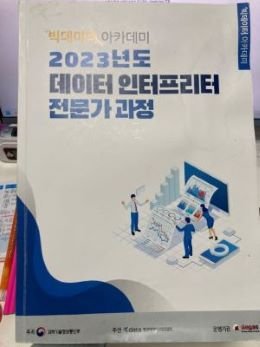
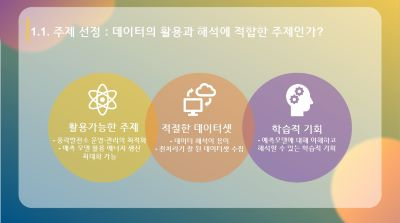
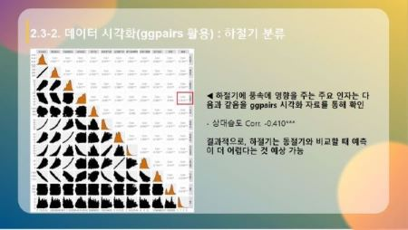
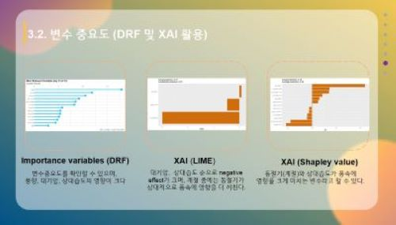
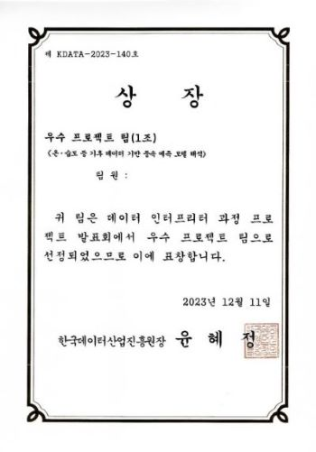

---
title: 데이터 인터프리터란 무엇인가?
date: "2024-01-25T00:00:00.000Z"
category: "blog"
description: 한국데이터산업진흥원이 주관하는 빅데이터 아카데미의 데이터 인터프리터 교육과정 후기에 대해 이야기합니다.
postauthor: "Anna"
---     

안녕하세요. 미디어나비 안나입니다. 미디어나비는 인공지능과 데이터 산업 내에 속해있는 기업인데요. 데이터 전문가가 아닌 저는 실무를 하면서 데이터에 대한 깊이 있는 이해의 필요성을 느껴 데이터 인터프리터 교육과정을 찾아 듣게 되었습니다.

한국데이터산업진흥원 주관, 빅데이터 아카데미의 교육과정 중 데이터 인터프리터 과정은 조금 생소하게 다가왔습니다. “인터프리터 = 통역사”라는 사전적 뜻처럼 데이터 분석가 정도의 수준은 아니지만 데이터에 대해 깊이 이해하고 다양한 이해관계자들에게 전달할 수  있는 역량을 기르기 위한 교육과정으로 2023년 10월 최초 개설된 신직종 과정입니다. 제가 수강신청할 때에는 사전 정보가 전무했습니다. 이번 콘텐츠에서 다루게 된 이유가 저처럼 데이터 인터프리터가 무엇인지 교육과정에 대한 정보를 얻고 싶은 분들께 체득한 경험을 나누고 싶어서입니다.  

빅데이터 아카데미는 내일배움카드 소지자 및 우선지원 대상 기업 소속 재직자면, 온라인 신청이 가능합니다. 신청 후 지원자가 직접 데이터 역량 자가진단을 할 수 있으며, 자가진단 이후 종합평가와 최종평가를 거쳐 교육생에 최종 선발됩니다.  

먼저 교육 기본개요 및 커리큘럼에 대해 알려드릴게요.

### **교육 개요**    

* 과정명 : 데이터 인터프리터 과정

* 목적 : 데이터 처리 기술을 이해하고 데이터를 활용한 신규 비즈니스 창출 접근법 및 활용 사례 실습

* 교육 대상 : 우선지원대상기업(고용보험법 시행령 제12조) 소속 재직자 또는 내일배움카드 발급자 12명

* 교육 내용 : 데이터 산업과 데이터 인터프리터 이해, 분석 알고리즘의 해석과 성능 평가 등의 지식을 활용할 수 있는 프로젝트 기획 능력 향상 및 프로젝트 수행

* 교육 일정 : 약 7주 과정 
(사전 교육) 1주간 온라인 강의로 개별 진행
(집체 교육) 2주간 주말 총 4회 / 온라인 강의로 진행
(파일럿 프로젝트) 3주간 총 6회 / Zoom으로 멘토링 스터디 형식 진행
(프로젝트 발표회 및 수료식) 1회 / Zoom으로 조별 발표 및 수료식 진행  

### **커리큘럼 내용** 

#### **1. 사전 교육** 

빅데이터 분석 전문가 과정 수강에 필요한 선수 지식을 온라인 동영상 콘텐츠로 제작 및 무료 제공하며, 빅데이터 플랫폼 현황, 데이터 거래 프로세스 등에 대한 내용을 배우게 됩니다. 

여기까지는 수강생이 개별적으로 데이터온에 들어가서 동영상 교육을 하기때문에 반복재생 등을 통해 개인적으로 부족한 부분을 이해될 때까지 들을 수 있어서 수월했던 것 같습니다.  

#### **2. 집체 교육**
1) 1단계 사전 교육을 수료하고 나면, 2단계 집체 교육이 시작됩니다. 재직자 과정이기에 주말에 진행되었는데요. 2주간 하루에 8시간씩 총 4회의 교육을 통해 진행되기에 생각 보다 타이트합니다.  

2) 총 3분의 강사님께서 Zoom을 통해 강의를 진행해주셨는데요. 사실 32시간 내에 데이터의 기본 개념부터 알고리즘의 이해, 시각화 그리고 데이터 분석의 이해까지 다루는 게 쉽지 않았겠죠. 그래서인지 강의는 질문을 할 틈도 없이 빠르게 진행되었고 사실 중간 중간 내가 이걸 이해하고 있는건가 의심이 들 정도로 힘든 때도 있었던 것 같아요. 특히, 업무상 R을 다룰 일이 없던 저는 온라인으로 진행되는 강의에서 R을 활용한 실습을 병행하며 따라가는 것이 가장 큰 고비였던 순간이었어요. 챗GPT 덕분에 따라갔다고 해도 과언이 아닙니다. Thanks ChatGPT!  
그리고 만약 오프라인이었다면 쉬는 시간에 질문이라도 드렸을텐데 온라인으로 진행되어 조금 아쉬운 마음이 남아요. 온라인 수업이 주는 편리함이 있었던만큼 이런 부분에선 어쩔 수 없는 단점도 있었던 것 같아요.  

     
   *데이터 인터프리터 전문가 과정 교재, 이미지 출처 : (주)베가스 제공, 개인 소장*  
    
교재는 무단공개 불가라 상단의 표지 이미지로 대체하고요. 상세 커리큘럼만 아래 살짝 공개합니다.  

| 회차 / 시간 | 교육 분야 | 상세 커리큘럼 |
| ---- | --- |--- |
| 1회차 / 8H | 데이터 산업과 데이터 인터프리터 | 데이터 산업의 이해, 데이터 인터프리터의 역할, 데이터 Biz유형과 접근 방법, Biz 창출을 위한 데이터 기획, 국내 데이터 산업 제약의 이해, 데이터를 활용한 신규 Biz창출 접근법 및 모범 활용 사례 |
| 2회차 / 8H | 데이터 처리 및 가공의 이해 | 빅데이터 처리 기술 소개 (제외 가능), 빅데이터 처리 기술 아키텍처 (제외 가능), 데이터 품질 개요, 데이터 가공 개요 |
| 3회차 / 8H | 데이터 시각화와 데이터 분석 프로세스의 이해 | 정보 디자인과 시각화 원칙, 다양한 데이터 표현 방법, 데이터의 탐색 및 시각화 기법, 데이터 시각화 활용 실습, 데이터 분석 프로세스의 이해 및 데이터 사이언스 캔버스 사용법 |
| 4회차 / 8H | 분석 알고리즘의 이해/ 해석 및 성능 평가 | 데이터 분석의 기초(추정 및 가설검정 등), 정형/ 비정형 데이터 분석을 위한 AI 알고리즘 이해/해석, 데이터 분석 결과 성능 평가 방법 방법의 이해 |

#### **3. 파일럿 프로젝트**
1) 집체 교육이 종료되고 파일럿 프로젝트를 위한 팀이 구성됩니다. 6인 내외로 운영팀에서 구성해주시며 각 팀에 멘토가 배정됩니다. 멘토님은 파일럿 프로젝트의 안내자가 되어 주제 선정부터 프로젝트 진행 및 발표 준비까지 전 과정을 이끌어주십니다.  

2) 파일럿 프로젝트는 팀별 분석할 주제를 선정하고 데이터를 탐색하고 구조화해보고 시각화까지 해보는 데이터 분석의 전 과정을 포함하고 있었습니다. 인터프리터 과정이지만 준 분석가 정도의 수준은 요구했던 것 같네요. 그래서 분석도구 R의 패키지들을 활용하여 데이터 탐색부터 시각화 자료까지 다룰 수 있었습니다. 데이터 분석에 있어 최근 파이썬을 많이 사용하기도 하지만, R을 적절히 활용한다면 다양한 패키지들이 있어 누구나 쉽게 데이터 시각화 결과물까지 도출해낼 수 있더라구요. 여러 데이터 분석에 유용한 패키지 모음집이라고 할 수 있는 tidyverse에서 ggplot, dplyr 등을 다운로드 받으실 수 있습니다. https://www.tidyverse.org/packages/ 

3) 그런데 저희 팀은 약간의 이슈(?)가 있었습니다. Zoom으로 만나다보니 출석률이 불규칙하고 각자의 진도가 다르기도 했기에 프로젝트 발표 준비를 하는데 있어서 제대로 의사소통이 안 된 것이지요. 안타깝게도 저희 팀은 수료식까지 단체 채팅방 한 번 만들어보지 못하고 발표회 일주일 전부터 홀로 프로젝트 발표를 준비하게 됩니다. (훌쩍..)  

4) 저희의 분석 주제는 “온습도 등 기후 데이터 기반 풍속 예측 모델 해석”으로 분석 기획 - 데이터 탐색 - 예측 모델 - 결론 및 활용방안의 순서로 발표를 진행하였습니다. 발표 내용에 대해 간략하게 설명하기 위해 요약하자면, 다음과 같습니다.  

      
    *온습도 등 기후 데이터 기반 풍속 예측 모델 해석 발표자료 1, 이미지 출처 : 개인 소장*  
    
    4-1. 풍력 발전은 경제성이 가장 높은 재생에너지원으로 손꼽힌다고 합니다. 그런데 국내 풍력 발전효율이 선진국의 50% 수준에 못 미치는 것으로 나타나고 있으며, 이러한 원인은 한국의 지리적 조건이 유럽 등에 비해 상대적으로 불리하기 때문이라는 분석이 나오고 있다고 합니다. 이와 함께 풍력발전의 고비용에 대한 지적도 있어 기후 데이터 기반 풍속 예측 모델 해석을 통해 이러한 문제점의 해결방안을 분석 및 탐색해 보고자 했습니다.  

      
    *온습도 등 기후 데이터 기반 풍속 예측 모델 해석 발표자료 2, 이미지 출처 : 개인 소장*  

    4-2. 풍력발전의 효율적인 운영뿐 아니라 적절한 데이터셋이 있는지와 학습적인 기회가 되느냐 역시 주제선정의 중요한 동기였습니다. 데이터 분석을 위해 제대로 된 데이터셋을 찾는 것이 가장 큰 관건이었습니다. 그래서 데이콘 경진대회의 주제로  전처리가 잘 되어있는 데이터셋을 구할 수 있었고, 또 해석이 용이한 데이터셋이었기에 주제선정에 적합했습니다. 예측 모델에 대해 이해하고 해석할 수 있는 학습적인 기회가 될 것이라고 예상했습니다.  

      
    *온습도 등 기후 데이터 기반 풍속 예측 모델 해석 발표자료 3, 이미지 출처: 개인 소장*  
    
    4-3. ggpairs 함수를 활용한 시각화 자료를 탐색해보니 풍속 예측을 위해 우선 동절기, 하절기의 계절적 분류가 필요해보였고, 각 계절에 따라 풍속에 영향을 주는 주요 인자를 확인해보고 동절기와 비교시 하절기가 예측이 더 어렵다는 것을 예상할 수 있었습니다.  

      
    *온습도 등 기후 데이터 기반 풍속 예측 모델 해석 발표자료 4, 이미지 출처: 개인 소장*  
    
    4-4. 풍속에 영향을 주는 변수 중요도를 랜덤 포레스트 모델과 XAI를 통해 알 수 있었던 시각화 자료들인데요. XAI는 eXplainable AI, 즉 설명가능한 AI라는 뜻으로 XAI는 기존 알고리즘이 왜 이러한 값이 나오는지 알 수 없는 경우, 이를 추론하기 위한 계산이라고 합니다. 각각의 시각화 자료를 통해 풍속에 가장 영향을 주는 주요 인자를 파악할 수 있었다는 내용입니다. 

5. 여러 우여곡절이 있었으나 수료라는 명확한 목표 하에 의자할 곳은 오로지 멘토님뿐…매일 밤 늦은 시각, 멘토님을 괴롭히게 되었고, 멘토님의 적극적인 지지와 도움으로 위와 같이 발표를 준비하고 무사히 마쳤답니다. 멘토님, A부터 Z까지 질문해서 상당히 힘드셨을텐데 다시 한 번 감사인사 드립니다.    

### 수료식 및 우수팀 선정    

#### **1. 파일럿 프로젝트 발표회 및 평가** 
Zoom으로 진행된 발표회에는 데이터 분석가인 평가위원 세 분이 함께해 주셨는데요. 인터프리터 과정 자체가 신설된 과목이라 어느 정도 난이도를 기준점으로 삼고 평가해야 하는지 난해하셨던 것 같긴 합니다. 발표자였던 저는 데이터에 대한 좀 더 깊이있는 이해가 부족해 아쉽다. 주제 선정 동기가 약하다. 랜덤 포레스트 알고리즘을 채택하여 사용했는데 굳이 라임, 샤블리 밸류 등을 또 썼는지 모르겠다 등 피드백을 받았습니다.  

#### **2. 우수팀 선정, 한국데이터산업진흥원장상 수상** 
발표회와 수료식이 끝나고 일주일 후 우수팀 선정이 있었는데요. 준비한 것은 빠뜨리지 않고 발표했지만 과정 중에 개인적으로 부족한 점을 느껴 한치의 기대도 하지 않았더랬습니다.  

그런데 저희 팀이 **우수팀에 선정**되었다고 합니다. 무려 **한국데이터산업진흥원장상**이네요. 부족한 수준에서 도전하여 수료했지만 그럼에도 불구하고 상장을 자랑하면서 이번 포스팅 마무리합니다. 개인적으로는 포기하지 않으면 뭐든 얻는 것이 있다는 교훈이 있었습니다. 이러한 도전적인 과정이 조금씩 모여 조직의 발전에도 도움이 되기를 바랍니다.  

  
*한국데이터산업진흥원장상 상장, 이미지 출처: 개인 소장*

### **참고 링크**  

- 한국데이터산업진흥원 - https://www.kdata.or.kr/ 
- 데이터온에어 - https://dataonair.or.kr/ 
- AI 해커톤 플랫폼 DACON - https://dacon.io/ 
- 파일럿 프로젝트 데이터셋 - https://dacon.io/competitions/official/236126/data   
- R install, R Sudio - https://posit.co/download/rstudio-desktop/
- tidyverse - https://www.tidyverse.org/packages/