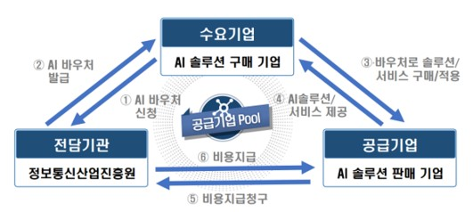
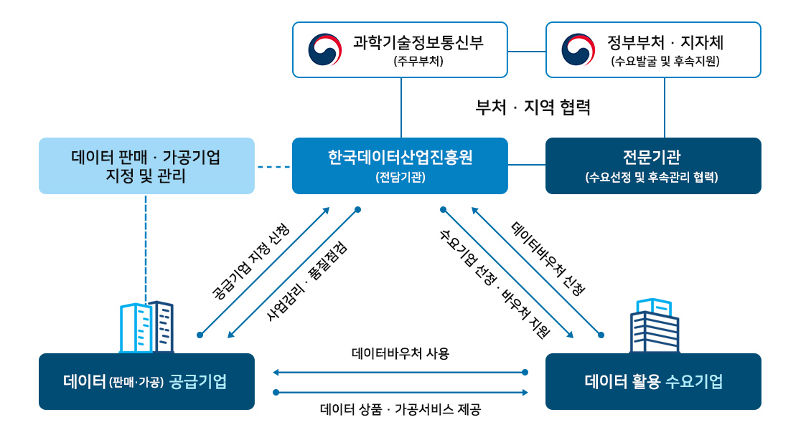
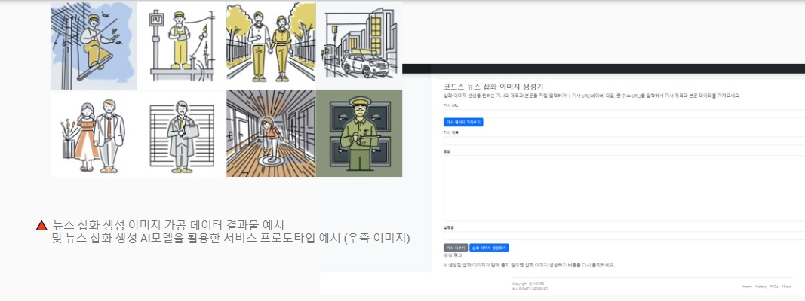
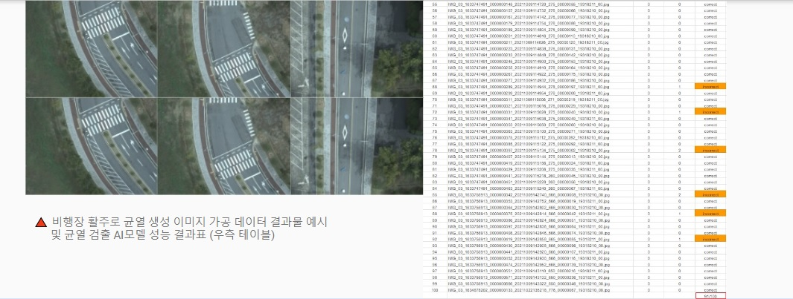

---
title: 정부 지원 바우처 최대 2억으로 AI를 도입하는 방법!
date: "2024-02-17T00:00:00.000Z"
category: "blog"
description: AI 기업 육성 및 인공지능과 데이터 기반 디지털 전환을 촉진하기 위한 AI바우처와 데이터바우처 지원제도에 대해 설명합니다.
postauthor: "Anna"
---     

안녕하세요. 미디어나비 안나입니다. AI 기업 육성 및 인공지능 기반 디지털 전환의 가속화를 위한 대표적인 정부 지원제도에 대해 소개해드립니다. 최대 2억 원의 정부지원금으로 미디어나비의 AI 기술력과 서비스를 이용하실 수 있습니다.  

### **1. 정보통신산업진흥원 주관, AI바우처 지원사업**    

* **AI바우처 지원사업이란?**  
AI 솔루션 적용이 필요한 중소, 벤처, 중견기업(수요기업)에게 바우처를 발급하고, 수요기업은 바우처를 활용하여 원하는 AI솔루션을 제공하는 중소, 벤처기업(공급기업)의 기술력을 활용함으로써 AI 기업 육성 및 산업 디지털 전환 촉진을 목표로 하는 대표적인 정부 지원사업입니다. **2024년 기준, 총 예산 425억원**으로 **지원과제로 선정시, 최대 2억 원까지 AI솔루션 도입비용 지원**이 가능합니다.  

* **사업 개요**  
  
 *AI바우처 지원사업 개요도, 이미지 출처 : 한국정보통신진흥원(NIPA) 제공*  

* **신청 대상 기업**  
 AI 솔루션 도입이 필요한 중소기업, 초기 중견기업, 청년기업, 예비 창업자, 소상공인 누구나 신청 가능합니다.  

* **수요기업 혜택**  
1) **최대 2억 원 정부지원 바우처**로 AI 도입비용 절감 
2) 자연어처리, 데이터 분석, 비전AI 분야의 미디어나비 **AI 솔루션 적용으로 기업 혁신 가속화**
3) 정확한 고객사 요구분석 기반 **커스터마이징 서비스** 
4) AI 솔루션 활용 가이드 제공 등 기술 지원  

* **2023, 2024년도 연속 AI솔루션 공급기업 지정 미디어나비의 AI 솔루션은?**  
자세한  내용은 하단 링크의 블로그 글을 참고하세요.  
(미디어나비 AI 솔루션 소개 블로그)  
https://blog.medianavi.kr/2023-01-10-MediaNavi-AI-Solution/  

* 수요기업의 요구사항을 가장 잘 구현해낼 수 있는 미디어나비가 공급기업으로 함께 지원사업에 공모하기 위해 과제지원 준비부터 맞춤형으로 상담해드립니다.  

* 2024년 AI바우처 지원사업 상담 문의 anna@medianavi.kr   

### **2. 한국데이터산업진흥원 주관, 데이터바우처 지원사업**  

* **데이터바우처 지원사업이란?**  
데이터 수요 · 공급의 생태계를 조성하고 全 산업의 디지털 기반 데이터 활용 활성화 촉진을 위해 데이터 구매 · 가공 바우처를 지원하는 내용의 한국데이터산업진흥원 주관 사업으로 2024년 올해, 총 예산 499억 원이 편성되어 약 1,000건의 바우처 지원이 예상됩니다. 작년의 경우, AI가공 서비스는 **최대 6천 만원까지 바우처로 제공**되었습니다.  

* **사업 개요**  
      
    *데이터바우처 지원사업 시스템 개요도, 이미지 출처 : 한국데이터산업진흥원(Kdata) 제공*  

* **신청 대상 기업**  
 **데이터의 AI가공이 필요한 중소기업, 초기 중견기업, 청년기업, 예비 창업자, 소상공인 누구나** 신청 가능합니다. 가게 매출 증진을 위한 마케팅 전략이 필요한 소상공인 A 사장님, 자체 보유 데이터는 많지만 가공하고 활용할 수 있는 기술 인력이 없는 중소기업 B 과장님, 신사업의 서비스를 고도화시킬 인공지능 기술이 필요하신 예비창업자 C 대표님 등 **데이터를 활용하여 이익창출 또는 기업혁신을 원하는 분들이 신청 가능**한 지원사업입니다.  

 * **수요기업 혜택**
1) **최대 6천만 원 정부지원 바우처**로 데이터의 AI가공 비용 절감 
2) 자연어처리, 데이터 분석, 비전AI 분야 **미디어나비의 데이터 AI가공 서비스로 기업 혁신 가속화**
3) 정확한 고객사 요구분석 기반 **커스터마이징 서비스** 
4) 납품된 가공데이터 활용 가이드 제공 등 기술 지원  

* **2023, 2024년도 연속 공급기업 지정, 미디어나비의 데이터바우처 서비스는?**  
데이터바우처 포털사이트에서 미디어나비를 검색하시면 보다 자세한 서비스 상품을 확인하실 수 있습니다.  
(데이터바우처 포털사이트)  
https://kdata.or.kr/datavoucher/index.do  

* **2023년도 수행완료 데이터바우처 레퍼런스**  
1. 비주얼 저널리즘을 위한 뉴스 기사 삽화 이미지 자동 제작 시스템 개발을 위한 AI가공 작업
   
    *데이터바우처 레퍼런스 1, 이미지 출처 : 미디어나비 제공*  

2. 비행장 활주로 균열 검출 AI 모델 개발을 위한 AI가공 작업  
  
    *데이터바우처 레퍼런스 2, 이미지 출처 : 미디어나비 제공*  

### **정부 바우처 최대 2억 원으로 미디어나비의 AI 기술력을 이용하세요.**
요즘은 최신기술의 인공지능을 활용해야 한다던데…데이터를 활용해야 한다던데…당장의 데이터 활용 및 AI 도입비용이 부담되거나 어디서부터 시작할지 막막한 분들은 저희 미디어나비에 문의주세요.  
**정부에서 바우처 형식으로 제공하는 최소 6천만원부터 최대 2억 원의 비용으로 미디어나비의 데이터를 활용한 AI 기술력을 활용**하실 수 있습니다. 수요기업의 정확한 요구사항을 면밀히 파악하여 적절한 사업을 사전에 함께 모색하여 제안해 드립니다. AI바우처 지원사업, 데이터바우처 지원사업 두 사업 모두 수요기업의 모집공고는 **2024년 2월 중 예정**되어 있습니다.  

2024년 AI바우처, 데이터바우처 지원사업 상담 문의 anna@medianavi.kr  

### **참고 링크**  

- 정보통신산업진흥원 - https://www.nipa.kr/
- AI 허브 - https://www.aihub.or.kr/ 
- 한국데이터산업진흥원 - https://www.kdata.or.kr/ 
- 데이터바우처 포털 - https://kdata.or.kr/datavoucher/index.do 