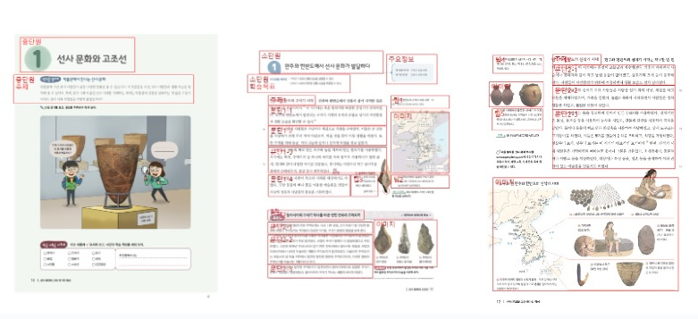
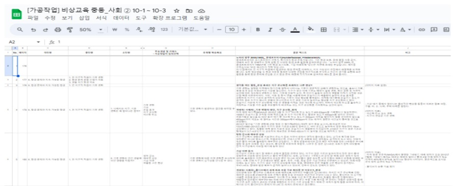
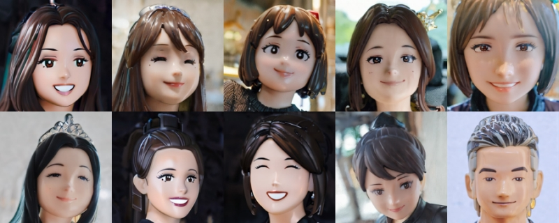
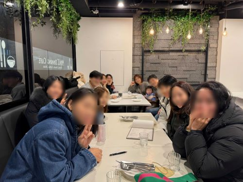

---
title: 중, 고등학교 교과서 데이터 가공 프로젝트 후기
date: "2024-04-01T00:00:00.000Z"
category: "blog"
description: 크라우드 워커 10인과 함께한 중, 고등학교 교과서 텍스트 데이터 라벨링 프로젝트의 생생한 후기를 전합니다.
postauthor: "Anna"
---     

### 콘텐츠 기획의도
안녕하세요. 미디어나비의 안나입니다. 2023년 11월부터 지난 3월 초까지 약 4개월간 총 10인의 크라우드 워커들과 함께 중, 고등학교 교과서 텍스트 데이터 가공 프로젝트를 수행했습니다.  

참여한 크라우드 워커 대부분이 출산과 육아로 인한 비자발적 경력 멈춤이 있으신 분들이었는데요. 재택근무 형태로 시공간 제약 없이 원하는 시간만큼 일할 수 있었기에 좋았고 의미있었다는 후기들이 있었습니다.  

이 가치있는 프로젝트가 작업종료와 함께 끝나는 것이 아쉬워 블로그에 간단한 프로젝트 후기를 남겨보는 것이 어떨까 하는 생각에서 인터뷰 코너를 곁들인 블로그 콘텐츠를 기획하게 되었습니다.   

### 데이터 가공작업은 어떤 일을 하나요?  
먼저 데이터 가공작업이 무엇인지 살펴볼게요. 데이터 라벨러라는 직업을 들어보신 적 있으시죠? 인공지능이 학습하기 위한 형태로 데이터 가공작업을 하는 사람을 데이터 라벨러라고 합니다. 하단 링크를 보시면 인공지능 학습용 데이터 라벨링 전문 교육에 대한 영상이 있습니다. 요즘 데이터 라벨러 전문 교육들이 많이 개설되고 있는 것을 보면 AI 학습과 성능 개선을 위한 데이터 라벨링의 중요성이 높아지고 있는 것을 알 수 있습니다.

**(인공지능 학습용 데이터 라벨링 전문교육)**  
https://www.youtube.com/watch?v=pViXY4DPhHs&feature=youtu.be 

데이터 라벨링의 종류는 텍스트, 음성, 이미지, 영상 등 분야가 다양한데요. 저희가 수행한 프로젝트는 텍스트 라벨링 작업입니다. 여러 출판사의 중, 고등학교 교과서 PDF로부터 텍스트 데이터를 DB화하는 작업으로, 이 역시 인공지능 모델 학습을 위한 데이터 가공작업 단계에 해당됩니다. 교과서의 단원 구분, 페이지 번호, 학습목표, 본문 내용 등 명확한 가공기준에 따라 텍스트 데이터를 분류 및 태깅하여 옮기는 작업으로 얼핏 보면 단순작업 같아 보이지만 각 교과목의 특성과 책의 구성 등에 따라 작업방식이 상이하고, 무엇보다도 AI모델 성능을 결정짓는 요소이기에 사람의 손이 반드시 필요한 중요한 작업이라고 할 수 있습니다.  

  
 *교과서 PDF 원본의 작업 기준, 이미지 출처 : 중, 고등학교 교과서*  

  
 *교과서 텍스트 데이터 가공작업 예시, 이미지 출처 : 미디어나비 제공*  

철저한 사전교육과 기본적인 컴퓨터 작업능력을 요하는 데이터 라벨링 작업을 다양한 경력과 센스를 겸비한 크라우드 워커 열 분이 열정적으로 수행해 주셨는데요. 미디어나비의 비전AI 솔루션 나비전(nAvI-Sion)을 활용, 크라우드 워커분들의 얼굴 사진을 레고 스타일로 생성한 프로필 이미지와 함께 생생한 작업 후기를 들어보도록 하겠습니다.🙂

**(미디어나비 AI솔루션 상세내용 바로가기)**    
https://blog.medianavi.kr/2023-01-10-MediaNavi-AI-Solution/ 
 
### 크라우드 워커 인터뷰  

**Q. 기존에 하시던 일이 이번 일과 관련이 있거나, 관련 없지만 의외로 작업에 도움이 되었던 점이 있으실까요?**  

  <StaticImage src="./image04.jpg" alt="" />
  웹디자인 일을 하면서 오탈자 검사를 자주 해서 작업하는 것이 낯설지 않았고 원래 단순 반복 작업을 좋아하는 성격이라 아무 생각없이 무념무상으로 힐링하듯 작업 할 수 있었습니다.  

   
  
컴퓨터를 아주 오랜만에 만져보긴 했는데…생각보다 손가락이 기억을 많이 하고 있었어요.ㅋㅋ 원래 문서작업을 많이 했었고(하지만 경력단절 12년…), 타자를 잘치는 편이긴 했던 것이 도움이 되었을지 모르겠습니다.
  
    
퇴사한 지 10년이 다 되가는 시점에 이런 문서 작업을 할 수 있어 다시 그때로 돌아간 기분이었습니다. 단축키 사용에 능숙하고 타자 속도가 빨랐던 것이 작업에 도움이 되었습니다.
    
     
오래 전에 잠깐 했던 일이지만 방송작가 일을 하며 받아적는 일이 많아 타이핑이 늘었는데 이번 작업 중 복사가 안 되는 부분에서는 직접 타자를 칠 때 그때 기억이 떠올랐습니다. 제가 타자 치는 걸 좋아하더라구요.  
    
기존에 안 해본 작업이라 흥미가 있었습니다.
AI 관련해서 데이터 학습의 중요점을 알게 되었으며 이로 인하여 다른 클라이언트에게 데이터의 중요성을 강조할 수 있게 되었습니다.    
 
       
 
**Q. 작업하시며 특별히 기억에 남는 에피소드 있으시면 간략한 스토리로 함께 나눠주세요. 🙂**  
  
 처음 교과서를 배정받고 주말에 작업을 하고 있었어요. 근데 둘째 아이가 엄마가 갑자기 집에서 노트북으로 뭔가를 하고 있으니, 궁금한지 지나가면서 슬쩍 보고는 뭐하냐고 물어보더라구요. 그래서 제가 농담 삼아 '비밀유지 각서'(크라우드 워커 보안서약서)를 쓰고 와서 알려 줄 수 없다고 했어요. 처음에는 아무 말이 없다가 얼마 후 둘째가 엄마 혹시 댓글 알바 하는거 아니냐고..그 얘기 듣고 어이가 없어 웃었어요.(하하하)
    
초등학교 고학년인 큰 아이가 기웃거리며 "중학교 과정도 뭐 별거 없네?" 하는 멘트를 날릴 때마다 이런 근거 없는 자신감은 밟아주는게 맞는건지 자라나는 새싹을 키워줘야 하는건지 내적 갈등에 시달림. 우리집 애들은 왜 이렇게 실적 체크를 하는지..
"엄마 오늘 일 했어? 몇 시간 했어? 또 꼴찌야???" 
나는 안나에게 무슨 잘못을 해서 화학 과목 교과서를 2연타로 받았는가? 일단 무릎을 꿇었어야 했다. 
    
일상생활에서 또는 TV를 보다가 관련 내용이 나오면 "어! 나 저거 교과서에 나왔던 내용인데~" 하며 가족들에게 설명해줄 수 있었습니다. 또 아이가 옆에서 "엄마 키보드를 왜 이렇게 빨리 쳐?" 라고 하는 말에 "엄마 엄청 빠르지?" 하고 자랑 아닌 자랑을 할 수 있었네요.ㅎㅎ 그렇지만 아이가 나중에 이만큼 많은 양의 공부를 할 생각을 하니 걱정과 한숨이…ㅋㅋ(전 어떻게 했을까 싶은…?)
    
기술가정 교과서 작업 중 임신과 출산에 관한 내용이 있었는데 최근 제 인생에 가장 큰 이슈였다 보니 과몰입했는지 학생들!! 이건 중요해!! 하며 단락을 세세하게 나눠서 정리했더니 바로 피드백을 받았던 일이 있어요 아 내가 오바했구나 깨닫고 혼자 웃었죠. ㅎㅎ    
하루는 아기 재우고 늦은 밤에 작업하다보니 입이 심심해 남편에게 간식 좀 사오라 했더니 마트를 쓸어왔던 남편..원래 좀 중간이 없는 분이시라..스윗하려다가 조금 무서워진 밤이었습니다.^^
   
아이들에게 엄마 일해야 하니 각자 할 일을 하자라고 하니 돈은 아빠가 벌어오게 놔두고 엄마는 쉬라고 했던? ㅋㅋ 반만 효자를 낳았습니다…  
  
  
    
**Q. 작업하면서 보람되거나 좋았던 부분이 있다면요? 이것만큼은 이 작업이 제일 좋다! 라고 자신있게 추천할만한 점이 있으면 얘기해 주세요!**
   
제일 좋았던 부분은 아무래도 시간에 얽매이지 않고, 내가 시간날 때 할 수 있다는 점이었던 것 같습니다. 그리고 노트북만 있으면 어디서든 할 수 있다는 게 가장 큰 장점이였던 것 같아요.  
아이가 둘이다보니 아이들이 수시로 아픕니다. 그래서 고정적인 일은 하기 힘들었어요. 그러다 파트 타임으로 일을 하게 되었고, 직장인처럼 매일 회사에 출근하지 않아도 되고 아이들 자는 시간이나 없는 시간에 집에서든 밖에서든 노트북만 있다면 일할 수 있으니 부담 없이 할 수 있었어요.
 
 
좋았던 점으로는 교과서 작업을 하고 있으면 한 번씩 애들이 와서 보고 가기도 해요. 그러다 과목을 보고는 "어..이거 나 아는 건데" 라며 배운 내용이라고 얘기도 하고, 교과서에 있는 퀴즈도 같이 풀어보면서 자연스럽게 대화도 하며 공감할 수 있어서 좋았어요.  
보람된 점으로는 집에서 살림하고 애들 챙기며 지내다가 오랜만에 일을 하게 되었어요. 한 권씩 교과서 작업을 마칠 때마다, 작업 시간도 조금씩 줄어들어 가는 걸 보면서 나도 뭔가 할 수 있다는 뿌듯함과 보람을 느꼈어요. 그리고 작업을 하면서 정확한 띄어쓰기도 새삼 알게 되는 것들이 있어 좋았답니다.
 
 
고등학교 사회 과목의 세계지리 같은 경우는 작업을 끝낼 때마다 몰랐던 부분을 알아가는 재미가 있더라구요. 일을 하면서 지식을 쌓아가는 느낌! 이런 부분이 참 좋았습니다.
 
 
     
작업하는 시간을 내맘대로 할 수 있어 좋지요. 그리고 아주 크게 얻은 것이 있는데 개인적으로 올빼미과라 생각하고 살아왔는데 새벽형 인간으로 거듭난 것. 자고 일어나는 시간이 일정해진 것. 너무 너무 좋음. 시간 들인만큼 페이를 받으니 부담도 없음.  
 
      
**Q. 향후 추가 프로젝트가 시작된다면 다시 참여하실 의향이 있으신가요? 데이터 가공작업이 처음인 신규 크라우드 워커들에게 해주고 싶은 한 마디가 있다면요?**

추가 프로젝트가 시작된다면 다시 참여할 의향이 있습니다.
시간 제약 없고 스트레스 없고 아무 잡 생각도 없는 3無를 갖춘 일을 찾고 있다면 추천합니다.  
 
       
당연히 해야죠! 데이터 가공작업 어렵지 않습니다. 대부분 너무 좋아하실 거예요. 사실 같이 작업하셨던 분들 모두 능력이 없으셔서 일을 안하고 계신 건 아닐 거예요. 보통 육아로 인한 제약으로 어쩔 수 없이 다니던 직장을 그만두게 되는 이유가 클 거라 생각합니다. 이번 작업은 내가 시간적 여유가 있을 때 일할 수 있으니, 너무 좋았어요. 물론 자는 시간도 좀 줄여야 할 수 있고 육아도 병행해야 하니 힘들 수도 있겠죠. 근데 다시 일할 수 있게 된 것만으로도 제 자존감이 엄청 상승했습니다. 내가 어디에든 도움이 된다는게 기뻤고 뿌듯했어요. 뭐든 할 수 있을 것 같았어요.  
일하기 전보다 오히려 밝아졌고 남편도 좋아했어요. 아이들 학원비 번다고 생색도 좀 냈고요.ㅎㅎ 남편은 돈보다 다시 일해서 밝아진 제 모습이 더 좋다고 했죠.  
이런 기회를 주셔서 너무 감사해요. 사실 아이 둘 방학이 겹쳐 일하면서 바쁘기도 했지만 힘들거나 그만두고 싶었던 마음은 없었던 것 같습니다. 오히려 바쁘게 지내서 더 즐거웠고요. 물론 추가 프로젝트가 시작된다면 당연히 해야죠!!
     
추가 프로젝트가 시작된다면 당연히 다시 참여하고 싶어요. 너무 좋은 직장입니다~^^  
처음 시작하는 워커들에게 해주고 싶은 말로는, 역사나 사회 과목은 텍스트 양이 많은 편이고, 물리나 화학과 같은 과목은 위첨자, 아래첨자가 많고, 기술가정은 이미지 자료나 실습내용이 다른 과목에 비해 많이 있는 등 과목마다 조금씩 장단점이 있어요. 하지만 몇 번 작업하다 보면 노하우도 생기고, 작업하다가 어려운 부분이 생겨도 안나님이 친절하게 알려주시니 고민하지 말고 도전하라고 얘기하고 싶어요.
       
추가 프로젝트가 시작된다면 일단 무릎 꿇고 시작해 볼게요..(?) 일단 시작해 봅시다. 어떻게든 마무리 됩디다.  
    
    
네~ 또 할 수 있음 좋지요. 내가 할 일이 있다는 게 기분이 꽤 괜찮아요.^^  
    
 
   
### 인터뷰 마무리 
크라우드 워커분들의 인터뷰 어땠나요? 저는 특히 스페셜 에피소드들이 너무 재밌게 느껴지는데요. 같은 작업을 했어도 모두 다른 스토리가 있다는 것이 흥미롭네요! 
마지막으로 모든 크라우드 워커분들의 한 줄 후기로 마무리할게요.

### 한줄 후기  
  
*크라우드 워커 10인, 이미지 출처 : 미디어나비 나비전 솔루션으로 생성* 

**안나 (프로젝트 매니저)** : 저 역시 육아를 병행하는 워킹맘인데요. 엄마이면서 동시에 한 개인으로서 육아나 살림 이외에 ‘나의 일’이 얼마나 소중한지 너무나도 잘 압니다. 이 프로젝트가 더 의미있고 특별한 이유입니다. 열정적으로 작업해주신 모든 크라우드 워커분들께 진심으로 감사드립니다!🙂

**리디아** : 아이를 키우며 경력 단절이 된 후 오랜만에 일을 하게 되어 매우 뿌듯하고 알찬 하루하루를 보낼 수 있었습니다. 뜻 깊은 기회를 주셔서 감사합니다.^^  

**엘리** : 다시 한 번 이런 기회를 주셔서 감사해요. ㅎㅎ 일하는 동안 즐겁고 재미있었습니다~ 모두 추가 프로젝트 때 만나요!!!  

**영이** : 재택근무라 애들이 학교나 학원 간 시간 틈틈이 자유롭게 일할 수 있어 너무 좋았어요. 여러 가지 교과서를 작업하면서 몇몇 어려움도 있었지만, 예전에 배웠던 내용이 새록새록 생각나면서 재미있게 일했어요. 오랜 경단녀로 지낸 저에게 일을 할 수 있는 기회를 주셔서 너무 감사합니다.  

**오쓰리** : 처음엔 어렵다고 생각했고 사실 그건 어려운 것이 아니라 낯선 것이었습니다.
낯선 것을 익숙함으로 만들어 해내신 워커들 칭찬합니다.
처방 받은 금융 치료로 잠시의 즐거움을 누립시다.

**원더** : 새로운 일을 할 수 있어 좋았어요. 요새 중, 고등학생들은 별걸 다 배우네 이런 생각도 하고...즐거운 시간이었어요. (작업속도가 빠르다는 이유로) 원더머신이라는 별명도 생기고 ㅋㅋ 감사합니다!!!  

**윰쓰** : 회사를 그만 둔지 어언 10년, 나의 쓸모에 대해 계속 생각을 하고 있던 차에 제의를 받고 의욕적으로 시작하였고 몇 달이나마 남편과 아이에게 좋은 모습을 보여준 것 같아 뿌듯합니다. 물론 처음에는 모집책의 말과는 달리 신경쓸 것도 확인할 것도 많아 시행착오를 겪으며 안나님을 몇 번 찾아가기는 하였지만요. ㅎㅎ 이 자리를 빌어 안나님께 다시 한 번 감사의 인사를 드려요.^^ 

**헤이즐** : 필사라는 것이 있죠. 데이터 가공작업을 하며 저는 필사할 때의 느낌을 가진 것 같습니다. 손이 바빠지고 머리가 비워지는 힐링이 되는 시간이었습니다.  

**하임** : 처음 해보는 작업이라 해가 되진 않을까 걱정반 기대반하는 마음이였는데요. 재밌고 유익한 시간이었습니다.  
   
**베쓰** : 재밌었어요. 감사해요. 모두들^^  

**헌터** : 어려운 시기에 좋은 기회 주셔서 감사합니다.
쉽게 생각했던 부분이 없지 않아 있었지만 실수 끝에 나름의 방법을 찾았습니다.  

### 맺음말  
  
*어느 멋진 겨울 날, 따뜻했던 크라우드 워커 송년 회식, 이미지 출처 : 미디어나비 제공*  

데이터 라벨링 프로젝트처럼 지역 일자리 창출이라는 미디어나비의 사회적 책임을 잊지 않으며 또 다른 프로젝트, 그리고 흥미로운 콘텐츠로 찾아올게요!    

참고로, 미디어나비의 데이터 가공작업이 필요하신 기업에서는 하단 링크의 **데이터바우처 포털사이트에서 미디어나비를 검색**해 보세요. 데이터바우처 지원사업에서 AI가공 부문 공급기업으로 지정된 미디어나비 AI가공 서비스의 상세한 내용을 보실 수 있습니다. 

**(데이터바우처 포털사이트)**   
https://kdata.or.kr/datavoucher/index.do  

### **참고 링크**  

- (사)한국인공지능협회 YouTube - https://www.youtube.com/watch?v=pViXY4DPhHs 
- 데이터바우처 포털 - https://kdata.or.kr/datavoucher/index.do 
- 데이터바우처 PMS - https://kdata.or.kr/pms/index.do  