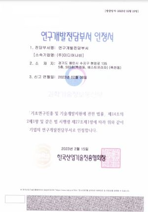
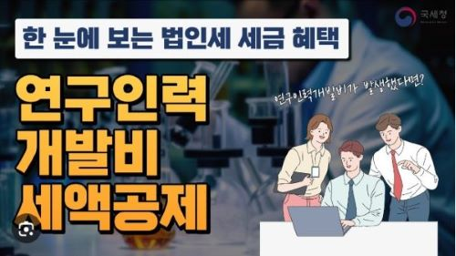

---
title: 연구개발전담부서 신고제도와 연구인력개발비(R&D) 세액공제 사전심사 제도
date: "2024-04-08T00:00:00.000Z"
category: "blog"
description: 연구개발전담부서 설립신고 제도와 연구인력개발비(R&D) 세액공제 사전심사 제도에 대해 깊이 알아봅니다.
postauthor: "Anna"

---     
## 머리말
안녕하세요. 안나입니다. 오늘은 연구개발전담부서 신고제도와 함께 연구인력개발비 세액공제에 대한 내용으로 여러분을 찾아왔습니다. 저희 미디어나비는 기술기업인만큼 R&D를 전담하는 연구개발전담부서를 가지고 있는데요. 지난 해 초, 한국산업기술진흥협회(이하 KOITA)로부터 연구개발전담부서 신규설립 신고, 인정을 받은 바 있습니다. 연구소/연구개발전담부서의 신규신고 요건은 인적요건과 물적요건을 모두 충족해야 하는데 지난 해 신청시 준비가 만만치 않았던 기억이 납니다.

저희처럼 R&D 활동을 하는 중소규모 기업의 연구개발전담부서 설립신고와 그에 따른 세제혜택에 관심있는 분들께 유용한 정보가 될 것 같아 오늘은 이와 관련된 정보를 담은 블로그 콘텐츠를 기획하게 되었습니다.

## 연구소 / 연구개발전담부서 설립신고 제도란?  
연구소/전담부서 설립신고 제도부터 간략히 알아볼게요. 

연구소/전담부서 설립신고 제도는 일정 요건을 갖춘 기업의 연구개발전담조직을 신고, 인정함으로써 기업 내 독립된 연구조직을 육성하고 인정받은 연구소/전담부서에 대해서는 연구개발활동에 따른 지원혜택을 부여하여 기업의 연구개발을 촉진하는 제도입니다.

이 제도는 다음과 같은 법적 근거를 기초로 시행되고 있습니다.
* 기업부설연구소 : 기초연구진흥 및 기술개발지원에 관한 법률 제14조의2, 동법 시행령 제16조의2
* 연구개발전담부서 : 기초연구진흥 및 기술개발지원에 관한 법률 제14조의2, 동법 시행령 제16조의2   

  
*미디어나비 연구개발전담부서 인정서, 이미지 출처 : 미디어나비 제공, 발급처 : 한국산업기술진흥협회*  

KOITA가 기초연구진흥 및 기술개발지원에 관한 법률 제20조 및 동법 시행령 제27조 1항에 근거하여 연구소/전담부서 신고 수리 및 인정 업무를 담당하고 있으며, 신규설립 신고 방법, 절차 및 인정요건 등 자세한 내용은 하단 링크에서 확인 가능합니다.  

**(기업부설연구소/전담부서 신고관리시스템)**  
https://www.rnd.or.kr/user/main.do  

## 연구개발전담부서 설립신고 혜택  
가장 중요한 점이죠. 연구개발전담부서 설립신고 후 인정시 기업이 받을 수 있는 주요 혜택에 대해 알아볼게요. 하단 내용과 같이 다양한 조세 및 관세, 자금 지원 등을 받을 수 있는 장점이 있습니다.  

  
*이미지 출처 : 핀터레스트, 유토이미지*  

(1) 연구 및 인력개발비와 설비투자에 대한 세액공제  
(2) 연구전담요원의 연구활동비 비과세  
(3) 산업기술 연구개발용품을 연구목적으로 수입할 경우, 관세 80% 감면  
(4) 연구 및 시험용 시설 등에 대한 통합투자세액공제  
(5) 연구개발과 관련한 출연금에 대해 과세특례  
(6) 연구인력 고용지원 및 병역특례 지원  
(7) 중소기업 기술신용보증 특례 등 자금지원  

## 연구인력개발비(R&D) 세액공제, 사전심사 제도  
연구인력개발비(R&D) 세액공제는 연구개발활동을 하는 기업에게 주는 가장 큰 혜택 중 하나인데요. 본 세액공제는 기업의 연구인력개발을 촉진하여 기술을 축적하고 우수한 인력 확보를 도움으로써 기업의 대외경쟁력 향상 및 성장잠재력 확충을 위해 도입된 조세지원 제도입니다.

본 세액공제는 조세절감 효과가 큰 반면 공제대상 비용 범위, 연구인력개발 활동여부 등에 대해 사업자와 과세관청 간 견해차이가 발생하여 추후 세무조사 등으로 세액공제가 잘못 신고된 것으로 확인되는 경우 수년간 공제받은 세액은 물론 가산세까지 추징되어 이는 기업에게 큰 부담이 될 수 있습니다.

이러한 이유로 국세청은 2020년부터 연구인력개발비 세액공제 적정 여부를 사전에 확인해 주는 사전심사 제도를 도입하였으며, 많은 기업이 이 제도를 이용하여 세무상 불확실성을 미리 미리 해소하고 있습니다.

작년 11월, 국세청 주관으로 세액공제 사전심사 제도의 온라인 설명회를 개최하여 참석했었는데요. 이때 이해하고 정리한 핵심 내용을 공유하고자 합니다.  

   
*이미지 출처 : 국세청 공식 유튜브 채널*  

**1. 연구인력개발비(R&D) 세액공제란?**  
중소기업은 보통 연구비의 25%에 대해 세액공제를 받고 있습니다. 법인 세액공제의 약 30%를 R&D 세액공제가 차지하는데, 이는 점차 증가하고 있는 추세이고 기업 차원에서 자체적으로 세액공제를 신청하여 혜택 받으면 좋겠지만 의외로 몰라서 세액공제를 못 받는 경우도 많다고 하네요.

또한, 앞서 언급했듯이 법인세의 조세절감 효과가 크지만 연구인력개발 활동 여부, 공제 대상, 비용 범위 등 납세자와 국세청 간 이견 발생이 사전심사 제도의 주요 도입 배경인데요.
우선, 사전심사를 받으면 이러한 점이 좋습니다.
- 신고내용 확인 및 감면사후관리 대상에서 제외
- 분야별 전문성을 갖춘 심사직원들을 통해 심사가 이루어지며 제도시행 이후 심사결과와 다르게 과세처분 된 사례가 현재까지 없음.

**2. R&D 세액공제 사전심사 신청개요**
- 신청인 : 내국법인과 거주자(개인사업자)
- 신청기한 : 법인세(소득세) 신고 전까지 가급적 여유 두고 신청 권장
- 신청방법 : 홈택스, 우편, 방문접수 모두 가능 
- 사전심사 절차   
(1) 서면 심사 : 신청인의 편의를 위해 비대면 방식의 서면심사 원칙으로 진행  
(2) 재심사 청구 : 심사결과에 이의가 있는 경우 총 1회에 한하여 재심사 청구 가능  
(3) 사전심사 조기신청 가능 : 가급적 11~12월에 신청하시어 세액공제 가능여부를 조기에 확인 받아 세무불확실성을 해소하고 내년 법인세 신고에 활용하기를 권장함. * *늦어도 1~2월까지는 사전심사 신청을 권장*  
- 신청 서류 : 사전심사 신청서, 연구개발 보고서, 연구개발비 명세서 등  
- 인건비, 재료비, 위탁 및 공동 연구개발비 등 별도로 기입해야 함.  
: 인건비 명세서는 참여비율 작성은 기간참여와 공수참여가 있는데 기간참여로 작성해주는 것이 좀 더 보편적인 방법  
: 비용기재시 민간부담금 기재가 중요한데 국세청에서 세액공제 하는 것은 민간부담금에만 해당  
: 증빙서류 중 연구개발 활동 증빙으로는 연구노트 자료로 증빙 가능  

이밖에 연구개발비 세액공제 사전심사 신청에 대한 좀 더 상세한 사항은 하단 국세청 웹사이트에서 확인이 가능합니다.  

**(국세청-연구인력개발비 세액공제 사전 심사제도)**  
https://www.nts.go.kr/nts/cm/cntnts/cntntsView.do?mi=2383&cntntsId=7749

**3. 연구개발활동 판정 유형** 
- 조세특례제한법 제2조 제2항에 의거한 과학적 또는 기술적 진전을 이루기 위한 활동을 R&D로 봄.
- 인력개발이란 내국인이 고용하고 있는 임원 또는 사용인을 교육, 훈련시키는 활동을 말함.
- 과학기술 분야 또는 특정 서비스 분야의 지식을 축적하거나 새로운 응용방법을 찾아내기 위해 축적된 창의적인 지식을 활용하는 체계적이고 창조적인 활동으로서 시제품의 설계, 제작 및 시험, 새로운 서비스 및 서비스 전달체계의 개발 등 사업화 전까지의 전 과정을 말함.
- 연구개발 단계 : 시제품을 제작하는 일련의 과정 / 예상 결과물을 사전에 제작 / 기획→설계→개발→제작→시험 순으로 각 단계별 흐름 체계를 따름.

**4. 인정 및 불인정심사 사례**  
(1) 인정심사 사례
- 시험검사 전문 기관에 위탁한 비용 인정
- 시험을 위한 시험체 재료비, 성능시험 비용 인정
- 금형 제작비도 시제품 제조나 연구용 금형 제작비용은 인정됨. 양산형은 불인정. 이처럼 명확한 인정기준이 있음.
- 연구원 인건비 : 연구원의 전공은 해당 과제와 무관하지만 경력증명서, 기술교육 등을 이수한 사항은 연구과제를 수행할 능력을 준비한 사항이므로 연구개발비 인건비 세액공제 대상으로 인정됨. 자격증 / 경력증명서 / 기술교육이수 → 제출할 때 연구원 현황에 표시된 자료 반드시 첨부 제출해야 함.  

(2) 불인정심사 사례  
- 과세연도 이전 활동에 해당되는 사례는 불인정
- 국가 R&D과제로 타법인의 개발완료 사업 등 불인정
- 특허로 등록되거나 공개되었던 내용 등을 표절한 것은 불인정 → 이 경우 악의가 있다고 보고 매우 자세히 확인하는 편이므로 주의

**5. 연구인력개발비용 판정 유형**  
(1) 시제품 제작비 : 직접비용만 인정. 양산제품 제작비는 시제품 제작과 무관하므로 간접비용으로 불인정  
(2) 기초실험재료비   
(3) 인증/평가시험비  
(4) 산업재산권 진단비 : 산업재산권 진단기관에 지출한 특허조사비용은 인정  
(5) 기술 자문료 : 연구개발과 관련된 기술자문으로 대학 또는 연구기관 등 해당 분야 전문가에게 지급된 비용에 한해서만 인정    

**6. R&D 세액공제 사전심사 제도 FAQ**  
  
*이미지 출처 : 핀터레스트, 유토이미지*  

**Q) R&D 세액공제는 국책사업일 경우 정부출연금이 아닌 기업 자부담이 발생하였을경우 새액 공제를 받을 수있는 제도가 맞을까요?**  
→ 네 맞습니다. 정부출연금은 세액공제 대상이 아니며 민간부담금이 세액공제 대상입니다. 추가로 자체연구개발 활동이 있을 경우 기업이 부담하는 인건비 및 재료비 범위 내에서 세액공제 사전심사가 가능합니다.

**Q) 그럼 연구관련 행정업무를 수행하는 연구보조원의 활동은 대상이 아닐까요?**  
네 세액공제 대상이 아닙니다. 연구관련 행정업무를 수행하는 연구원은 연구관리요원으로 분류되며 연구보조원은 시험 및 시제품 제작 등 업무를 보조하는 역할을 수행하는 연구원을 지칭합니다. 연구전담요원과 연구보조원은 세액공제 대상이나 연구관리요원은 세액공제 대상이 아닙니다.

**Q) 민간부담금 및 기업이 부담한 인건비,재료비가 있는 과제만 신청하면 되는 건가요?**    
→ 네 맞습니다. 위탁개발비 등 기업이 비용을 부담하는 과제라면 모두 가능하고 현물만 부담하는 경우더라도 일단 신청하시면 적정여부를 검토해 드리고 있습니다.

**Q) 기존 연구방법은 동일한데 활용하는 재료는 다른데 연구보고서 작성가능한가요?**     
→ 연구방법이 동일하나 재료가 다른 경우는 소재 선정과 같은 선행연구가 있을 것으로 보여지며 그러한 활동을 기록하고 구체화되는 개발과정이 확인된다면 연구개발활동으로 볼 수 있을 것으로 보입니다.

**Q) 양산단계이후는 R&D로 보기 어렵다고 하셨는데, 양산이후에 제품 성능 테스트 목적의 비용(업그레이드 또는 불량 개선)도 R&D로 볼 수 없는 건가요?**    
→ 일반적으로 양산이후의 사후관리비용은 세액공제 대상이 아닙니다.
기초연구진흥법에 연구개발시작부터 사업화 전 단계의 비용까지 연구개발 과정으로 규정하고 있습니다.
구체적인 내용을 확인하시려면 사전심사를 통해서 검토가 가능할 것으로 보입니다. 참고로, 비용의 경우 조세특례제한법 시행령 [별표6]에 의거하여 판정하고 있으며 해당 내용은 참고하셔서 검토하시면 됩니다.

**Q) 기업부설연구소 인건비만 세액 공제 받을 경우에 필요한 증빙은 어떤 것이 있을까요?(연구개발 명세서, 보고서, 연구노트 등)**  
→ 사실 인건비가 비중이 가장 큰 것으로 판단하구요. 증빙은 연구개발과정을 확인할 수 있는 자료면 모두 가능합니다. 보고서, 연구노트에서 확인이 가능하다면 그정도 수준이면 될 거 같습니다.

**Q) 연구노트라고 함은 그냥 연구활동을 하고 있는 노트를 작성 증빙하면 되는 건가요?**    
→ 네 맞습니다. 형식을 갖추면 좋겠으나 확인만 가능하다면 양식은 중요하지 않을 거 같습니다. 다만 연습장에 작성자가 확인되지 않는 자료나 날짜가 기입되지 않은 자료는 증빙으로 보기는 어려울 것으로 보입니다.

**Q) 비전공자라도 인건비 공제 가능하다고 하셨는데, 기업부설연구소에 연구전담인력으로 등록이 되어있지 않아도 공제 가능한가요?**     
→ 연구소에는 필수적으로 등록되어야 합니다.

**Q) 연구노트 제출시 매일 매일 작성한 1년치 노트를 제출하여야 하는 건가요? 아님 주단위나 월단위로 작성한것을 제출하여도 무관한가요?**    
→ 연구노트는 기업이 자율적으로 작성하시는거라 분량에 대한 기준은 없습니다만 연구개발과정에 대한 내용이 확인되는 수준은 일반적으로 월 2~4회 정도면 가능하지 않을까 싶습니다.

**Q) 겸직 연구원은 인정되나요?**    
→ 겸직 연구원은 인정되지 않습니다.

**Q) 내일채움공제를 경상연구비에 적용할 시 이부분도 연구소 인력에 등재된 직원분 것만 인정이 되는건가요?**     
→ 내일채움공제는 연구인력 여부과 관련없이 신청이 가능합니다.  

하단 링크의 국세청 유튜브 채널의 R&D 세액공제 사전심사 제도 영상을 확인하셔도 좋을 것 같습니다.

**(국세청 YouTube)**   
 https://www.youtube.com/watch?v=sVXM3Hi-76Y  

 ## 맺음말  
국세청의 연구인력개발비(R&D) 세액공제 사전심사 제도는 세액공제 신청기업의 필수 의무사항은 아닙니다. 하지만 앞서 언급했듯 사업자와 과세관청 간 견해차이가 발생할 수 있기에 기업의 부담을 미연에 방지하기 위해 도입된 제도로 사전에 점검하여 나쁠 건 없을 것 같습니다. 매년 법인세(소득세) 신고 전까지 가급적 여유 있는 신청을 권장하며, 국세청 사이트(우편, 방문접수도 가능)를 통해 사전심사 제도 신청을 접수받고 있으니 참고하시기 바랍니다.  

오늘 준비한 콘텐츠는 여기까지입니다. 조만간 더 많은 분들께 필요한 알찬 정보로 다시 찾아올게요! 감사합니다.    

## 참고자료
- KOITA (사)한국산업기술진흥협회 - https://www.koita.or.kr/  
- 기업부설연구소/전담부서 신고관리시스템 - https://www.rnd.or.kr/user/main.do  
- 국세청 웹사이트_연구인력개발비 세액공제 사전 심사제도 - https://www.nts.go.kr/nts/cm/cntnts/cntntsView.do?mi=2383&cntntsId=7749  
- 국세청 YouTube - https://www.youtube.com/watch?v=sVXM3Hi-76Y 
- 일러스트 이미지 출처 - 핀터레스트 https://www.pinterest.co.kr/