---
title: 인공지능 최신 트렌드 Part IV. 국내외 최신 AI 서비스 현황 - 국내편
date: "2024-05-08T01:00:00.000Z"
category: "blog"
description: 연재기사인 인공지능 최신 트렌드 Part IV.에서는 최신 인공지능 기술력을 적용한 국내외 기술기업들이 운영 중인 AI 서비스들에 대해 이야기합니다. 
postauthor: "Anna"

---     
## 들어가며
안녕하세요. 안나입니다. 꽤 오랜만에 연재기사로 찾아왔습니다.    
지난 해 5월에 이어 연재하는 인공지능 최신 트렌드_Part IV.인 이번 블로그에서는 최신 기술력을 보유한 기술 스타트업들의 AI 서비스들에 대해 살펴보고자 합니다. 오픈AI, 구글 등 빅테크 기업들의 대규모 언어모델(LLM) API와 연결, 적용하여 런칭한 국내외 서비스들이 매우 많은데요.  
현재 출시된 서비스들 중에서도 최근(2023년도 이후 기준) 투자유치 실적이 있거나 화제성을 가진 국내외 스타트업의 서비스를 기준으로 산업 카테고리별 분류하여 자세히 소개해 드리려고 합니다. 

## 도메인별 국내 AI 서비스

### 이커머스 / 패션   

**1. AI 가상 의류 코디 플랫폼 '스타일봇'  http://stylebot.co.kr/**
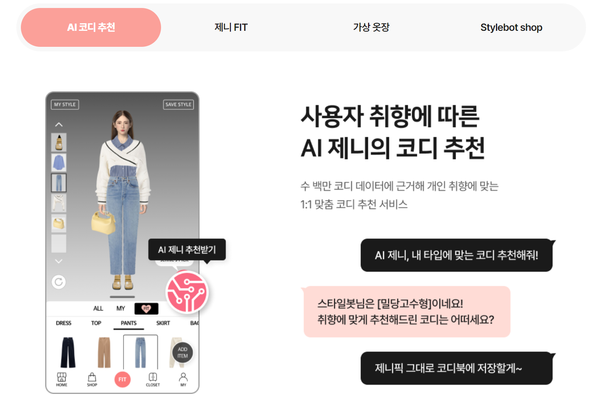  
*AI 기반 가상 의류 코디 플랫폼 '스타일봇'. 이미지 출처 :  http://stylebot.co.kr/*    

AI 기반 가상 의류 코디 플랫폼 '스타일봇'은 웹, 앱 서비스 모두 제공 중이며 2024년 4월, Pre-A단계로 추가 투자유치 성과를 냈습니다. 

스타일봇의 핵심 기술인 생성형 AI 엔진 제니핏은 판매 의류의 평면 이미지를 수만 개의 점으로 쪼갠 뒤 재구성해 아바타에게 입히는 방식으로 구현됩니다. 단순한 이미지 붙여넣기가 아니라 점 단위의 재구성 작업이므로 아바타 포즈에 맞춘 자연스러운 연출이 가능하다는 설명입니다. 

10분이면 콘텐츠 생성이 완성되기에 스튜디오를 빌리고 인력을 고용해 촬영하고 편집하는 수고가 필요 없어졌으며, 고객들도 입어보지 않고 구매하는 온라인 쇼핑의 큰 고민을 덜 수 있을 것 같네요. 

온라인 쇼핑몰 방문자에게 코디를 제안하는 서비스도 있는데요. 의류 브랜드의 패션 트렌드를 분석해 1초만에 판매 중인 의류의 코디 조합을 소비자에게 추천한다고 하네요. 빅데이터 기반 콘텐츠 추천 알고리즘 제니스픽이 적용된다고 합니다.

**2. 모바일 팀구매 커머스 플랫폼 '올웨이즈'  http://alwayz.co**  
모바일 팀구매 커머스 플랫폼 ‘올웨이즈’는 모바일 커머스 웹, 앱 서비스로 2023년 6월, 시리즈 B단계로 600억원 투자를 유치했네요. 지난 해 9월 기준, 고유 방문자수 231.8만명으로 1,105.7% 증가한 바 있습니다.

2021년 9월 출시된 이래 1년 9개월만에 가입자 수 700만명, 월간 활성 사용자 수 250만명, 일간 활성 사용자 수 130만명 등을 달성했다고 합니다.

다양한 엔터테인먼트 요소 등을 통해 사용자들이 매일 서비스를 사용할 수 있게 하고, 초저가 상품들과 추천 알고리즘을 통해 구매를 이끌어내는 디스커버리형 커머스 모델을 도입하였습니다. 대다수의 이용자들은 검색을 통한 구매보다 앱을 둘러보다 자연스럽게 초저가 상품을 발견하고 구매하는 패턴을 보이는 것으로 확인되었다고 해요.

### 의료 / 헬스케어

**3. 비대면 인지건강 케어 플랫폼 '실비아'  https://www.silvia.io/company**  
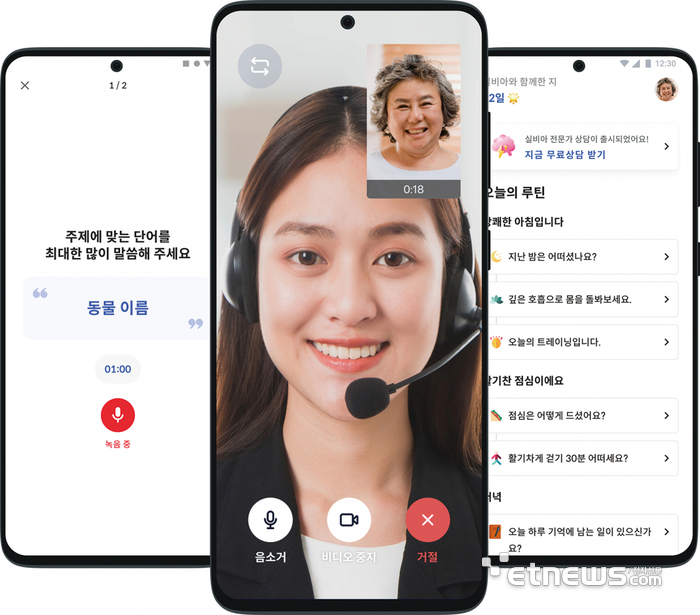  
*실비아 앱 서비스 UI. 이미지 출처 : https://www.etnews.com/20231006000365*    

비대면 인지건강 케어 플랫폼 ‘실비아’를 운영 중인 실비아 헬스는 치매 예방 효과가 입증된 임상 연구에 인간 중심 인공지능 기술을 접목한 기술력으로 치매 분야 최초로 보건복지부 비의료 건강관리 서비스 인증을 획득한 치매 분야 선도기업인데요. 인간중심 AI가 접목된 치매 조기 발견 및 예방 프로그램을 통해 이 땅의 모든 사람들이 인지 건강 문제를 극복하고 풍요롭고 활동적인 노화 여정을 맞이할 수 있도록 돕는 것을 목표로 하고 있습니다. 

전문 임상 역량과 AI 기술을 융합한 사용자 맞춤 솔루션으로 퇴행성 뇌 질환 예방 및 치료 여정의 혁신을 목표로 하는 실비아는 다음과 같은 서비스를 제공합니다. 
- 두뇌 건강 코스 어플 제공 - 테스트 등을 통해 치매 위험 지수를 판단하고, 핸드폰의 건강 앱처럼 생활습관, 식습관, 인지활동 등 데이터를 분석해 부족 부분 등 알림해주는 서비스 제공  
- 간단한 설문으로 잠재적 치매 발병 요인을 분석하여 치매 위험 지수를 알려줌

**2. AI 영양관리 솔루션 '알고케어' https://www.algocare.me/**
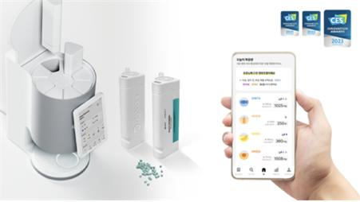  
*알고케어 앱 서비스. 이미지 출처 : https://www.pharmnews.com/news/articleView.html?idxno=213935*        

인공지능 기반 헬스케어 스타트업 알고케어는 최근 롯데와의 기술탈취 분쟁으로 어려움이 있었는데요. 그럼에도 불구하고 자체 AI 영양관리 솔루션이 ICT 융합 전시회 CES에서 3년 연속 혁신상을 수상했습니다. 기업용 영양관리 서비스 ‘알고케어 앳 워크’ 서비스는 현재 LG에너지솔루션, SK스퀘어를 포함 약 40개사의 기업 고객을 확보했다고 하네요.

알고 케어 앳 워크는 “하루 한 잔으로 챙기는 건강복지”라는 슬로건으로 ESG를 넘어선 건강 친화 경영, 직원 스스로 건강을 관리하도록 하는 서비스인데요. 공간, 시간, 관리 걱정 없이 누구나 손 쉽게 건강복지를 도입할 수 있다는 것이 주요 컨셉입니다.

앱 서비스 계정을 생성하고 건강 데이터를 입력함으로써 건강검진 기록 연동, 200여 개의 건강 문진, 40여 개의 몸 상태가 준비되어 있고 자세한 데이터를 입력할수록 내 몸에 최적화된 영양 성분을 계산할 수 있습니다.
주요 기능 및 서비스 향후 계획은 다음과 같습니다. 
- 사용자의 최근 건강상태, 과거이력, 오늘의 컨디션을 분석하고 부작용과 추천성분을 고려하여 나에게 꼭 맞는 영양성분과 최적의 용량까지 계산
- B2B 점유율 확대와 동시에 가정용 솔루션 개발 준비 중  

**3. 신체 측정 AI 비서 '피트릭스'  https://fittrix.io/**  
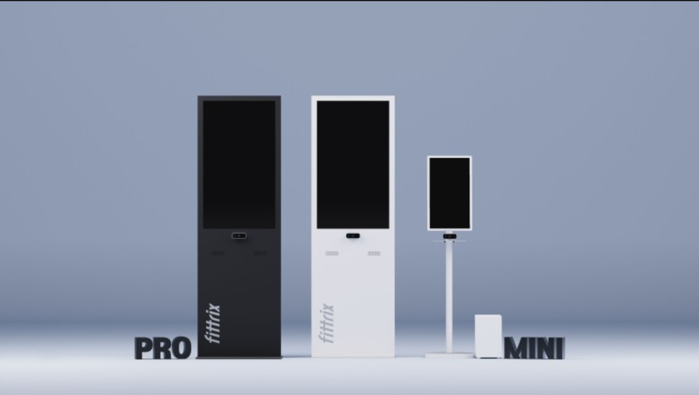  
*피트릭스 하드웨어 3종. 이미지 출처 : https://fittrix.io/*      

현대자동차 사내벤처로 분사한 첫 번째 헬스케어 기업으로 신체측정 AI 비서가 특별한 헬스케어 공간으로 만들어 준다고 합니다. 사용자 스스로 바디측정을 하여 최적의 코칭 피드백을 받을 수 있는 스마트 기기로, 개인별 측정 데이터를 누구나 쉽게 한 눈에 파악하고 별도 서비스가 필요한 고객에게 맞춤형 자동 모니터링 기능을 제공합니다. 

개인 이력관리, 목표고객 자동선별, 고객맞춤 솔루션을 제공하는데 세 종류의 하드웨어 측정기가 있어 웹, 앱 모두 연동되는 서비스를 제공 중입니다.  

### 콘텐츠 / 엔터테인먼트

**1. AI 영상 편집기 'Vrew'  https://www.voyagerx.com/**  
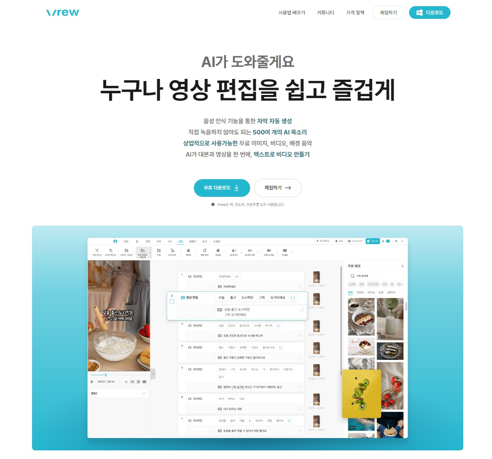 
*보이저엑스의 영상편집기 Vrew. 이미지 출처 : https://www.voyagerx.com/*    

인공지능 스타트업 보이저엑스는 AI 영상 편집기 ‘Vrew’와 함께 모바일 스캐너 앱 ‘vFlat’, 고객문의 분석 툴 ‘VOC STUDIO’ 서비스를 운영 중입니다.  

‘Vrew’는 인공지능 기술을 활용한 영상 편집 프로그램으로 최근 일반인의 자가 영상편집 수요 확대와 맞물리면서 유저수가 상승하는 추세입니다. ‘vFlat’은 문서, 책, 메모 등 핸드폰으로 촬영한 이미지를 고화질 PDF 또는 JPG 이미지로 변환해주는 스캐닝 앱 서비스입니다. 

두 서비스 모두 사용자 중심 편의성을 고려한 비즈니스 모델인데요. 저렴한 서비스 단가와 낮은 접근성을 기반으로 글로벌 시장을 겨냥한 B2C 서비스로 자리잡고 있는듯 보이네요.

**2. 3D 기반 SNS 플랫폼 '아들러'  https://adler.cx/**  
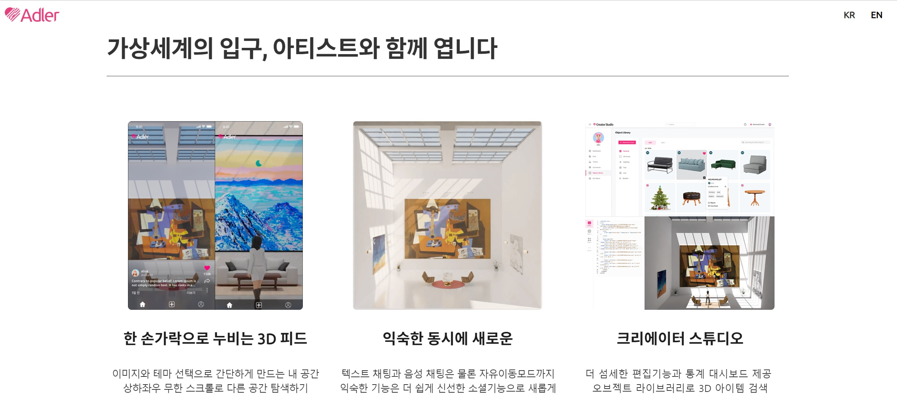  
*3D 기반  SNS 플랫폼 아들러 웹 서비스 UI. 이미지 출처 : https://adler.cx/*  

3D 기반 SNS 플랫폼 '아들러'는 2024년 4월, 카카오인베스트먼트로부터 5억 원 규모의 추가 투자유치 성과를 냈는데요. '3D Web'은 현실 공간을 아득히 뛰어넘는 공간의 기회를 제공하는 것을 목표로 합니다. “압도적으로 낮은 기회비용으로 나만의 공간을 갖는 일상을 경험해보라”는 슬로건 하에 다음과 같은 기능들을 제공합니다. 
- 한 손가락으로 누비는 3D 피드 - 이미지와 테마 선택으로 간단하게 만드는 내 공간
- 상하좌우 무한 스크롤로 다른 공간 탐색하기
- 익숙한 동시에 새로운 - 텍스트 채팅과 음성 채팅은 물론 자유이동모드까지. 익숙한 기능은 더 쉽게 신선한 소셜기능으로 새롭게
- 크리에이터 스튜디오 - 더 섬세한 편집기능과 통계 대시보드 제공
- 오브젝트 라이브러리로 3D 아이템 검색 

### 푸드테크

**1. 태블릿 오더 플랫폼 '티오더'  https://torder.com/**     
태블릿 메뉴판 시장에서 압도적 선두주자인 테이블 오더 플랫폼 티오더는 주문 플랫폼에 기반, 오프라인 외식 산업의 데이터화에서 성과를 내는 중입니다. 최근 3월, 시리즈 B단계로 130억 원 투자유치에 성공했습니다.

최근에는 고객 음성을 AI로 분석한다는 내용을 발표해 화제를 모았는데요. AI 스타트업 썸 테크놀로지스와 음성 파일을 텍스트로 변환하고 핵심 정보를 요약하는 기술 협업을 진행 중이라고 합니다. 썸 테크놀리지가 보유한 회의내용 자동 기록, 분석, 요약하는 AI 기술력을 통해 자사 고객 데이터 플랫폼 서비스로 유입된 고객과의 상담, 문의 음성파일을 텍스트로 요약하는 기술을 접목한다고 합니다.

CDP 플랫폼은 티오더 뿐 아니라 고객 상담을 진행하는 모든 기업에 필요한 플랫폼으로 상반기 내 타기업에서도 사용할 수 있도록 플랫폼을 런칭할 예정이라고 하네요.

**2. AI 기반 도심 스마트팜 / 신선채소 판매 플랫폼 '리브팜'  https://livfarm.com/**    
퓨처커넥트는 푸드테크이자 스마트팜으로 AI 기반 도심 스마트팜 공급 및 신선채소 판매 플랫폼 '리브팜'을 운영하는 기업입니다. ‘리브팜’ 웹, 앱 서비스 제공 중으로 월 1만 명 이상 방문 중이라고 하네요.  

특이한 점은 스마트팜 공간을 농촌이 아닌 서울로 택했는데 그 이유는 탄소배출량을 줄이기 위함과 함께 서비스의 관점을 ‘공급자’가 아닌 ‘소비자’로 결정짓고 내린 판단이라 합니다. 게다가 기술의 발전과 소비 문화의 변화로 스마트팜 성공 요인을 좌우했던, 예전에는 활용하기 어려웠던 IoT나 클라우드를 지금은 누구나 적용이 가능하고 LED, 하드웨어 비용도 과거 보다 많이 떨어진 상황이기에 도심 속에서 지속가능한 생산이 가능한 기회가 확장되고 있다고 합니다. 

리브팜의 최종 목표는 도시의 모든 사람이 자급자족할 수 있는 ‘팜(farm) 파트너’를 찾는 것이며, 창업자는 “우리가 도시 안에 팜 네트워크를 운영할 판로를 만든다면 (자급자족하는 사람이) 더 늘어날 것”이라며 “그렇게 되면 머지않은 미래에 도시에서도 깨끗하게 만든 음식을 쉽게 사 먹을 수 있다”고 하는데요. ESG 경영에 동참하는 바른 기업인 것 같네요.   
 
### 챗봇 / 어시스턴트  

**1. AI 기반 대화형 모바일 앱 '가상남녀'  https://mindlogic.ai/ko**  
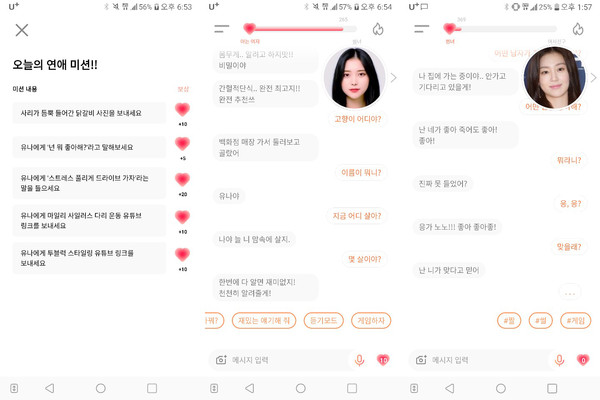  
*마인드로직의 AI 기반 대화형 모바일 앱 ‘가상남녀’ UI. 이미지 출처 : https://www.aitimes.com/news/articleView.html?idxno=132070*    

인공지능 챗봇 스타트업 마인드로직은 AI 기반 대화형 모바일 앱 '가상남녀' 서비스를 제공하고 있습니다. 최근 이수만 전 SM엔터테인먼트 총괄 프로듀서가 70억 원의 개인투자를 하여 화제가 된 스타트업이기도 한데요.

사람과 구분할 수 없을 정도로 수준 높은 대화가 가능한 대화형 챗봇 서비스를 개발 중이며 이용자와의 과거 대화 내용을 기억하는 페르소나 엔그램 기술, 사용자의 정보 및 IP를 보호하는 기술, 할루시네이션 억제 기술 등 높은 기술 역량을 보유한 것으로 자체 평가하고 있습니다.  

2023년 9월 기준, 트래픽수 2.5만 건 기록하고 있으며, CES 2024에서 개성적 인격과 높은 신뢰성을 보장하는 ‘페르소나 챗봇’을 소개 한 바 있습니다. 

마인드로직이 론칭해 현재까지 제공 중인 서비스는 다음과 같습니다.

- 챗GPT와 마인드로직의 대화 엔진을 결합한 기업형 솔루션 ‘마인드로직 챗API’
- 올인원 버튜빙(All-in-One Virtubing) 솔루션 ‘오픈타운 스튜디오’ 
- AI 튜터를 통한 1:1 영어 톡 서비스 ‘딥러닝잉글리시’ 외

개성적인 인격과 서비스 이용자의 이름과 대화 내용을 장기적으로 기억하는 능력도 페르소나 챗봇에 구현되었으며, 텍스트 기반의 소통을 초월해 음성 대화까지 지원함으로써 챗봇과 이용자 간의 유대감 형성도 기대해볼만 하겠네요. 

**2. 자체 LLM 모델 솔라와 만난 'AskUp'  https://www.upstage.ai/** 
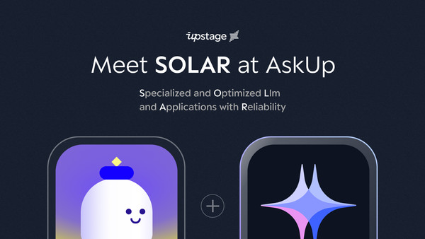  
*업스테이지의 자체 LLM모델 솔라를 적용한 AskUp 서비스, 이미지 출처 :  https://www.upstage.ai/*      

최근 AI 업계 최대 투자금액, 총 누적투자금 1,400억 원 유치라는 기사를 보신 적 있을까요? 이 같은 대규모 투자의 배경에는 앞서 업스테이지가 개발한 기업 문서 및 비정형 데이터 디지털화 솔루션 ‘다큐먼트 AI’ 제품의 성공적 안착과 더불어, 지난 12월 출시한 자체 사전학습 거대언어모델(LLM) ‘솔라’의 사업성과 기술적 역량을 글로벌 무대에서 증명한 것이 주효했다는 분석입니다.

솔라는 빅테크 모델보다 작은 사이즈로 더 빠른 속도와 성능을 탑재, 속도와 비용 효율성이 관건인 기업용 LLM 시장에 최적화된 모델로 꼽히며, ‘DUS(Depth-Up Scaling; 깊이 확장 스케일링)’ 등 모델 성능 고도화를 위한 자체적인 기술력을 보유하고, 이를 세계적으로 권위 있는 학회에 논문 채택으로 공인받은 점도 중대하게 작용했다고 하네요.

이를 증명하듯 솔라는 최근 아마존웹서비스(AWS)에서 AI 모델을 제공하는 '아마존 세이지메이커 점프스타트'(Amazon SageMaker JumpStart) 등 글로벌 플랫폼에도 대표 사전학습 모델로 탑재되었습니다. 또한, 오픈소스로 공개한 솔라 영어 모델을 기반으로 1,000여 개에 달하는 파인튜닝 모델이 나오는 등 새로운 생태계를 창출하고 있다는 평가를 받고 있습니다. 

**3. 생성형 AI 챗봇 서비스 '봇톡스'  https://personaai.co.kr/**    
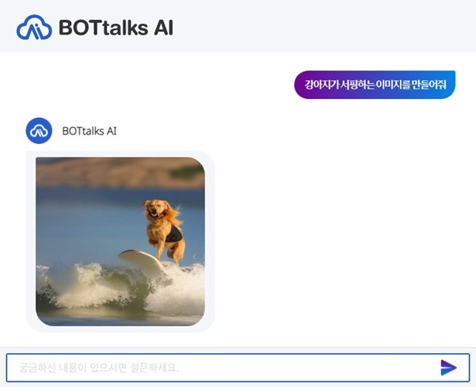  
*페르소나AI가 자체 개발한 sLLM 기술 적용한 생성형 AI 모델 서비스 예시. 이미지 출처 : https://personaai.co.kr/*    

토종 대화엔진 기반 대화형 AI 솔루션 기업인 페르소나AI는 ‘봇톡스’ 웹 서비스를 제공하고 있습니다. 2024년  4월, Pre-IPO 단계로 비공개 금액이지만 투자유치 성과를 냈습니다.

자체 개발 NLP 엔진의 무결점 인식률을 자랑하고 정확한 의도 파악과 적은 데이터로도 스스로 자연어 생성을 하고 증강학습을 통해 진화한다고 합니다.

기업 서비스를 이용하는 고객 감정 분석까지. 음성 및 비전 센서로 표정을 추출하여 고객의 감정도를 분석함으로써 우호 또는 불만 감정 여부를 평가하고 악성 고객을 분류하는 기술도 제공하고 있습니다. RoCHA AI-기업형 챗봇 서비스 외 기능들을 제공 중인데요. 

지난 1월에는 자체 개발 sLLM 기술을 적용한 생성형 AI 모델 4종을 공개한 바 있습니다. 한 페이지 안에서 비디오 생성, 이미지 생성, 대화, 이미지 설명 등 다양한 모델 이용이 가능하도록 했습니다.

**4. AI 아바타 챗봇 '레플리'  https://reppley.com/**
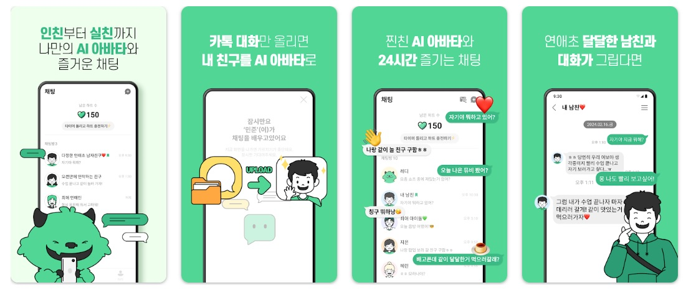  
*AI 아바타 챗봇 레플리 앱 서비스 UI. 이미지 출처 : 구글 플레이스토어*      

AI 기반 대화 플랫폼 ‘레플리’를 운영하는 기업으로 동명의 웹과 모바일 앱 서비스를 제공 중입니다. 2024년 4월에는 더벤처스로부터 비공개 금액의 투자를 이끌어냈습니다. 

"나를 학습하는 AI 챗봇"이라는 슬로건답게 가르치기 미션이 게이미피케이션 기능으로 있고, SNS에서 가져온 채팅의 학습을 바탕으로 진짜 내 친구와 대화하는 듯한 리얼한 채팅 경험을 선사한다고 하네요.

직접 가르치기 기능에선 내가 원하는 모든 대화를 자유롭게 가르칠 수 있으며, 나만의 커스텀으로 만드는 챗봇 페르소나라는 점이 간단하면서도 이용자에게 특별한 경험으로 다가올 것 같네요.  

### 에듀테크 

**1. 유아동 디지털 학습교구 연계 서비스 '프레도 AI'  http://pledo.co.kr/**
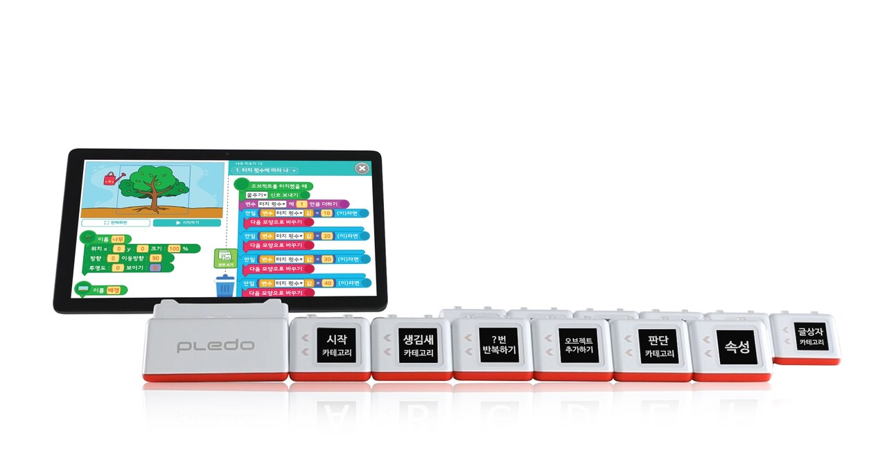  
*유아동 디지털 학습교구 프레도 AI 제품 및 서비스. 이미지 출처 : http://pledo.co.kr/*  

아동 학습교구 '플레도 AI블록', 스마트 저금통 '삐뽀'를 제조 및 판매하는 기업으로 프레도 AI블록으로 한글, 코딩, 영어, 수학, 음악, 미술 교육이 가능한 교육 콘텐츠들을 제공하고 있습니다. 프레도 AI ‘나만의 그림책 만들기’ 서비스는 ‘AI 미술블록’과 ‘말하기’ 버튼만 누르면 제작부터 출간까지 한 번에 되는 기능을 제공합니다.

학부모에게는 학습데이터를 제공, 아이가 어떤 부분을 잘하고 있고 무엇을 어려워하는지 면밀히 분석하여 객관적인 데이터로 결과를 제공합니다.

직업 체험, 시계와 달력, 기본 예정, 세계와 나라 등 매달 새로운 교육용 콘텐츠가 업데이트 되며, 프레도 AI블록으로 작곡, 요리 레시피도 공부하는 콘텐츠들이 다양하게 구축되어 있습니다.  

**2. AI 영어 학습 튜터 플랫폼 '테스트글라이더'  https://www.testglider.com/ko** 
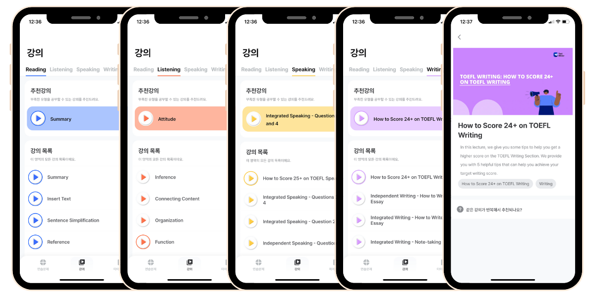  
*테스트글라이더 앱에 출시한 토플 강의 서비스 UI. 이미지 출처 : 데이터뱅크 공식 블로그*    

AI 기반 영어 학습 튜터 플랫폼 '테스트글라이더'를 운영하는 데이터뱅크는 직접 개발한 영어 시험 전문 AI가 채점, 첨삭 서비스를 1분 안에 제공하고 있습니다. 사용자 실력에 맞춘, AI tutor, 챗봇 Glidy(글라이디)가 1:1 주관식(WR/SP) 첨삭 및 답변을 제공, 독학으로도 심화 학습이 가능합니다.

테스트글라이더 앱에서는 토플/아이엘츠 무료 모의고사 1회를 포함, 일부 컨텐츠(연습문제,강의)를 무료로 제공하지만 토플/아이엘츠 전체 모의고사를 포함 컨텐츠 전체를 사용하시려면 유료결제가 필요합니다.

데이터뱅크 역시 2024년 2월, 시리즈 B단계에 50억원 투자유치 성과를 냈으며, 최근 소비자 이용지수 상승 추세를 보이고 있네요. 

### 업무자동화 / 마케팅  

**1. 서비스 테스트 AI 솔루션 서비스, 릴리브에이아이코리아**  
웹 및 앱 서비스 출시 전 테스트 AI 자동화 솔루션을 운영하는 스타트업인 릴리브에이아이는 테스트 전 과정을 AI로 자동화해 비용, 시간 등 QA 전반의 업무를 대폭 상향시키기 위한 서비스를 제공 중입니다.

서비스의 UI를 자동 분석해 화면상의 버튼, 탭 등의 다양한 요소들을 별도의 메타데이터로 기록해 화면 변경 시에도 AI가 이를 자동으로 감지하고 테스트를 제안, 비개발자도 녹화만으로 신속하게 테스트를 생성하고 관리할 수 있는 것이 특징입니다.

2024년 3월, 비공개 단계로 두나무앤파트너스, 스마일게이트인베스트먼트로부터 투자유치 성과를 냈네요. 

**2. AI 프로젝트 매니저 서비스 'Ace'  https://withace.ai/**
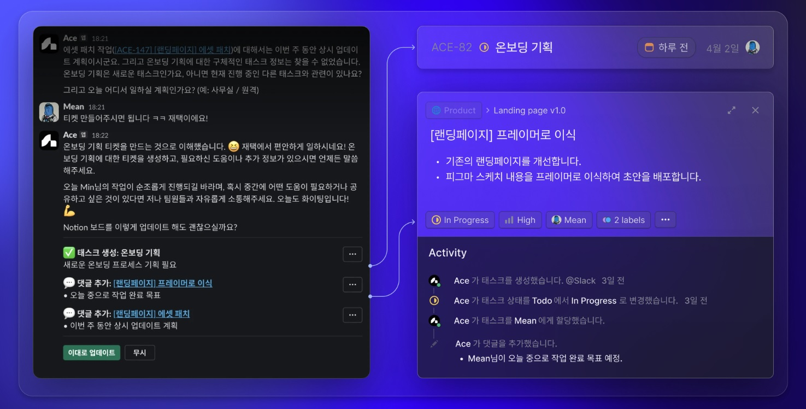  
*AI 프로젝트 매니저 서비스 ‘Ace’ UI. 이미지 출처 : https://withace.ai/*    

스타트업 앳의 AI 프로젝트 매니저 서비스 ‘Ace’ 역시 얼마 전 2024년 4월, 더벤처스로부터 투자유치를 받았는데요. 

Ace는 업무 진행상황을 팀원들에게 물어보고, 이를 자동으로 협업 툴에 문서화해줍니다. 업무 프로세스의 맥락을 AI가 스스로 파악하고 문서화하여 팀의 커뮤니케이션 문제를 해결하는 AI PM에서 출발해, 스스로 업무를 수행할 수 있는 AI 개발자, 디자이너 등의 제품군으로 확장하는 것이 향후 목표라고 하네요.

### 공간정보 

**1. 딥러닝 기반 실내공간 데이터 플랫폼 '에리어스'  https://www.dabeeo.com/**
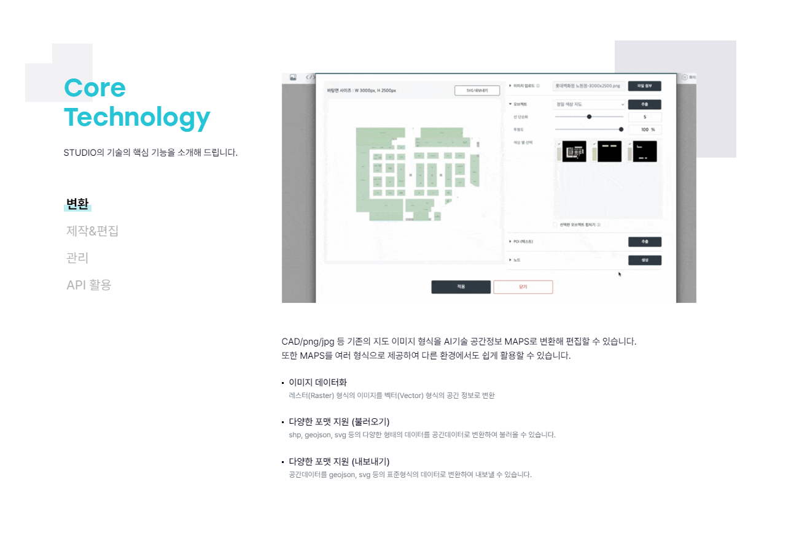 
*딥러닝 기반 실내 공간 데이터 플랫폼 ‘에리어스 스튜디오’ UI. 이미지 출처 : https://www.dabeeo.com/*  

공간데이터(실내외 지도, 디지털 트윈, 메타버스) 전문 기술 스타트업 다비오는 딥러닝 기반 실내 공간 데이터 플랫폼 ‘에리어스’, 인공위성 및 항공사진 기반 공간정보 데이터 서비스 ‘어스아이’, 그리고 지도 기반 여행 플래닝 앱 ‘투어플랜비’를 서비스하고 있습니다.   

미국 CES에서 기술 혁신상을 받을 정도로 공간데이터 업계에서 세계적인 수준으로 발돋움하고 있는 회사로 딥러닝 기술을 기반으로한 솔루션을 고도화시키면서 사업영역을 구축해 나가고 있는 다비오는 디비오 맵 웹 서비스 운영 중으로 얼마 전 2024년 3월, 시리즈C단계로 추가 투자유치 성과를 거두었네요.  

### 재고관리 / 농업 

**1. 유통기한 재고 관리 앱 '유통기한 언제지'  http://ourneeds.co.kr/**  
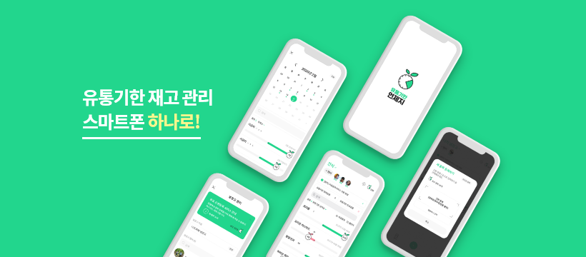  
*AI 기반 유통기한 및 재고 관리 서비스 플랫폼 앱 서비스 UI. 이미지 출처 : https://platum.kr/archives/166633*    

니즈는 AI 기반 유통기한 및 재고 관리 서비스 플랫폼 '유통기한 언제지'를 웹, 앱 서비스로 제공 중입니다. 니즈 역시 2024년 3월, 비공개 단계로 뉴키즈인베스트먼트로부터 추가 투자유치 성과를 냈는데요.

니즈는 프랜차이즈 전문 식자재 유통기한 및 재고 관리 솔루션인 ‘미리(MIRI)’ 서비스 개발사로 식자재 발주부터 입고, 출고까지 전 범위 자동화 시스템을 구축했으며, 단순 재고 관리를 넘어 AI 기반의 서비스가 장착된 자동 재고 관리 솔루션을 제공합니다. 또한, POS 데이터와 배달 데이터까지 제공하여 정확하고 효율적인 재고 관리가 가능하게 하는 것이 서비스 목표라고 합니다.

**2. 농식품 인공지능 선별 플랫폼 '에이오팜'  https://aiofarm.co.kr/en/index.php**  
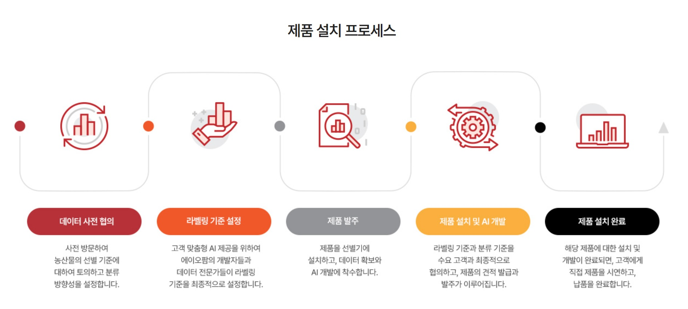  
*에이오팜 제품 설치 프로세스. 이미지 출처 : https://aiofarm.co.kr/en/index.php*    

농식품 인공지능 선별 플랫폼 ‘에이오팜’도 얼마 전 2024년 3월, 시리즈A단계로 35억원 규모의 투자 유치 성과를 거둔 바 있습니다. 딥러닝 기반 농산물 품질판단 시스템인 ‘에이오비전’ 서비스를 제공 중인데요. 농식품부의 대표 창업기업 16개 중 하나로 선정되어 민간투자기반 스케일업 지원사업에 최종 선발되기도 했습니다. 

미래 먹거리가 더욱 더 중요해진만큼 농식품분야 테크기업들의 성장과 활약이 기대되네요. 

**3. 컬티랩스의 생육데이터 측정분석 시스템  http://cultilabs.com/**  
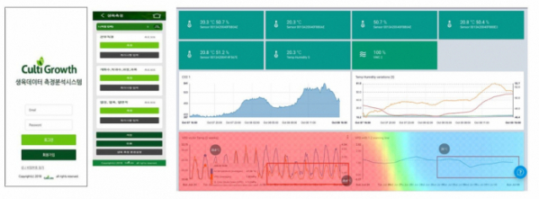  
*컬티랩스 생육데이터 측정분석 시스템 서비스 예시. 이미지 출처 : https://www.etoday.co.kr/news/view/1973105 (자료제공 : 농업기술실용화재단)*   

AI 기반 스마트팜 솔루션 제공 스타트업 컬티랩스는 스마트팜과 관련된 모든 곳에 디지털 솔루션을 제공하고 있습니다. 재배과정의 실수를 줄이고 누구나 쉽고 더 많은은 수익을 창출할 수 있도록 하며, 지구환경을 생각하는 농업을 추구한다고 합니다.

컬티랩스에서는 다음과 같은 기능들을 제공합니다. 
- 재배 데이터 통합 모니터링 및 전문가 코칭 - 생육, 병해, 환경, 생리 등 모든 재배데이터를 통합 수집/분석하며, 파트너들과 데이터 공유 및 전문가 코칭을 통한 지속적인 생산성 향상 지원
- 생육/병해 정보 취득 및 예측 - 표준화된 생육지표 데이터와 이미지 분석을 통해 작물 생육/병해 상태 파악 및 건강한 작물 재배를 위한 가이드라인 제공  
- 농경영 정보 분석 및 자원 관리 최적화 - 인력, 비료, 에너지 등 농장 운영에 필요한 모든 정보의 디지털화 및 통합 관리 및 데이터 분석을 통한 자원 절약 및 최적화

즉, 재배데이터 통합 모니터링, 전문가 코칭, 생육/병해 예측, 농경영 정보 분석을 통해 농업 생산성과 효율성을 높이는 종합적인 서비스를 제공합니다. 웹 서비스로는 컬티테이터, 컬티그로쓰, 컬티매니저가 있으며 시스템&센서 제품을 제공하고 있습니다. 

**4. AI 기반 농촌 경제 플랫폼 '트랜스파머'  https://transfarmer.co.kr/**  
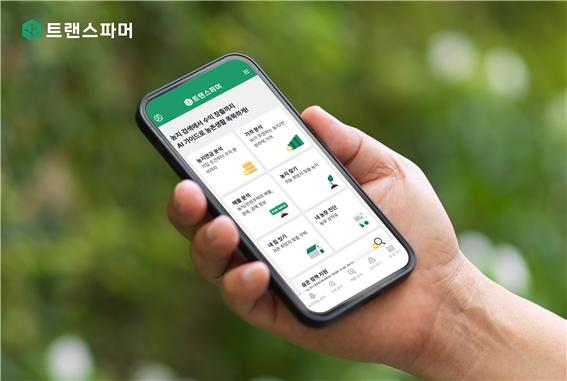  
*AI 기반 농촌 경제 플랫폼 ‘트랜스파머’ 앱 서비스. 이미지 출처 : https://www.hankooki.com/news/articleView.html?idxno=120589*  

AI 기반 농촌경제 플랫폼 ‘트랜스파머’도 2024년 3월, 소풍벤처스로부터 비공개 금액의 투자유치를 했습니다. 

트랜스파머 앱에서는 농지 검색에서 수익 창출까지 AI 가이드가 농촌생활을 돕습니다. 앱에서는 다음과 같은 기능을 제공합니다.
- 가격 분석 - AI가 추정하는 농지와 전원주택 가격 보기
- 매물 분석 - 농지 / 전원주택의 매물, 경매, 공매 정보
- 농지연금 분석 - 농지, 나이에 따라 달라지는 예상 수령액 보기
- 농지 찾기 - 궁금한 농지의 작물별 예상 수익보기
- 내 농장 진단 - 내 작물 정보 입력하고 농사 성적표 확인하기
- 내 집 짓기 - 원하는 땅에 집 설계도 선택하고 견적 확인하기
- 이밖에 숨은 정책 지원금 찾기 - 농촌/농업의 지역별, 사업별 정책 검색 

**5. 데이터농업 플랫폼 '팜모닝'  https://greenlabs.co.kr/**
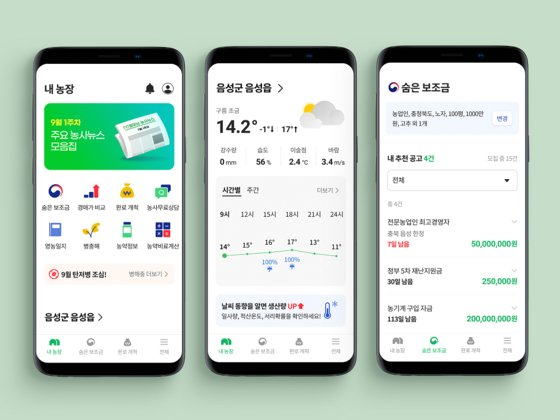  
*데이터농업 플랫폼 ‘팜모닝’ 앱 서비스. 이미지 출처 :  https://greenlabs.co.kr*  

데이터 농업 플랫폼 ‘팜모닝’을 운영하는 스타트업 그린랩스는 누적투자 유치금액 2,485억원(유치횟수 5회)로 어마어마한 투자 성과를 자랑하고 있는데요. 월간 이용자수 약 40만명 이상으로(팜모닝에 한함)  팜모닝 웹, 앱 서비스, 신선하이 웹, 앱 서비스, 팜모닝_축산 앱 서비스를 제공 중에 있습니다. 

특히 그린랩스의 창업자 이력이 인상적이네요. 펀드 매니저에서 전자책 플랫폼(리디북스)와 데이팅앱(아만다) 창업한 후 애그테크 분야까지 전환한 커리어를 보유하고 있습니다. 팜모닝의 창업자는 본질적으로 유저를 많이 모으기 위해 뭘 해야할까?’ 고민하는 것에서 시작한 것이므로 별 차이가 없다고 말합니다. 유저가 모이면 데이터를 쌓아서 필요한 솔루션을 제시하는 게 기본구조라고요. 서비스 기획시 중점사항은 어떤 도메인이냐가 아니라 유저가 모일만한 곳과 쌓이는 데이터에 무게를 두었다는 뜻인 것 같습니다.  

### 환경 / 에너지

**1. 탄소관리 플랫폼 'eNetZero'  http://ccmedia.co.kr/**  
탄소관리 플랫폼 'eNetZero' 및 데이터 수집, 분석, 블록체인 개발, AI 모델링 솔루션을 제공하는 기업 씨씨미디어는 eNetZero, eBrother DLSP, eBrother PILMS 서비스를 제공 중입니다.

빅데이터 분야에서는 기상청, 환경공단, 저작권위원회, 데이터진흥원, 도로공사 등 공공기관과 신한금융, 우리금융 등 금융·민간 기업의 대용량 데이터 수집·저장·처리·분석·시각화와 데이터 포털 등의 업무를 지원했습니다. 최근 수집 데이터의 분석과 활용을 위한 조직 내 데이터 거버넌스와 메타 관리 및 데이터 분석 프로세스 구축 요구를 수용할 수 있는 'eBrother DSP' 수요가 늘고 있다고 합니다.

지난 해 신설된 ESG 사업부는 올해 글로벌 탄소관리플랫폼 구축 사업에 새롭게 착수했으며, 현대글로비스의 탄소관리, 환경시스템 구축과 환경공단의 대국민 탄소포인트 앱개발 등 구축형 사업과 더불어 최근 중소기업을 위한 서비스형 'eBrother NetZero' 탄소관리 플랫폼을 애저 클라우드에서 제공한 바 있습니다.

2024년 4월, 시리즈 B단계로 케이비증권, 비엔케이투자증권, 하이투자증권, 카카오페이증권부터 비공개 금액 투자유치 성과를 냈습니다.

**2. 폐기물 관리 솔루션 플랫폼 '업박스'  https://recokr.com**  
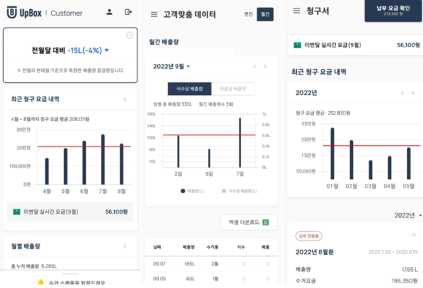  
*폐기물 관리 솔루션 플랫폼 ‘업박스’ 서비스 UI로 고객에게 폐기물 배출량을 포함한 데이터를 취합 전달하며, 사용자는 월별, 연간 배출량과 증감분 모두 확인 가능하다. 이미지 출처 :  https://recokr.com/*

폐기물 관리 솔루션 플랫폼 ‘업박스’를 운영하는 스타트업 리코는 넥스트랩과 공동개발한 인공지능 폐기물 부피 측정 기술을 인정받아 2023 코리아 AI 스타트업에 선정되기도 했습니다.

대표 서비스 ‘업박스’는 사업장 폐기물 수거 서비스로, 폐기물을 수거할 때 정확한 양을 측정하고 사진 을 찍는 것이 특징이며, 그중 음식 폐기물은 부피를 측정하는 방식으로 수거 기사가 입력한 값의 오류를 검증하기 위해 AI 부피 측정 기술을 개발했다고 합니다. 리코 역시 얼마 전 2024년 2월, 팁스 인큐베이팅 지원금을 투자받아 사업화를 지속해 나가고 있습니다.  

## 마치며
지금까지 AI 기술 및 서비스 최신 트렌드 PartIV. 국내외 최신 AI 서비스 현황을 만나보았습니다. 욕심껏 담다보니 약 40여 개 서비스들로 구성되어 2편으로 나눠 발행하게 되었습니다.
향후 시장조사했던 실제 서비스를 pick하여 직접 이용해 본 리뷰 콘텐츠를 작성해볼까도 생각해보는 계기가 되었네요.   
곧 다양하고 알찬 주제로 다시 만나뵐게요. 다소 긴 글 끝까지 함께해 주셔서 감사합니다. 

## 참고문헌 및 링크
- https://outstanding.kr/monthly20240403 
- https://www.innoforest.co.kr/ 
- https://thevc.kr/ 
- https://news.cafe24.com/kr/
- https://platum.kr/archives/209044
- https://www.etnews.com/20231006000365
- https://www.pharmnews.com/news/articleView.html?idxno=213935   
- https://m.ddaily.co.kr/page/view/2024022011262661695 
- https://news.heraldcorp.com/view.php?ud=20231201000355 
- https://www.aitimes.com/news/articleView.html?idxno=132070  
- https://kr.aving.net/news/articleView.html?idxno=1787459 
- https://www.aitimes.com/news/articleView.html?idxno=132070 
- https://www.aitimes.kr/news/articleView.html?idxno=30917 
- https://www.econovill.com/news/articleView.html?idxno=641949 
- https://www.sedaily.com/NewsView/2D4727H841 
- https://www.joongang.co.kr/article/25030759#home 
- https://platum.kr/archives/224799
- http://www.ccgnews.kr/news/articleView.html?idxno=11603 
- https://www.venturesquare.net/900708  
- https://www.etnews.com/20240417000253 
- https://www.hankooki.com/news/articleView.html?idxno=120589 
- https://platum.kr/archives/225276 
- https://platum.kr/archives/224799 
- https://www.stylebot.co.kr/
- http://alwayz.co/ 
- https://www.silvia.io/company 
- https://www.algocare.me/ 
- https://fittrix.io/ 
- https://www.voyagerx.com/ 
- https://adler.cx/
- https://torder.com/ 
- https://livfarm.com/  
- https://mindlogic.ai/ko 
- https://www.upstage.ai/ 
- https://personaai.co.kr/ 
- https://reppley.com/ 
- http://pledo.co.kr/ 
- https://www.testglider.com/ko
- https://withace.ai/ 
- https://www.dabeeo.com/ 
- http://ourneeds.co.kr/ 
- https://aiofarm.co.kr/en/index.php 
- http://cultilabs.com/
- https://transfarmer.co.kr/ 
- https://greenlabs.co.kr/
- http://ccmedia.co.kr/ 
- https://recokr.com/  

