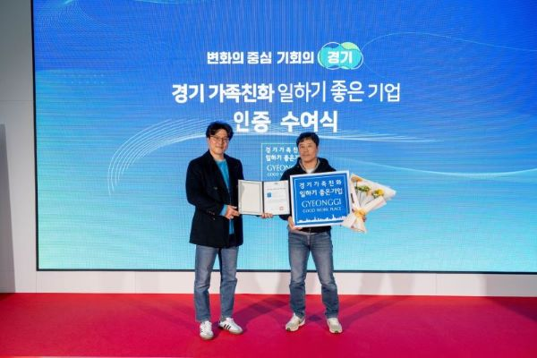
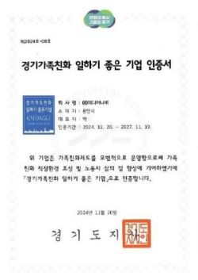
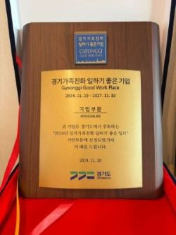

---
title: 2024 경기가족친화 일하기 좋은 기업 선정! 미디어나비가 만들어가는 특별한 문화
date: "2024-12-19T01:00:00.000Z"
category: "blog"
description: '육아'와 '커리어' 모두를 존중하는 IT기업의 새로운 시도. 2024 경기가족친화 일하기 좋은 기업으로 신규 인증 받은 미디어나비만의 특별한 조직 문화에 대해 이야기합니다. 
postauthor: "Anna"
---     

### 일과 삶의 균형, 미디어나비가 실천하는 가족친화 문화

안녕하세요. 안나입니다. 오늘은 오랜만에 반가운 뉴스와 함께 인사드리게 되었는데요.
경기도 용인시 소재 IT 기업인 저희 미디어나비가 경기도경제과학진흥원이 주관하는 '2024 경기가족친화 일하기 좋은 기업' 인증을 획득했다는 기쁜 소식을 전해드립니다!

*2024 경기가족친화 일하기 좋은 기업 인증 수여식, 이미지 출처 : 경기도경제과학진흥원*

사실 이 이야기는 한 워킹맘의 개인적인 스토리에서 시작되는데요. 자세한 이야기를 지금부터 풀어볼게요.

### Behind the Scenes
다소 개인적인 스토리로 시작될 것 같습니다만, 저희 회사의 가족친화제도 담당자는 이전에 공공기관에서 일했습니다. 그곳에서 가족친화기업 인증 담당자로 일하면서 겪은 아이러니한 경험이 있었죠. 대외적으로 명백한 가족친화 인증기업이었지만, 정작 본인은 일과 가정의 균형을 전혀 찾지 못했다고 합니다. 결국 자신의 행복을 위해 퇴사를 선택했고, 1년간의 육아 전념 후 새로운 도전을 시작했습니다. 지난 2022년, 미디어나비와의 인연이 시작되었습니다. 처음에는 프리랜서로 시작했는데 미디어나비에서 곧 특별한 점을 발견했죠. 겉으로 보이는 제도나 형식보다 더 중요한 것, 바로 진정한 배려와 이해가 있는 곳이었습니다.

### 우리가 만드는 특별한 문화

미디어나비는 조금 특별합니다. 대표이사부터 전 직원 모두가 육아기 근로자예요. 모든 구성원들이 워킹대디, 워킹맘이다 보니 서로의 상황을 더 잘 이해하고 배려하게 되는 것 같아요. 아이가 아파서 갑자기 재택근무를 해야 할 때도, 유치원 방학 때 아이와 함께 출근할 때도 눈치 보는 일이 없습니다. 특히 자랑하고 싶은 건 우리 회사의 하계휴가비 지원제도예요. 작은 기업이다 보니 넉넉한 복지제도를 운영하기가 쉽지 않은데도, 매년 직원들의 행복한 휴가를 위해 대표님이 마음 써주시는 부분이죠.

재미있는 에피소드도 있어요. 매년 연말이면 부담되지 않는 소소한 금액 내로 마니또 선물을 준비하는데, 한 번은 이런 일이 있었어요. 당시 홍일점 여직원이었던 담당자가 마니또 선물로 애프터쉐이브를 준비했는데, 하필 그 선물을 받은 동료가 수염 레이저 제모를 한 직원이었던 거예요. 쓸모없는 선물이 되어버린 웃지 못할 상황이 되었지만, 오히려 우리가 두고 두고 함께 웃을 수 있는 추억으로 남았답니다.

### 대표적인 가족친화제도

**1) 자유로운 자녀 돌봄 문화**
- 아이가 아플 때 부담 없는 재택근무 전환
- 돌봄공백 시 아이와 함께 출근 가능
- 간단한 휴가 신청 및 결재 시스템

**2) 직원 성장 지원**
- 연간 교육비 지원으로 자기계발 응원
- 업무 역량 강화를 위한 적극적인 교육 참여 독려
  
**3) 일과 삶의 균형**
- 매년 하계휴가비 지원으로 즐거운 여름휴가 보장
- 매주 수요일, '가족 사랑의 날' 정시퇴근 문화 정착
- 유연근무제의 활성화

*2024 경기가족친화 일하기 좋은 기업 인증서 및 인증패, 이미지 출처 : 미디어나비*

### 기술과 마음을 나누는 IT 기업

미디어나비는 2011년 설립된 이후 꾸준히 성장해온 IT 기업입니다. 2021년에는 한국언론진흥재단의 인공지능 언어모델 'KPF-BERT'를 공동개발하기도 했고, 자연어처리, 데이터 분석, 비전 AI 분야에서 혁신적인 솔루션을 제공하고 있죠. 하지만 우리가 가장 중요하게 생각하는 건 기술 그 이상의 가치입니다. "누구나 기술 없이도 인공지능을 누릴 수 있는 세상"을 만들고자 하는 우리의 미션처럼, 회사 안에서도 모두가 부담 없이 일과 가정의 균형을 누릴 수 있는 가족친화적인 환경을 만들어가고 있습니다.

이번 인증을 계기로 더 다양한 가족친화제도를 만들어가려고 해요. 직원 건강검진 지원도 하고 싶고, 다방면에서 복지혜택도 준비하고 싶습니다. 물론 모든 변화는 구성원들의 의견을 경청하며 함께 만들어갈 예정이에요. 우리는 작은 규모의 기업이지만, 그만큼 서로를 더 잘 이해하고 배려할 수 있다고 믿습니다. 행복의 크기는 어느 기업과 견주어도 결코 부럽지 않은, 그런 일터가 되고 싶습니다. 서로를 배려하고 행복한 마음을 나누는 우리 회사, 미디어나비는 오늘도 모든 구성원이 워라밸을 보장받는 행복한 일터를 만들어가고 있습니다.

### 참고 링크

- 경기도경제과학진흥원 https://www.gbsa.or.kr/