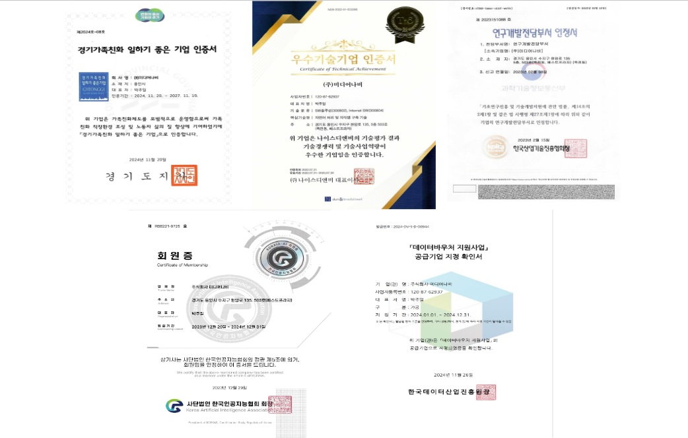
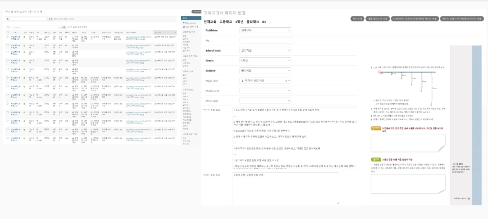
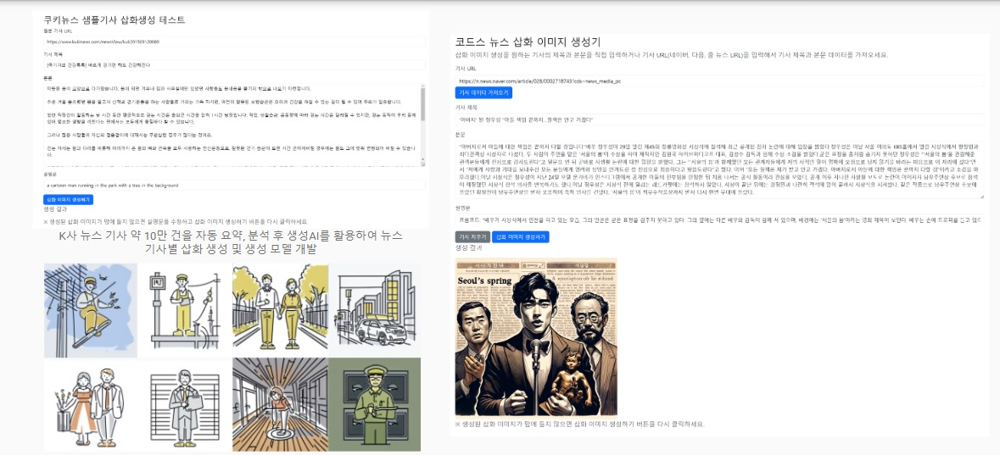
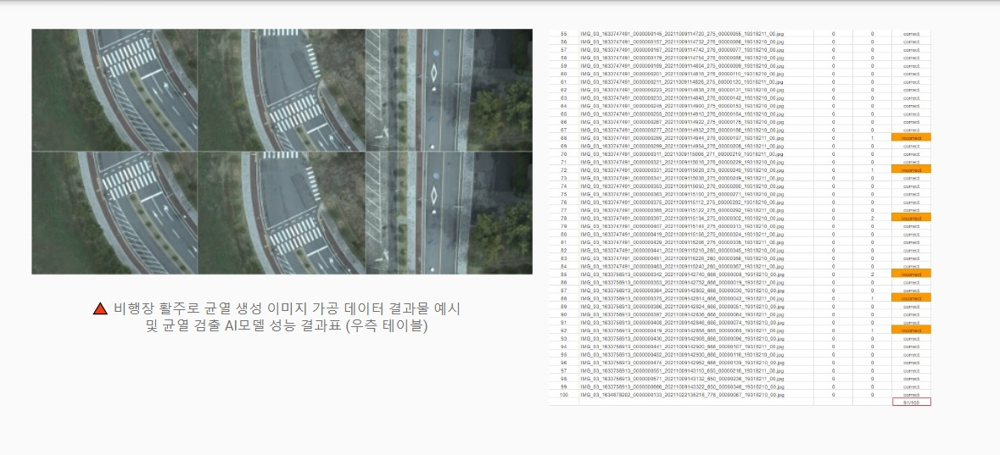

---
title: "비즈니스 혁신을 위한 데이터 전략 : 미디어나비 2025 데이터바우처 서비스"
date: "2025-04-04T01:00:00.000Z"
category: "blog"
description: "2025년 데이터바우처 사업을 통해 미디어나비가 공급하는 맞춤형 AI 활용 서비스를 소개하는 콘텐츠로, 소상공인과 중소기업이 데이터 활용 역량을 강화하고 비즈니스 혁신을 이루는 구체적 방안과 성공 사례를 담고 있습니다."
postauthor: "Anna"
---     

## 데이터, 그 무한한 가능성을 열다

디지털 시대, 기업의 경쟁력은 데이터 활용 능력에 달려 있습니다.  

하지만 많은 소상공인 및 중소기업들이 데이터의 중요성은 인식하면서도 실질적인 활용과 구현에 어려움을 겪고 있는데요.

- ##### 데이터 분석을 위한 인프라와 전문 인력이 부족하신가요?

- ##### 데이터 기반 의사결정으로 전환하고 싶지만 어디서부터 시작해야 할지 막막하신가요?

- ##### AI 기술을 도입하고 싶지만 비용과 기술적 장벽이 높게 느껴지시나요?  

2025년 데이터바우처 지원사업은 이러한 기업의 고민을 해결할 수 있는 좋은 기회입니다.

특히 검증된 기술력을 가진 미디어나비와 함께라면,  
데이터의 가치를 최대한 발굴하고 비즈니스 성과로 연결하는 여정이 한층 수월해질 것입니다.

## 미디어나비: 신뢰할 수 있는 데이터 혁신 파트너

2011년 설립 이후, 미디어나비는 데이터 기반 AI 기술을 활용하여 다양한 산업 분야의 고객사에게 가치를 제공해오고 있습니다.

2025 데이터바우처의 수요기업들이 미디어나비를 공급기업으로 선택해야 하는 이유를 살펴보겠습니다.

#### (1) 차별화된 AI 솔루션 포트폴리오

- **nAvI-Lang™(나비랑): 자연어처리 특화 AI 솔루션**  
-KPF-BERT 개발 경험 기반의 고도화된 언어모델  
-텍스트 데이터 자동 요약 분석 및 클러스터링 기능  
-AI 챗봇 등 맞춤형 자연어처리 모델 개발 지원

- **nAvI-An™(나비안): 데이터 분석 특화 AI 솔루션**  
-기업 데이터 수집-가공-분석 통합 프로세스  
-IoT 센서 데이터 실시간 분석 - BI 도구 활용 데이터 시각화  
-예측 모델링 및 이상 감지 시스템  
-맞춤형 대시보드 기능 제공

- **nAvI-Sion™(나비전): 비전/이미지 처리 특화 AI 솔루션**  
-스테이블 디퓨전 기반 이미지 처리  
-객체 인식 및 분석 시스템  
-이미지 자동 생성 및 편집  
-3D 모델링 및 VR 서비스 지원   

#### (2) 검증된 전문성과 신뢰성

- 2024년 경기가족친화 일하기 좋은 기업 인증
- 2023년 연구개발전담부서 인정
- 2023년 Korea AI Startups 회원사 선정
- **2023-2025년 데이터바우처 3년 연속 공급기업 선정 및 다수 프로젝트 성공적 수행**
- 2021년 한국언론진흥재단의 KPF-BERT 개발 참여 등 다수의 AI 프로젝트 수행 경험

<figure>
  
  <figcaption>(1) 미디어나비 인증서 모음, 출처 : (주)미디어나비</figcaption>
</figure>

#### (3) 시스템 컨설팅 역량

미디어나비는 복잡한 데이터 활용과 AI 기술 도입에 어려움을 겪는 수요기업들에게 맞춤형 시스템 컨설팅을 지원함으로써 든든한 파트너 역할을 책임집니다.

- 요구사항 분석 및 관리 체계 구축
- DB 서버 구축 및 시스템 아키텍처 설계
- AI 솔루션 도입 및 운영 컨설팅
- 전문 교육 프로그램 운영

## 미디어나비 데이터바우처 서비스 활용 분야

미디어나비는 다양한 산업 분야에 맞춤형 데이터 활용 서비스를 제공합니다. 

귀사의 비즈니스 목표와 산업 특성에 맞는 최적의 서비스를 찾아보세요.

#### (1) 제조업을 위한 스마트 팩토리 솔루션
##### 설비 예지 정비 시스템  

설비 고장 예측 모델: 센서 데이터 분석을 통해 설비 이상을 사전에 감지  
스마트 품질 관리: 비전 AI를 활용한 제품 불량 자동 검출 시스템  
공정 최적화 엔진: 생산 데이터 분석을 통한 공정 효율성 극대화  

#### (2) 농업·식품 산업을 위한 스마트 솔루션
##### 디지털 농업 시스템  

스마트 RPC 재고관리: 실시간 농산물 재고 모니터링 및 관리 시스템  
농산물 품질 분류 시스템: 이미지 분석 기반 농산물 등급 자동 분류  
수확량 예측 모델: 기상 데이터와 생육 데이터 융합 분석을 통한 정확한 예측  

#### (3) 미디어·콘텐츠 산업을 위한 지능형 솔루션
##### 콘텐츠 인텔리전스 플랫폼  

뉴스 클러스터링 엔진: LLM 기반 유사 뉴스 자동 그룹화 시스템  
콘텐츠 트렌드 분석: 소셜 데이터 기반 콘텐츠 트렌드 예측 모델  
자동 콘텐츠 분류: 텍스트 분석 기반 콘텐츠 자동 분류 및 태깅 시스템  
콘텐츠 생성 자동화 : 생성형 AI를 도입한 콘텐츠 자동 생성 시스템   

#### (4) 리테일·서비스업을 위한 고객 중심 솔루션
##### 고객 인사이트 플랫폼  

고객 세그먼테이션: 데이터 기반 정교한 고객 그룹 분류  
구매 패턴 분석: 트랜잭션 데이터 분석을 통한 구매 패턴 발견  
수요 예측 시스템: 시계열 분석을 통한 정확한 수요 예측 모델  

## 미디어나비의 데이터바우처 성공 사례

#### AI 튜터 개발을 통한 교육 혁신

수요기업: (주)코O넛    
과제명: AI 튜터 개발을 위한 교과서 기반의 AI 학습 데이터 가공    
수행 기간 : 2024.6.1 ~ 2024.11.30    
도전 과제: 학생 개인별 맞춤형 학습 환경 구축    

미디어나비의 접근법:  
중고등학교 교과서 데이터 기반 AI 학습 데이터셋 구축  
교과서 이미지 입력 및 텍스트 자동 추출 분석을 위한 콘텐츠 입력기 개발  
학습자 수준에 맞는 자동 문항 생성 시스템에 활용  
맞춤형 학습 수준 분석 알고리즘 개발 학습 데이터로 활용    

성과:    
학습 효율성 30% 향상    
사용자 만족도 90% 달성    
학습 시간 대비 성취도 30% 개선    

<figure>
  
  <figcaption>(2) AI 튜터 개발을 위한 교과서 기반의 AI 학습 데이터 가공 프로젝트, 출처 : (주)미디어나비</figcaption>
</figure>

#### 비주얼 저널리즘의 혁신적 변화

수요기업: (주)코O스  
과제명: 비주얼 저널리즘을 위한 온라인 AI 이미지 제작시스템 개발  
수행 기간 : 2023.6.1 ~ 2023.11.30  
도전 과제: 뉴스 콘텐츠 제작 시간 단축 및 시각적 품질 향상    

미디어나비의 접근법:  
뉴스 특화 AI 이미지 생성 모델 개발  
텍스트 분석 기반 이미지 자동 생성 시스템  
직관적인 이미지 편집 인터페이스 구축  

성과:  
이미지 제작 시간 70% 단축  
시각 콘텐츠 활용률 200% 증가  
콘텐츠 체류 시간 30% 향상  

<figure>
  
  <figcaption>(3) 비주얼 저널리즘을 위한 온라인 AI 이미지 제작시스템 개발 프로젝트, 출처 : (주)미디어나비</figcaption>
</figure>  

#### 이미지 데이터 가공을 통한 활주로 안전 강화  

수요기업: 공OOOO술(주)  
과제명: 드론 촬영 영상 기반 비행장 활주로 AI 균열 검출 모델 개발  
수행 기간 : 2023.6.1 ~ 2023.11.30  
도전 과제: 비행장 활주로 안전 점검을 위한 균열검출 모델 개발 및 검출 정확도 향상  

미디어나비의 접근법:  
드론 영상 분석 파이프라인 구축  
AI 기술 활용, 활주로 균열 이미지 가공으로 충분한 모델 학습 데이터 확보   
딥러닝 기반 균열 검출 AI 모델 개발  
위험도 평가 및 유지보수 우선순위 결정 시스템으로 활용  

성과:  
균열 검출 정확도 90% 달성  
안전 점검 비용 30% 절감  
위험 요소 조기 발견율 40% 향상    

<figure>
  
  <figcaption>(4) 드론 촬영 영상 기반 비행장 활주로 AI 균열 검출 모델 개발 프로젝트, 출처 : (주)미디어나비</figcaption>
</figure>

## 2025 데이터바우처 단계별 가이드  

최대 4,500만원 혜택의 데이터바우처를 이용하여 최대 가치를 창출하기 위한 단계별 준비 팁을 요약해봤습니다.

매년 시행되고 있는 데이터 분야 대표 지원사업인만큼 데이터바우처의 전반적인 프로세스 이해에 도움이 되길 바랍니다.  

**(1) 사전점검 단계: 기업의 데이터 현황 파악 (상시)**  

체크리스트:  
□ 현재 보유 중인 데이터 자산 또는 필요 데이터 파악  
□ 데이터 활용을 통해 해결하고자 하는 비즈니스 문제 정의  
□ 데이터바우처 지원 자격 요건 확인  

**(2) 준비 단계 : 지원자격 및 사업 파악 (1-2월 중)**

체크리스트 :  
□ 지원대상 확인: 중소기업, 소상공인, 예비창업자, 공공·연구기관, 대학연구팀 등  
□ 지원내용 파악: 데이터 기획·설계, 상품 구매, 수집·생성, 가공, 분석 등  
□ 지원금액 확인: 1개 기업당 최대 4,500만원  
□ 사업기간 확인: 2025년 6월 1일 ~ 2025년 11월 30일  
□ 공모분야 확인: 일반분야(450건) 및 사회 현안 해결 분야(10건)  
□ 민간부담금 준비: 기업 규모별 부담 비율 확인(중소기업 25% 이상, 청년기업 10% 등)  

**(3) 계획 단계: 사업수행계획 수립 및 접수 (2-3월 중)**  

주요 활동:  
□ 공모기간 확인: 2025년 2월 12일(수) ~ 3월 14일(금) 18:00  
□ 데이터바우처 사업관리시스템(PMS) 회원가입(2.19부터 접수 가능)  
□ 데이터바우처 포털에서 필요한 데이터 상품 및 활용서비스 사전 확인 (공급기업의 사전 컨설팅을 통한 데이터 활용 방향성 도출)  
□ 제출서류 준비:  

- 사업수행계획서: 과제 목표의 타당성, 추진계획의 구체성, 활용성 및 시장성 등 포함    
- 발표자료: 총 10분 내외 분량의 PPT 파일(PDF로 변환하여 제출)    
- 필수 증빙서류: 국세완납증명서, 지방세납세증명서 등 공고일 이후 발행분  

**(4) 신청 단계: 경쟁력 있는 사업수행계획서 작성 (매년 2월 공고, 3월 중 신청마감)**  

준비 사항:  
□ 공모기간 확인: 2025년 2월 12일(수) ~ 3월 14일(금) 18:00  
□ 데이터바우처 사업관리시스템(PMS) 회원가입(2.19부터 접수 가능)  
□ 데이터바우처 포털에서 필요한 데이터 상품 및 활용서비스 사전 확인  
□ 제출서류 준비:  

- 사업수행계획서: 과제 목표의 타당성, 추진계획의 구체성, 활용성 및 시장성 등 포함  
- 발표자료: 총 10분 내외 분량의 PPT 파일(PDF로 변환하여 제출)  
- 필수 증빙서류: 국세완납증명서, 지방세납세증명서 등 공고일 이후 발행분  

**(5) 수요-공급기업 매칭단계: 공급기업 탐색 및 과제협의 (3-4월 중)**  

탐색 및 매칭 전략:      
□ 선정 후 희망하는 공급기업 선택(데이터바우처 포털 등록 공급기업 중)    
□ 과제협의서 및 견적서 작성·제출    
□ 매칭심사 준비: 매칭 적합성(60점), 사업비 적정성(40점) 평가    
□ 필요시 재매칭 준비: 최대 2회까지 가능, 70점 미만 시 재매칭 필요    

**(6) 협약 단계: 수요-공급-진흥원 다자협약 체결 (5-6월 중)**      

협약 준비:  
□ 수요기업-공급기업-전담기관 간 다자 전자협약 체결  
□ 정부지원금(선금) 지급 준비: 총 지원금의 75% 선금 지급(예산에 따라 변경 가능)  
□ 수요기업 민간부담금 준비: 현금 및 현물(참여인력 인건비) 준비  

**(7) 과제수행 단계: 프로젝트 수행 관리 및 결과보고 (6-11월)**  

수행 요소:  
□ 교육이수: 사업수행·윤리교육, 청렴교육, 개인정보 보호 교육 등  
□ 기업점검 대비: 이행점검, 민간부담금 점검(수요기업), 감리 및 품질점검(공급기업)  
□ 데이터 활용: 제공받은 데이터를 활용한 비즈니스 혁신 및 서비스 창출  
□ 결과평가 준비: 사업 수행 결과 평가(우수 수요기업 발굴)  

**주요 유의사항**  

필수 확인사항:  
□ 제재기업 확인: 과년도('19~'24년) 참여 중 사업 참여 제한 중인 기업 신청 불가  
□ 동일대표 다사업자: 동일 대표자는 1개 사업자만 신청 가능  
□ 공급기업 중복 참여: '25년 등록 공급기업은 수요기업으로 신청 불가  
□ 개인정보 처리 과제: 개인정보보호 관련 법령 준수 및 관리방안 수립  
□ 하자보수 기간: 최소 6개월 이상 설정, 무상·유상 조건 명시  

## 미디어나비와 함께하는 데이터 혁신 여정  

오늘날 가장 가치 있는 자원은 더 이상 석유가 아닌 데이터입니다.  

하지만 데이터는 그 자체로는 가치가 제한적입니다.  
진정한 가치는 데이터를 통찰력으로, 그리고 실행 가능한 전략으로 변환하는 과정에서 창출됩니다.

미디어나비는 단순한 기술 제공자가 아닌, 귀사의 비즈니스 목표 달성을 함께 고민하는 전략적 파트너로서 데이터 기반 혁신의 여정에 동행하겠습니다.

2025년 데이터바우처와 함께, 미디어나비의 검증된 기술력과 산업 경험을 바탕으로 귀사의 데이터가 가진 무한한 가능성을 실현해 보시길 바랍니다.  

**현재 2005 데이터바우처 수요-공급 매칭을 위해 공급기업을 탐색 중인 수요기업에서는  
데이터바우처 포털 사이트 (https://kdata.or.kr/datavoucher/index.do) 에서 "미디어나비"를 검색하시면,  
좀 더 상세한 서비스 정보를 확인하실 수 있습니다.**        

### 참고 링크

- 데이터바우처 지원사업 포털사이트 https://kdata.or.kr/datavoucher/index.do
- 한국데이터산업진흥원 웹사이트 https://www.kdata.or.kr/