---
title: "미래를 움직이는 힘: AI와 로봇으로 진화하는 물류 자동화 시스템 현황과 전망"
date: "2025-04-15T01:00:00.000Z"
category: "blog"
description: "AI와 로봇 기술이 물류 산업을 혁신적으로 변화시키는 과정을 분석하고, 아마존, 페덱스, DHL 같은 글로벌 기업의 자동화 전략과 함께 물류 산업의 미래, 5~10년간 발전 전망 및 경쟁력 있는 솔루션 개발 전략을 제시합니다."
postauthor: "Keaton"
---     
<figure>
  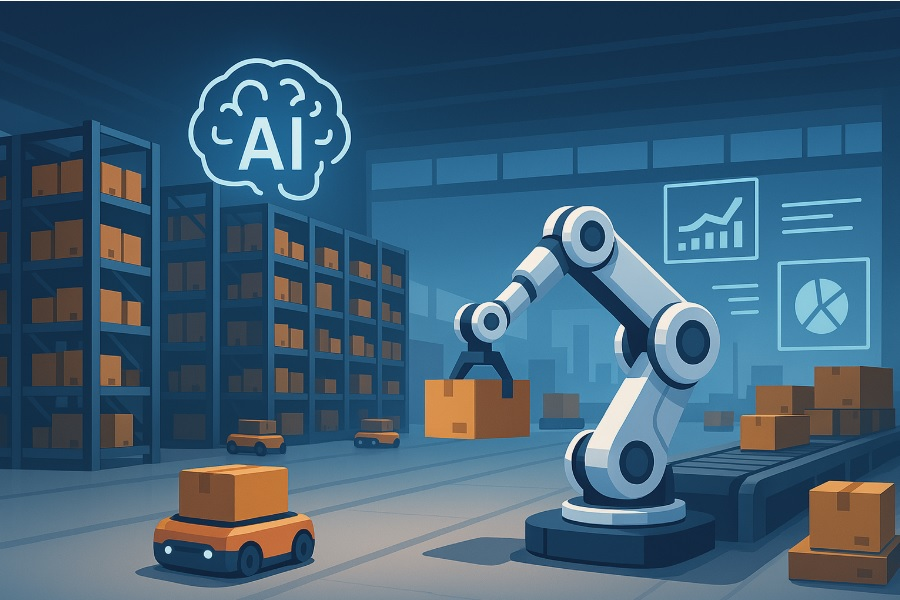
  <figcaption></figcaption>
</figure>

## 들어가며

글로벌 물류 산업이 역사적 전환점을 맞이하고 있습니다.  

오늘날 전자상거래의 폭발적 성장과 공급망 최적화 요구가 증가하면서, 물류 자동화 기술은 단순한 효율성 향상 도구를 넘어 산업 경쟁력의 핵심 차별화 요소로 자리잡았습니다.  

특히 인공지능과 로봇공학의 급속한 발전이 물류 운영 방식을 근본적으로 재정의하고 있습니다.  

이번 포스팅에서는 현재 물류 자동화 시장의 규모와 성장 동향, 핵심 기술 트렌드, 그리고 아마존, 페덱스, DHL과 같은 선도 기업들의 혁신 전략을 체계적으로 살펴보겠습니다.  

또한, 향후 5년 및 10년 후의 물류 자동화 청사진을 제시하고, 기업들이 이 변화의 물결에서 경쟁 우위를 확보하기 위한 실질적인 전략을 제안하고자 합니다.

물류 산업의 미래 경쟁력을 준비하는 기업 의사결정자와 물류 기술 발전에 관심 있는 전문가 여러분께 유용한 인사이트를 제공해 드리겠습니다.

## 목차

1. 글로벌 물류 자동화 트렌드와 시장 전망  
2. 물류 자동화의 핵심 기술  
3. 글로벌 기업 사례 연구  
3-1. 아마존: AI 기반 공급망 혁신  
3-2. 페덱스: 분류 허브 자동화와 예측 배송 관리  
3-3. DHL: 창고 자동화와 AR 피킹 시스템
4. 기업별 자동화 전략 비교  
5. 전망: 5년 후의 물류 자동화  
6. 미래 청사진: 10년 후의 물류 자동화  
7. 경쟁력 있는 물류 자동화 솔루션 개발 전략  

## 1. 글로벌 물류 자동화 트렌드와 시장 전망

<figure>
  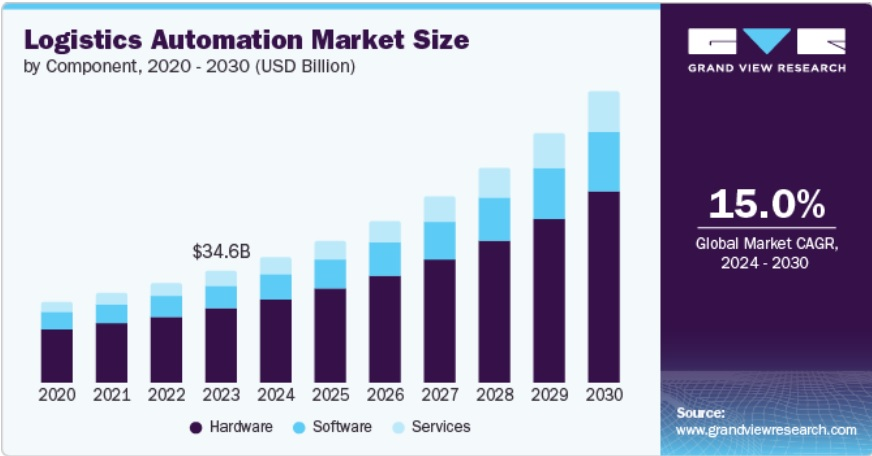
  <figcaption> 2020-2030 물류 자동화 시장 규모 (단위 : 100만 USD), 자료 출처:  www.grandviewresearch.com </figcaption>
</figure>
<figure>
  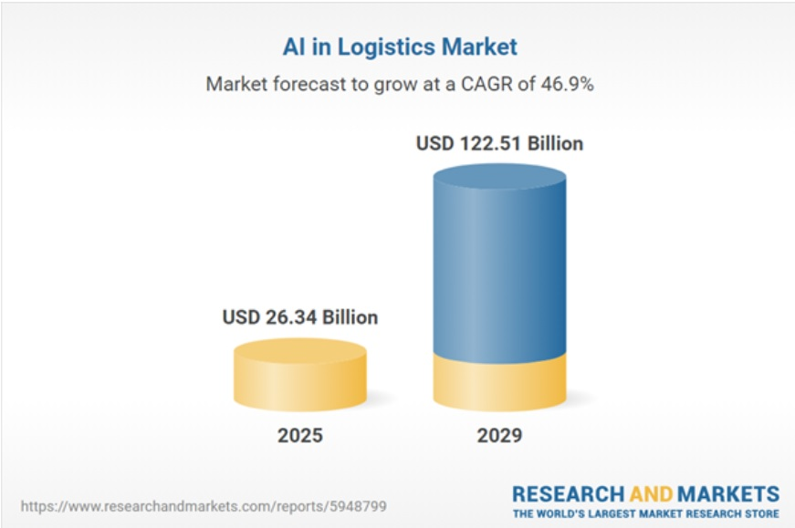
  <figcaption> 물류 분야 AI 시장, 연평균 성장률 46.9% 전망, 자료 출처 :  https://www.researchandmarkets.com/reports/5948799/ai-in-logistics-market-report </figcaption>
</figure>

### 폭발적인 시장 성장세

- 매년 두 자릿수 성장을 기록하며 **2030년까지 약 350~400억 달러 규모로 성장** 예상  
- 창고 자동화 시장은 더욱 빠르게 성장하여 McKinsey 분석에 따르면 2030년 510억 달러 규모까지 확대될 전망  
- 물류 분야 AI 시장은 2024년 180억 달러에서 2028년 832억 달러로 **연평균 46.9%의 폭발적 성장률 예측  

### 지역별 동향

- **아시아**: 물류 자동화의 글로벌 선두 지역으로 부상 중  
  - 세계 로봇 도입 상위 10개국 중 5개국이 아시아 국가  
  - 싱가포르가 1위를, 중국은 2025년까지 5만개 이상의 창고에 400만대 이상의 상업용 로봇 설치 예정  

- **북미**: 아마존, 월마트, UPS 등 대규모 투자 진행 중  

- **유럽**: DHL, XPO, Maersk 등 주요 물류기업들이 창고 자동화와 자율주행 트럭 시험 진행  

- **글로벌 표준화 움직임**: 글로벌 물류 기업들은 국경을 넘어 기술 도입을 진행
  - DHL은 싱가포르, 독일, 미국, 호주 등에서 공통된 로봇 솔루션으로 글로벌 표준화 추진 중  

## 2. 물류 자동화의 핵심 기술

<figure>
  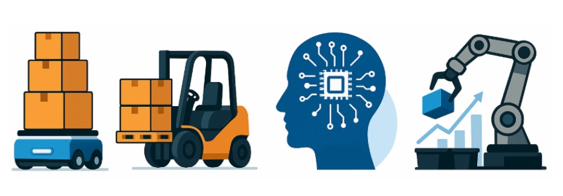
  <figcaption></figcaption>
</figure>

### 창고 로보틱스

- GV(Automated Guided Vehicle)/AMR(Autonomous Mobile Robot)이라 불리는 자동이송 로봇과 로봇팔 기술이 성숙 단계
- 팔레트 운반 자율 지게차와 협동 피킹 로봇이 현장에 다수 투입됨  

### AI 기반 물류 소프트웨어

- 수요 예측, 재고 최적화, 배송 경로 최적화에 AI 기술 적용
- 빅데이터 분석으로 운영 효율성 극대화  

### 배송 분야 자율 주행

- 자율 주행 트럭, 드론 배송 등 라스트 마일 딜리버리 혁신 기술 도입 중  

### IoT 및 실시간 데이터 모니터링

- FedEx Surround, DHL MySupplyChain 등 실시간 가시성 플랫폼 활용  
- 센서 기반 자산 및 환경 모니터링으로 물류 전과정 추적 가능

### 협업 기술과 사람 중심 설계

- 현장 직원이 웨어러블 기기나 RPA(Robotic Process Automation) 활용  
- 로봇과 상호작용하며 생산성을 높이는 방향으로 기술 도입  

### 물류 자동화 솔루션 주요 구현 기술

<figure>
  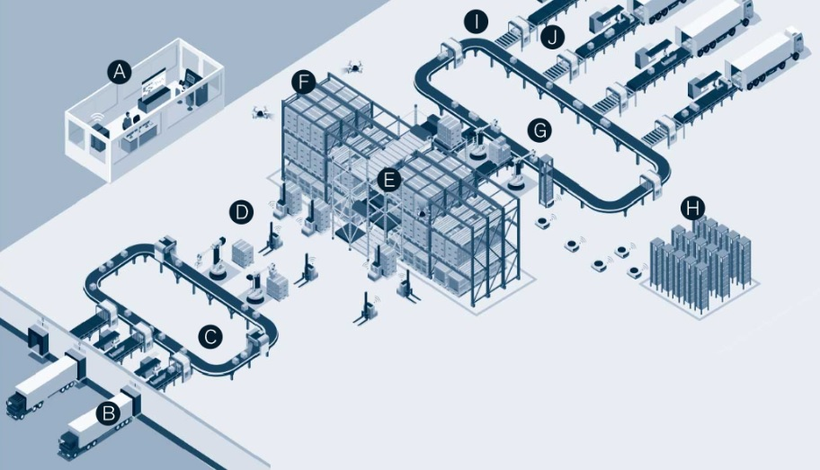
  <figcaption>물류 자동화 시스템 개념도, 이미지 출처: https://www.mckinsey.com/industries/retail/our-insights/automation-has-reached-its-tipping-point-for-omnichannel-warehouses</figcaption>
</figure>

- **A**: 통합 WMS 및 창고 제어 시스템으로 자동화 기술을 지시
- **B**: 자동 언로더로 입고 트럭에서 케이스와 팔레트를 하역  
- **C**: 제품 식별 스캐너로 입고 수량을 기록하고 보관 위치를 결정  
- **D**: 팔레타이저와 AGV를 활용하여 도크에서 보관장소로 이동  
- **E**: 케이스 보관용 ASRS 시스템 - 대량 보관을 위한 팔레트 슬롯  
- **F**: 재고 순환 카운팅을 위한 UAV(드론)  
- **G**: 보관 선반에서 완제품 및 날짜 단위로 상품을 선택하는 피킹 로봇  
- **H**: AGV를 활용하여 날짜 단위 선반을 운송하고 재고 보충  
- **I**: 제품별 하역장소를 결정하는 분류 스캐너  
- **J**: 출고를 확인하는 스캐너 및 적재 로봇  

## 3. 글로벌 기업 사례 연구

### 3-1. 아마존 : AI 기반 공급망 혁신

<figure>
  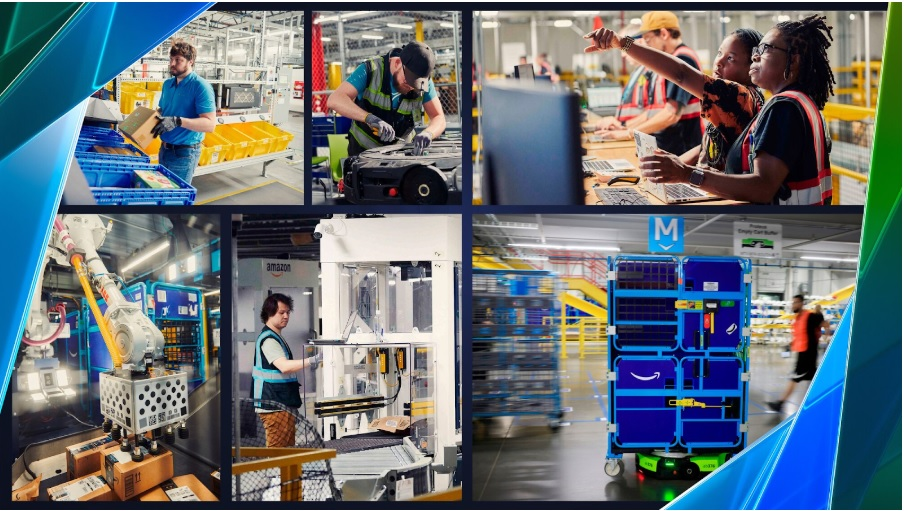
  <figcaption>아마존의 AI와 로보틱스 기반 물류 자동화 솔루션, 이미지 출처:  https://www.aboutamazon.com/news/operations/amazon-fulfillment-center-robotics-ai</figcaption>
</figure>  

- **산업용 로봇 플랫폼 자체 구축**: 현재 75만대 이상의 로봇이 상품 분류, 적재, 운반 작업 수행  
- **Kiva 로봇**: 상품 선반을 사람에게 가져다주는 방식으로 피킹 자동화  
- **Sequoia 멀티 레벨 재고 관리 시스템**: 재고 식별, 저장 속도 75% 향상  
- **AI 수요 예측 기술**: 2023년 사이버 먼데이 기간 4억개의 제품 일별 수요 예측  
- **주문 처리 시간 25% 단축과 인력 부상 15% 감소**  
- **2020년 한 해만 물류 비용 16억 달러 절감 효과**

### 아마존의 차세대 전략

- 6종의 신규 물류 로봇 개발(팔렛 적재 로봇 Sparrow, 이동 로봇 Proteus 등)  
- 피크 시즌 물류센터 운용 비용 25% 절감  
- 차세대 로봇 물류 센터 구축에 250억 달러 투자  
- 2030년 미국 물류의 30~40%를 로봇 센터로 처리해 연간 45,100억 달러 절감 목표  
- 드론 배송 Prime Air와 자율주행 배달로봇 Scout 시험 중  
- 포장 자동화 기계로 시간당 처리량 인력 대비 5배 향상  

### 3-2. 페덱스: 분류 허브 자동화와 예측 배송 관리

<figure>
  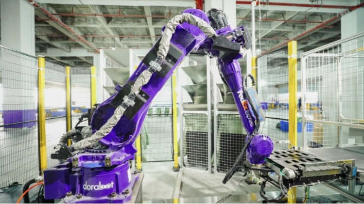
  <figcaption>페덱스의 지능형 분류 로봇 Dorasoter, 이미지 출처: https://www.irobotnews.com/news/articleView.html?idxno=27589</figcaption>
</figure>

- **DoraSorter**: 2022년 중국 광저우 허브에 도입된 페덱스의 AI 로봇 분류기  
  - 시간당 1,000개 소형 소포 분류 가능
  - 98.5% 이상의 정확도  
  - 100개 행선지 동시 분류 가능  

- **Berkshire Grey사의 AI 로봇 시스템**: 미국 내 뉴욕, 라스베이거스 등 8개 시설 운영 중  

- **FedEx Surround**: IoT 센서(SenseAware)와 AI를 활용한 실시간 배송 추적 및 예측 관리 시스템
  - 하루 1,700만건의 배송 데이터에서 예측 인사이트 도출  
  - 연간 40~45억 달러 비용 절감 효과  

### 3-3. DHL: 창고 자동화와 AR 피킹 시스템

<figure>
  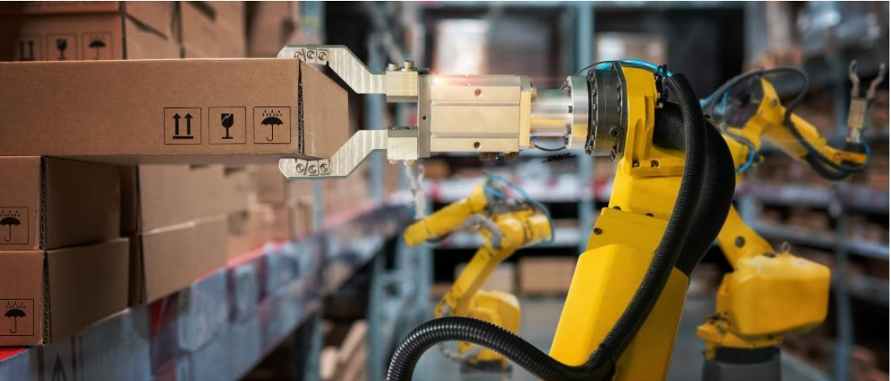
  <figcaption>물류 창고 자동화에 쓰이는 한팔 로봇, 이미지 출처: https://www.dhl.com/global-en/delivered/innovation/warehouse-robotics-and-automation.html</figcaption>
</figure>  

<figure>
  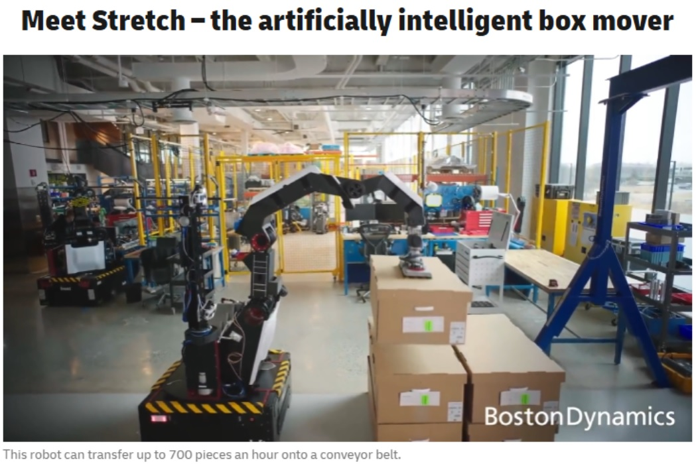
  <figcaption>DHL에서 도입한 물류센터용 자동화 로봇 ‘스트레치’ : 다관절 로봇팔을 가진 이 로봇은 1시간에 박스 700개까지 컨베이어 벨트로 운반할 수 있다., 이미지 출처:  https://bostondynamics.com/</figcaption>
</figure>  

<figure>
  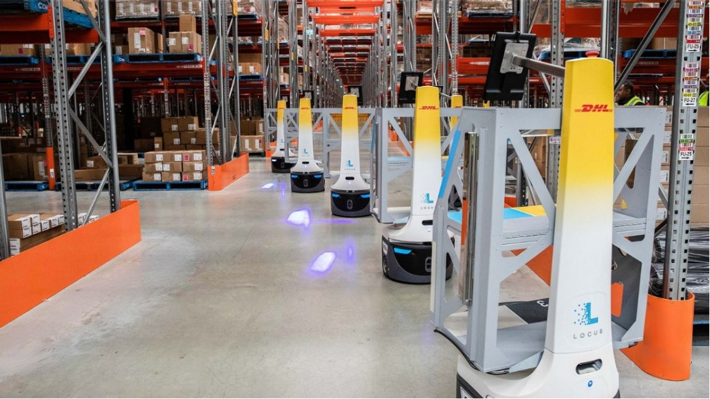
  <figcaption></figcaption>
</figure>  
<figure>
  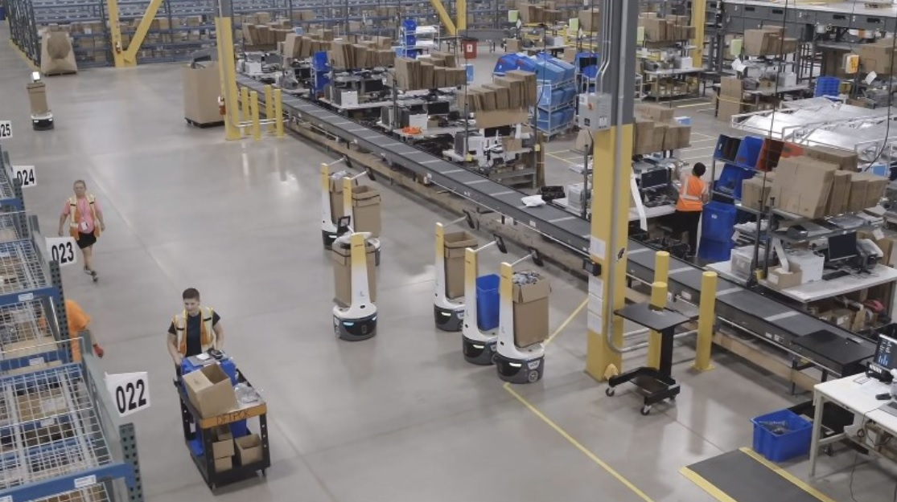
  <figcaption>DHL의 물류 창고 자동화 시스템 전경, 이미지 출처: www.dhl.com</figcaption>
</figure>

- **창고 자동화와 현장 업무의 디지털화**에 전략적 투자
  - DHLBot: 도라봇과 제휴해 개발한 자동 분류 로봇으로 시간당 1,000개 이상   소화물 분류 및 99% 정확도 달성  
  - DHL Supply Chain: 피킹, 팔렛 적재 등 반복 작업에 로봇 광범위 도입  

- **Boston Dynamics의 자율 이동 로봇 Stretch에 1,500만 달러 투자**  
  - 북미 창고에서 시간당 700 상자 자동 하역 파일럿 진행  
  - AI 비전으로 작업자 없이도 트레일러를 빈틈없이 비울 수 있는 기술  

- **AutoStore 자동 저장 조회 시스템(AS/RS)**: 입출고 프로세스 자동화  
- **2022년 전 세계적으로 1억 유로 규모의 로봇 기술 투자 프로그램 운영**  
- **호주/뉴질랜드 지역에 1억 5천만 달러 투자**로 남반구 최대 규모의 완전 자동화 물류센터 구축  

### DHL의 AR 피킹 시스템 

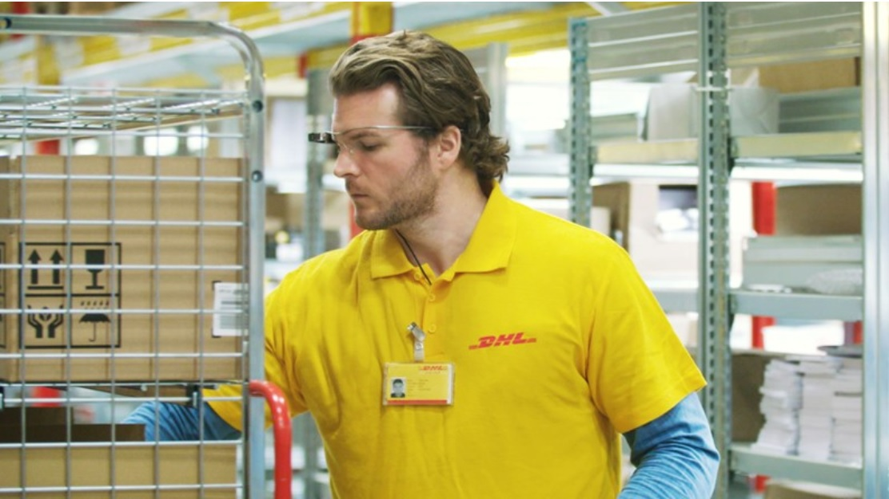
  <figcaption>DHL의 스마트 AR 글라스를 활용한 비전 피킹 시스템, 이미지 출처: www.dhl.com</figcaption>
</figure>  

- **AR 비전 피킹(Vision Picking) 시스템**  
  - 스마트 글라스 착용 작업자에게 제품 위치, 수량, 적재 위치 등 정보 실시간 제공  
  - 초기 파일럿 테스트 결과, 생산성 25% 향상 및 오류 감소  
  - 직관적 인터페이스로 교육 및 온보딩 시간 단축  

## 4. 기업별 자동화 전략 비교  

| 구분 | Amazon (이커머스) | FedEx (특송/택배) | DHL (종합 물류) |
|------|-------------------|-------------------|-----------------|
| 주요 도입 기술 | 자동 분류기, AI 피킹 시스템, 드론 배송, 재고 수요 예측 | 분류 로봇, 자동화 컨베이어, AI 배송 추적/최적화, 자율주행 배달 | 창고 협동 로봇, AS/RS, 팔렛적재 로봇, AR 피킹, 자율운반 차량(AGV/AMR) |
| 기술 도입 방식 | 내부 개발 + 인수  Kiva System 인수 후 Amazon Robotics 내재화  자체 AI 플랫폼 구축  대규모 자체 투자 | 파트너십 활용  DoraBot, Berkshire Grey 등 외부 로봇 기업 협업  MS와 데이터 플랫폼 공동 개발 | 혼합 전략  Accelerated Digitalization 프로그램으로 검증된 기술 빠르게 채택  Boston Dynamics 등 외부 신기술 투자 병행 |
| 차별점 및 강점 | 압도적 투자 규모  전 공정 자동화로 배송속도 우위 확보  자체 생태계(물류+판매) 데이터 축적 극대화 | 글로벌 배송망 데이터 보유  운송 전문성 바탕 자동화  고객 대상 물류 SaaS 플랫폼 | 광범위한 운영현장 경험  인간+로봇 협업 강조  지역별 투자 시장맞춤 전략 |
| 도입 속도 | 매우 빠름 | 점진적 확대 | 선택적 빠른 확대 |  

### 종합 분석

- **아마존**: 가장 공격적인 자동화로 Fulfillment Center(FC) 완전 자동화  
  - 로봇, AI 내재화 개발하여 규모의 경제 실현  
  - 경쟁사 대비 처리 속도와 비용 우위 확보  

- **페덱스**: 특송 배송 특성상 허브에서 분류 효율과 실시간 배송 관리에 초점  
  - 급격한 풀필먼트 자동화보다는 신뢰성 강화와 비용 절감에 선별적 투자  

- **DHL**: 글로벌 3PL(제3자 물류) 사업자로 다양한 고객의 창고 운영  
  - 유연한 협업로봇 도입과 모듈식 자동화 솔루션 강조  
  - Accelerated Digitalization 프로그램을 통해 다양한 기술 제공업체와 협력  
  - 로봇 프로세스 자동화(RPA), 웨어러블 기기, AI 및 데이터 분석 등 다양한 기술 활용  

## 5. 전망: 5년 후의 물류 자동화

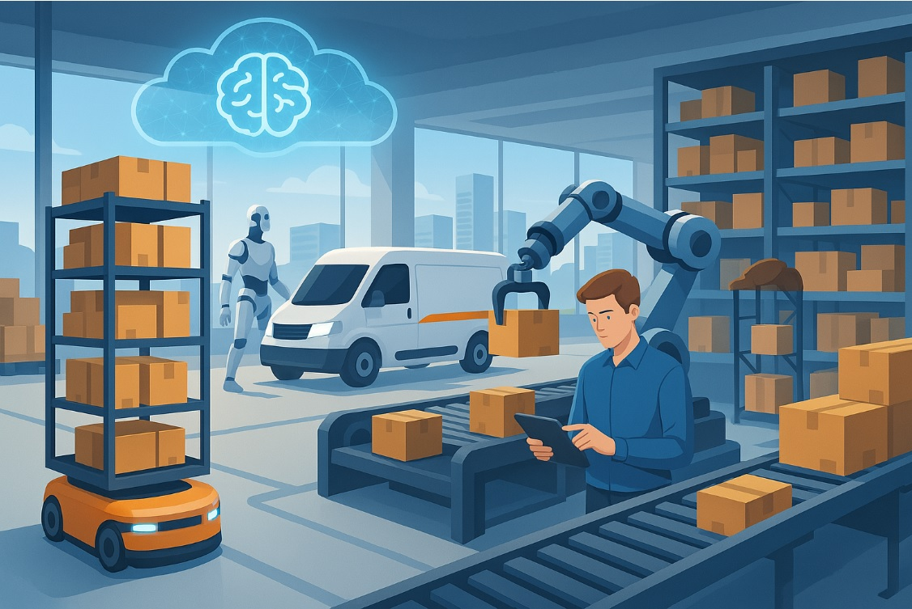
  <figcaption></figcaption>
</figure>  

### 단기적으로 예상되는 기술 발전과 시장 변화  

- **현재 도입된 기술들의 대규모 확산기**
  - 파일럿 단계를 지나 자동화 솔루션을 전면 배치하여 효율 극대화 추구  
  - 향후 3년 내 현행 로봇 솔루션의 급격한 스케일업 예상  

- **2030년 물류 센터의 모습**  
  - 대형 물류 센터들은 로봇이 상시 가동되는 무인 창고로 변모  
  - 분류 허브에서는 로봇팔과 AI 카메라가 밤낮없이 패키지를 분류하는 24시간 자동화 운영 일반화  

- **AI 플랫폼의 역할 강화**  
  - 통합 물류 AI 플랫폼으로 수요 예측, 재고 관리, 운송 계획이 연동된 자동 의사 결정  
  - 디지털 운영센터에서 AI가 실시간으로 주문 데이터를 분석하고 즉각적으로 물류센터 로봇들에게 작업 지시  

### 자율 주행 배송의 도입  

- **자율 주행 차량과 드론**이 5년 내 상용 서비스에 일부 투입 전망  
- 2030년까지 전 세계 소형 화물의 10% 이상이 자율주행 수단으로 배송될 것으로 예측

### 인력 구조의 변화  

- 사람의 역할이 물건을 직접 나르는 작업에서 로봇 운영자로 변화  
- 여러 대의 로봇을 모니터링하고 예외 상황을 처리하는 직무로 이동  
- DHL은 2030년까지 자사 물류 장비의 30%를 로봇화하지만, 이를 감독하고 유지관리 할 일자리도 창출될 것으로 전망  

## 6. 미래 청사진: 10년 후의 물류 자동화  

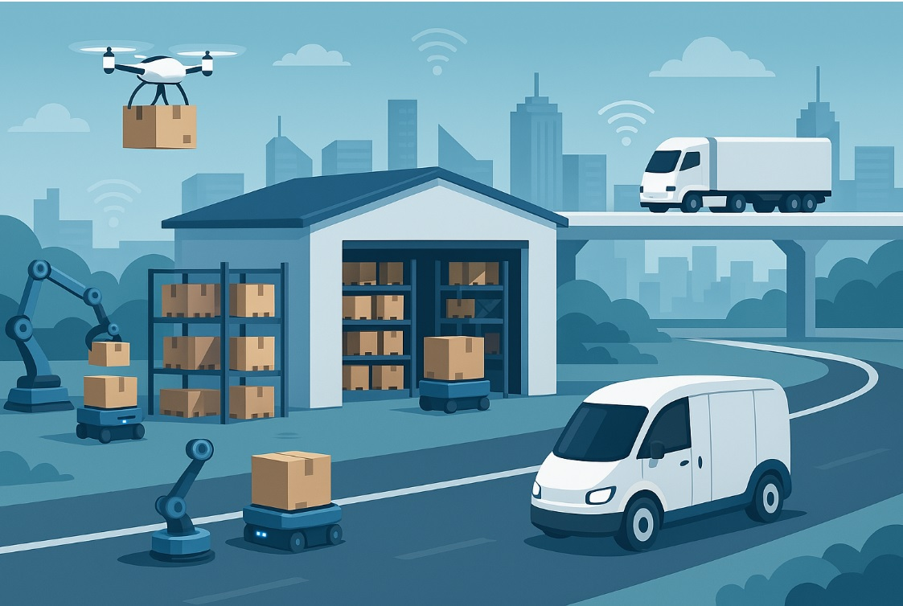
  <figcaption></figcaption>
</figure>  

### 장기적 관점에서의 물류 산업 패러다임 변화

- **AI 기술의 고도화**  
  - 수요예측 고도화, 강화학습 기반 경로 최적화  
  - 생성형 AI를 활용한 실시간 시뮬레이션 보편화  
  - 스스로 학습하는 지능형 공급망 구현  

- **로봇 공학의 획기적 발전**  
  - 현재는 불가능한 비정형 작업(다양한 형태의 상품 피킹, 트럭 적재 최적화 등)까지 로봇이 수행  
  - 휴머노이드형 로봇이나 고성능 멀티핑거 그리퍼 기술의 성숙으로 섬세한 작업 자동화  
  - 창고 완전 무인화 실현  

### 물류 네트워크 구조의 혁신  

- **분산형 마이크로 풀필먼트 vs 메가허브 중심 네트워크**의 공존  
  - 도시 내 마이크로 풀필먼트 센터 확산  
  - 거대 메가허브의 완전 자동화로 허브앤스포크 네트워크 강화
  - 도심 지하 자동화 물류 허브 운영  
  - 철도/항만 터미널의 로봇화된 컨테이너 처리 시스템  

### 인간과 로봇의 공존  

- McKinsey Global Institute에 따르면 운송/창고업의 약 60~70% 업무가 현재 기술로도 자동화 가능  
- 포장, 분류, 운반 직무는 자동화율이 높아지는 반면, 로봇 정비, 시스템 운영 등 고숙련 직무가 부상  
- 예측 불가능한 상황 대처나 창의적 문제 해결은 여전히 인간의 영역으로 남을 전망  
- 윤리적/사회적 고려로 완전한 무인화보다는 인간-로봇 협업 모델이 권장될 가능성  

### 산업 구조의 변화  

- 기술 선도 기업의 시장 지배력 강화  
- 기술 도태 기업의 도산 가능성 등 산업 내 양극화 심화 전망  

## 7. 경쟁력 있는 물류 자동화 솔루션 개발 전략

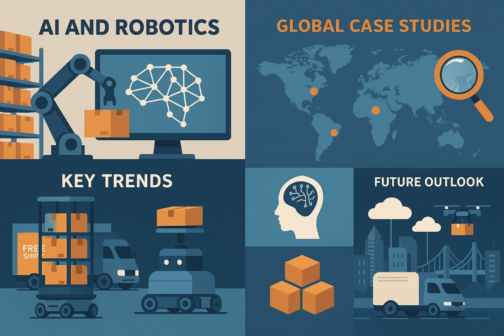
  <figcaption></figcaption>
</figure>

### 1) 통합 플랫폼 전략  

- 단순 로봇 하드웨어에 국한되지 않는 **AI 소프트웨어와 로보틱스가 유기적으로 연동되는 통합 솔루션** 개발  

- 물류센터 관리 AI와 자율 이송 로봇+로봇팔을 하나의 시스템으로 묶어 제공  

- 각 자동화 장비와 소프트웨어 간 실시간 데이터 공유를 통한 최적 의사결정 설계  

### 2) 데이터 분석 및 예측 기능 강화  

- 단순 물리적 자동화를 넘어 **스마트한 운영 인사이트 제공**  

- AI를 접목해 예측 분석(Predictive Analytics) 기능 강화  

- 병목 예측, 재고 소진 예보, 배송 지연 예상 등의 상황을 대시보드로 제공  

- 머신러닝 기반 자가 성능 개선 시스템으로 장기적 고객 락인 효과 창출  

### 3) 단계적 도입 로드맵 제시  

- **PoC(개념검증) → 파일럿 → 단계적 확대** 접근법  

- 특정 공정부터 자동화를 시작해 짧은 회수 기간의 ROI 입증  

- 성과 데이터와 신뢰를 바탕으로 전체 프로세스로 확장 유도  

- 처리량, 정확도, 인건비 절감률 등 성과 지표를 투명하게 제시  

### 4) 미래 지향적 기술 검토  

- **미래 기술 로드맵**을 바탕으로 선행 R&D 투자  

- 5-10년 내 유망 기술(자율 주행 배송로봇, AI 비전 기반 자동 검수, 드론 배송 인프라 등) 연구  

- 관련 특허/인재를 선제적으로 확보하는 투자 전략  

- 장기적으로 **AI와 로봇의 융합을 통한 지능형 물류 플랫폼**으로 진화  

- 기술 혁신과 현장 이해의 균형을 기반으로 지속적인 투자와 피드백 개선 시스템 구축  

## 결론: 물류 자동화의 미래를 선도하기 위한 핵심 포인트  

- **통합과 연결성**: 단일 기술이 아닌 여러 자동화 기술의 유기적 통합이 성공 열쇠  

- **데이터 중심 접근**: 실시간 데이터 수집과 AI 기반 분석으로 지속적 최적화 실현  

- **점진적 전환**: 완전 자동화로의 급격한 전환보다 단계적 접근으로 ROI 확보  

- **사람-기계 협업**: 완전 무인화보다 인간과 로봇의 최적 협업 모델 구축이 중요  

- **미래 기술 준비**: 현재 성과와 함께 미래 기술에 대한 지속적 투자로 경쟁 우위 확보  

물류 자동화는 이제 선택이 아닌 필수가 되어가는 시대입니다.  
어떻게 준비하고 접근하느냐에 따라 기업의 생존과 성장이 결정될 것입니다.  

## 물류 자동화의 새로운 패러다임을 준비하며  

앞서 살펴본 바와 같이, 물류 자동화 기술은 단순한 트렌드를 넘어 산업 전반의 구조적 변화를 이끄는 핵심 동력으로 자리잡고 있습니다. 아마존, 페덱스, DHL 등 선도 기업들의 사례에서 확인할 수 있듯이, 이러한 기술 혁신은 운영 효율성 향상뿐 아니라 비즈니스 모델 자체의 재정의로 이어지고 있습니다.  

특히 주목할 점은 자동화 기술의 도입이 인력 대체가 아닌 인간-기계 협업 모델로 진화하고 있다는 사실입니다. 향후 물류 산업에서는 단순 반복 작업은 자동화되는 반면, 데이터 분석, 시스템 최적화, 예외 상황 관리와 같은 고부가가치 직무에 대한 수요가 증가할 것으로 예측됩니다.  

기업들은 중장기적 전략 수립을 통해 단계적으로 자동화 솔루션을 도입하고, 하드웨어와 소프트웨어의 통합 시스템을 구축하는 한편, 데이터 기반의 의사결정 체계를 확립해 나가야 합니다. 이러한 노력이 축적될 때, 물류 산업은 더 높은 안정성, 효율성, 지속가능성을 갖춘 새로운 패러다임으로 도약할 수 있을 것입니다.  

이번 포스팅이 물류 산업 관계자와 기술 분야 전문가 여러분께 유용한 인사이트와 전략적 시사점을 제공했기를 바랍니다. 물류 자동화의 여정은 앞으로 더 많은 혁신과 도전이 기다리고 있습니다.  

## 참고 문헌 및 링크
1) https://www.aboutamazon.com
2) https://www.fedex.com
3) https://www.dhl.com
4) https://sifted.com/resources/how-amazon-is-using-ai-to-become-the-fastest-supply-chain-in-the-world/#:~:text=Amazon%20has%20invested%20in%20new,faster
5) https://www.investing.com/news/stock-market-news/amazon-saving-up-to-3b-a-year-after-introducing-6-new-warehouse-robots-analyst-3845465
6) https://www.benzinga.com/media/25/02/43972083/amazons-25-billion-robotics-push-targets-cost-savings-ai-growth-and-temu-competition-report
7) https://mashable.com/article/amazon-warehouse-robots-workers#:~:text=robots%20mashable,theoretically%20save%20money%20over
8) https://www.supplychaindive.com/news/delivery-robot-bills-laws-proliferate-state-legislatures/648303/#:~:text=Why%20delivery%20robots%20face%20a,content%20image%20Access%20now%E2%9E%94
9) https://newsroom.fedex.com/newsroom/global/fedex-and-microsoft-announce-new-cross-platform-logistics-solution-for-e-commerce#:~:text=global%20trade%20and%20accelerated%20e,brands%20deliver%20improved%20customer%20experiences
10) https://s21.q4cdn.com/665674268/files/doc_downloads/2024/08/2024-FedEx-Annual-Report.pdf#:~:text=robotic%20product%20sortation%20systems%20to,million%20of%20asset%20impairment
11) https://www.automotivelogistics.media/inplant-logistics/dhl-invests-15m-in-warehouse-automation-from-boston-dynamics/42674.article#:~:text=Boston%20Dynamics%20Stretch%20robot
12) https://www.reddit.com/r/singularity/comments/18cy49f/amazons_humanoid_warehouse_robots_will_eventually/?rdt=38244#:~:text=Amazon%27s%20humanoid%20warehouse%20robots%20will,workers%27%20fears%20of%20being%20replaced
13) https://www.mckinsey.com/industries/logistics/our-insights/automation-in-logistics-big-opportunity-bigger-uncertainty
14) https://www.supplychaindive.com/news/delivery-robot-bills-laws-proliferate-state-legislatures/648303/#:~:text=Dive%20www,content%20image%20Access%20now%E2%9E%94