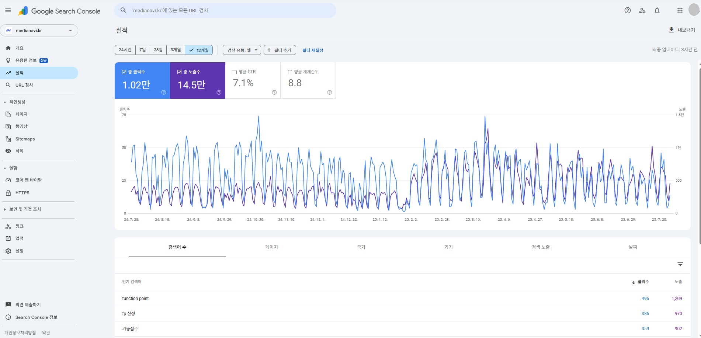
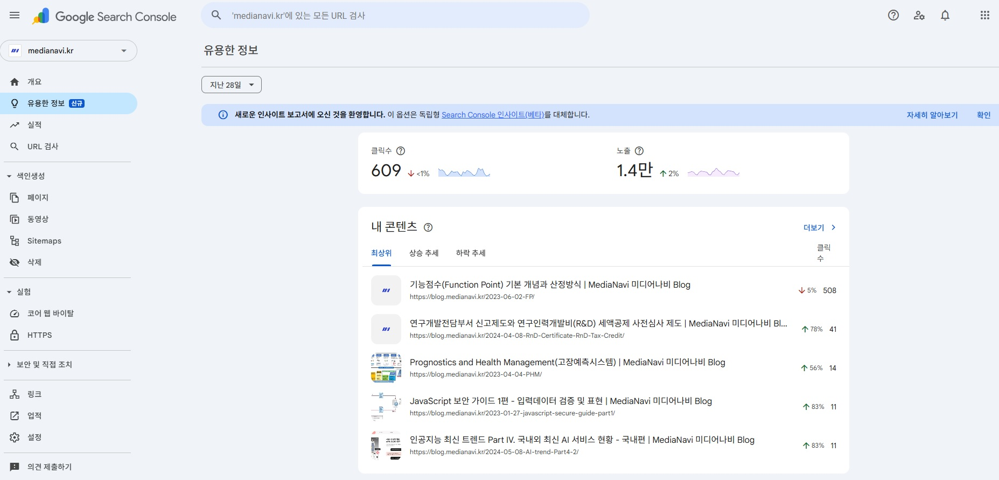
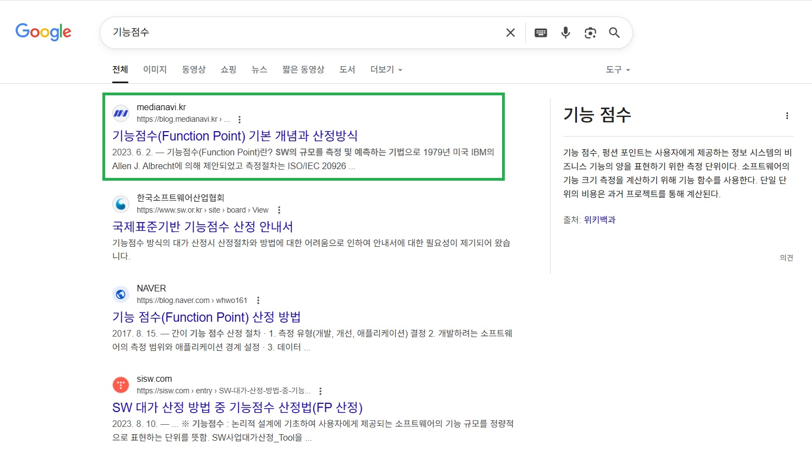

---
title: "구글 상위노출 비밀 노트 – 기술 블로그 SEO 2025 완벽 가이드"
date: "2025-08-011T01:00:00.000Z"
category: "blog"
description: "기술 블로그의 구글 상위노출 비법 — 기본 개념부터 실전 최적화 체크리스트까지 따라하기 쉬운 2025 가이드를 제공합니다."
postauthor: "Anna"
---     
## 왜 내 블로그는 구글에서 검색이 안 될까?

많은 개발자들이 GitHub Pages나 개인 블로그를 운영하면서 겪는 고민이지요. 좋은 기술 콘텐츠를 작성해도 검색 노출이 되지 않아 답답하셨다면, 이 글에서 그 해답을 찾으실 수 있을 것입니다.  

실제로 많은 개발자 블로그들이 SEO 최적화를 간과하여 훌륭한 콘텐츠가 묻혀버리는 경우가 많습니다. 하지만 올바른 전략을 적용하면 검색 유입을 획기적으로 늘릴 수 있습니다.

## 이 글에서 다룰 내용

1. 구글 검색 색인의 기본 원리  
2. 블로그 포스트 주제 선정 전략  
3. SEO 친화적 글쓰기 방법  
4. 기술적 최적화 체크리스트  
5. 성과 측정과 개선 방법   
 
## 1. 구글 검색 색인의 기본 원리 

### 1-1. 검색 엔진이 작동하는 방식  

**구글은 다음 3단계로 웹사이트를 처리합니다:**

1. 크롤링(Crawling): 구글봇이 웹페이지를 발견하고 읽음  
2. 색인(Indexing): 페이지 내용을 분석하여 데이터베이스에 저장
3. 랭킹(Ranking): 검색 쿼리에 맞는 페이지들을 순위별로 정렬  

### 1-2. Google Search Console 필수 설정

Google Search Console은 구글이 무료로 제공하는 웹마스터 도구로, 내 블로그가 구글 검색에서 어떻게 노출되고 있는지 확인할 수 있는 필수 도구입니다.  

어떤 키워드로 사람들이 내 블로그를 찾아오는지, 검색 결과 몇 페이지에 나오는지, 색인이 제대로 되었는지 등을 한눈에 볼 수 있는데요.  마치 블로그 운영의 '건강검진 리포트' 같은 역할을 해서, 검색엔진최적화(SEO) 전략을 세우고 개선점을 찾는 데 꼭 필요한 도구라고 할 수 있습니다. 

**개발자 블로그 운영에 반드시 필요한 도구입니다:**

```
html

<!-- 사이트 소유권 확인용 메타 태그 -->
<meta name="google-site-verification" content="your-verification-code" />
```  

**설정 방법**

1. Google Search Console (https://search.google.com/) 접속  
2. 추가 → URL 접두어 방식 선택  
3. 제공받은 HTML 태그를 ```<head>```에 삽입  
4. 사이트맵 제출: https://yourblog.com/sitemap.xml

***실전 팁** : 설정 완료 며칠 후, Search Console에서 "색인 생성됨" 상태가 확인되면 성공적으로 등록된 것입니다.*

<figure>
  
  <figcaption>(1-1) Google Search Console의 지난 12개월간 총 클릭수, 총 노출수, CTR, 평균 게재순위를 보여주는 성과 추이 그래프입니다., 이미지 출처: 미디어나비</figcaption>
</figure>

<figure>
  
  <figcaption>(1-2) 최근 28일 기준 클릭수·노출수 변화와 인기 콘텐츠별 순위를 보여주는 인사이트 화면으로 웹사이트, 블로그 성과 추이 분석이 가능합니다., 이미지 출처: 미디어나비</figcaption>
</figure> 

## 2. 블로그 포스트 주제 선정 전략

### 2-1. 키워드 리서치의 핵심 

**개발자 블로그에서 효과적인 키워드 전략:**

**❌ 피해야 할 키워드:**  

- "React 사용법" (너무 포괄적, 경쟁 과열)  
- "JavaScript" (검색 의도 불분명)

**✅ 타겟하기 좋은 키워드:**

- "React useEffect 훅 실전 가이드"  
- "Next.js 배포 에러 해결 방법"  
- "TypeScript 인터페이스 vs 타입 차이점"  

### 2-2. 롱테일 키워드 전략

롱테일 키워드는 3-5개 단어로 이루어진 구체적이고 긴 검색어를 말하는데요.  "React"처럼 짧은 키워드는 수많은 사이트들이 경쟁하지만, "React useEffect 훅 실전 가이드"처럼 구체적인 키워드는 경쟁이 훨씬 적어 상위노출 기회가 많아집니다. 

또한 이런 구체적인 검색어로 찾아오는 사용자들은 명확한 목적이 있어서 우리 글을 끝까지 읽을 가능성도 높습니다.

**구체적이고 긴 키워드일수록 상위노출 가능성이 높습니다:**

```
 <span style="color: green;">녹색 글씨</span> 
 - 기본 키워드: "Git" (경쟁 매우 치열)
- 롱테일 키워드: "Git 브랜치 merge conflict 해결 방법" (검색 의도 명확 + 상위 노출 가능성 높아짐)  
```  

### 2-3. 트렌딩 주제 발굴법
**1.** **GitHub Trending**: 인기 저장소에서 새로운 기술 발견  
**2.** **Stack Overflow**: 자주 질문되는 문제들 확인  
**3.** **개발자 커뮤니티**: Reddit, Discord에서 핫한 주제 파악  
**4.** **Google Trends**: 검색량 상승 중인 기술 키워드 확인  

## 3. SEO 친화적 글쓰기 방법

### 3-1. 제목 작성 황금 공식

**효과적인 패턴:**

```
[기술스택] + [구체적 문제/해결책] + [가이드/방법] + [연도]

예시:
- "React 18 useState 배치 업데이트 완벽 가이드 2024"  
- "Node.js 메모리 누수 디버깅 실전 방법 3가지"
- "Docker 컨테이너 최적화로 빌드 시간 50% 단축하기"  
```  
**제목 최적화 체크리스트:**

- 60자 이내 (검색결과에서 잘리지 않게)
- 타겟 키워드 포함
- 구체적 숫자나 이점 명시
- 감정적 단어 활용 (완벽, 실전, 핵심, 필수 등)  

실제 예를 들자면, 미디어나비 테크 블로그 중 구글에서 가장 높은 노출수와 클릭수를 차지한 콘텐츠는 ‘기능점수(Function Point)’ 기본 개념과 산정방식’ (https://blog.medianavi.kr/2023-06-02-FP/) 인데요.   

기술스택 + 구체적 문제/해결책 + 가이드/방법을 내포한 명확한 타켓 키워드 덕분에 구글 검색시 상단에 노출되어 매달 가장 높은 검색어 노출수와 유입률을 기록하고 있습니다.  

<figure>
  
  <figcaption>(2) 미디어나비 블로그의 ‘기능점수’ 콘텐츠는 SEO 개선 후 검색어 '기능점수'에서 구글 상단에 노출되어 게재된 콘텐츠 중 월간 최다 유입을 기록 중입니다., 이미지 출처 : 구글 검색창 스크린샷</figcaption>
</figure>  

### 3-2. 헤딩 태그 구조화

헤딩 태그는 글의 '목차 구조'를 만들어주는 HTML 태그로써  H1은 제목, H2는 대제목, H3는 소제목 이런 식으로 계층적으로 구성하면 구글이 "이 글이 어떤 순서와 구조로 정보를 제공하는지" 쉽게 이해할 수 있습니다. 

구글 검색엔진은 논문이나 보고서처럼 체계적으로 정리된 것과 같은 구조화된 글을 선호하며, 사용자 입장에서도 그런 글이 훨씬 읽기 쉽고 이해하기 편합니다.

**정확한 헤딩 구조는 구글이 문서를 빠르게 이해하고 색인하는 데 큰 도움이 됩니다:**

``` 
markdown

# H1: 메인 제목 (페이지당 1개만)
## H2: 주요 섹션 
### H3: 하위 내용
#### H4: 세부 설명
```
### 3-3. 메타 태그 최적화

메타 태그는 블로그 포스트의 '요약 정보'를 담고 있는 숨겨진 코드인데요. 구글 검색했을 때 제목 아래 나오는 짧은 설명글이 바로 메타 태그에서 가져온 내용인 것입니다. 

각 포스트마다 서로 다른 메타 태그를 설정해야 구글이 "이 글은 어떤 내용인지" 정확히 파악할 수 있고, 검색하는 사람들도 클릭하기 전에 어떤 글인지 미리 알 수 있어서 클릭률이 높아집니다.

참고로 2025년 현재 기준, 메타 태그는 구글에서 검색 랭킹에 영향을 주지 않는다고 합니다. 하지만 클릭률과 관계있으므로 필요시 참고하시면 되겠습니다. 

**포스트마다 고유 메타 태그를 설정하면 클릭률이 높아집니다:**

```
html 

<meta name="description" content="React useEffect 훅의 핵심 개념부터 실전 활용법까지. 의존성 배열, 클린업 함수, 성능 최적화 팁을 예제와 함께 설명합니다. (150자 내외)">

<meta name="keywords" content="React, useEffect, 훅스, JavaScript, 프론트엔드">
```
```
html 

<!-- 오픈그래프 태그 -->
<meta property="og:title" content="React useEffect 완벽 가이드">
<meta property="og:description" content="useEffect 훅 실전 활용법">
<meta property="og:image" content="https://yourblog.com/images/react-useeffect-guide.png">
```

### 3-4. 내부 링크 전략

내부 링크는 블로그 내 다른 포스트로 연결하는 링크인데, 사용자가 어떤 글을 읽다가 "아, 이것도 궁금한데? "라고 생각할 때 바로 관련 글로 이동할 수 있게 해줍니다.

이렇게 하면 사용자가 내 블로그에 더 오래 머무르게 되고, 구글은 이를 "유용한 사이트"라고 판단해서 검색 랭킹을 높여줍니다. 또한 오래된 포스트들도 새 글을 통해 다시 노출되는 기회를 얻을 수 있습니다.

**내부 링크는 체류 시간 증가 + SEO 점수 향상 + 오래된 글 노출 효과를 누릴 수 있습니다.**

```
markdown

이 내용과 관련해서 [React 성능 최적화 가이드](/blog/react-performance-optimization)도 함께 읽어보시면 도움이 될 거예요.

더 깊이 있는 내용은 [JavaScript 이벤트 루프 완벽 이해하기](/blog/javascript-event-loop) 포스트를 참고하세요.
```
## 4. 기술적 최적화 체크리스트

### 4-1. 사이트맵 생성

사이트맵은 블로그의 모든 페이지 목록을 정리해놓은 '지도' 같은 파일입니다. 구글 검색 로봇이 우리 블로그에 와서 "어떤 글들이 있는지" 한눈에 파악할 수 있도록 도와주는 역할을 하지요.

마치 도서관에 책 목록이 있어야 사서가 모든 책을 찾을 수 있는 것처럼, 사이트맵이 있어야 구글이 우리 블로그의 모든 포스트를 빠짐없이 발견하고 검색 결과에 포함시킬 수 있습니다.

**사이트맵은 검색 엔진이 모든 페이지를 발견할 수 있도록 도와줍니다:**  

```
xml

<?xml version="1.0" encoding="UTF-8"?>
<urlset xmlns="http://www.sitemaps.org/schemas/sitemap/0.9">
  <url>
    <loc>https://yourblog.com/blog/react-guide/</loc>
    <lastmod>2024-07-29</lastmod>
    <changefreq>monthly</changefreq>
    <priority>0.8</priority>
  </url>
</urlset>
```
### 4-2. 페이지 로딩 속도 최적화

페이지 로딩 속도는 구글 랭킹 요소 중 하나이면서, 사용자 경험에도 직접적인 영향을 미치는데요.  3초 이상 로딩되면 사용자의 53%가 페이지를 이탈한다는 통계도 있습니다.

특히 개발자 블로그는 코드 예제나 스크린샷이 많아서 용량이 커지기 쉬운데, 아래 핵심 체크포인트들을 적용하면 로딩 속도를 크게 개선할 수 있습니다.

**핵심 체크포인트:**

- 이미지 WebP 포맷으로 압축
- JS/CSS 파일 최소화
- 불필요한 플러그인 제거
- CDN 사용 (Cloudflare(무료), jsDelivr(오픈소스 라이브러리용)  등)

**도구 추천:**  

- PageSpeed Insights
- GTmetrix  

### 4-3. 모바일 친화성

요즘 개발자들도 지하철이나 카페에서 모바일로 기술 블로그를 읽는 경우가 많아졌는데요. 실제로 대부분의 블로그에서 모바일 트래픽이 전체의 60% 이상을 차지하고 있습니다.   
따라서 모바일에서도 편하게 읽을 수 있는 블로그 디자인은 이제 선택이 아닌 필수라고 할 수 있습니다.

**모바일 트래픽이 60% 이상인 만큼 반응형 디자인은 필수입니다:**  

```
CSS

/* 반응형 디자인 기본 */
@media (max-width: 768px) {
  .container {
    padding: 10px;
  }
  
  code {
    font-size: 14px;
    word-break: break-all;
  }
}
```
### 4-4. 구조화된 데이터

구글에서 검색했을 때 단순한 제목과 설명만 나오는 게 아니라, 작성자 정보나 발행일, 썸네일 이미지까지 함께 표시되는 걸 본 적 있으신가요?  

바로 이런 풍부한 정보를 검색 결과에 노출시키는 게 구조화된 데이터의 역할입니다. 마치 블로그 포스트에 명함을 붙여주는 것처럼, 검색 사용자들이 클릭하기 전에도 더 많은 정보를 미리 확인할 수 있게 해줍니다.  

**구조화된 데이터는 검색 결과에 작성자, 발행일, 이미지 등 추가 정보가 노출되는 리치 리절트(Rich Results)를 유도합니다:**

```
JSON
{
  "@context": "https://schema.org",
  "@type": "BlogPosting",
  "headline": "React useEffect 완벽 가이드",
  "author": {
    "@type": "Person",
    "name": "개발자명"
  },
  "datePublished": "2025-07-29",
  "image": "https://yourblog.com/images/react-guide.png"
}
```

## 5. 성과 측정과 개선 방법

### 5-1. Google Search Console 데이터 분석

**주요 지표들:**

- 노출수: 검색 결과에 표시된 횟수
- 클릭수: 실제 클릭된 횟수
- 클릭률(CTR): 클릭수 ÷ 노출수 × 100
- 평균 게재순위: 검색 결과에서 평균 순위

### 5-2. 개선 포인트 찾기

**클릭률이 낮다면 (5% 미만):**

- 제목이나 메타 설명 개선 필요
- 더 매력적인 제목으로 변경 고려

**게재순위가 낮다면 (20위 이하):**
- 콘텐츠 품질 향상 필요
- 키워드 밀도 조정
- 내부/외부 링크 강화  

### 5-3. A/B 테스트 방법

**동일한 주제로 다른 접근법의 포스트를 작성해 봅니다:**

```
- A안: "React 상태관리 라이브러리 비교"

- B안: "Redux vs Zustand vs Recoil - 2024년 최고의 React 상태관리는?"
```
## 실전 체크리스트

### 포스팅 전 체크리스트

- 키워드 리서치 완료 (Google Keyword Planner 또는 Ubersuggest 활용)
- 경쟁 콘텐츠 3개 이상 분석
- 제목에 타겟 키워드 포함 (60자 이내)
- 고유 메타 설명 작성 (150자 내외)
- 목차 구성 (H2, H3 태그 활용)
- 이미지 alt 태그 설정
- 내부 링크 2개 이상 삽입

### 포스팅 후 체크리스트

- Google Search Console에서 색인 요청
- 소셜미디어 공유 (Twitter, LinkedIn)
- 개발자 커뮤니티에 공유
- 일주일 후 Search Console 분석
- 한 달 후 Google Analytics 트래픽 분석    

 ##  지금 바로 이것부터 시작해 보세요!

이 가이드를 읽으셨다면 이제 실행만 남았습니다. 다음 포스팅부터 한 가지씩 적용해 보세요.  

### 가장 먼저 해볼 것

#### 기본 레벨:
- Google Search Console 등록  
- 다음 포스트 제목에 구체적 키워드 포함  
- 목차와 헤딩 구조 개선  

#### 고급 레벨 (경험자):
- 고난도 키워드 타겟팅 전략 설계
- 경쟁사 대비 차별화된 콘텐츠 포맷 실험
- 내부 링크 구조 최적화와 페이지 속도 개선 작업  

이번 편에서는 구글 SEO의 기본 전략을 살펴봤습니다.   

앞서 설명드린 전통적인 SEO 방법들도 여전히 중요하지만, 급변하는 검색 알고리즘과 사용자 니즈에 대응하기 위해서는 더 정교하고 데이터 기반의 접근이 필요합니다. 

따라서 다음 편에서는 ChatGPT API를 활용한 키워드 분석, AI 기반 메타 태그 자동 생성, Python을 활용한 SEO 성과 예측 모델 개발과 실전 프롬프트 예시까지 AI를 적극 활용한 스마트 SEO 전략을 소개하겠습니다.

다음 편 : 2편 포스팅 링크

## 참고 문헌 및 링크
1) https://moz.com/learn/seo  
2) https://ahrefs.com/blog/  
3) https://www.semrush.com/blog/  
4) https://www.searchenginejournal.com/  
5) SEO Starter Guide - https://developers.google.com/  
6) Google Search Console 도움말 - https://support.google.com/webmasters#topic=9128571  
7) Google PageSpeed Insights - https://pagespeed.web.dev/ 