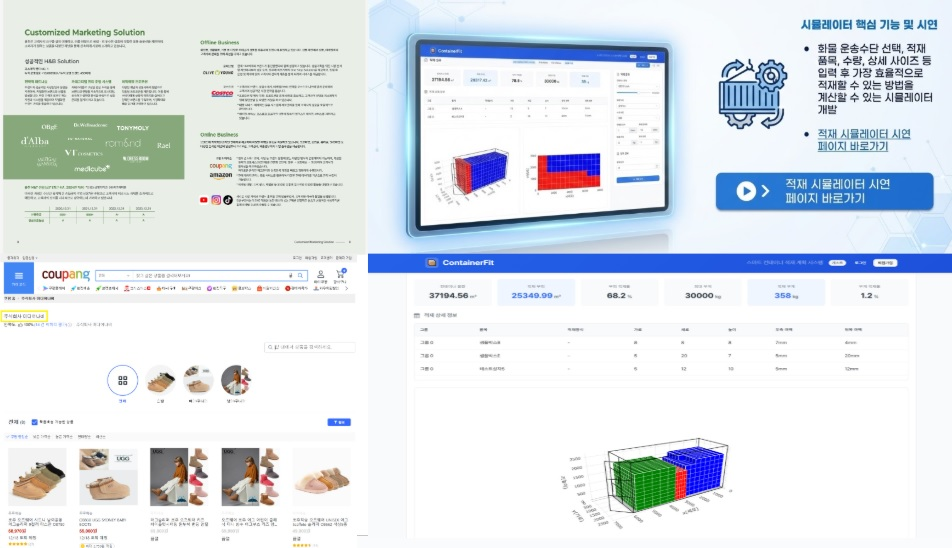
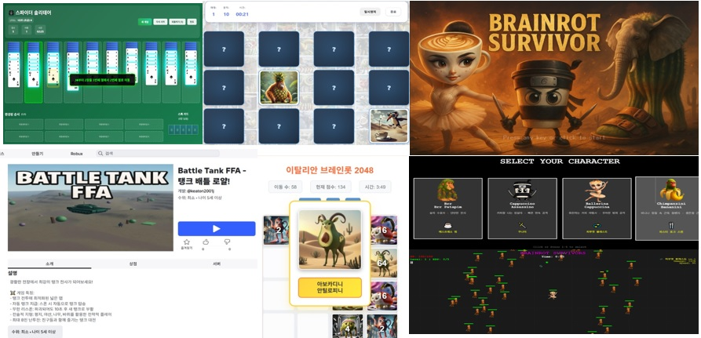
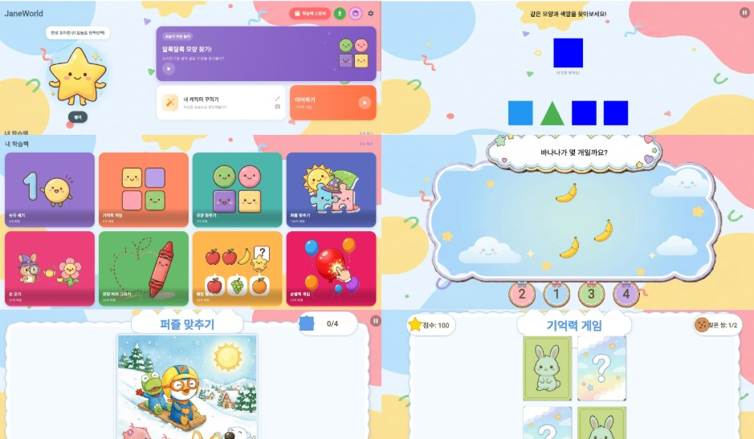
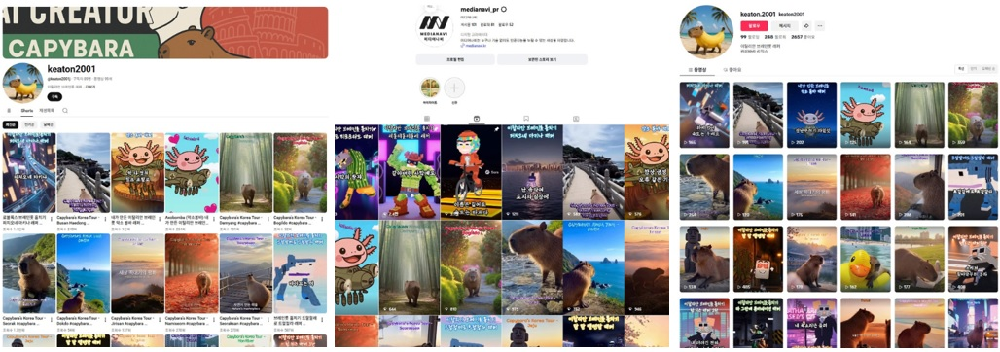
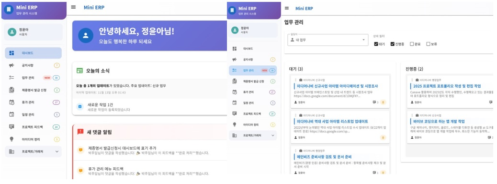
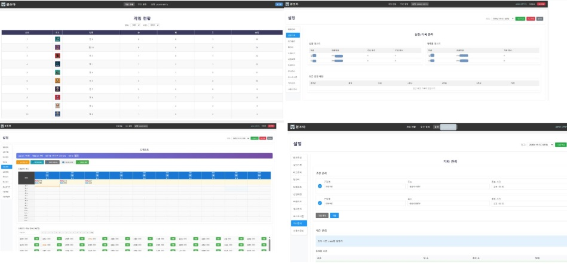

---
title: "미디어나비 2025 프로젝트 회고 - Just Do It"
date: "2025-12-26T01:00:00.000Z"
category: "blog"
description: "'Just Do It' 2025년 미디어나비는 하드웨어부터 소프트웨어, 물류, 유통, AI까지 경계 없이 도전했습니다. 작은 스타트업의 치열했던 한 해를 기록합니다."
postauthor: "Anna"
---     
## 2025년, 기술을 관망하지 않고 직접 써보는 팀으로 살아남기

<figure>
  
  <figcaption></figcaption>
</figure>

안녕하세요. 안나입니다.  
벌써 2025년의 마지막 달이네요. 해가 갈수록 1년이 유난히 빠르게 지나갑니다.

올해를 돌아보며 문득 이런 생각이 들었습니다.  
**“우리는 AI 시대를 어떻게 준비하고 받아들이고 있을까?”**

미디어나비의 2025년은 하나의 문장으로 정리할 수 있습니다.  
기술을 이야기하는 회사가 아니라, 직접 써보고 몸으로 익히는 팀이 되자.

누가 묻지 않았지만, 어쩌면 궁금했을지도 모를 미디어나비의 2025년을 정리해 봅니다.

## 기술을 ‘연구’하는 것을 넘어, ‘현장’으로 가져가다 

<figure>

  <figcaption>(1) 스마트 RPC 재고관리 시스템 고도화 2025년 주요 성과, 이미지 출처: 미디어나비</figcaption>
</figure>  

2025년 우리의 중심에는 **스마트 RPC 재고관리 시스템이** 있었습니다.

곡물 저장 시설이라는 매우 현실적인 산업 현장에서,   
하드웨어부터 소프트웨어, 데이터 분석까지 전 공정을 직접 경험하며  
**“기술이 실제로 작동하는 조건”** 을 끊임없이 검증해 온 프로젝트입니다.

이 프로젝트는 단일 솔루션을 넘어서 미디어나비가  
**AI·센서·엣지 컴퓨팅·대시보드·모바일 앱**을 
하나의 흐름으로 다룰 수 있는 팀이라는 점을  
증명해 준 기반이 되었습니다.
 
**상세 내용은 상단 이미지를 클릭하시거나 블로그 하단 프로젝트별 상세 링크를 클릭하시면 연결됩니다.*

## 새로운 도메인에 직접 뛰어들며 얻은 것들  

<figure>
  
  <figcaption></figcaption>
</figure>

올해 우리는 기존에 다뤄보지 않았던 영역에도 과감히 들어갔습니다.

- **유통·물류 기업과의 협업 프로젝트**를 통해  
여전히 아날로그에 머물러 있는 현장의 문제를 가까이에서 관찰했고,

- **E 브로슈어 웹뷰어 개발, 컨테이너 적재 시뮬레이터 개발 등 디지털 전환**에 기여했으며,

- 그 연장선에서 **쿠팡·네이버스토어에 직접 판매자로 참여**하며  
유통의 A to Z를 몸소 경험해오고 있습니다.

- **브로슈어 웹뷰어 바로가기** http://hongcheon.medianavi.kr
- **컨테이너 적재 시뮬레이터 바로가기** http://container.medianavi.kr/ 
- **쿠팡스토어 미디어나비 판매상품 바로가기** https://shop.coupang.com/A01509399?source=brandstore_sdp_atf&ocid=23476156&checkBatchDelivery=true&pid=8286298620&viid=93492867798&platform=p&brandId=0&btcEnableForce=false%20i 

프로젝트가 항상 후속 계약으로 이어지지는 않았습니다.  
하지만 중요한 것은 결과보다 **학습 속도와 도메인 이해도**였습니다.

이 경험들은 **“우리 기술이 어디까지 확장 가능한가”** 를 판단하는  
현실적인 기준이 되어 주었습니다.

<figure>

  <figcaption>(2) 좌측 상단부터 시계 방향으로 브로슈어 웹뷰어 UI, 컨테이너 적재 시뮬레이터 UI, 쿠팡스토어 미디어나비 입정 스크린샷, 이미지 출처: 미디어나비</figcaption>
</figure>

**상세 내용은 상단 이미지를 클릭하시거나 블로그 하단 프로젝트별 상세 링크를 클릭하시면 연결됩니다.*

## 생성형 AI를 ‘도구’가 아니라 ‘동료’로 쓰기 시작하다

<figure>
  
  <figcaption></figcaption>
</figure>

2025년은 생성형 AI를 가장 적극적으로 실험한 해이기도 합니다.

- 게임, 웹 서비스, 숏폼 영상, 자동화 도구까지  
혼자서 어디까지 만들 수 있는지를 실험했고,
- Claude, Gemini, Sora 등 **다양한 생성형 AI를 활용해**  
**기획부터 개발, 배포까지의 속도를 극단적으로 끌어올렸습니다.**

이 과정에서 중요한 깨달음이 하나 있었습니다.  
이제 경쟁력의 차이는 “개발을 할 줄 아는가”가 아니라  
**AI에게 무엇을, 어떻게, 잘 시키는가**에 달려 있다는 점입니다.

그래서 우리는 결과물도 물론이지만,  
**과정과 학습을 기록하는 것**에도 집중했습니다.

<figure>

  <figcaption>(3) 생성형 AI를 활용하여 개발한 웹 게임 UI 모음, 이미지 출처: 미디어나비</figcaption>
</figure>

<figure>

  <figcaption>(4) 생성형 AI를 활용하여 개발한 유아동 발달 자극 게임 'JaneWorld' UI 모음, 이미지 출처: 미디어나비</figcaption>
</figure>
 
 <figure>

  <figcaption>(5) 생성형 AI 활용 제작 콘텐츠 SNS 업로드 현황 , 이미지 출처: 미디어나비</figcaption>
</figure>

 **상세 내용은 상단 이미지를 클릭하시거나 블로그 하단 프로젝트별 상세 링크를 클릭하시면 연결됩니다.*

## 비개발자도 만들 수 있는 시대, 바이브 코딩의 가능성

<figure>
  
  <figcaption></figcaption>
</figure>

개인적으로는 바이브 코딩 앱 서비스 개발이 큰 전환점이었습니다.  
비개발자도 아이디어와 대화만으로 서비스를 만들 수 있는 시대에,  
기술의 장벽은 생각보다 훨씬 낮아졌다는 것을 직접 확인했습니다.  

아이를 위한 그림동화, 관계 상담 챗봇, 웰니스 앱, 시니어 키오스크 도우미까지.  
짧은 기간 동안 여러 프로토타입을 만들어보며    
**“이제 중요한 것은 기술이 아니라 문제 정의”** 라는 확신을 갖게 되었습니다.

<figure>

  <figcaption>(6-1) 바이브 코딩으로 개발, 배포한 앱 서비스 UI 모음, 이미지 출처: 미디어나비</figcaption>
</figure>

<figure>

  <figcaption>(6-2) 바이브 코딩으로 개발, 배포한 앱 서비스 UI 모음, 이미지 출처: 미디어나비</figcaption>
</figure>

**상세 내용은 상단 이미지를 클릭하시거나 블로그 하단 프로젝트별 상세 링크를 클릭하시면 연결됩니다.*

## 내부 문제를 가장 먼저 해결하는 팀

<figure>
  
  <figcaption></figcaption>
</figure>

외부 프로젝트와 실험만큼 의미 있었던 것은  
**사내 미니 ERP 개발**이었습니다.

실제 업무에서 불편했던 것들을 하나씩 직접 만들며  
공지사항, 업무관리, 휴가관리, 프로젝트 피드백, 아이디어 관리까지  
우리에게 꼭 필요한 기능만 담았습니다.  

이 경험은 분명히 말해줬습니다.  
**우리가 쓰기 불편한 도구는, 고객에게도 불편하다는 것**을 말입니다.

<figure>

  <figcaption>(7) 미니 ERP UI 모음, 이미지 출처: 미디어나비</figcaption>
</figure>

저희 CTO 저스타가 활동하는 **사회인 야구팀 관리 시스템을 디지털화**  
하는 개발작업도 병행했습니다.   
내가 직접 불편함을 느껴 필요한 것을 개발하는 것만큼   
제대로, 잘 만들 수 있는 것도 없는 것 같습니다. 

현재 수기로 입력 관리하는 **야구 경기 심판기록을 시스템 입력으로 전환하여**  
**기록 데이터를 관리**할 수 있도록 했으며,    
**리그, 구단, 구장 관리, 회원관리, 트레이드 기능** 등   
꼭 필요한 기능들을 붙여 관리의 효율화를 높였습니다. 

<figure>

  <figcaption>(8) 사회인 야구팀 경기 심판기록 관리 시스템 '분조야' UI 모음, 이미지 출처: 미디어나비</figcaption>
</figure>

**상세 내용은 상단 이미지를 클릭하시거나 블로그 하단 프로젝트별 상세 링크를 클릭하시면 연결됩니다.*

## 2025년을 한 문장으로 정리한다면

2025년은 미디어나비에게 **‘도전의 해’** 였습니다.  
하드웨어, 소프트웨어, 유통, 물류, 콘텐츠, AI 실험까지   
고민하는 시간보다 **직접 해보는 선택**을 더 많이 했던 한 해였습니다.

그래서 올해의 모토는 단순했습니다.  
**Just Do It.**

2026년에도 미디어나비는  
기술을 설명하는 회사가 아니라  
**기술을 실제로 써보고 증명하는 팀**으로 계속 움직이겠습니다.

각 프로젝트의 상세한 이야기들은  
아래 링크를 통해 천천히 확인해 주세요.

## 개별 프로젝트 상세보기

1. 스마트 RPC 재고관리 시스템 개발 및 고도화 프로젝트  
http://works.medianavi.kr/blog/47  

2. 유통·물류 현장에서 검증한 디지털 전환 프로젝트: 웹뷰어부터 컨테이너 적재 시뮬레이션까지    
http://works.medianavi.kr/blog/48/  

3. 생성형 AI로 확장한 콘텐츠·앱 서비스 PoC 프로젝트: 멀티미디어 제작부터 바이브 코딩 앱까지  
http://works.medianavi.kr/blog/49/  
  
4. 내부 효율화와 외부 협업을 동시에 진행한 개발 프로젝트 기록: 사내 미니 ERP 구축과 데이터 분석 협업 사례  
http://works.medianavi.kr/blog/50/   

