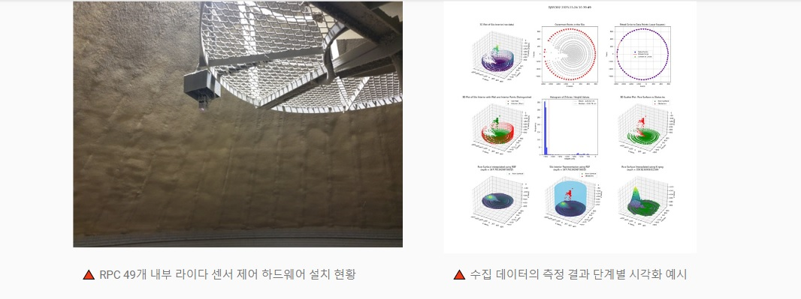

## 에이앤에이, 스마트 RPC 재고관리 시스템 고도화 프로젝트 진행 중  

2025.01. ~ 현재

* 2024년 수행 완료한 스마트 RPC 재고관리 시스템 1차 프로젝트의 고도화 작업으로 시스템 안정화 및 유지보수 작업 진행 중  
* 공급업체 관리 시스템(VMS) 개발을 포함, 관리자의 편의성과 재고 측정 정확도 향상을 고려한 소프트웨어 개선작업 추진 중

## 에이앤에이, 스마트 RPC 실시간 재고관리 시스템 구축사업 수행 완료  

2023.04. ~ 2023.12.

* 지역 농협 RPC 에 미디어나비에서 설계하고 개발한 라이다 센서 제어 하드웨어 및 관리 소프트웨어 개발 납품
* 사일로 재고를 실시간으로 모니터링 할 수 있도록 센서 데이터 수집부터 가공, 분석, 대시보드 API 등 스마트 RPC 실시간 재고관리 시스템을 위한 솔루션 공급
* 1차 프로젝트로 지역 RPC 내 49개 사일로 재고를 실시간으로 모니터링하고 있음

