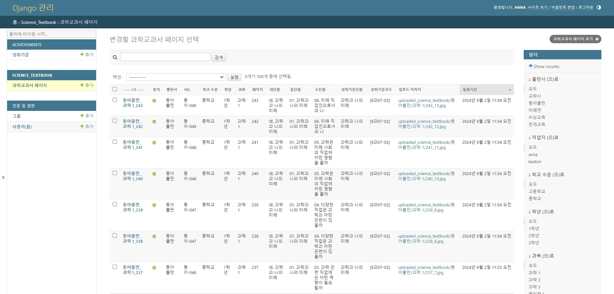
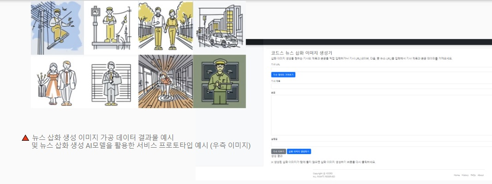
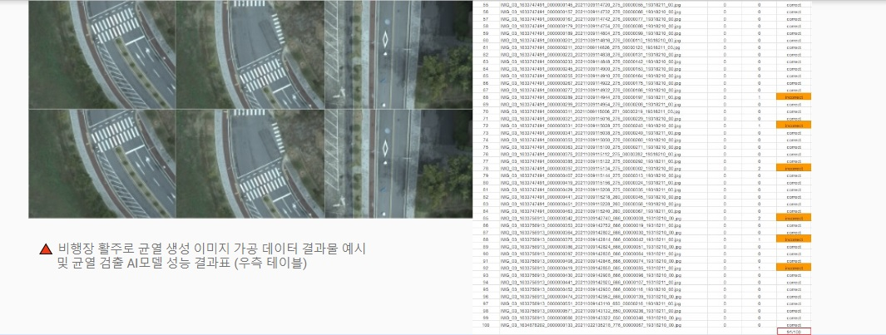

## 2024년도 데이터바우처 지원사업 - AI 가공 프로젝트 수행 완료  

2024.06. ~ 2024.11.

* 코드넛, AI 튜터 개발을 위한 교과서 기반의 AI 학습 데이터 가공  
  

* 초중고등학교 과학 교과서 내 텍스트 데이터 가공 및 검수작업 진행  
* 이미지 데이터 입력기 시스템 개발로 교과서 텍스트 데이터 추출 및 가공 시간을 약 50% 이상 단축함으로써 기존 목표 이상 성과를 거둠.  

## 2023년도 데이터바우처 지원사업 - AI 가공 프로젝트 수행 완료

2023.06. ~ 2023.11.

* (주)코드스, 비주얼 저널리즘을 위한 온라인 AI 이미지 제작 시스템 개발

* 공간정보기술(주), 드론 촬영 영상 기반 비행장 활주로 AI 균열 검출 모델 개발

* 생성AI를 활용하여 저널리즘과 공간정보 산업 분야에서 필요한 AI 가공 데이터를 제공하며 프로젝트 수행 완료
* 2023년도 데이터바우처 지원사업 - AI 데이터가공 부문 공급기업으로 선정
* ‘KPF-BERT’를 활용한 뉴스 기사 본문 요약 데이터 가공서비스 제공
* ‘KPF-BERT’를 활용한 뉴스 기사 클러스터링 데이터 가공서비스 제공
